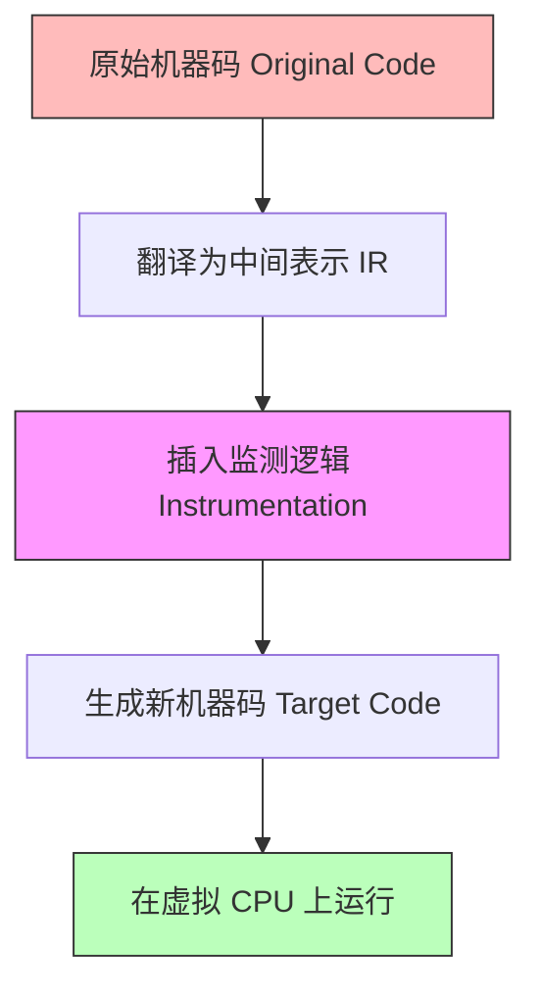

# 第三章：Valgrind 动态监测与嵌入式排查实战

动态分析工具是在运行时抓取内存问题的核心武器。本章将深入解析 Linux 环境下最著名的动态分析工具——**Valgrind Memcheck** 的底层运行机制，解读其复杂日志中的每一类内存错误，并详述如何在资源受限的嵌入式交叉编译平台上部署、运行和远程联调 Valgrind。

---

## Valgrind Memcheck 工作引擎与“影子内存”机制

Valgrind 并不是一个普通的链接库或简单的 API 劫持工具，而是一个**动态二进制插桩（Dynamic Binary Instrumentation, DBI）**框架。

当运行 `valgrind ./my_program` 时：
1.  **即时编译（JIT）**：Valgrind 会接管你的可执行文件，将其机器代码翻译为一种平台无关的中间表示（Intermediate Representation, IR）。
2.  **插桩（Instrumentation）**：在 IR 中插入用于监控内存读写及分配的分析指令。
3.  **重新生成**：将插桩后的 IR 重新编译为目标机器码并执行。

这种机制使得 Valgrind 不需要修改源程序或重新编译，即可实现指令级的全面监控。



### 影子内存（Shadow Memory）的双位追踪法

为了校验每一处内存访问是否合法，Valgrind 维护了一份虚拟的“影子内存”，它记录了主存中每一个字节的两个核心属性位：

*   **A 位（Addressability bit，可寻址性）**：表示该内存地址是否已被分配并有权访问。如果程序尝试读写 A 位标记为“不可访问”的区域，Memcheck 就会报出 `Invalid read` 或 `Invalid write` 错误。
*   **V 位（Valid-value bit，有效值标志）**：表示该内存地址中的数据是否已被初始化。每个位在被写入确定值时 V 位置 1，否则为 0。当该数据被用于条件判断或输出时，如果 V 位为 0，就会报出 `Use of uninitialised value`。

---

## 剖析 Valgrind 堆泄漏报告中的四类判定

当程序退出时，`--leak-check=full` 参数会促使 Valgrind 打印出全面的堆内存状态汇总。报告中通常包含以下四种泄漏分类：

```text
==23456== LEAK SUMMARY:
==23456==    definitely lost: 40 bytes in 1 blocks
==23456==    indirectly lost: 120 bytes in 3 blocks
==23456==      possibly lost: 0 bytes in 0 blocks
==23456==    still reachable: 512 bytes in 1 blocks
```

### 1. Definitely Lost（确定泄漏）
*   **含义**：这部分堆内存没有任何指针指向它。程序已经彻底失去了找到它的手段，**必须立即修复**。
*   **场景**：如局部指针超出了作用域，或者指针在未释放前被赋予了新值。

### 2. Indirectly Lost（间接泄漏）
*   **含义**：这部分内存本身有指针指向它，但那些指向它的指针本身存放在一个“确定泄漏”（Definitely Lost）的堆内存块中。
*   **场景**：链表头指针丢失了，导致整个链表节点全部发生间接泄漏。只要修复了链表头的“确定泄漏”，间接泄漏会自动消失。

### 3. Possibly Lost（可能泄漏）
*   **含义**：仍有指针指向这块内存，但该指针并没有指向内存块的**起始位置**，而是指向了块的内部（偏移位置）。
*   **场景**：可能由于指针算术操作（如 `p++` 后程序退出），或者在使用 C++ 多重继承、或自定义了复杂的滑移指针管理器时发生。

### 4. Still Reachable（仍然可达）
*   **含义**：程序退出时，这部分内存依然被有效指针指向。它通常没有造成实质危害，因为进程退出后操作系统会强制收回所有空间。
*   **常见成因**：全局变量指向的单例对象，或者初始化后一直伴随程序生命周期的静态缓冲区，忘记在 `main` 结束前调用 `free`。

---

## 典型 Memcheck 错误代码复现与日志翻译

### 陷阱 1：Invalid Read / Write（非法读写越界）

#### ❌ 错误源码
```c
// test_invalid.c
#include <stdlib.h>

int main() {
    int *arr = (int*)malloc(5 * sizeof(int));
    // 越界写入：本该是 i < 5
    for(int i = 0; i <= 5; i++) {
        arr[i] = i; 
    }
    free(arr);
    return 0;
}
```

#### 🔍 Valgrind 日志输出
```text
==23480== Invalid write of size 4
==23480==    at 0x10915B: main (test_invalid.c:8)
==23480==  Address 0x4a1b054 is 0 bytes after a block of size 20 alloc'd
==23480==    at 0x483B7F3: malloc (vg_replace_malloc.c:309)
==23480==    by 0x10913E: main (test_invalid.c:5)
```
*   **翻译**：
    *   在 `test_invalid.c` 的第 8 行，程序尝试写入 4 字节的数据（`Invalid write of size 4`）。
    *   写入的目标地址 `0x4a1b054` 位于一个大小为 20 字节（`size 20 alloc'd`）的堆块末尾偏移 0 字节处（`0 bytes after`），即刚刚越界的位置。
    *   该内存块是在 `test_invalid.c` 的第 5 行通过 `malloc` 申请的。

---

### 陷阱 2：Use of uninitialised value（使用未初始化数据）

#### ❌ 错误源码
```c
// test_uninit.c
#include <stdio.h>
#include <stdlib.h>

int main() {
    int* p = (int*)malloc(sizeof(int));
    // 分配后未赋值直接参与逻辑
    if (*p == 42) {
        printf("Match!\n");
    }
    free(p);
    return 0;
}
```

#### 🔍 Valgrind 日志输出（需加参数 `--track-origins=yes`）
```text
==23512== Conditional jump or move depends on uninitialised value(s)
==23512==    at 0x109160: main (test_uninit.c:8)
==23512==  Uninitialised value was created by a heap allocation
==23512==    at 0x483B7F3: malloc (vg_replace_malloc.c:309)
==23512==    by 0x10913E: main (test_uninit.c:6)
```
*   **翻译**：
    *   在第 8 行（`test_uninit.c:8`），存在一个依赖未初始化变量的条件跳转指令（`Conditional jump`，即 `if` 判断）。
    *   追溯该未初始化值的来源（`Uninitialised value was created by`），它是第 6 行调用 `malloc` 产生的堆内存。

---

## 工业排查工作流（Leak Resolution Checklist）

在排查大型项目的内存泄漏时，建议遵循以下严谨的工作流：

```text
[编译测试程序] ---> [运行基础 Valgrind 检测] ---> [依据日志定位第一致错点]
      ^                                                  |
      |                                                  v
[重新运行验证] <--- [修复逻辑 (使用 goto cleanup / 置空)] <--- [定位未初始化源 (加上 --track-origins=yes)]
```

1.  **Debug 编译**：确保使用 `-g -O0` 编译，绝不能用编译优化，否则行号和函数栈会发生严重变形或合并。
2.  **启动检测参数**：
    ```bash
    valgrind --tool=memcheck \
             --leak-check=full \
             --show-leak-kinds=all \
             --track-origins=yes \
             --log-file=valgrind_report.txt \
             ./your_program [args]
    ```
3.  **优先处理 Invalid Write**：如果报告中同时存在 `Invalid write` 和 `Definitely lost`，优先解决写入越界，因为越界写很容易损毁堆的元数据，导致后续正常的 `free` 被拦截，造成误报的“内存泄漏”。
4.  **定位分配原点**：通过 `by 0x...` 的调用栈底端向上寻找，定位到程序中谁分配了这块资源，并在其职责链路末端增加释放逻辑。

---

## 嵌入式跨平台目标板（Embedded Target）调试实战

在嵌入式开发（如 Linux 车机、物联网网关、路由器等）中，目标板往往只有极小的内存（如 128MB/256MB）和受限的 CPU（如 ARM Cortex-A7 或 MIPS），无法在本地直接编译和顺畅运行带有复杂分析逻辑的 Valgrind。我们需要采取**交叉编译部署**和**远程联合调试**的方案。

### 1. 交叉编译 Valgrind

假设我们的目标板是 64 位 ARM（AArch64），宿主机（Host）为 Ubuntu x86_64。

首先，在宿主机上下载 Valgrind 源码包并解压：

```bash
wget https://sourceware.org/pub/valgrind/valgrind-3.21.0.tar.bz2
tar -xjf valgrind-3.21.0.tar.bz2
cd valgrind-3.21.0
```

配置交叉编译环境，指定目标平台与安装路径：

```bash
# 配置交叉编译器环境变量
export CC=aarch64-linux-gnu-gcc
export CXX=aarch64-linux-gnu-g++
export AR=aarch64-linux-gnu-ar
export LD=aarch64-linux-gnu-ld

# 执行 configure
./configure --host=aarch64-unknown-linux-gnu \
            --prefix=/opt/valgrind_arm64 \
            --with-tmpdir=/tmp

# 编译与安装
make -j$(nproc)
make install DESTDIR=$(pwd)/install_dist
```
*   `--host`：指定运行的目标架构体系。
*   `--prefix`：指定在目标板上运行时 Valgrind 的**绝对安装路径**。注意，由于 Valgrind 对内部库路径要求极严，目标板上的最终存放路径必须与这里的 `--prefix` 完全一致（通常为 `/opt/valgrind_arm64`）。
*   `with-tmpdir`：将临时目录设为 `/tmp`，防止写入受限的只读文件系统。

### 2. 部署到目标板

将生成的 `install_dist/opt/valgrind_arm64` 整个文件夹复制到开发板的 `/opt/` 目录下。可以使用 NFS 挂载或 SCP 传输：

```bash
scp -r ./install_dist/opt/valgrind_arm64 root@192.168.1.100:/opt/
```

配置环境变量：

```bash
# 在开发板的终端执行
export PATH=$PATH:/opt/valgrind_arm64/bin
export VALGRIND_LIB="/opt/valgrind_arm64/libexec/valgrind"
```

### 3. 运行监测与性能优化

为了防止频繁的屏幕 I/O 导致嵌入式系统过载或界面假死，建议关闭调试过程中的控制台标准输出，全部重定向至本地闪存或 `/tmp` 内存文件系统中的日志文件：

```bash
valgrind --tool=memcheck \
         --leak-check=full \
         --log-file=/tmp/valgrind.log \
         /opt/usr/bin/my_app
```

### 4. 远程多进程联调（Using vGDB）

在嵌入式开发中，如果我们希望在 Valgrind 抛出内存非法读写时，立刻让程序停下来，并用 Host 端的 GDB 进行单步分析，我们可以使用 Valgrind 内建的 **vGDB** 机制。

#### 步骤 A：在开发板（Target）上启动 Valgrind
```bash
valgrind --tool=memcheck --vgdb=yes --vgdb-error=0 /opt/usr/bin/my_app
```
*   程序会立即挂起，并打印出一行提示，显示其监听的 GDB 端口以及进程 PID：
    `==3456== TO CONNECT TO THE MEMBER GDB, USE THIS COMMAND: target remote | vgdb --pid=3456`

#### 步骤 B：在宿主机（Host）上使用交叉 GDB 连接
在宿主机上启动针对目标架构的 GDB 工具：

```bash
# 宿主机终端
aarch64-linux-gnu-gdb ./my_app_debug_version
```

在 GDB 提示符内，建立与开发板的通信管道：

```text
(gdb) target remote | ssh root@192.168.1.100 "/opt/valgrind_arm64/bin/vgdb --pid=3456"
```

此时，宿主机上的 GDB 已经成功接管了开发板上由 Valgrind 托管运行的进程。当开发板上发生任何内存越界或非法读写时，Valgrind 会模拟发送一个 `SIGTRAP` 信号给 GDB，使得程序在“犯罪第一现场”立刻中断，方便开发者在宿主机上打印调用栈（`bt`）、观察变量（`print`）以及单步执行。
