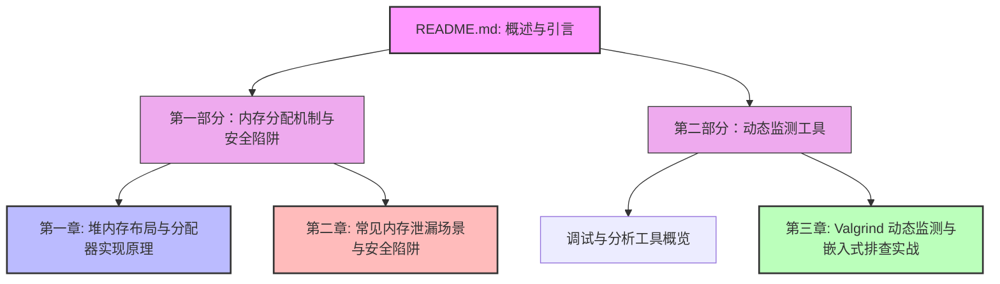

# 概述：C 语言动态内存管理与 Valgrind 调试指南

在没有垃圾回收（Garbage Collection, GC）机制的 C 语言中，手动管理堆内存是每个系统级程序员的必修课，也是构建高性能、高可靠性软件的核心基石。动态内存管理赋予了程序在运行时根据实际数据流量和运行需求动态申请空间的能力，但同时也直接暴露了虚拟和物理内存地址。如果管理不当，轻则导致程序性能退化、内存泄漏（Memory Leaks），重则引发段错误（Segmentation Fault）、缓冲区溢出（Buffer Overflow）或严重的内核崩溃，甚至被恶意攻击者利用。

本教程是一份深度探究 **C 语言动态内存分配、常见内存泄漏陷阱及 Valgrind 动态排查技术** 的完整指南。我们将从硬件和操作系统内核的视角出发，逐层解析 C 运行时库（GNU C Library - glibc）底层的堆管理机制，剖析常见的动态内存分配故障，并结合工业界主流的内存分析工具 Valgrind Memcheck，展示从本地 Linux 环境到嵌入式交叉编译目标的内存泄漏排查与调试流程。

---

## 为什么动态内存管理在 C 中如此关键？

在 C 程序的内存布局中，内存被划分为多个不同的区域：

*   **栈区（Stack）：** 由编译器自动分配和释放，用于存储函数的局部变量、参数和返回地址。栈的分配效率极高（只需移动栈指针），但其生命周期与函数调用栈帧（Stack Frame）紧密绑定，且容量通常非常有限（在 Linux 上默认为 8MB 左右，若发生深层递归易导致栈溢出 Stack Overflow）。
*   **全局/静态数据区（Data/BSS）：** 存储全局变量和静态变量。`.data` 段存放已初始化的变量，`.bss` 段存放未初始化的变量（在系统加载程序时清零）。其生命周期贯穿整个程序运行期，但大小在编译和链接阶段就已经固定，无法在运行时弹性扩展。
*   **堆区（Heap）：** 唯一一个允许程序员在运行时自由申请、动态调整和手动释放的内存区域。它的空间上限取决于系统的虚拟内存大小（受限于物理内存和交换分区），非常适合用于处理大小未知的动态数据集（如网络接收缓冲区）、长生命周期的对象或复杂的动态数据结构（如链表、树、二叉堆、图等）。

然而，“能力越大，责任越大”。在享受堆内存灵活性带来的性能红利时，程序员必须手动维护每一次分配（`malloc`/`calloc`/`realloc`）与释放（`free`）的配对关系。任何一个控制流分支（如提前返回 `return`、错误处理 `goto`）的疏忽，都可能使得系统长期运行时资源耗尽。

---

## 典型内存问题的危害

在工业级系统（如高并发服务器、车载嵌入式系统、物联网网关、微控制器控制系统等）中，内存管理缺陷通常会引发严重的后果：

1.  **资源耗尽与 OOM 崩溃：** 内存泄漏会在程序运行期间持续消耗系统可用物理内存。当系统物理内存与交换空间（Swap Space）耗尽时，操作系统内核的 OOM Killer（Out-of-Memory Killer）将被激活，强制杀死耗费内存最多的进程，导致关键业务中断。
2.  **静默数据损坏（Silent Data Corruption）：** 越界写入（Out-of-bounds Write）或野指针写入可能意外修改相邻的内存块或控制结构（如堆块头部的元数据），导致程序在很久之后的某个毫无关联的逻辑中莫名崩溃。这种“案发现场”与“第一致错点”分离的特性，使得调试极其困难。
3.  **安全漏洞：** 释放后使用（Use-After-Free, UAF）和双重释放（Double Free）是安全漏洞的重灾区。黑客常利用这些漏洞劫持程序控制流，破坏分配器的内部控制链表，执行恶意 shellcode。

---

## 本书内容结构与学习路线

为了帮助你建立起从“底层原理”到“实战分析”的完整知识体系，本书精心规划了以下两个部分：



### [第一部分：内存分配机制与安全陷阱](allocators/README.md)
*   **[第一章：堆内存布局与分配器实现原理](allocators/dynamic-allocation.md)**
    *   **核心内容：** 深入解析进程的虚拟内存空间布局；探究 `malloc`/`free` 的底层系统调用（`brk`/`sbrk` 与 `mmap`）；剖析现代内存分配器（以 glibc `ptmalloc` 为例）的元数据管理方式（Chunks, Bins）、堆碎片（Heap Fragmentation）的成因，并提供一个基于 C 语言手写的、带元数据头部的自定义内存分配器，加深对堆管理的本质理解。
*   **[第二章：常见内存泄漏场景与安全陷阱](allocators/memory-leaks-traps.md)**
    *   **核心内容：** 全面分类并复现 C 语言中经典的内存管理反模式。包括未配对的分配与释放、野指针与悬挂指针、多级指针及复杂结构体释放时的“漏网之鱼”、临时局部指针重新赋值导致的“引用丢失”等。同时对比分析静态代码检查（Static Analysis）与动态运行期监测（Runtime Profiling）的优缺点。

### [第二部分：动态监测工具](debugging/README.md)
*   **[第三章：Valgrind 动态监测与嵌入式排查实战](debugging/valgrind-profiling.md)**
    *   **核心内容：** 详细介绍 Valgrind Memcheck 引擎的仿真与影子内存（Shadow Memory）工作机理；教你如何阅读并精确翻译 Valgrind 详尽的 XML/文本堆栈日志；深度剖析 Invalid Read/Write、Use-After-Free 等错误的诊断过程；最后介绍在资源受限的嵌入式 ARM/MIPS 交叉编译目标板上移植、运行 Valgrind 并结合 `gdbserver` 进行远程联合调试的工程实战。

---

## 实验与调试准备

在开始学习后续章节前，建议准备好以下环境以运行书中的代码示例与调试命令：

*   **操作系统：** 现代 Linux 发行版（推荐 Ubuntu 20.04/22.04 LTS 或 Debian）。
*   **编译器工具链：** GCC（GNU Compiler Collection）及 GDB 调试器。
*   **分析工具：** Valgrind（推荐版本 >= 3.15.0）。
*   **测试代码编译命令：**
    为了保留完整的符号表并关闭编译器的自动内存优化，我们在编译测试程序时通常使用以下参数：
    ```bash
    gcc -g -O0 -fno-builtin -fno-stack-protector main.c -o my_program
    ```
    *   `-g`：生成详细的调试信息（包括文件名、行号、局部变量符号），以便 Valgrind 报告精准行号。
    *   `-O0`：关闭所有编译器优化，确保汇编指令与源程序行严格对应，防止发生变量被优化掉或内联的情形。
    *   `-fno-builtin`：防止编译器将 `malloc`/`free` 等标准库函数替换为内联的编译器优化实现，便于 Valgrind 或其他工具进行运行时拦截（Interception）。
    *   `-fno-stack-protector`：关闭栈溢出保护，使堆栈结构在调试时更为纯粹和易于分析。
