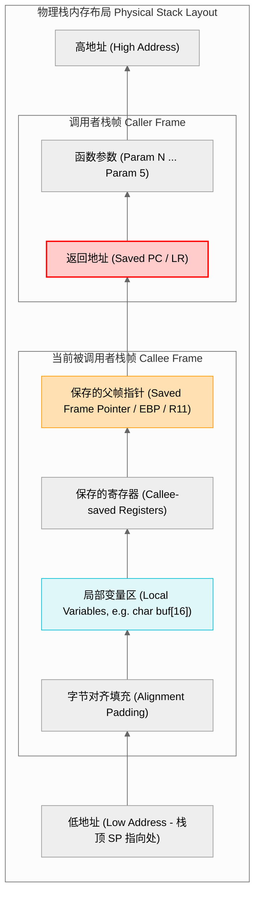

# 第一章：栈内存机制与函数调用栈帧

函数调用是程序控制流转移与恢复的核心手段。要深入理解栈溢出，必须首先从最底层的硬件寄存器、ABI 规范和编译器汇编代码出发，理清函数调用栈帧（Stack Frame）是如何创建、维护以及销毁的。

---

## 1. 函数调用约定（Calling Conventions）

函数调用约定定义了调用者（Caller）与被调用者（Callee）之间传递参数、返回值以及清理栈空间的标准方法。不同的处理器架构与操作系统遵循不同的 ABI（Application Binary Interface）标准。下面重点对比两大主流架构：桌面的 **x86_64 System V AMD64 ABI** 与嵌入式领域的 **ARM AAPCS**。

### x86_64 System V AMD64 ABI (Linux/macOS)
在 x86_64 架构的类 Unix 系统中，前 6 个整型或指针参数通过特定的寄存器传递，多余的参数则通过栈传递：
* **参数传递寄存器**：依次为 `%rdi`, `%rsi`, `%rdx`, `%rcx`, `%r8`, `%r9`。
* **栈上传递**：第 7 个及以后的参数按照自右向左的顺序压入栈中。
* **返回值**：通过 `%rax` 寄存器返回。
* **栈帧对齐**：在执行 `call` 指令前，栈指针 `%rsp` 必须对齐到 16 字节边界。

### ARM AAPCS (Procedure Call Standard for ARM Architecture)
在 ARM 32 位架构（如 Cortex-M 处理器）中，调用约定遵循 AAPCS 标准：
* **参数传递寄存器**：前 4 个整型/指针参数使用 `R0`, `R1`, `R2`, `R3` 传递。
* **栈上传递**：超出 4 个的参数通过栈传递，同样按照自右向左的顺序压栈。
* **返回值**：32 位返回值存放在 `R0` 中，64 位返回值存放在 `R0`（低 32 位）和 `R1`（高 32 位）中。
* **寄存器保护职责**：
  * **调用者保存（Caller-Saved / Scratch）**：`R0-R3`, `R12`, `LR`, `PSR`。如果调用者在函数调用后仍需使用这些值，必须自行压栈保护。
  * **被调用者保存（Callee-Saved / Preserved）**：`R4-R11`。被调用者若需要修改这些寄存器，必须在函数入口处压栈，并在退出时恢复。

---

## 2. 栈帧物理布局（Stack Frame Layout）

每次函数调用时，系统都会在栈上分配一块专属的物理区域，称为**栈帧（Stack Frame）**。栈帧中保存了该函数执行所需的一切上下文信息。

### 栈帧精细结构图
栈在内存中从**高地址向低地址**生长，但数据的读写和数组的索引是从**低地址向高地址**进行的。



### 关键要素解析
1. **返回地址（Return Address）**：当前函数执行完毕后，CPU 应当跳转回去执行的下一条指令地址（x86 架构直接自动压栈；ARM 架构下通常通过 `LR` 传入，若存在嵌套调用，则必须在栈帧中保护起来）。
2. **保存的帧指针（Saved Frame Pointer）**：指向调用者栈帧基地址的指针。
3. **局部变量区**：函数内定义的自动变量（非静态局部变量）。注意，即使栈向下生长，局部变量的写入依然是从低地址向高地址进行（例如 `memcpy(buf, source, len)` 会从 `buf` 的低地址开始往高地址写，逐渐逼近上方保存的返回地址）。
4. **栈指针（SP）与帧指针（FP / BP）**：
  * **SP (Stack Pointer)**：始终指向当前栈的顶部（即物理内存上的最低地址）。随着压栈 `push` 和出栈 `pop` 动态移动。
  * **FP/BP (Frame Pointer / Base Pointer)**：在函数执行期间保持不变，指向当前栈帧的基准地址。通过 `FP + Offset` 或 `FP - Offset` 的方式，CPU 可以稳定地寻址局部变量和入参，不受 SP 动态调整的影响。

---

## 3. 汇编级别的栈帧创建与销毁（Prologue & Epilogue）

编译器在编译 C 函数时，会自动在函数的入口处插入**前导码（Prologue）**以建立栈帧，并在出口处插入**后续码（Epilogue）**以销毁栈帧并返回。

### 3.1 x86_64 架构下的 Prologue / Epilogue 剖析

我们编写一个简单的 C 函数：
```c
void my_function(int a, int b) {
    char buf[16];
    // 业务逻辑
}
```

GCC 对其编译生成的 x86_64 汇编通常如下：

#### 函数前导码 (Prologue)：
```assembly
.global my_function
my_function:
    pushq   %rbp            # 将调用者的帧指针（RBP）压栈保存
    movq    %rsp, %rbp      # 将当前栈指针（RSP）作为新栈帧的基准（RBP）
    subq    $32, %rsp       # 递减 RSP，在栈上为局部变量 buf 分配 32 字节空间（16 字节对齐要求）
```

#### 函数后续码 (Epilogue)：
```assembly
    leave                   # 相当于：movq %rbp, %rsp 恢复栈指针，然后 popq %rbp 恢复父帧指针
    ret                     # 弹出栈顶的返回地址至 RIP 寄存器，控制流返回调用者
```

---

### 3.2 ARM Cortex-M 架构下的 Prologue / Epilogue 剖析

在 ARM Cortex-M 架构（Thumb-2 指令集）下，相同的函数编译生成的汇编代码结构如下：

#### 函数前导码 (Prologue)：
```assembly
my_function:
    push    {r4-r7, lr}     # 将 callee-saved 寄存器以及链接寄存器（LR，即返回地址）压入栈中
    sub     sp, sp, #16     # 递减 SP，在栈上为局部变量分配 16 字节空间
```

#### 函数后续码 (Epilogue)：
```assembly
    add     sp, sp, #16     # 释放栈上的局部变量空间
    pop     {r4-r7, pc}     # 弹出保存的寄存器，同时将原先存入栈的 LR 值直接弹出至程序计数器 PC 中
                            # 这将立即使 CPU 控制流跳转回调用者处，完成返回
```

---

## 4. 关键寄存器的硬件角色（SP, LR, PC）

在控制流劫持与溢出防护中，以下三个寄存器扮演了决定性角色：

### 4.1 栈指针寄存器（SP / R13）
在任何时候，SP 都代表了当前的栈顶位置。
* **ARM Cortex-M 双栈指针机制**：为了将操作系统内核与用户任务进行安全隔离，Cortex-M 引入了双栈指针设计：
  * **MSP (Main Stack Pointer，主栈指针)**：系统复位后默认使用。所有的异常中断服务程序（ISR）和操作系统内核均强制使用 MSP。
  * **PSP (Process Stack Pointer，进程栈指针)**：通常供用户级任务/线程使用。
  * **切换机制**：通过修改控制寄存器 `CONTROL` 的第 1 位（`SPSEL`），可以在 Thread Mode 下决定使用 MSP 还是 PSP。这种物理隔离可以防止用户线程栈溢出直接破坏内核栈。

### 4.2 链接寄存器（LR / R14）
用于存储子程序的返回地址。
* **硬件行为**：当 CPU 执行分支跳转指令 `BL`（Branch with Link）或 `BLX` 时，硬件会自动将下一条指令的地址装载到 `LR` 寄存器中。
* **嵌套调用挑战**：如果当前函数（叶子函数）不再调用其他函数，`LR` 保持不变，退出时直接 `BX LR` 返回。但若当前函数内部需要调用其他子函数（非叶子函数），则必须先在 Prologue 中将 `LR` 压栈保护（如 `push {lr}`），否则后续 `BL` 指令写入的新返回地址将覆盖旧的返回地址，导致无法返回父函数。

### 4.3 程序计数器（PC / R15）
指向当前正在执行（在流水线中为正在取指）的指令地址。
* **控制流转移**：改变 PC 的值，意味着改变 CPU 下一步执行代码的物理位置。
* **安全威胁**：在 x86 架构中，由于返回地址直接存在栈上，栈溢出可以直接修改该值。在 ARM 架构中，如果非叶子函数将 `LR` 压栈保护，攻击者通过溢出修改栈上保存的 `LR` 副本，在 Epilogue 执行 `pop {pc}` 时，被篡改的地址直接被装载进 `PC`，从而实现控制流的强行改道。

---

## 5. 递归调用的内存开销与栈空间耗尽

递归调用是引发栈空间耗尽（Stack Exhaustion）最常见的原因。由于每次函数未执行完毕就再次发起调用，系统必须源源不断地为新调用创建新的栈帧，直至栈物理空间耗尽。

### 5.1 递归函数栈开销分析

我们以一个未做优化的阶乘函数为例：

```c
#include <stdio.h>

// 故意不作边界防护的深层递归函数
unsigned long long factorial(unsigned int n) {
    char frame_marker[1024]; // 模拟函数内分配的较大局部变量，增大栈帧体积
    frame_marker[0] = (char)n; // 防止编译器将该数组优化掉
    
    if (n <= 1) {
        return 1;
    }
    return n * factorial(n - 1);
}

int main(void) {
    // 若输入参数过大，会导致数十兆的栈空间被栈帧塞满，触发 Segment Fault
    unsigned long long result = factorial(10000);
    printf("Result: %llu\n", result);
    return 0;
}
```

在这个例子中，每次 `factorial` 的调用都会在栈上分配超过 1KB 的空间。当 $N=10000$ 时，累计开销将达到 $10\text{MB}$，这极易超出多数操作系统默认的栈大小限制（Linux 默认通常为 $8\text{MB}$）。

当栈空间消耗殆尽，栈指针 `SP` 突破了分配的栈边界，就会发生**栈与堆碰撞（Stack-Heap Collision）**或者越界触碰了不可写的内存页，引发操作系统的保护机制，抛出 `SIGSEGV`。而在裸机嵌入式系统中，由于没有虚拟内存保护，它会直接静默覆盖掉全局变量或堆数据，造成极难排查的逻辑死锁或系统奔溃。

---

### 5.2 尾调用优化（Tail Call Optimization, TCO）

为了解决递归引发的栈开销问题，现代编译器提供了一项关键优化技术：**尾调用优化（TCO）**。

#### 原理
如果一个函数的最后一个动作是调用另一个函数（或者调用其自身），并且该调用的返回值直接作为当前函数的返回值，那么当前函数的栈帧就没有继续保留的必要。编译器可以优化代码，复用当前栈帧，甚至将其转化为简单的跳转（`jmp` 或 `B` 指令），使得递归调用的空间复杂度从 $O(N)$ 锐减至 $O(1)$。

#### C 语言代码示例：
```c
// 适合尾递归优化的阶乘实现
unsigned long long factorial_tail(unsigned int n, unsigned long long accumulator) {
    if (n <= 1) {
        return accumulator;
    }
    // 尾调用：返回直接是另一个函数调用的结果，无需在当前帧做进一步运算
    return factorial_tail(n - 1, n * accumulator);
}
```

#### 汇编对比分析（GCC 编译，开启 `-O2`）：

未开启优化时，编译器使用传统的栈帧累积方式。而在开启 `-O2` 后，编译器通过数据流分析，生成了没有递归压栈的紧凑循环汇编：

| `-O0`（未优化，递归调用） | `-O2`（优化后，转化为循环） |
| :--- | :--- |
| <pre>factorial_tail:<br>  pushq   %rbp<br>  movq    %rsp, %rbp<br>  subq    $16, %rsp<br>  ...<br>  call    factorial_tail # 压栈并发起新的函数调用<br>  leave<br>  ret</pre> | <pre>factorial_tail:<br>  # 没有 push rbp, 没有 sub rsp<br>.L3:<br>  cmpl    $1, %edi<br>  jbe     .L4<br>  imulq   %rdi, %rsi     # 计算 accumulator = n * accumulator<br>  decl    %edi           # n--<br>  jmp     .L3            # 直接跳转回 L3 循环，无栈帧累积<br>.L4:<br>  movq    %rsi, %rax<br>  ret</pre> |

从汇编可以看出，优化后的代码完全移除了 `call` 指令，取而代之的是本地条件跳转 `jmp`。不仅消除了栈溢出的物理可能，也极大地提升了执行速度（免去了频繁压栈出栈的内存读写延迟）。
