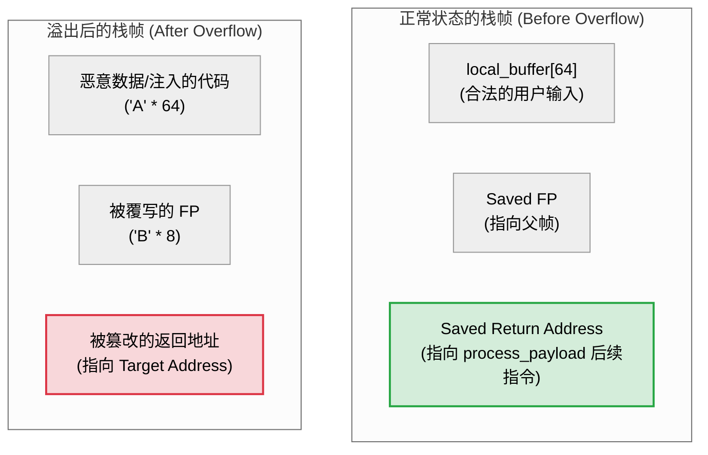

# 第二章：栈溢出漏洞原理与攻击重定向

栈缓冲区溢出是一种空间安全性（Spatial Safety）违规漏洞。理解其本质需要把握物理内存中数据的对齐、生长方向与写入方向的冲突，以及 CPU 执行返回指令时的硬件行为。本章将详细解构这一经典漏洞的底层机理。

---

## 1. 缓冲区越界写（Buffer Out-of-Bounds Writes）的本质

在 C 语言中，数组在内存中是一组连续分配的内存单元，其下标增长方向是从低地址到高地址。而栈底位于高地址，栈顶位于低地址，栈的生长方向是从高地址向低地址。这两者的空间交汇点，就是漏洞产生的根源。

### 内存写入方向与栈生长方向的冲突
当我们向栈上的缓冲区（如字符数组 `char buffer[16]`）写入数据时，写入操作是从 `buffer[0]` 开始，顺着地址递增的方向进行的。

```
                    【栈的物理布局与数据流向】
                    
     物理高地址 ───>  +-----------------------+
                     |  调用者栈帧参数及控制数据|
                     +-----------------------+
                     |  保存的返回地址 (RET)  |  <--- 写入溢出破坏的终极目标
                     +-----------------------+
                     |  保存的帧指针 (FP/RBP) |
                     +-----------------------+
                     |  局部变量 buffer[15]  | ^
   数据写入方向 ───>   |         ...           | | 数组下标递增方向
  (从低地址向高地址)   |  局部变量 buffer[0]   | | (0 -> 15 -> 溢出)
                     +-----------------------+
     物理低地址 ───>  |  栈指针 SP 指向的栈顶   |
                     +-----------------------+
                     栈生长方向 (递减) ⬇️
```

从上图可以直观地看出，一旦数据写入量超出了 `buffer` 预留的 16 字节，数据就会不可避免地越界，向高地址方向蔓延，依次覆写：
1. 后续的局部变量或编译器填充的对齐 Padding。
2. 保存的帧指针（Saved FP/EBP）。
3. **最关键的控制数据：保存的函数返回地址（Saved Return Address / RIP / LR）**。

---

### 典型漏洞 C 代码示例
以下是一个在实际工程中因处理网络封包输入而引发栈缓冲区溢出的典型场景：

```c
#include <stdio.h>
#include <string.h>
#include <stdlib.h>

// 模拟从外部网络接收的数据包结构
typedef struct {
    unsigned short packet_len;
    char payload[512];
} NetworkPacket;

void process_payload(const char* data, unsigned short len) {
    // 在栈上分配一个较小的临时缓冲区
    char local_buffer[64];
    
    // 安全隐患：未使用传入的真实缓冲区限制，而是使用了 strcpy，或者虽然使用 memcpy 但 len 来自不受信的外部输入
    // 若 len > 64，将发生栈溢出
    memcpy(local_buffer, data, len); 
    
    printf("Processed payload: %s\n", local_buffer);
}

int main(int argc, char* argv[]) {
    NetworkPacket packet;
    
    // 模拟恶意攻击者构造的超长载荷（72 字节，超出 local_buffer 的 64 字节）
    packet.packet_len = 72;
    memset(packet.payload, 'A', 64);      // 填充 local_buffer 空间
    memset(packet.payload + 64, 'B', 8);  // 覆写临近的 Saved FP 和返回地址
    
    process_payload(packet.payload, packet.packet_len);
    
    return 0;
}
```

在上述代码中，`process_payload` 内部的 `memcpy` 盲目相信了外部输入的 `packet_len`，导致写入 `local_buffer` 的数据长度达到 72 字节，这会直接冲毁 `local_buffer` 的边界，并将后面的控制数据修改为 `0x4242424242424242`（即字符 `'B'` 的 ASCII 码），导致程序在函数返回时试图跳转到非法地址而崩溃。

---

## 2. 返回地址篡改与劫持（Return Address/LR Hijacking）

攻击者并非只是为了让程序崩溃，他们的核心目标是**劫持控制流**。通过将返回地址修改为自己精心准备的目标内存地址，诱骗 CPU 跳转去执行非预期的逻辑。

### 溢出前后的栈状态对比



### 精确计算溢出偏移量（Padding Size）
要成功实施劫持，必须知道从缓冲区起始位置到返回地址的**精确距离**。其计算公式为：

$$\text{Padding Size} = \text{缓冲区大小} + \text{编译器对齐填充 Padding} + \text{Saved Frame Pointer 大小}$$

* **缓冲区大小**：定义时的字节数。
* **编译器对齐填充**：现代编译器通常要求栈指针按照 8 字节（32位系统）或 16 字节（64位系统）对齐。因此，为缓冲区分配的空间可能大于声明的空间。例如，`char buf[9]` 在 64 位系统上可能被分配 16 字节。
* **Saved Frame Pointer**：在 x86_64 上为 8 字节（`RBP` 副本），在 ARM 32 位上通常也是 4/8 字节（`R11/FP`）。

在实际开发与漏洞分析中，安全人员常使用循环模式字符串（Pattern Generation）工具（如 Metasploit 的 `pattern_create` 和 `pattern_offset`）来定位崩溃时的 PC 值，从而精确反推出 Padding 的大小。

---

## 3. 恶意代码重定向技术演进

随着安全防范技术的升级，攻击者重定向控制流的手段也经历了多次进化：

### 3.1 传统 Shellcode 注入与执行
这是最古老的溢出攻击方式，适用于早期没有引入代码执行保护的系统。

1. **注入**：攻击者在栈缓冲区中不仅写入填充数据，还写入一段编译好的二进制机器码，即 **Shellcode**（通常用于生成一个交互式命令行，如调用 `execve("/bin/sh")`）。
2. **劫持**：将返回地址改写为该缓冲区在栈上的起始地址。
3. **执行**：函数返回时，CPU 跳转回栈内，将栈上的数据当作指令开始执行。

#### NOP 滑行区（NOP Sleds）
由于操作系统的环境变量、栈加载基址在每次运行时可能发生微小偏移，硬编码的缓冲区起始地址可能不精确。为了提高成功率，攻击者会在 Shellcode 前面填充大量 `NOP` 指令（x86 架构为 `0x90`，表示空操作）。
* **效果**：只要被改写的返回地址落在这段 `NOP` 区域的任何一个字节，CPU 就会像滑滑梯一样顺序向下执行，最终顺利滑入真实的 Shellcode。

---

### 3.2 控制流绕过：从 Shellcode 到现代劫持
随着硬件和操作系统引入了 **DEP（数据执行保护 / 栈不可执行）**，将控制流跳转到栈上的做法会直接触发 CPU 硬件异常（即下文详述的 W^X 机制）。攻击者被迫转向“利用现有可执行内存”的技术。

#### A. Return-to-libc (ret2libc)
* **原理**：攻击者不再往栈中注入新代码，而是利用程序本身已经链接的共享库（如 `libc.so`）。
* **实现**：将返回地址修改为 `libc` 中 `system` 函数的入口地址，并在栈上原本存放参数的位置精心布置参数地址（如指向字符串 `"/bin/sh"` 的地址）。当函数返回时，相当于调用了 `system("/bin/sh")`。

#### B. 返回导向编程 (Return-Oriented Programming, ROP)
* **原理**：如果系统中没有简单的 `system` 函数可以直接调用，或者函数参数传递受寄存器限制（如 x86_64 需要用 `%rdi` 传参），攻击者会收集程序和依赖库的只读代码段中现有的短小指令片段，这些片段通常以 `ret`（返回）指令结尾，被称为 **ROP Gadgets**（小配件）。
* **ROP 链构建**：
  例如，若要将寄存器 `%rdi` 设置为特定的数值，攻击者可以在栈上依次布置：
  1. Gadget 1 的地址：指向指令 `pop %rdi; ret`
  2. 期望赋给 `%rdi` 的数据值
  3. Gadget 2 的地址：指向下一阶段要跳转的函数入口（如 `system`）
  当原函数返回时，跳转到 Gadget 1，Gadget 1 的 `pop %rdi` 会将栈上的第 2 项数据弹入 `%rdi` 中，随后 Gadget 1 自身的 `ret` 会弹出栈上的第 3 项（Gadget 2 地址）并跳转执行。通过这种方式，多米诺骨牌式的 ROP 链可以在栈上不执行任何指令的情况下，巧妙操控各寄存器的状态并控制程序走向。

---

## 4. 栈溢出与堆溢出机制对比（Stack vs. Heap Overflow）

内存溢出漏洞根据所发生的内存区域不同，主要分为栈溢出与堆溢出，两者的底层机理与攻击手法存在重大差异：

| 维度 | 栈溢出 (Stack Overflow) | 堆溢出 (Heap Overflow) |
| :--- | :--- | :--- |
| **内存区域性质** | 静态/半自动管理的连续物理空间，生命周期随函数执行结束而消亡。 | 动态分配的平坦内存，生命周期由程序员控制（`malloc`/`free`）。 |
| **内存生长方向** | 向低地址生长（但缓冲区写入仍向高地址）。 | 向高地址生长。 |
| **核心溢出目标** | 覆写保存在栈帧中的函数返回地址（RIP/LR）或保存的父帧指针（FP）。 | 覆写相邻堆块的控制元数据（如 glibc 的 `chunk header`），或覆写堆上分配的 C++ 对象虚表指针（vptr）、函数指针。 |
| **系统奔溃诱因** | 触发非法地址跳转或访问未映射内存页。 | 触发堆内存管理器（如 ptmalloc）在 `malloc`/`free` 时检测到元数据损坏。 |
| **主流攻击技术** | Ret-to-stack/Shellcode、ret2libc、ROP 链控制流劫持。 | 堆风水（Heap Feng-shui）排布、Use-After-Free (UAF) 结构篡改、Double Free 导致双重释放、堆合并攻击（Chunk Consolidation）。 |
| **防御复杂度** | 相对较低。可通过 Canary、DEP、ASLR 实现较高强度的自动化防御。 | 极高。堆管理器本身的完整性校验算法复杂，且极难抵御应用层的 UAF 和逻辑混淆。 |
