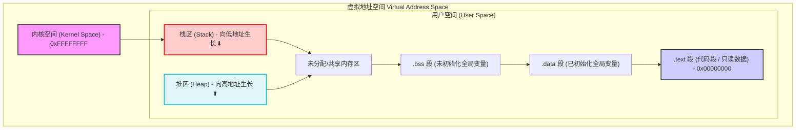

# 引言：栈内存安全概述

在现代系统级编程与嵌入式开发中，C 语言以其直接操作底层硬件的能力和无与伦比的执行效率而闻名。然而，这种“绝对信任程序员”的设计哲学也引入了巨大的安全隐患。其中，**栈溢出（Stack Overflow）**作为经典的内存安全漏洞，近四十年来一直是计算机安全领域的核心话题，也是系统级软件工程师必须攻克的难关。

---

## 1. 栈内存的双刃剑特性

栈（Stack）是现代计算机架构中用于支持函数调用和局部变量管理的关键内存区域。在硬件层面，CPU 通过专用的栈指针寄存器（如 x86_64 的 `RSP`，ARM 的 `SP/R13`）来维护这块区域。

栈内存具有显著的优势：
* **极高的分配效率**：栈的分配和释放仅需要对栈指针寄存器进行简单的加减操作（即一两条机器指令），时间复杂度为 $O(1)$。
* **自动生命周期管理**：局部变量的生命周期与函数调用紧密绑定，当函数退出、栈帧被销毁时，空间自动收回，避免了堆（Heap）内存的手动管理成本及内存泄漏风险。

然而，这种高效性是以牺牲安全性为代价的。C 语言在标准规范中**不强制进行数组边界检查**，这导致程序员在使用指针和缓冲区时必须承担全部的越界防护责任。这种设计上的漏洞使得栈成为了恶意攻击者（Exploiters）最青睐的突破口。

---

## 2. 栈溢出的双重语境

在实际开发与讨论中，“栈溢出”这一名词经常在两种截然不同的语境下被使用，开发人员必须清晰区分它们：

### A. 栈空间耗尽（Stack Exhaustion）
这是一种**资源耗尽型**的溢出。当程序执行深度递归调用、或在栈上分配了过大的局部变量（例如 `char large_buf[1024 * 1024]`）时，栈指针超出了系统分配给该线程的栈空间上限。
* **后果**：直接引发段错误（Segmentation Fault，x86）或进入硬件异常中断（HardFault，ARM Cortex-M），导致程序异常崩溃。
* **本质**：合法的程序逻辑消耗了超出物理限制的资源。

### B. 栈缓冲区溢出（Stack Buffer Overflow）
这是一种**安全漏洞型**的溢出。它是指由于输入校验不严，写入局部缓冲区的数据超出了其声明的大小，从而向高地址方向覆写了栈帧中的其他关键数据（如函数返回地址、保存的栈帧指针等）。
* **后果**：攻击者能够通过精心构造的输入数据改写函数返回地址，强制 CPU 跳转到任意指定的内存地址执行代码（如注入的 Shellcode 或现有的系统函数），从而劫持控制流。
* **本质**：空间安全性（Spatial Safety）失效导致的控制流完整性（Control Flow Integrity）被破坏。

---

## 3. 栈安全威胁的系统级影响

在桌面级操作系统（如 Windows, Linux）中，进程拥有独立的虚拟地址空间，栈溢出漏洞可能导致以下危害：
* **本地权限提升（LPE）**：普通用户利用高权限守护进程的栈溢出漏洞，获取系统 Root/Administrator 权限。
* **远程代码执行（RCE）**：通过网络套接字向服务器发送恶意载荷，覆写服务端处理线程的栈返回地址，获取服务器的 Shell 控制权。

而在物联网与嵌入式系统（如基于 ARM Cortex-M 的裸机或 RTOS 环境）中，影响更为致命：
* 整个系统通常运行在单一的物理或平坦虚拟内存空间中，一个任务的栈溢出可能直接破坏操作系统内核的数据结构。
* 导致设备无限重启（Watchdog 复位）或彻底锁死，在工业控制、汽车电子、医疗设备等安全敏感型场景中，这直接关系到人身和财产安全。

---

## 4. 进程虚拟内存布局与栈生长方向

为了理解栈溢出，我们首先必须理解典型进程（以 32 位系统为例）的虚拟内存排布。栈在内存空间中通常向下（向低地址）生长，而缓冲区写入则向上（向高地址）进行，这正是栈溢出漏洞得以被利用的物理基础。

以下是典型进程的虚拟内存空间示意图：

```mermaid
%%{init: {'theme': 'neutral'}}%%
gridLayout
    accTitle: 典型进程虚拟内存布局
    accDescription: 显示进程从高地址到低地址的各个段的排布，以及栈与堆的生长方向。
```



* **栈（Stack）**：从高地址向低地址生长。每次函数调用执行 `PUSH` 指令或递减栈指针时，`SP` 的值减小。
* **堆（Heap）**：从低地址向高地址生长。通过 `malloc`/`new` 进行动态分配，地址值递增。
* **缓冲区写入方向**：即使栈是向下生长的，我们在栈上分配的字符数组（如 `char buf[128]`）在进行数据写入（如 `strcpy`）时，数据依然是按照**从低地址向高地址**的顺序排列。因此，写入超出边界的数据必然会覆盖位于缓冲区“上方”（即高地址方向）的栈帧控制元数据。

---

## 5. 本书知识体系与导读

本书旨在由浅入深，从硬件寄存器级别到操作系统/编译器防御层面，全方位剖析 C 语言的栈内存安全。全书分为三个核心章节：

* **[第一章：栈内存机制与函数调用栈帧](01_stack_mechanism.md)**：深入不同架构（x86_64 与 ARM Cortex-M）的调用约定（Calling Conventions），拆解栈帧的物理结构，剖析寄存器（SP, LR, PC）的协同工作原理，并量化分析递归调用的内存开销与尾调用优化（TCO）。
* **[第二章：栈溢出漏洞原理与攻击重定向](02_overflow_vulnerabilities.md)**：通过真实漏洞代码，演示栈缓冲区越界写如何一步步蚕食返回地址（LR），探讨 Shellcode 注入、NOP 滑行区、Ret-to-libc 及 Return-Oriented Programming (ROP) 的漏洞利用演进，并详细对比栈溢出与堆溢出的机制差异。
* **[第三章：栈溢出防御措施与工程实践](03_defense_measures.md)**：立足于工业级防御，剖析编译器 Canary 哨兵（`-fstack-protector`系列）的插入与校验机制，讲解操作系统级 DEP/NX 与 ASLR 的协同防御，实战演示 ARM Cortex-M 硬件 MPU 栈警戒区（Guard Zones）的配置，并总结运行时边界校验与现代静态/动态分析技术。

通过本书的学习，读者不仅能够写出结构严密、无缓冲区隐患的安全 C 代码，更能站在系统底层的视角，理解漏洞攻防的本质。
