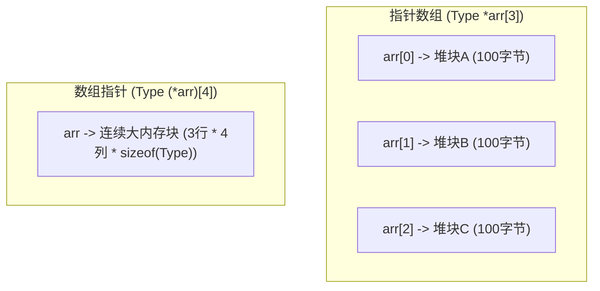

# 动态二维数组的内存分配与回收

在处理矩阵计算、图像处理或动态字符列表时，二维数组是最基础的数据结构。然而，在 C 语言中，动态分配二维数组并非只有一种方法。不同的分配策略不仅直接决定了内存释放的复杂度，更对 CPU 缓存命中率（Cache Hit Rate）和系统整体性能产生深远影响。

---

## 指针数组 vs 数组指针

在深入动态分配之前，必须厘清 C 语言中两个极易混淆的核心概念：**指针数组**与**数组指针**。

### 1. 指针数组 (Array of Pointers)
*   **语法**：`Type *arr[N];`
*   **本质**：它是一个**数组**，数组中存放了 `N` 个指向 `Type` 类型的指针。
*   **内存特征**：数组本身的 `N` 个指针在物理上是连续排布的，但这些指针各自指向的目标地址在物理上可以分布在堆区的任何碎片位置。
*   **指针退化**：在作为函数参数传递时，`Type *arr[N]` 会退化为二级指针 `Type **`。

### 2. 数组指针 (Pointer to Array)
*   **语法**：`Type (*arr)[N];`
*   **本质**：它是一个**指针**，指向一个包含 `N` 个 `Type` 类型元素的数组。
*   **内存特征**：这是一个单一指针，其步长（Pointer Arithmetic Step）为 `N * sizeof(Type)` 字节。它指向一块物理上完全连续的二维矩阵内存。
*   **寻址图景**：



---

## 动态二维数组的两种分配模式

依据物理连续性，动态分配二维数组通常分为**非连续分配**与**连续分配**。

### 1. 非连续内存分配（锯齿数组/Jagged Array）
这是教科书中最常见的分配方案：先分配一个包含行指针的数组，再对每一行独立执行 `malloc`。

```c
int **arr = (int **)malloc(rows * sizeof(int *));
for (int i = 0; i < rows; i++) {
    arr[i] = (int *)malloc(cols * sizeof(int));
}
```

*   **优点**：
    *   **极高灵活性**：每一行的大小可以不同（构成锯齿状数组）。
    *   **易适配碎片化内存**：当堆区中没有足够大的单块连续空间时，这种分块分配更容易成功。
*   **缺点**：
    *   **严重的 Cache Line 缺失**：由于各行物理地址不连续，当按列遍历或跳行读取时，CPU 缓存机制无法有效进行预取（Prefetching），导致耗时的 Cache Miss。
    *   **高分配开销**：需要执行 `rows + 1` 次 `malloc` 调用，增加了内存分配器的管理开销（每个堆块都有其元数据 Headers，产生额外的空间浪费）。

### 2. 连续内存分配（单次/双次申请）
此方案将所有元素打包在一块连续的内存块中，然后通过二级指针挂接，以维持 `arr[i][j]` 的直观语法。

```c
// 1. 分配指针数组本身
int **arr = (int **)malloc(rows * sizeof(int *));
// 2. 一次性分配存储所有元素的整块内存
int *data = (int *)malloc(rows * cols * sizeof(int));
// 3. 将行指针指向该大内存的对应段
for (int i = 0; i < rows; i++) {
    arr[i] = data + i * cols;
}
```

*   **优点**：
    *   **缓存友好**：二维矩阵在物理上是完全连续的，完美适配 CPU Cache Line（单次载入 64 字节数据，极速遍历相邻元素）。
    *   **低分配开销**：仅需 2 次 `malloc`，元数据冗余少，且释放极为方便。
*   **缺点**：
    *   需要一块足够大的连续物理/虚拟内存块。

---

## 递归与循环安全释放机制

当使用非连续分配法创建复杂的嵌套或多维动态数组时，如何确保释放内存时不发生指针悬空和内存泄漏？

### 迭代释放 vs 递归释放

对于标准的非连续分配二维数组，通常使用**迭代循环**释放：
```c
for (int i = 0; i < rows; i++) {
    free(arr[i]); // 释放每一行
}
free(arr);        // 释放行指针数组本身
```

然而，在处理诸如**不规则多维树形数据结构**、**动态嵌套的锯齿数组**或具有**父子级联关系**的复杂矩阵时，显式的迭代代码会变得极其冗长且易错。此时，**递归释放（Recursion-based Freeing）**凭借其声明式的代码结构和优美的前/后序遍历语义，成为了更优雅的解决方案。

---

## 完整生产级代码范例

以下程序集成了上述两种分配模式，并实现了一个基于递归机制的深度销毁算法。

```c
#include <stdio.h>
#include <stdlib.h>

/**
 * @brief 递归释放非连续二维锯齿数组的辅助函数
 * 
 * @param arr  指向行指针数组的二级指针
 * @param row  当前正在处理的行索引
 */
void recursive_free_rows(int **arr, int row) {
    // 递归基（Base Case）：如果行索引已递减至 0，则停止递归
    if (row <= 0) {
        return;
    }

    // 1. 递归释放当前行之前的行（前序/后序选择：此处先递归，释放深层内存）
    recursive_free_rows(arr, row - 1);

    // 2. 释放当前行堆内存，并安全清空
    if (arr[row - 1] != NULL) {
        free(arr[row - 1]);
        arr[row - 1] = NULL;
    }
}

/**
 * @brief 基于递归的安全二维数组销毁器
 * 
 * @param p_arr 指向二级指针本身的指针，便于在释放后将原始变量置为 NULL
 * @param rows  二维数组的总行数
 */
void safe_free_jagged_array(int ***p_arr, int rows) {
    if (p_arr == NULL || *p_arr == NULL) {
        return;
    }

    // 1. 递归释放所有子行内存
    recursive_free_rows(*p_arr, rows);

    // 2. 释放最外层的行指针数组本身
    free(*p_arr);

    // 3. 将调用方的指针变量置空，防止野指针
    *p_arr = NULL;
}

/**
 * @brief 分配物理上连续的动态二维数组（只需两次 malloc）
 */
int** allocate_contiguous_2d_array(int rows, int cols) {
    if (rows <= 0 || cols <= 0) return NULL;

    // 1. 分配行指针空间
    int **arr = (int **)malloc(rows * sizeof(int *));
    if (arr == NULL) return NULL;

    // 2. 分配所有元素所需的单块物理连续大内存
    int *data = (int *)malloc(rows * cols * sizeof(int));
    if (data == NULL) {
        free(arr); // 核心：第二步失败时，必须释放第一步的指针数组
        return NULL;
    }

    // 3. 挂接行首地址到指针数组
    for (int i = 0; i < rows; i++) {
        arr[i] = data + (i * cols);
    }

    return arr;
}

/**
 * @brief 释放连续二维数组
 */
void free_contiguous_2d_array(int ***p_arr) {
    if (p_arr == NULL || *p_arr == NULL) return;

    int **arr = *p_arr;
    // 由于元素物理连续，arr[0] 即为 data 数据块的首地址
    if (arr[0] != NULL) {
        free(arr[0]); // 释放整块数据内存
    }

    // 释放行指针数组本身
    free(arr);
    *p_arr = NULL;
}

int main(void) {
    int r = 4, c = 5;

    // ==========================================
    // 方案一：分配非连续锯齿数组并进行递归安全释放
    // ==========================================
    printf("--- Jagged Array Allocation ---\n");
    int **jagged = (int **)malloc(r * sizeof(int *));
    if (jagged != NULL) {
        for (int i = 0; i < r; i++) {
            jagged[i] = (int *)malloc(c * sizeof(int));
            if (jagged[i] != NULL) {
                jagged[i][0] = i * 100; // 测试赋值
                printf("jagged[%d] addr: %p\n", i, (void*)jagged[i]);
            }
        }
    }

    // 递归安全释放锯齿数组，并置为空指针
    safe_free_jagged_array(&jagged, r);
    if (jagged == NULL) {
        printf("Jagged array successfully freed & zeroed.\n");
    }

    // ==========================================
    // 方案二：分配连续二维数组（具有高 Cache 性能）
    // ==========================================
    printf("\n--- Contiguous Array Allocation ---\n");
    int **matrix = allocate_contiguous_2d_array(r, c);
    if (matrix != NULL) {
        // 验证物理内存的连续性
        for (int i = 0; i < r; i++) {
            printf("matrix[%d] addr: %p (diff from previous: %td bytes)\n", 
                   i, (void*)matrix[i], 
                   (i > 0) ? ((char*)matrix[i] - (char*)matrix[i-1]) : 0);
        }

        // 安全释放连续矩阵
        free_contiguous_2d_array(&matrix);
    }

    return 0;
}
```

### 关键细节说明
1.  **物理连续性验证**：在连续分配的示例中，如果打印 `matrix[i] - matrix[i-1]` 的地址差值，可以发现它精确等于 `cols * sizeof(int)`。而锯齿分配的指针地址差值则大小无序、甚至可能跳跃巨大。
2.  **递归深度防御**：虽然递归释放逻辑非常契合级联树状对象的生命周期，但在行数极其庞大（例如 `rows > 100000`）时，过深的递归可能导致调用栈（Call Stack）溢出。在工业实践中，当处理深度不确定的巨量数据时，应当优先使用显式迭代（循环）加上辅助数据结构来完成内存清理。
