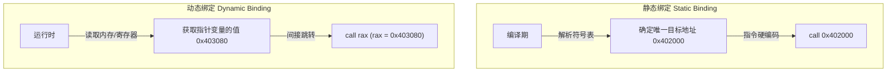

# 第一章：C语言函数指针语法全解析

在 C 语言中，数据声明和函数声明的语法极具伸缩性。当函数指针、指针数组、返回指针的函数以及多层回调混合在一起时，语法可能会变得晦涩难懂。本章将系统剖析函数指针的语法结构，利用经典的“右左法则”（Right-Left Rule）层层解构复杂的指针声明，并探讨如何通过 `typedef` 优雅地管理它们，最后对比静态绑定与动态绑定的深层机制。

---

## 1. 基础语法与指针声明的本质

在 C 语言中，函数名本身在大多数上下文中会被隐式转换为指向该函数的指针（与数组名类似）。函数指针变量的声明方式必须精确反映它所指向的函数的**签名**（即返回值类型和参数列表）。

### 1.1 基础声明对比

我们先从最基础的声明入手，对比普通函数声明、指针函数（返回指针的函数）与函数指针：

```c
int *func1(int, double);  // 1. 指针函数：这是一个函数，接受 int 和 double 参数，返回一个指向 int 的指针 (int*)
int (*func2)(int, double); // 2. 函数指针：这是一个指针，指向一个接受 int 和 double 参数、返回 int 的函数
```

在 `func2` 的声明中，圆括号 `(*func2)` 是强制性的。这是因为在 C 语言中，函数调用运算符 `()` 的优先级高于指针解引用运算符 `*`。如果不加括号：
- `int *func2(int, double)` 会被解析为 `(int*) func2(int, double)`；
- 加上括号后，`(*func2)` 使得 `func2` 首先与 `*` 结合，声明为一个指针，之后再与 `(int, double)` 结合，声明其指向的函数签名。

### 1.2 函数地址的获取与调用

在 C 语言中，获取函数地址和通过函数指针调用函数有显式和隐式两种写法，它们在语义上是完全等价的：

```c
#include <stdio.h>

void log_message(const char *msg) {
    printf("Log: %s\n", msg);
}

int main(void) {
    // 声明并初始化函数指针
    void (*fp1)(const char *) = &log_message; // 显式获取函数地址
    void (*fp2)(const char *) = log_message;  // 隐式获取函数地址 (推荐)

    // 调用方式
    (*fp1)("Hello via explicit dereference!"); // 显式解引用调用
    fp2("Hello via implicit dereference!");  // 隐式调用 (推荐，更像普通函数)

    return 0;
}
```

> [!NOTE]
> 为什么 `fp2("...")` 和 `(*fp1)("...")` 都可以运行？
> 根据 C 语言标准，在进行函数调用时，调用运算符 `()` 的左侧操作数必须是一个“指向函数的指针”类型。如果传入的是一个函数名，编译器会自动将其转换为指向该函数的指针。因此，`fp2` 本身已经是指针，可以直接跟 `()`；而 `*fp1` 会先被解引用回函数，但为了调用它，编译器又会将其隐式转换回指针。所以无论加多少个 `*`（如 `(***fp1)("...")`），在语义上最终都会被转换为指针调用。

---

## 2. 复杂声明的解密利器：“右左法则”

面对包含多重括号、指针和数组的复杂 C 语言声明时，“右左法则”（Right-Left Rule）是公认的解析利器。

### 2.1 右左法则的核心步骤

1.  **寻找标识符**：从最里层的括号内未声明的标识符（即变量名）开始看起。
2.  **向右看**：看标识符右侧最近的符号。
    *   如果是 `[]`，说明这是一个数组。
    *   如果是 `()`，说明这是一个函数。
3.  **向左看**：看标识符左侧最近的符号。
    *   如果是 `*`，说明这是一个指针。
4.  **脱括号**：如果遇到了括号（即包裹当前部分的圆括号），则说明当前括号内的部分已经解析完毕，跳出该括号，重复步骤 2 和 3。
5.  **最终类型**：直到解析完整个声明，最左侧剩下的就是基础类型（如 `int`, `void`, `char` 等）。

---

### 2.2 经典案例解析 1：`signal` 函数的声明

这是 C 标准库中 `<signal.h>` 里的 `signal` 函数的原型声明：

```c
void (*signal(int sig, void (*func)(int)))(int);
```

我们用右左法则分步解构它：

1.  **标识符**：最里层的核心标识符是 `signal`。
2.  **向右看**：右侧是 `(int sig, void (*func)(int))`。这表明 `signal` 是一个**函数**，它接收两个参数：
    *   第一个参数 `sig` 的类型是 `int`。
    *   第二个参数 `func` 是一个指针（左侧有 `*`），向右看是 `(int)`，向左看是 `void`。因此，`func` 是一个**指向“接收一个 int 参数并返回 void”的函数的指针**。
3.  **向左看**：括号外左侧是 `*`。这表明 `signal` 函数的**返回值是一个指针**。
4.  **脱括号**：此时 `(*signal(...))` 这一层解析完毕。跳出来，向右看。
5.  **向右看**：右侧是 `(int)`。这表明刚才的返回值指针，指向的是一个**接收一个 int 参数的函数**。
6.  **向左看**：最左侧是 `void`。这表明那个被指向的函数**返回 void**。

**结论**：`signal` 是一个函数，它接收一个 `int` 和一个函数指针作为参数，其返回值是一个指向“接收 `int` 参数并返回 `void` 的函数”的指针。

---

### 2.3 经典案例解析 2：嵌套回调函数数组

看下面这个极其复杂的声明，这在某些高度优化的底层分发器中可能出现：

```c
void (*(*f[])(int, void (*)(void)))(int);
```

我们再次使用右左法则解析：

1.  **标识符**：核心标识符是 `f`。
2.  **向右看**：右侧是 `[]`。说明 `f` 是一个**数组**。
3.  **向左看**：左侧是 `*`。说明数组 `f` 的元素是**指针**。
4.  **脱括号**：`(*f[])` 解析完毕。跳出来，向右看。
5.  **向右看**：右侧是 `(int, void (*)(void))`。说明这些指针指向**函数**。这些函数接收两个参数：一个 `int` 和一个无参数无返回值的函数指针 `void (*)(void)`。
6.  **向左看**：左侧是 `*`。说明这些函数的**返回值是一个指针**。
7.  **脱括号**：`(*(*f[])(...))` 解析完毕。跳出来，向右看。
8.  **向右看**：右侧是 `(int)`。说明刚才的返回值指针指向的是一个**接收 int 参数的函数**。
9.  **向左看**：最左侧是 `void`。说明那个被指向的函数**返回 void**。

**结论**：`f` 是一个数组，数组元素是函数指针。这些函数接收一个 `int` 和一个回调函数指针，并返回另一个函数指针（该指针指向一个接收 `int` 并返回 `void` 的函数）。

---

## 3. 使用 `typedef` 简化与规范化声明

直接编写上述复杂声明的代码不仅难以维护，而且极易出错。在生产实践中，我们应当通过 `typedef` 将其逐步解构并赋予有物理意义的别名。

### 3.1 `typedef` 的核心语法规则

声明 `typedef` 别名最简单的方法是：先按照声明普通变量的方式写出声明，然后在最前面加上 `typedef` 关键字，最后将变量名替换为你想要的别名。

例如，声明一个指向 `void func(int)` 的函数指针变量 `fp`：
```c
void (*fp)(int);
```
在前面加上 `typedef` 并将变量名 `fp` 改为 `Callback_t`：
```c
typedef void (*Callback_t)(int);
```
此时，`Callback_t` 就变成了一个**类型别名**，我们可以用它直接定义变量：
```c
Callback_t my_callback = &some_function;
```

### 3.2 重构 `signal` 声明与嵌套回调

我们使用 `typedef` 重构前面提到的 `signal` 声明：

```c
// 定义基础回调函数类型：接收 int，返回 void
typedef void (*SigHandler_t)(int);

// 声明 signal 函数：接收 int 和 SigHandler_t 类型的参数，返回 SigHandler_t 类型的值
SigHandler_t signal(int sig, SigHandler_t func);
```
仅仅两行，可读性得到了质的提升。

对于更复杂的嵌套回调数组 `f`（即 `void (*(*f[])(int, void (*)(void)))(int)`）：
```c
// 1. 定义最内层无参回调类型
typedef void (*VoidCallback_t)(void);

// 2. 定义最终被指向的返回函数类型
typedef void (*OutputCallback_t)(int);

// 3. 定义数组内函数指针所指向的函数类型
typedef OutputCallback_t (*ActionFunc_t)(int, VoidCallback_t);

// 4. 声明数组 f
ActionFunc_t f[10];
```
通过这种阶梯式的定义，不仅消除了繁琐的括号，更让每一层回调的职责变得一目了然。

---

## 4. 静态绑定与动态绑定的深层对比

理解函数指针的关键，在于理解它如何将程序的绑定时间从**编译期**推迟到**运行时**。

| 维度 | 静态绑定 (Static Binding) | 动态绑定 (Dynamic Binding) |
| :--- | :--- | :--- |
| **定义** | 在编译和链接阶段就已经确定了调用的目标函数地址。 | 在运行时通过变量或内存查找来确定目标函数地址。 |
| **底层指令** | 直接分支跳转：如 `call 0x401120` (x86) 或 `bl 0x1040` (ARM)。 | 间接分支跳转：如 `call rbx` (x86) 或 `blr x3` (ARM)。 |
| **执行开销** | 极低。目标地址硬编码，CPU 易于预取指令，分支预测率高。 | 较高。需要额外的内存/寄存器寻址，可能导致分支预测未命中（BTB Miss）。 |
| **灵活性** | 较低。调用关系在编译时固化，不支持运行时多态。 | 极高。支持插件、运行时注册回调、策略模式等。 |
| **编译器优化**| 易于进行内联（Inlining）、死代码消除（DCE）等全局优化。 | 很难进行内联。除非编译器能通过控制流分析完成“去虚拟化”。 |

### 4.1 内存模型视角下的调用过程

当执行直接调用和间接调用时，进程的内存空间和寄存器状态如下所示：

#### 静态绑定（直接调用）的指令流：
```
地址        汇编指令             说明
0x401000   mov rdi, 10         ; 传递参数
0x401007   call 0x402000       ; 直接跳转到硬编码地址 0x402000 (do_work)
```

#### 动态绑定（间接调用）的指令流：
```
地址        汇编指令             说明
0x401000   mov rdi, 10         ; 传递参数
0x401007   mov rax, [rip+0x20] ; 从全局数据区读取函数指针变量的值（例如得到 0x403080）
0x40100e   call rax            ; 间接跳转到 rax 寄存器中存储的地址
```



在下一章中，我们将深入汇编底层，通过具体的代码实例剖析间接调用在 x86-64 与 ARM 架构上的机器表示，并探讨它对现代 CPU 流水线分支预测的深远影响。
