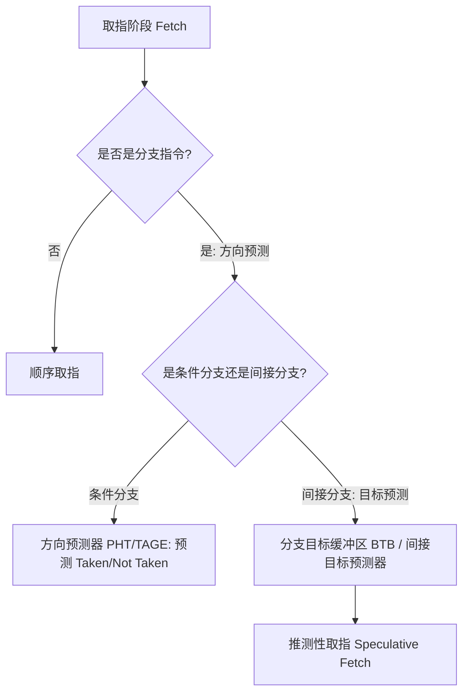
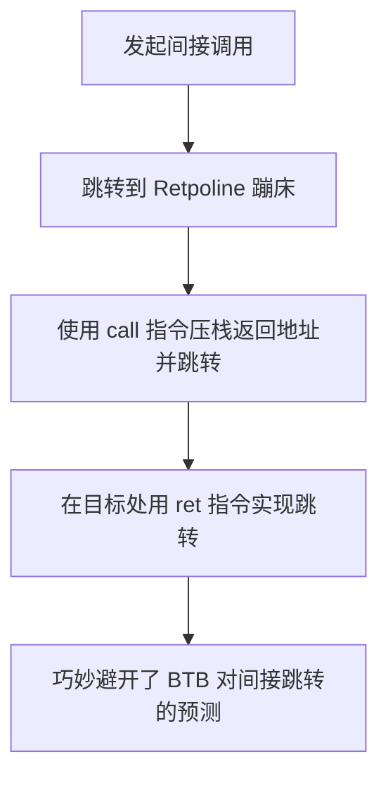

# 第二章：间接调用与编译器/分支预测优化

在 C 语言中，使用函数指针虽然能极大地提高系统的灵活性，但这种灵活性在底层硬件层面是有代价的。本章我们将深入探讨函数指针在汇编层面的机器表示，剖析现代 CPU 的分支预测机制（特别是针对间接跳转的 BTB 行为），并探讨分支预测失败所带来的性能惩罚。最后，我们将研究编译器如何通过去虚拟化（Devirtualization）与间接调用促销（Indirect Call Promotion）等高级手段优化这些开销。

---

## 1. 间接调用的汇编翻译与底层指令

当我们在 C 语言中通过函数指针发起调用时，编译器无法在编译期确定跳转目标。因此，编译器必须生成**间接调用指令**，而不是像直接调用那样硬编码目标偏移量。

### 1.1 x86-64 与 ARM64 汇编对比

考虑以下简单的 C 语言示例：

```c
// caller.c
typedef int (*ArithmeticFunc)(int, int);

int execute_op(ArithmeticFunc op, int a, int b) {
    return op(a, b);
}
```

使用主流编译器（如 GCC 或 Clang）在 `-O2` 优化级别下编译该文件，我们来看看其生成的汇编代码：

#### x86-64 汇编表示（System V AMD64 ABI）：
```assembly
# 输入参数：
#   rdi = op (函数指针)
#   esi = a  (第一个参数)
#   edx = b  (第二个参数)
execute_op:
    .cfi_startproc
    mov     rax, rdi        # 将函数指针的值移入暂存寄存器 rax
    mov     edi, esi        # 调整参数寄存器，将 a 放入 edi (第一个参数)
    mov     esi, edx        # 调整参数寄存器，将 b 放入 esi (第二个参数)
    jmp     rax             # 尾调用优化 (Tail-call Optimization)：直接跳转到 rax，不再使用 call/ret
    .cfi_endproc
```

如果不是尾调用（例如在调用后还需要对结果进行处理），则汇编指令会使用 `call`：
```assembly
    call    rax             # 间接调用：压入返回地址到栈顶，并跳转到 rax 寄存器存储的地址
```

#### ARM64 (AArch64) 汇编表示：
```assembly
# 输入参数：
#   x0 = op (函数指针)
#   w1 = a  (第一个参数)
#   w2 = b  (第二个参数)
execute_op:
    mov     x19, x0         // 将函数指针存入暂存寄存器 x19
    mov     w0, w1          // 将 a 调整到第 0 参数寄存器 w0
    mov     w1, w2          // 将 b 调整到第 1 参数寄存器 w1
    br      x19             // 尾调用优化：使用 br (Branch Register) 指令跳转到 x19
```

如果不是尾调用：
```assembly
    blr     x19             // 间接分支并链接：跳转到 x19，并将返回地址写入 Link Register (x30/lr)
```

### 1.2 核心差异分析
*   **直接分支（`call label` / `bl label`）**：目标地址相对于当前 PC（程序计数器）的偏移量是编译时计算好并直接编码在指令里的。CPU 可以在解码阶段就直接算出跳转目标。
*   **间接分支（`call rax` / `blr x19`）**：跳转的目标地址存储在寄存器中。CPU 在能够执行该跳转之前，必须先通过数据依赖链获取到寄存器的最新值。

---

## 2. 现代 CPU 分支预测机制：BTB 与间接分支预测

现代超标量 CPU 依赖于深度的指令流水线（Pipeline）来取得高 IPC（每周期指令数）。为了防止流水线因等待分支指令计算出目标而停顿，CPU 引入了**分支预测器（Branch Predictor）**。



### 2.1 分支目标缓冲区 (BTB, Branch Target Buffer)

条件分支（如 `if-else`）通常只需要预测“跳还是不跳”（Taken / Not Taken），因为其跳转目标只有两个（PC + 偏移量，或者紧随其后的下一条指令）。
但间接分支（`call rax`）的跳转目标可能是内存中的任意地址，因此它不仅需要预测“方向”，更关键的是要预测**“跳转目标地址”（Target Address）**。这就是 **BTB** 的用武之地。

*   **BTB 结构**：BTB 是一个特殊的缓存（Cache），类似于 TLB，它将分支指令的地址（PC）映射到上一次或前几次成功跳转的目标地址（Target PC）。
*   **预测过程**：当取指单元（Fetch Unit）发现当前取指地址在 BTB 中有命中项时，它会查出保存的目标地址，并立即在这个预测的目标地址处继续取指。

### 2.2 间接分支预测器 (ITT / Indirect Branch Predictor)

如果一个间接调用在运行时始终跳转到同一个函数（例如，同一个接口实例），BTB 可以做到 100% 准确。然而，如果同一个间接调用在多个目标之间来回切换（多态分发或状态机跳转），传统的单目标 BTB 就会频繁发生**未命中（Conflict / Misprediction）**。

为了解决这个问题，现代处理器（如 Intel Core、AMD Zen）引入了更复杂的**全局历史间接分支预测器（Indirect Target Predictor）**：
*   它不仅利用当前分支指令的 PC，还会结合**全局分支历史寄存器（Global Branch History Register, GHR）**的路径信息进行哈希映射。
*   通过结合最近执行过的分支历史路径，区分同一个间接跳转指令在不同上下文中的行为，从而准确预测多重跳转目标。

---

## 3. 分支预测失败的代价与安全防御

尽管预测器很智能，但当出现随机分发或者冷启动时，分支预测失败是不可避免的。

### 3.1 流水线排空与惩罚周期

当 CPU 发现其推测执行（Speculative Execution）的路径是错误的时候，它必须：
1.  **废弃（Flush）**所有在流水线中已取指、译码但尚未提交的指令。
2.  **清空（Clear）**推测执行期间修改的所有暂存状态。
3.  从正确的地址重新开始取指。

在现代主流处理器中，流水线深度通常在 15~20 级左右。一次分支预测失败的惩罚通常需要消耗 **15 到 20 个时钟周期**。如果一个紧凑的循环中频繁发生预测失败，CPU 的吞吐量可能会断崖式下跌 50% 以上。

### 3.2 安全防御开销：Retpoline

在 2018 年被披露的 **Spectre Variant 2 (CVE-2017-5715)** 漏洞中，攻击者可以利用间接分支预测器污染 BTB，诱导 CPU 推测执行越权指令，进而通过旁路攻击（Side-channel Attack）窃取数据。

为了防范此漏洞，编译器引入了 **Retpoline**（Return Trampoline，返回蹦床）机制：



Retpoline 的核心思想是将间接跳转 `jmp rax` 替换为一串利用 `call` 和 `ret` 指令配合构造的代码，使得 CPU 的分支预测器强制去查找**返回栈缓冲区（RSB, Return Stack Buffer）**而不是 BTB。

这套防御机制在带来安全性的同时，也极大地增加了跳转开销。在开启 Retpoline 的系统上，每一次函数指针调用的性能衰减可能会进一步加剧。

---

## 4. 编译器优化：去虚拟化与间接调用促销

鉴于间接调用带来的硬件开销，现代优化编译器在编译时会竭尽全力将间接调用转换为直接调用。

### 4.1 去虚拟化 (Devirtualization)

如果编译器能够通过静态控制流分析（如指针分析、逃逸分析），证明在某处调用的函数指针有且仅有一个可能的指向，它就会直接将间接调用改写为直接调用，并尝试进行**函数内联（Inlining）**。

```c
static int add(int a, int b) { return a + b; }

int main() {
    ArithmeticFunc op = add; // 编译器能静态推导 op 必然指向 add
    return op(3, 4);        // 优化后：直接内联为 3 + 4，消除了整个调用
}
```

### 4.2 间接调用促销 (Indirect Call Promotion, ICP)

当静态分析无法确定目标，但程序开启了**基于特征分析的优化（Profile-Guided Optimization, PGO）**时，编译器会根据运行时的统计数据进行促销优化。

如果 PGO 数据表明，某个函数指针 `op` 在 99% 的情况下都指向 `add` 函数，编译器就会生成类似下面的代码：

```c
// 原始代码：
// int res = op(a, b);

// 编译器促销（ICP）后的等价逻辑：
int res;
if (op == add) {
    res = add(a, b); // 静态直接调用，可被内联优化！
} else {
    res = op(a, b);  // 兜底的慢速路径：间接调用
}
```

#### ICP 带来的巨大优势：
1.  **高预测性**：条件分支 `if (op == add)` 的方向非常单一，CPU 的 TAGE 预测器可以轻松做到几乎 100% 预测正确。
2.  **内联机会**：在条件成立的分支里，`add(a, b)` 是一个直接调用，编译器可以对其进行完全内联，从而消除了函数调用的开销，并开启了更广泛的寄存器分配和指令调度优化。

在下一章中，我们将回归系统软件设计，学习如何利用函数指针数组构建工业级的高性能状态机与命令路由表，并结合本章的性能分析，探讨如何在高吞吐系统里做合理折中。
