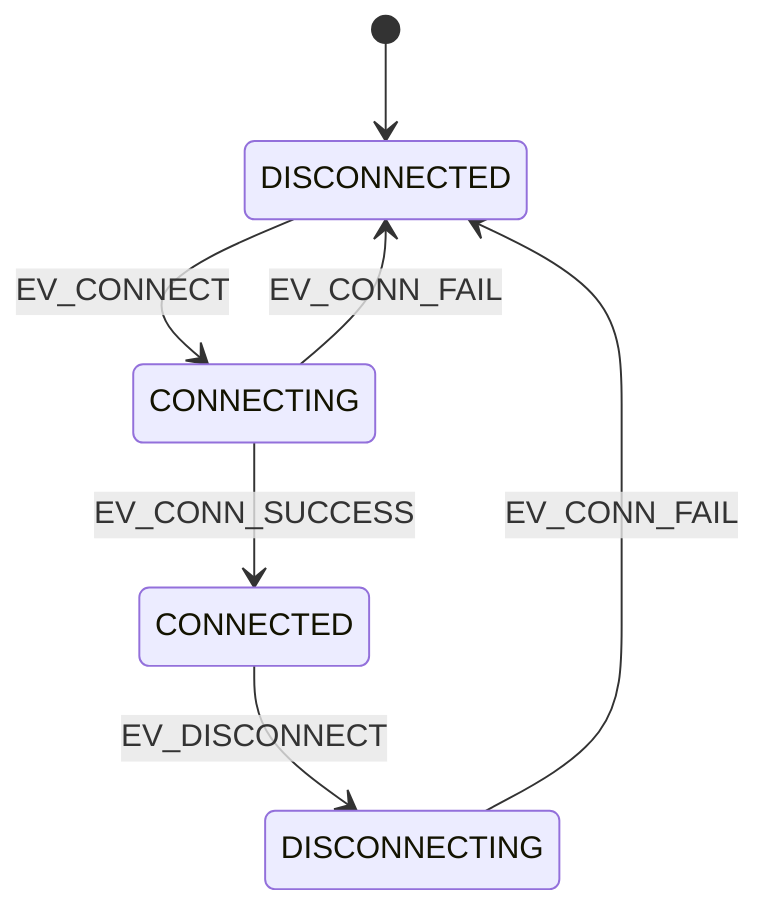

# 第三章：基于函数指针的高级设计模式

在前两章中，我们掌握了函数指针的语法声明，并深入了解了间接跳转在 CPU 底层的执行代价。本章我们将把这些理论付诸实践，探讨如何在系统架构设计中优雅地应用函数指针。我们将构建三个生产级别的 C 语言架构模式：**表驱动状态机（Tabular FSM）**、**动态命令行路由器（Command Router）**，以及**跨平台动态链接库（Shared Library）的回调与插件机制**。

---

## 1. 工业级表驱动有限状态机（FSM）设计

传统的有限状态机通常使用嵌套的 `switch-case` 或 `if-else` 来实现。当状态和事件数量增加时，代码的维护成本会呈指数级上升。表驱动状态机通过将状态转移逻辑抽离到“二维配置表”中，利用函数指针分发，能够将状态转移的时间复杂度维持在固定的 $O(1)$，且扩展新状态或事件时无需修改核心引擎代码。

### 1.1 状态机设计图

我们以一个典型的网络连接控制器（Connection Controller）为例，其包含 4 个状态和 4 个事件：



### 1.2 生产级 C 代码实现

我们将状态转移配置表定义为一个二维数组，行代表当前状态（State），列代表发生的事件（Event）。单元格存储目标状态和要执行的动作函数指针。

```c
#include <stdio.h>
#include <stdlib.h>
#include <stdbool.h>

// 1. 定义状态与事件枚举
typedef enum {
    STATE_DISCONNECTED,
    STATE_CONNECTING,
    STATE_CONNECTED,
    STATE_DISCONNECTING,
    STATE_MAX
} State_t;

typedef enum {
    EV_CONNECT,
    EV_CONN_SUCCESS,
    EV_CONN_FAIL,
    EV_DISCONNECT,
    EV_MAX
} Event_t;

// 状态机上下文结构体
typedef struct {
    State_t current_state;
    int retry_count;
    void *user_data;
} FsmContext_t;

// 2. 定义动作函数指针类型
typedef void (*ActionFunc_t)(FsmContext_t *ctx);

// 3. 定义状态转换结构体
typedef struct {
    State_t next_state;
    ActionFunc_t action;
} Transition_t;

// 4. 声明动作函数（具体实现）
void do_connect(FsmContext_t *ctx) {
    printf("Action: Initiating socket connection...\n");
    ctx->retry_count = 0;
}

void do_conn_success(FsmContext_t *ctx) {
    printf("Action: Handshake complete. Connection established.\n");
}

void do_conn_fail(FsmContext_t *ctx) {
    ctx->retry_count++;
    printf("Action: Connection failed. Retry count: %d\n", ctx->retry_count);
}

void do_disconnect(FsmContext_t *ctx) {
    printf("Action: Terminating socket connection.\n");
}

void do_nothing(FsmContext_t *ctx) {
    // 哑动作，用于非法或无动作的转移
    (void)ctx;
}

// 5. 构建状态转移矩阵 (二维表)
// 格式: [Current_State][Event] = { Next_State, Action }
const Transition_t fsm_table[STATE_MAX][EV_MAX] = {
    [STATE_DISCONNECTED] = {
        [EV_CONNECT]      = { STATE_CONNECTING,   do_connect },
        [EV_CONN_SUCCESS] = { STATE_DISCONNECTED, do_nothing }, // 非法转移，保持原样
        [EV_CONN_FAIL]    = { STATE_DISCONNECTED, do_nothing },
        [EV_DISCONNECT]   = { STATE_DISCONNECTED, do_nothing }
    },
    [STATE_CONNECTING] = {
        [EV_CONNECT]      = { STATE_CONNECTING,   do_nothing },
        [EV_CONN_SUCCESS] = { STATE_CONNECTED,    do_conn_success },
        [EV_CONN_FAIL]    = { STATE_DISCONNECTED, do_conn_fail },
        [EV_DISCONNECT]   = { STATE_DISCONNECTING,do_disconnect }
    },
    [STATE_CONNECTED] = {
        [EV_CONNECT]      = { STATE_CONNECTED,    do_nothing },
        [EV_CONN_SUCCESS] = { STATE_CONNECTED,    do_nothing },
        [EV_CONN_FAIL]    = { STATE_DISCONNECTED, do_conn_fail }, // 异常断开
        [EV_DISCONNECT]   = { STATE_DISCONNECTING,do_disconnect }
    },
    [STATE_DISCONNECTING] = {
        [EV_CONNECT]      = { STATE_DISCONNECTING,do_nothing },
        [EV_CONN_SUCCESS] = { STATE_DISCONNECTING,do_nothing },
        [EV_CONN_FAIL]    = { STATE_DISCONNECTED, do_nothing }, // 清理完成
        [EV_DISCONNECT]   = { STATE_DISCONNECTING,do_nothing }
    }
};

// 6. 状态机事件分发引擎
void fsm_dispatch(FsmContext_t *ctx, Event_t event) {
    if (ctx == NULL || event >= EV_MAX || ctx->current_state >= STATE_MAX) {
        fprintf(stderr, "Error: Invalid FSM context or event.\n");
        return;
    }

    // 从矩阵中获取转换规则
    Transition_t transition = fsm_table[ctx->current_state][event];

    printf("FSM Transition: [State: %d] --(Event: %d)--> [State: %d]\n",
           ctx->current_state, event, transition.next_state);

    // 1. 执行关联的动作函数 (间接调用)
    if (transition.action != NULL) {
        transition.action(ctx);
    }

    // 2. 更新当前状态
    ctx->current_state = transition.next_state;
}

// 7. 测试代码
int main(void) {
    FsmContext_t my_connection = {
        .current_state = STATE_DISCONNECTED,
        .retry_count = 0,
        .user_data = NULL
    };

    printf("--- Initialize State Machine ---\n");
    fsm_dispatch(&my_connection, EV_CONNECT);       // 跳转到 Connecting
    fsm_dispatch(&my_connection, EV_CONN_SUCCESS); // 跳转到 Connected
    fsm_dispatch(&my_connection, EV_DISCONNECT);   // 跳转到 Disconnecting
    fsm_dispatch(&my_connection, EV_CONN_FAIL);    // 跳转到 Disconnected

    return 0;
}
```

---

## 2. 动态命令行路由解析器设计

命令行接口（CLI）是嵌入式设备调试和系统管理控制台的标配。下面我们展示如何利用结构体数组存储路由规则，结合函数指针实现高效、防御性的命令路由系统。

```c
#include <stdio.h>
#include <string.h>
#include <stdbool.h>

// 1. 定义命令处理函数指针类型
// 参数为命令行中剥离了命令字之后的参数字符串
typedef void (*CmdHandler_t)(const char *args);

// 2. 定义命令路由条目
typedef struct {
    const char *cmd_name;    // 命令关键字 (如 "help", "set")
    CmdHandler_t handler;    // 执行的回调函数
    const char *help_desc;   // 帮助信息说明
} CmdRoute_t;

// 3. 实现各命令的具体处理函数
void handle_help(const char *args) {
    (void)args;
    printf("Available commands:\n");
    printf("  help                - Display this help message.\n");
    printf("  set-ip <ip_address> - Configure the device IP address.\n");
    printf("  reboot              - Restart the controller immediately.\n");
}

void handle_set_ip(const char *args) {
    if (args == NULL || strlen(args) == 0) {
        printf("Error: set-ip requires an IP address argument. Usage: set-ip 192.168.1.1\n");
        return;
    }
    // 防御性安全检查：简单验证IP长度
    if (strlen(args) > 15) {
        printf("Error: Invalid IP address format.\n");
        return;
    }
    printf("Success: Setting device IP to [%s]\n", args);
}

void handle_reboot(const char *args) {
    (void)args;
    printf("System Warning: Rebooting system now...\n");
    // 此处可调用硬件看门狗复位或系统调用
}

// 4. 定义命令路由表 (只读，存储于代码段中)
static const CmdRoute_t command_router[] = {
    { "help",   handle_help,   "Display system help" },
    { "set-ip", handle_set_ip, "Set local network IP address" },
    { "reboot", handle_reboot, "Soft reboot the CPU" }
};

#define ROUTE_TABLE_SIZE (sizeof(command_router) / sizeof(command_router[0]))

// 5. 命令路由解析引擎
void route_command(const char *input_line) {
    if (input_line == NULL || strlen(input_line) == 0) {
        return;
    }

    char line_buffer[128];
    strncpy(line_buffer, input_line, sizeof(line_buffer) - 1);
    line_buffer[sizeof(line_buffer) - 1] = '\0';

    // 去除行末尾的换行符
    line_buffer[strcspn(line_buffer, "\r\n")] = 0;

    // 解析命令字与参数
    char *cmd_token = strtok(line_buffer, " ");
    if (cmd_token == NULL) {
        return;
    }

    char *args_token = strtok(NULL, ""); // 获取剩余的所有参数

    // 遍历路由表进行匹配 (此处可升级为二分查找以提升 $O(\log N)$ 效率)
    for (size_t i = 0; i < ROUTE_TABLE_SIZE; i++) {
        if (strcmp(cmd_token, command_router[i].cmd_name) == 0) {
            if (command_router[i].handler != NULL) {
                // 安全地执行间接回调
                command_router[i].handler(args_token);
                return;
            }
        }
    }

    printf("Error: Unknown command '%s'. Type 'help' for support.\n", cmd_token);
}

// 6. 测试路由功能
int main(void) {
    printf("--- Mocking Console CLI Input ---\n");
    route_command("help");
    route_command("set-ip 10.0.0.15");
    route_command("set-ip"); // 测试防御性缺参检查
    route_command("reboot");
    route_command("format-disk"); // 测试未知指令

    return 0;
}
```

---

## 3. 跨平台动态链接库（插件系统）回调机制

在构建大型系统软件或服务器框架时，程序往往需要在运行时动态加载插件。这些插件由独立的 `.so` (Linux) 或 `.dll` (Windows) 文件提供。本节我们将探讨如何通过函数指针在主程序与外部插件之间传递接口。

### 3.1 跨平台动态加载的底层封装

首先，我们定义一个插件接口结构体。插件在加载时，主程序会向其请求该结构体的实例，结构体中填满了指向插件内部实现函数的指针。这在本质上就是一个显式的**虚函数表（vtable）**。

```c
// plugin_interface.h
#ifndef PLUGIN_INTERFACE_H
#define PLUGIN_INTERFACE_H

typedef struct {
    const char *name;
    int version;
    
    // 插件回调函数指针
    void (*on_init)(void);
    int  (*process_data)(const char *input, char *output, int max_len);
    void (*on_destroy)(void);
} PluginInterface_t;

// 导出的工厂函数定义
typedef PluginInterface_t* (*GetPluginFunc_t)(void);

#endif // PLUGIN_INTERFACE_H
```

### 3.2 主程序动态装载逻辑示例

下面的伪代码展示了在 Linux 下利用 `dlopen`/`dlsym`，在 Windows 下利用 `LoadLibrary`/`GetProcAddress` 动态加载该插件的典型实现：

```c
#include <stdio.h>
#include <stdlib.h>
#include "plugin_interface.h"

#ifdef _WIN32
#include <windows.h>
#define LIB_HANDLE HMODULE
#define LOAD_LIB(path) LoadLibraryA(path)
#define GET_SYMBOL(handle, name) GetProcAddress(handle, name)
#define CLOSE_LIB(handle) FreeLibrary(handle)
#else
#include <dlfcn.h>
#define LIB_HANDLE void*
#define LOAD_LIB(path) dlopen(path, RTLD_LAZY)
#define GET_SYMBOL(handle, name) dlsym(handle, name)
#define CLOSE_LIB(handle) dlclose(handle)
#endif

void execute_plugin(const char *plugin_path) {
    LIB_HANDLE handle = LOAD_LIB(plugin_path);
    if (!handle) {
        fprintf(stderr, "Failed to load library: %s\n", plugin_path);
        return;
    }

    // 1. 解析导出函数
    GetPluginFunc_t get_plugin = (GetPluginFunc_t)GET_SYMBOL(handle, "get_plugin_interface");
    if (!get_plugin) {
        fprintf(stderr, "Failed to locate interface factory symbol.\n");
        CLOSE_LIB(handle);
        return;
    }

    // 2. 获取 vtable 结构体
    PluginInterface_t *plugin = get_plugin();
    if (!plugin) {
        fprintf(stderr, "Invalid plugin interface returned.\n");
        CLOSE_LIB(handle);
        return;
    }

    printf("Loaded Plugin: %s (v%d)\n", plugin->name, plugin->version);

    // 3. 安全调用生命周期函数 (间接调用)
    if (plugin->on_init) {
        plugin->on_init();
    }

    if (plugin->process_data) {
        char buffer[256];
        int bytes = plugin->process_data("RawData", buffer, sizeof(buffer));
        printf("Processed bytes: %d, Result: %s\n", bytes, buffer);
    }

    if (plugin->on_destroy) {
        plugin->on_destroy();
    }

    // 4. 关闭动态库句柄
    CLOSE_LIB(handle);
}
```

---

## 4. 架构设计总结：函数指针防弹设计指南

在使用函数指针做系统设计时，务必遵循以下三条防御性编程铁律：

1.  **非空校验（NULL Check）**：在通过函数指针进行任何调用之前，必须确保其不为 `NULL`。未初始化的指针调用将直接导致分段错误（Segmentation Fault）或者跳转到无效的内存地址，产生极其危险的“野指针”执行。
2.  **类型匹配约束**：切忌使用 `void*` 代替具体的函数指针进行传递。这会破坏 C 编译器的静态类型检查，一旦参数签名在后期发生修改，编译器将无法捕捉到潜在的栈帧错位风险。
3.  **注意重入性（Reentrancy）**：当函数指针作为外部库的回调使用时，要注意被回调的函数是否是线程安全的，以及该调用是否会重入当前正在处理数据的全局上下文。
