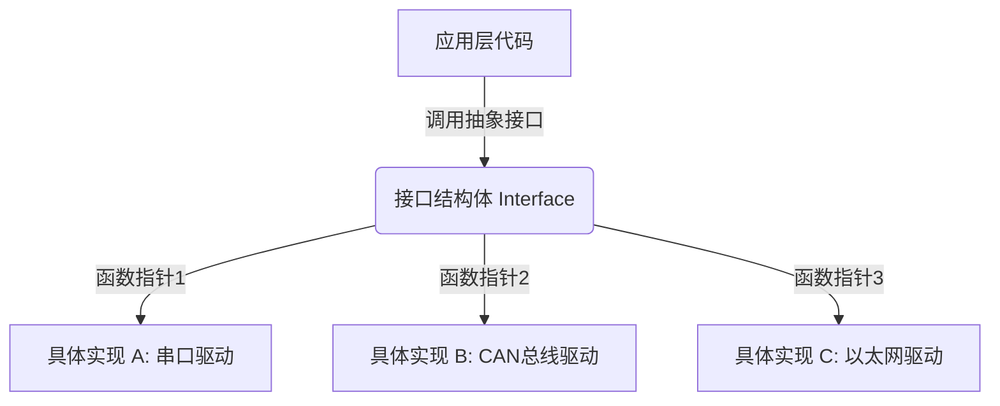
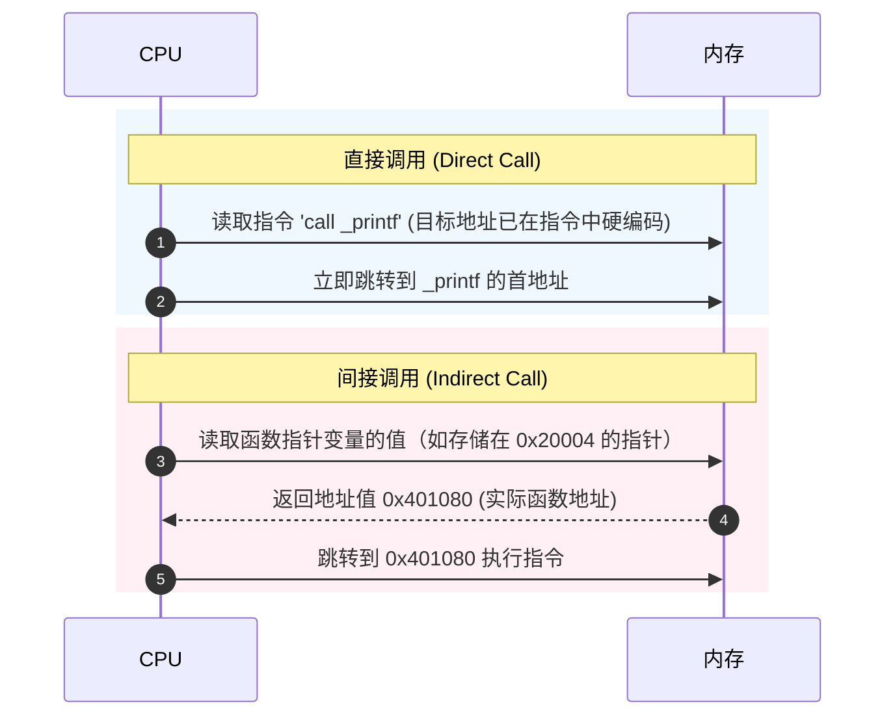

# C语言函数指针与分支优化设计

在 C 语言中，指针不仅是操作堆栈与堆内存的钥匙，更是连接静态编译与动态执行的桥梁。通常，我们习惯于将指针指向数据（如结构体、数组或基本类型），但指针同样可以指向代码段（Text Segment）中的指令。这就是**函数指针（Function Pointer）**。

函数指针是 C 语言实现多态性、解耦架构设计（如回调函数、发布-订阅模式）以及构建复杂系统软件（如操作系统内核、嵌入式状态机、网络协议栈分发器）的核心工具。然而，由于 C 语言语法的灵活性，复杂的函数指针声明往往使初学者和有经验的工程师头疼；而在现代高性能计算和硬实时系统中，函数指针引入的间接分支（Indirect Branch）调用对硬件分支预测器和编译器优化带来的挑战更是系统优化领域中的硬核课题。

本书旨在由浅入深，从**语法解析、汇编底层、CPU分支预测机制**以及**系统架构设计**四个维度，全面剖析 C 语言函数指针的方方面面。

---

## 1. 为什么需要函数指针？

在面向对象语言中，多态是通过虚函数表（Vtable）隐式实现的。而在 C 语言中，我们必须显式地利用函数指针来实现类似的行为。

### 1.1 核心价值：运行时行为的多态与解耦
1. **控制流解耦（Control Decoupling）**：底层的驱动程序或者库无法知道上层业务逻辑在特定事件发生时需要做什么。通过向底层传递一个函数指针（即**回调函数**），底层就可以在特定事件发生时通知上层，而无需显式依赖上层的具体函数名。
2. **表驱动设计（Table-driven Design）**：将控制逻辑（如大量的 `if-else` 或 `switch-case`）替换为“数据表”。表中的每一项都包含一个函数指针，通过查表并跳转，将分支选择的时间复杂度从 $O(N)$ 降到 $O(1)$。
3. **插件式架构与动态加载**：在运行时通过 `dlopen`/`dlsym` (Linux) 或 `LoadLibrary`/`GetProcAddress` (Windows) 动态加载 `.so` 或 `.dll` 模块，获取其导出的函数地址并赋值给函数指针，从而实现无缝的热插拔或动态更新。

---

## 2. 直接调用 vs 间接调用

要深刻理解函数指针，我们需要对比**直接调用（Direct Call）**与**间接调用（Indirect Call）**在底层的差异：

*   **直接调用**：在编译和链接阶段，目标函数的地址就已经确定（或在重定位时确定）。编译器直接在汇编中生成像 `call 0x401020` 这样的指令。目标地址是硬编码在指令中的。
*   **间接调用**：目标函数的地址在编译时是未知的，而是在运行时保存在寄存器或内存（如栈或全局变量）中。汇编指令类似于 `call rax` 或 `call [rdi]`。CPU 必须先从寄存器或内存中读取地址，然后再跳转。

这种间接性虽然赋予了 C 语言极强的灵活性，但也给现代处理器的流水线设计带来了巨大的挑战，例如分支目标缓冲（BTB）的未命中、流水线排空以及幽灵漏洞（Spectre）相关的安全防御开销。

---

## 3. 本书章节规划

本书将通过以下三个核心章节，帮助你彻底掌握 C 语言函数指针从语法到最底层硬件优化的全部知识：

*   **第一章：C语言函数指针语法全解析 (01_function_pointer_syntax.md)**
    *   深度剖析复杂的指针声明，学习并应用“右左法则”（Right-Left Rule）。
    *   探讨 `typedef` 与原生声明的最佳实践，规避高维指针回调中的陷阱。
    *   对比静态绑定（Static Binding）与动态绑定（Dynamic Binding）在编译期与运行期的深层差异。
*   **第二章：间接调用与编译器/分支预测优化 (02_indirect_call_optimizations.md)**
    *   直击 x86-64 与 ARM 汇编，看编译器如何将函数指针翻译为间接跳转指令。
    *   揭秘 CPU 分支目标缓冲区（BTB）与间接分支预测器（TA/ITT）的工作机理。
    *   分析分支预测失败（Branch Misprediction）引发的流水线惩罚与推测执行成本。
    *   剖析编译器黑科技：去虚拟化（Devirtualization）与间接调用促销（Indirect Call Promotion）。
*   **第三章：基于函数指针的高级设计模式 (03_state_machines_dispatch.md)**
    *   工业级表驱动状态机（FSM）的面向对象 C 语言实现。
    *   消息分发器与命令路由表（Command Router）的解耦架构。
    *   跨平台动态加载库（`.so`/`.dll`）的回调注册与运行时生命周期管理。
    *   提供一套完整的、带防御性设计的交互式命令行路由解析器代码。

通过本书的学习，你将不再畏惧任何复杂的 C 语言声明，并能编写出既优雅又对硬件流水线友好的高性能底层代码。
