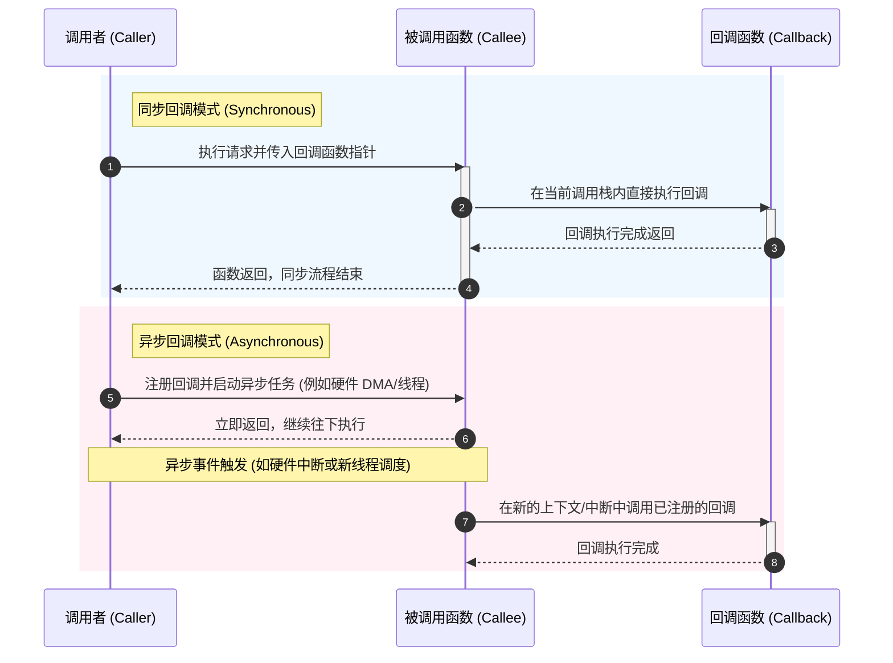

# 第一章：函数指针与回调机制的底层探秘

函数指针是 C 语言跃升为“系统级抽象语言”的关键特性。它不仅是一个存储函数入口地址的变量，更是构建动态调度、回调机制以及面向对象多态性的基石。本章将从语法定义、编译器生成的汇编指令、同步与异步的执行流特征，以及状态绑定的闭包模拟等方面，对函数指针和回调机制进行深度拆解。

---

## 1. 函数指针的语法、声明与 Typedef 重构

在 C 语言中，函数名本身在大多数上下文中会被隐式转换为指向该函数的指针（其值即为该函数在内存中的代码段首地址）。然而，声明一个函数指针变量的语法由于运算符优先级的存在，往往显得晦涩难懂。

### 1.1 “右左法则”解析复杂声明

要解析或设计复杂的 C 语言声明，业界通用的方法是**右左法则（Right-Left Rule）**：
1. **从变量名开始**，向右看，然后向左看。
2. 遇到括号则调转方向。
3. 括号内的内容处理完毕后，再跳出括号。
4. 始终牢记：`*` 读作“指向...的指针”，`[]` 读作“...的数组”，`()` 读作“返回...的函数”。

我们来看几个典型且复杂的函数指针声明：

#### 示例 A: `void (*func)(int);`
* 从变量名 `func` 开始。
* 向右看是 `)`，遇到括号，向左看，有 `*`，说明 `func` 是一个**指针**。
* 跳出括号 `(*func)`，向右看是 `(int)`，说明该指针**指向一个函数**，该函数接受一个 `int` 参数。
* 向左看是 `void`，说明该函数**返回 `void`**。
* **结论**：`func` 是一个指向“接受一个 `int` 参数并返回 `void` 的函数”的指针。

#### 示例 B: `int (*(*func_array)[10])(char*, double);`
* 从变量名 `func_array` 开始。
* 向左看有 `*`，说明其是一个**指针**。
* 跳出内层括号，向右看是 `[10]`，说明该指针**指向一个拥有 10 个元素的数组**。
* 向左看有 `*`，说明数组的元素是**指针**。
* 跳出外层括号，向右看是 `(char*, double)`，说明这些指针**指向接受 `char*` 和 `double` 参数的函数**。
* 最左侧是 `int`，说明这些函数**返回 `int`**。
* **结论**：`func_array` 是一个指针，指向一个包含 10 个元素的数组，该数组的每个元素都是一个函数指针，指向“接受 `char*` 和 `double` 并返回 `int` 的函数”。

### 1.2 使用 `typedef` 重构高可读性接口

直接使用原始语法声明复杂的函数指针不仅容易出错，还会导致代码极难阅读。生产级工程代码库中，**必须**使用 `typedef` 显式定义函数指针类型。

```c
#include <stdio.h>
#include <stdint.h>

/* 原始方式：可读性极差 */
void register_event_handler(int event_id, void (*handler)(int, void*), void* userdata);

/* 推荐方式：使用 typedef 明确定义函数指针类型 */
typedef void (*event_handler_t)(int event_id, void *userdata);

/* 重构后的接口声明 */
void register_event_handler_refined(int event_id, event_handler_t handler, void *userdata);
```

通过 `typedef`，`event_handler_t` 成为了一个一等公民类型。声明、参数传递以及可读性都得到了显著的提升。

---

## 2. 寄存器级汇编实现与间接跳转分析

在硬件与编译器层面，直接函数调用与通过函数指针的间接调用有着本质的区别。理解这些区别对于编写高性能系统级代码和进行逆向调试至关重要。

### 2.1 直接调用（Direct Call） vs 间接调用（Indirect Call）

* **直接调用**：目标函数的地址在编译/链接阶段就是确定的（或者由动态链接器在程序加载时重定位）。编译器生成类似于 `call label` 的指令，跳转目标是一个固定的硬编码相对偏移量。
* **间接调用**：跳转的目标地址在编译时是未知的，它存储在内存变量或寄存器中。CPU 在运行时必须先从内存中加载目标地址到寄存器，再通过寄存器内的地址进行分支跳转。

### 2.2 ARM (Cortex-M) 架构下的间接跳转

在 ARM Cortex-M 架构（Thumb-2 指令集）下，普通的直接调用使用 `BL`（Branch with Link）指令，而间接调用则必须使用 `BLX`（Branch with Link and Exchange）指令，并通过寄存器进行中转。

我们来看一段简单的 C 代码及其编译出的 ARM 汇编：

```c
// C 代码
void (*func_ptr)(void);
void caller(void) {
    func_ptr();
}
```

GCC 编译出来的汇编片段：

```assembly
caller:
    PUSH     {r4, lr}           @ 保存 R4 寄存器和链接寄存器 LR（返回地址）
    LDR      r3, .L2            @ 从文字池中读取全局变量 func_ptr 的地址到 R3
    LDR      r3, [r3]           @ 从 func_ptr 地址处加载实际的函数入口地址到 R3
    CMP      r3, #0             @ 检查函数指针是否为 NULL
    BEQ      .L1                @ 如果为 NULL，跳转到结束标签 .L1
    BLX      r3                 @ 间接调用：跳转到 R3 指向的地址，并将下一条指令地址存入 LR
.L1:
    POP      {r4, pc}           @ 恢复寄存器并返回（将 LR 的值弹出到 PC 中）
.L2:
    .word    func_ptr           @ 全局变量 func_ptr 的符号地址
```

> [!IMPORTANT]
> 在 ARM 架构中，`BLX Rm` 指令还会负责指令集状态的切换。因为 Cortex-M 只支持 Thumb 状态，所以存储在寄存器中的目标地址最低位（LSB）**必须为 1**，用以指示跳转后继续以 Thumb 模式运行。如果该位为 0，CPU 将尝试切换到 ARM 模式，在 Cortex-M 上会直接触发 `UsageFault` 异常。

### 2.3 x86_64 架构下的间接跳转

在 x86_64 架构下，直接调用使用 `call <offset>`，而间接调用则采用 `call QWORD PTR [rax]` 或 `call rdi` 的形式。

C 代码：
```c
void invoke_ptr(void (*fp)(int), int val) {
    fp(val);
}
```

GCC 编译生成的 x86_64 汇编：

```assembly
invoke_ptr:
    push    rbp
    mov     rbp, rsp
    sub     rsp, 16
    mov     QWORD PTR -8[rbp], rdi   # 将第一个参数 fp (函数指针) 保存到栈上
    mov     DWORD PTR -12[rbp], esi  # 将第二个参数 val 保存到栈上
    mov     eax, DWORD PTR -12[rbp]  # 参数准备：esi (val) 放入 edi
    mov     edi, eax
    mov     rax, QWORD PTR -8[rbp]   # 将函数指针加载到 rax 寄存器
    call    rax                      # 间接调用：通过寄存器 rax 跳转
    nop
    leave
    ret
```

#### 分支预测与 Spectre 漏洞

间接跳转在现代超标量处理器上面临严重的性能挑战。现代 CPU 内部包含分支目标缓冲器（Branch Target Buffer, BTB），用于预测间接跳转的下一条指令地址。
由于间接调用的目标地址可能动态发生变化，BTB 预测失败的概率显著高于直接调用。一旦预测失败，CPU 将清空流水线（Pipeline Flush），造成十几个到几十个时钟周期的延迟。

此外，2018 年曝光的 Spectre 漏洞正是利用了 CPU 在间接分支预测（Indirect Branch Prediction）时的推测执行（Speculative Execution）特性，通过注入恶意的分支历史来读取敏感内存。为了应对此漏洞，Linux 内核等系统软件引入了 **Retpoline**（Return Trampoline）防御机制，将所有的间接跳转转化为一系列相对安全的 `ret` 指令，这进一步增大了间接调用的软件开销。因此在高性能数据通道上，应克制或优化间接调用的频次。

---

## 3. 同步回调与异步回调的生命周期与执行流

基于函数指针，我们能够实现回调（Callback）机制。根据调用发生的时机与上下文，回调主要分为**同步回调**与**异步回调**。



### 3.1 同步回调 (Synchronous Callback)
同步回调发生在同一个线程的同步调用栈中。当外部函数被调用时，它在返回之前必须先执行完传入的回调函数。

* **调用栈特征**：回调函数的栈帧紧邻在被调用函数的栈帧之上，属于同一执行流。
* **生命周期**：传入回调函数的参数（包括栈上变量的指针）在整个回调执行期间都是安全且有效的，因为父函数尚未退栈。
* **典型应用**：标准库中的 `qsort` 比较函数、C++ STL 算法模拟。

```c
#include <stdlib.h>
#include <stdio.h>

// 同步回调示例：用于 qsort 的比较函数
int compare_ints(const void *a, const void *b) {
    return (*(int*)a - *(int*)b);
}

int main(void) {
    int array[] = {5, 2, 9, 1, 5, 6};
    // qsort 在返回前，会在其内部多次同步调用 compare_ints
    qsort(array, 6, sizeof(int), compare_ints);
    return 0;
}
```

### 3.2 异步回调 (Asynchronous Callback)
异步回调的生命周期与其注册时的调用栈完全分离。当注册函数返回时，回调函数通常**尚未**被执行。它会在未来的某个时间点，由另一个线程、软中断（如信号）、硬件中断服务例程（ISR）或事件循环（Event Loop）触发并执行。

* **调用栈特征**：回调执行时的上下文与注册时的上下文大不相同，甚至位于完全不同的栈空间（如中断栈）。
* **生命周期挑战（野指针隐患）**：
  在异步回调中，**绝对不能**访问注册函数栈上的局部变量。因为注册函数在返回后其栈帧已被销毁，若回调函数在未来的某个时间点尝试通过指针访问这些已被销毁的栈变量，将导致未定义行为（Undefined Behavior），即“栈悬空指针（Dangling Pointer）”漏洞。

```c
/* 错误示范：在异步回调中引用栈变量 */
typedef void (*async_cb_t)(void *arg);
void register_timer_callback(uint32_t delay_ms, async_cb_t cb, void *arg);

void bad_function(void) {
    int local_counter = 100; // 局部变量在栈上分配
    // 错误：当定时器时间到并触发回调时，bad_function 早已返回，local_counter 内存已被释放/复用
    register_timer_callback(1000, some_timer_handler, &local_counter); 
}
```

---

## 4. 上下文传递与闭包模拟

在面向对象编程语言中，方法（Method）天生绑定了对象实例的状态（即 `this` 或 `self` 指针）。而在 C 语言这种面向过程的语言中，函数本身是无状态的（Stateless）。为了使回调函数能够感知外部状态，必须引入**上下文传递机制**，并在 C 语言中模拟**闭包（Closure）**。

### 4.1 `void *userdata` 的必要性

为了保证回调接口的通用性，库的设计者必须在回调函数签名中预留一个通用指针 `void *userdata`（或 `void *arg`、`void *context`）。
这个指针是用户状态与回调函数行为之间的纽带。如果没有这个上下文指针，用户只能通过全局变量来传递状态，这会导致代码不可重入（Non-reentrant），并且无法在多线程或多个实例并存的场景下工作。

### 4.2 模拟闭包：打包状态与行为

闭包可以被理解为“函数”与“创建该函数时的环境状态”的结合体。在 C 语言中，我们通常定义一个结构体来保存状态，并将其地址通过 `void *userdata` 传递给回调函数，从而完美模拟闭包行为。

下面展示一个生产级的、基于事件的多路复用通知系统，展示如何打包状态与行为。

```c
#include <stdio.h>
#include <stdlib.h>
#include <string.h>
#include <stdbool.h>

/* 1. 定义事件回调类型，必须携带 void* 作为用户上下文 */
typedef void (*event_cb_t)(int event_type, void *userdata);

/* 2. 事件分发器核心结构体 */
#define MAX_HANDLERS 8
typedef struct {
    int event_type;
    event_cb_t callback;
    void *userdata;
} handler_entry_t;

typedef struct {
    handler_entry_t handlers[MAX_HANDLERS];
    size_t handler_count;
} event_dispatcher_t;

/* 初始化分发器 */
void dispatcher_init(event_dispatcher_t *dispatcher) {
    if (dispatcher) {
        memset(dispatcher, 0, sizeof(event_dispatcher_t));
    }
}

/* 注册回调函数及其对应的上下文 */
bool dispatcher_register(event_dispatcher_t *dispatcher, int event_type, event_cb_t cb, void *userdata) {
    if (!dispatcher || !cb || dispatcher->handler_count >= MAX_HANDLERS) {
        return false;
    }
    dispatcher->handlers[dispatcher->handler_count++] = (handler_entry_t){
        .event_type = event_type,
        .callback = cb,
        .userdata = userdata
    };
    return true;
}

/* 触发事件，执行回调并注入上下文 */
void dispatcher_dispatch(const event_dispatcher_t *dispatcher, int event_type) {
    if (!dispatcher) return;
    for (size_t i = 0; i < dispatcher->handler_count; ++i) {
        if (dispatcher->handlers[i].event_type == event_type) {
            // 执行回调，同时传入保存在 userdata 中的私有状态
            dispatcher->handlers[i].callback(event_type, dispatcher->handlers[i].userdata);
        }
    }
}

/* 3. 用户私有状态（模拟闭包的环境） */
typedef struct {
    char worker_name[32];
    uint32_t processed_count;
} connection_session_t;

/* 用户回调函数：通过强转还原私有状态 */
static void on_data_received(int event_type, void *userdata) {
    if (!userdata) return;
    
    // 将 void* 还原为具体的上下文类型
    connection_session_t *session = (connection_session_t *)userdata;
    session->processed_count++;
    
    printf("[Event: %d] Session '%s' processed packet #%u\n", 
           event_type, session->worker_name, session->processed_count);
}

int main(void) {
    event_dispatcher_t dispatcher;
    dispatcher_init(&dispatcher);

    // 模拟两个独立的会话（独立的状态）
    connection_session_t session_A = { .worker_name = "Session_Channel_A", .processed_count = 0 };
    connection_session_t session_B = { .worker_name = "Session_Channel_B", .processed_count = 100 };

    // 将相同的行为（on_data_received）绑定到不同的状态（session_A, session_B）
    dispatcher_register(&dispatcher, 1, on_data_received, &session_A);
    dispatcher_register(&dispatcher, 1, on_data_received, &session_B);

    printf("--- First Dispatch ---\n");
    dispatcher_dispatch(&dispatcher, 1);

    printf("--- Second Dispatch ---\n");
    dispatcher_dispatch(&dispatcher, 1);

    return 0;
}
```

### 4.3 闭包模拟的设计规范总结

1. **类型安全性**：`void *` 在 C 中会隐式转换，但这也意味着失去了编译器的强类型检查。在回调内部接收到 `void *` 后，**必须**首先对其进行非空检查（`if (!userdata) return;`），然后再将其强制类型转换为目标结构体指针。
2. **生命周期绑定**：传入 `userdata` 的数据结构必须保证在回调触发期间生命周期持续有效。在异步场景中，通常通过 `malloc` 在堆上分配上下文，并在回调函数的末尾或专门的销毁函数中调用 `free`。
