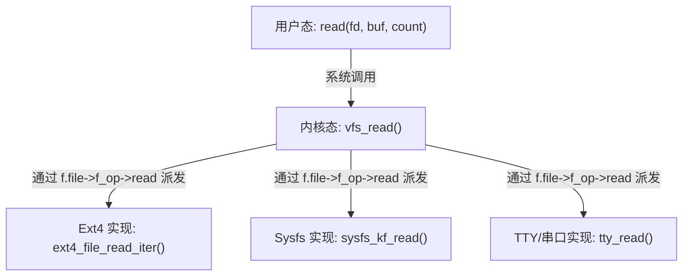

# 第三章：嵌入式与系统级开发中的 OOP-C 实践

在嵌入式开发、RTOS 内核、主流操作系统底层驱动中，面向对象的 C 语言设计模式并非屠龙之术，而是无处不在的工程实践。本章将详细剖析如何通过操作集结构体解耦底层硬件、如何保证回调函数在中断与多线程环境下的安全性，并通过 Linux 内核与 Zephyr RTOS 两大标杆级系统来还原 OOP-C 的经典设计。

---

## 1. 硬件抽象层（HAL）解耦与设备驱动模型

在嵌入式开发中，硬件抽象层（HAL）旨在将硬件芯片的差异（如寄存器地址、时钟树配置）与上层业务逻辑（如应用层通信协议、控制算法）彻底隔绝。这种隔离通常通过定义**操作函数指针结构体**来实现。

### 1.1 串口（UART）驱动接口的解耦设计

我们以串口驱动为例。上层业务只需要 `init`（初始化）、`send_char`（发送单字节）与 `receive_char`（接收单字节）等标准接口，而不必关心底层是 STM32 芯片的 USART 外设，还是 NXP 芯片的 LPUART 外设。

#### 驱动核心头文件：`uart_core.h`
```c
#ifndef UART_CORE_H
#define UART_CORE_H

#include <stdint.h>
#include <stddef.h>

/* 1. 前置声明统一设备句柄 */
typedef struct uart_device_t uart_device_t;

/* 2. 定义操作函数指针结构体 (类似于 C++ 虚函数表) */
typedef struct {
    int (*init)(uart_device_t *dev);
    void (*send_char)(uart_device_t *dev, uint8_t ch);
    int (*receive_char)(uart_device_t *dev, uint8_t *ch);
} uart_ops_t;

/* 3. 定义统一的串口设备结构体 */
struct uart_device_t {
    const uart_ops_t *ops;  /* 虚表指针 */
    void *private_data;     /* 硬件特有寄存器地址或状态结构体指针 */
};

/* 4. 暴露给上层的通用 HAL API */
static inline int hal_uart_init(uart_device_t *dev) {
    if (dev && dev->ops && dev->ops->init) {
        return dev->ops->init(dev);
    }
    return -1;
}

static inline void hal_uart_send(uart_device_t *dev, uint8_t ch) {
    if (dev && dev->ops && dev->ops->send_char) {
        dev->ops->send_char(dev, ch);
    }
}

static inline int hal_uart_recv(uart_device_t *dev, uint8_t *ch) {
    if (dev && dev->ops && dev->ops->receive_char) {
        return dev->ops->receive_char(dev, ch);
    }
    return -1;
}

#endif /* UART_CORE_H */
```

#### STM32 硬件平台具体实现：`uart_stm32.c`
```c
#include "uart_core.h"
#include <stdio.h>

/* 1. 定义 STM32 平台特有的硬件上下文 */
typedef struct {
    uint32_t reg_base;      /* 模拟 STM32 寄存器基地址 */
    uint32_t baud_rate;     /* 波特率配置 */
    uint32_t irq_num;       /* 中断号 */
} stm32_uart_context_t;

/* 2. 实现具体的硬件操作虚函数 */
static int stm32_uart_init(uart_device_t *dev) {
    stm32_uart_context_t *ctx = (stm32_uart_context_t *)dev->private_data;
    printf("[STM32 UART] Initializing peripheral at register base: 0x%08X (Baud: %u)\n", 
           ctx->reg_base, ctx->baud_rate);
    // 此处写入具体的寄存器操作，如配置 CR1, BRR 等
    return 0;
}

static void stm32_uart_send_char(uart_device_t *dev, uint8_t ch) {
    stm32_uart_context_t *ctx = (stm32_uart_context_t *)dev->private_data;
    // 模拟写入数据寄存器 (DR)
    printf("[STM32 UART 0x%08X] Sending character: '%c'\n", ctx->reg_base, (char)ch);
}

static int stm32_uart_recv_char(uart_device_t *dev, uint8_t *ch) {
    stm32_uart_context_t *ctx = (stm32_uart_context_t *)dev->private_data;
    // 模拟从数据寄存器 (DR) 读取
    *ch = 'A'; // 模拟接收到字符 'A'
    printf("[STM32 UART 0x%08X] Received character\n", ctx->reg_base);
    return 0;
}

/* 3. 静态绑定 STM32 操作集 */
static const uart_ops_t stm32_uart_ops = {
    .init = stm32_uart_init,
    .send_char = stm32_uart_send_char,
    .receive_char = stm32_uart_recv_char
};

/* 4. 导出实例化函数 */
uart_device_t* stm32_uart_instantiate(uint32_t reg_base, uint32_t baud) {
    uart_device_t *dev = (uart_device_t *)malloc(sizeof(uart_device_t));
    stm32_uart_context_t *ctx = (stm32_uart_context_t *)malloc(sizeof(stm32_uart_context_t));
    if (!dev || !ctx) {
        free(dev);
        free(ctx);
        return NULL;
    }

    ctx->reg_base = reg_base;
    ctx->baud_rate = baud;
    ctx->irq_num = 37; // 假设的中断号

    dev->ops = &stm32_uart_ops;
    dev->private_data = ctx;
    return dev;
}
```

使用这种结构，上层业务层只需接收通用的 `uart_device_t*`，即可完全解耦具体物理平台的底层逻辑。

---

## 2. 回调函数在中断重入与多线程环境下的安全性

在嵌入式实时系统（RTOS）或多线程环境中，回调函数的设计与执行经常伴随着竞态条件（Race Condition）与死锁风险。必须对其执行环境进行严格的分类考量。

### 2.1 中断服务程序（ISR）中执行回调的黄金法则

许多硬件外设（如 DMA 传输完成、GPIO 边沿触发）在发生事件时会直接进入中断服务程序（ISR）。如果驱动设计允许在 ISR 中直接执行用户注册的回调函数，用户编写的回调代码将受到极大的限制：

> [!CAUTION]
> 1. **绝对不能执行任何可能导致阻塞或挂起的系统调用**。例如：不能获取互斥锁（Mutex）、不能调用会引起任务切换的延时（如 `vTaskDelay()`）、不能执行阻塞型信号量获取（Semaphore Take）。
> 2. **不能调用非 ISR 安全的内存分配函数**（如标准 `malloc()` 或 RTOS 非 ISR 安全的堆内存分配），因为堆管理器内部往往包含互斥锁。
> 3. **执行时间必须尽可能短**。如果回调函数过于臃肿，会导致系统无法及时响应其他高优先级中断，从而引发硬实时性能的崩溃。

### 2.2 线程安全性与可重入性（Reentrancy）

如果回调函数可能被多个线程同时调用，或者在被中断打断后在中断中被再次调用，则该回调必须是**可重入（Reentrant）**的。

* **不可重入示例**：在回调中使用了局部静态变量（`static`）或者全局变量，且无保护机制。
* **设计规范**：
  * 回调函数应仅使用**栈变量（Local Variables）**。
  * 状态的读写应使用**原子操作（Atomic Operations）**。
  * 必须使用 `void *userdata` 引入独立线程的私有上下文，杜绝对全局状态的依赖。

### 2.3 工业级安全回调设计：底半部延迟处理（Deferred Processing）

当回调函数的工作量较大时，业界普遍采用“顶半部/底半部（Top-Half/Bottom-Half）”思想：在 ISR（顶半部）中仅做最小的硬件寄存器清除和状态标记，随后通过**消息队列**或**事件通知**将繁重的回调执行任务推迟到RTOS的工作线程（底半部）中进行。

```c
#include <stdbool.h>
#include <stdint.h>

// 模拟中断安全的消息队列推送 API
extern bool rtos_queue_push_from_isr(void *queue_handle, const void *item);

typedef struct {
    void *queue_handle;
    void (*deferred_callback)(void *userdata);
    void *userdata;
} isr_event_t;

/* 顶半部：在硬件中断中触发 */
void Gpio_Interrupt_Handler_ISR(void *context) {
    isr_event_t *event = (isr_event_t *)context;
    
    // 错误做法：在中断中直接调用慢速或可能阻塞的业务回调
    // event->deferred_callback(event->userdata); 

    // 正确做法：将任务打包并推送到队列，唤醒后台守护线程处理
    rtos_queue_push_from_isr(event->queue_handle, event);
}
```

---

## 3. 工业级经典案例研究

### 3.1 案例一：Linux 内核虚拟文件系统（VFS）

Linux 内核设计的核心哲学之一是“一切皆文件”。为了让不同类型的文件系统（如 ext4, FAT32, sysfs）以及各种字符/块设备能够向用户空间导出统一的接口，Linux 内核设计了庞大的虚拟文件系统（Virtual File System, VFS），它是 OOP-C 架构的巅峰之作。

#### VFS 的面向对象层次设计

* **基类**：VFS 抽象出了 `struct file`、`struct inode`、`struct dentry` 等对象。
* **虚函数表（Operations Structs）**：每个基类对象都包含一个虚函数表指针：
  * `struct file` 包含指向 `struct file_operations` 的指针。
  * `struct inode` 包含指向 `struct inode_operations` 的指针。

让我们看一下内核源码中经典的 `file_operations` 虚表结构体定义：

```c
/* 简化自 Linux 内核源码 include/linux/fs.h */
struct file_operations {
    struct module *owner;
    loff_t (*llseek) (struct file *, loff_t, int);
    ssize_t (*read) (struct file *, char __user *, size_t, loff_t *);
    ssize_t (*write) (struct file *, const char __user *, size_t, loff_t *);
    int (*mmap) (struct file *, struct vm_area_struct *);
    int (*open) (struct inode *, struct file *);
    int (*release) (struct inode *, struct file *);
    int (*fsync) (struct file *, loff_t, loff_t, int datasync);
    // ... 其他众多虚操作接口
};
```

当我们在用户态调用 `read(fd, buf, size)` 系统调用时，内核底层的执行分派逻辑如下：

```c
/* 内核系统调用处理例程 (分派器) */
SYSCALL_DEFINE3(read, unsigned int, fd, char __user *, buf, size_t, count) {
    struct fd f = fdget_pos(fd);
    ssize_t ret = -EBADF;

    if (f.file) {
        loff_t pos = file_pos_read(f.file);
        
        // 关键的多态调用：动态绑定到具体驱动或文件系统的 read 方法
        if (f.file->f_op->read) {
            ret = f.file->f_op->read(f.file, buf, count, &pos);
        } else {
            ret = new_sync_read(f.file, buf, count, &pos);
        }
        
        file_pos_write(f.file, pos);
        fdput(f);
    }
    return ret;
}
```



由于使用了极其稳定的 C 语言函数指针，驱动开发者只需实现对应的 `struct file_operations`，并使用相应的注册 API，即可无缝融入 Linux 宏大的生态系统中。

---

### 3.2 案例二：Zephyr RTOS 设备驱动架构

Zephyr RTOS 是一款专为资源受限物联网设备打造的高性能实时操作系统。它在极致节约内存（ROM/RAM）的前提下，完全通过 C 语言宏与结构体嵌套实现了一套强大的设备驱动架构。

#### Zephyr 中的设备三元结构体

Zephyr 中每一个设备实例都是一个 `struct device` 结构体：

```c
/* 简化自 Zephyr RTOS 头文件 include/zephyr/device.h */
struct device {
    const char *name;                  /* 设备名称 */
    const void *config;                /* 只读配置区 (常位于 ROM 中，降低 RAM 消耗) */
    const void *api;                   /* 虚接口指针 (指向对应设备类型的虚表) */
    void *state;                       /* 运行时状态变量 (位于 RAM 中) */
    void *data;                        /* 驱动私有动态数据区 (位于 RAM 中) */
};
```

对于特定类型的设备（例如 GPIO），Zephyr 定义了通用的 `gpio_driver_api` 虚表：

```c
struct gpio_driver_api {
    int (*pin_configure)(const struct device *port, gpio_pin_t pin, gpio_flags_t flags);
    int (*port_get_raw)(const struct device *port, gpio_port_value_t *value);
    int (*port_set_masked_raw)(const struct device *port, gpio_port_pins_t mask, gpio_port_value_t value);
    // ...
};
```

#### Zephyr 零运行时开销的驱动实例化

为了规避在运行时进行动态内存分配（由于安全要求与小 RAM 约束），Zephyr 使用了极其精妙的编译期宏机制（`DEVICE_DEFINE`）。
在编译时，宏会直接生成静态的配置数据段，并利用链接器脚本（Linker Script）将它们汇聚在专门的内核数据段中。在启动时，内核通过遍历该段来统一初始化所有驱动设备。

```c
/* Zephyr 中注册 GPIO 驱动的典型写法 */
static const struct gpio_driver_api stm32_gpio_api = {
    .pin_configure = stm32_gpio_configure,
    .port_get_raw = stm32_gpio_port_get,
    .port_set_masked_raw = stm32_gpio_port_set_masked,
};

// 编译时静态初始化设备实例，零运行时内存开销！
DEVICE_DEFINE(gpio_stm32_A, "GPIO_A",
              &stm32_gpio_init, NULL,
              &stm32_gpio_data_A, &stm32_gpio_config_A,
              POST_KERNEL, CONFIG_GPIO_INIT_PRIORITY,
              &stm32_gpio_api);
```

### 3.3 总结

无论是面对 Linux 这样管理 TB 级存储和高性能硬件的宏大内核，还是面对 Zephyr 这样在仅有几十 KB RAM 的超微型 MCU 上平稳运行的实时操作系统，面向对象的 C 语言模式都是最佳的解耦与多态选择。它在保障系统高扩展性与模块化开发的同时，维持了极佳的性能、零隐式损耗以及无与伦比的可预测性。
