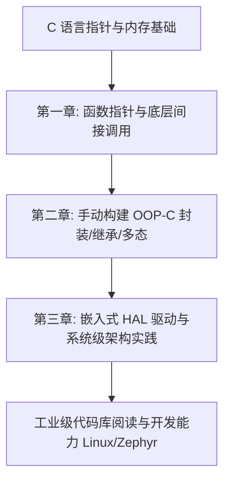

# 简介：深入理解 C 语言函数指针、回调机制与面向对象设计模式

在计算机科学与系统编程的宏大版图中，C 语言长盛不衰的核心秘诀在于其对底层硬件与内存空间的绝对控制力。它既不像汇编语言那样完全剥离结构化逻辑，也不像高级语言（如 Java、Python）那样用厚重的虚拟机或运行时（Runtime）将开发者与底层细节隔绝开来。

在系统级编程、操作系统内核（例如 Linux Kernel）、嵌入式系统（例如 Zephyr RTOS、FreeRTOS）以及高性能网络库中，**函数指针（Function Pointers）**与由其派生出的**回调机制（Callbacks）**和**面向对象 C 模式（OOP-C）**是构建模块化、可复用、高內聚低耦合软件系统的基石。

本书旨在作为一本面向中高级系统工程师的生产级技术指南，从底层硬件指令集架构（ISA）到顶层软件设计模式，全方位拆解 C 语言中基于指针的间接调用与面向对象技术。

---

## 1. 为什么用 C 语言实现面向对象？

许多现代开发者习惯了 C++、Rust、Go 或 Java 提供的原生面向对象或多态语法，常常会产生疑问：“既然有现代语言，我们为什么还要在 C 语言中手动模拟面向对象？”

在系统级与嵌入式软件开发中，这个问题的答案源于实际工程约束：

1. **编译器与工具链限制**：在许多安全关键领域（如航天、车载 MCU）或小众架构（如某些 8 位/16 位微控制器）中，C++ 编译器并不成熟或根本不存在。C 语言是唯一受到全面且稳定支持的语言。
2. **运行效率与内存开销的可控性**：C++ 隐含的特性（如异常处理机制、RTTI 运行时类型识别、动态内存分配隐式调用）会引入难以预测的延迟和不可控的内存开销。使用 C 语言手动实现面向对象，可以对每一字节的内存布局、每一次函数调用的指令开销拥有 $100\%$ 的掌控力。
3. **ABI（应用二进制接口）稳定性**：C 语言的 ABI 极其稳定且通用。相比之下，C++ 存在名字修饰（Name Mangling）和不稳定的虚函数表（vtable）布局，这使得跨编译器、跨语言的动态库链接异常困难。Linux 内核的 VFS（虚拟文件系统）和驱动模型完全使用 C 语言的结构体和函数指针来定义标准接口，从而规避了这些 ABI 兼容性问题。

---

## 2. 本书核心内容与结构

本书将分为三个主要章节，从浅入深、循序渐进地探讨这一主题：

### 第一章：函数指针与回调机制的底层探秘
* **语法与声明解析**：从复杂的函数指针声明入手，解析复杂类型定义的阅读法则（如右左法则），并通过 `typedef` 重构高可读性的接口。
* **寄存器级汇编分析**：在 ARM（Cortex-M）和 x86_64 架构下，通过反汇编对比直接函数调用（Direct Call）与间接函数调用（Indirect Call）在指令集级别的差异，详细剖析间接跳转指令（如 `BLX Rm`、`call reg`）的执行机理及分支预测的影响。
* **同步与异步回调**：探讨两种回调模式的执行流差异，并着重讲解如何利用 `void *userdata` 传递上下文，模拟面向对象中的闭包（Closure）机制。

### 第二章：C 语言面向对象（OOP-C）设计模式
* **封装（Encapsulation）**：利用不透明指针（Opaque Pointers，又称 Pimpl 模式）将类的私有成员和内部实现隐藏在编译单元内部，实现真正意义上的接口与实现分离。
* **继承（Inheritance）**：通过结构体嵌套（Struct Nesting）实现单继承，分析其内存对齐与布局，展示如何利用基类指针强制类型转换实现向上转型（Upcasting）。
* **多态（Polymorphism）**：手动设计虚函数表（vtable），模拟 C++ 的虚函数表指针（vptr），实现运行时的动态绑定（Dynamic Binding）。

### 第三章：嵌入式与系统级开发中的 OOP-C 实践
* **硬件抽象层（HAL）解耦**：分析经典驱动开发中的操作接口设计，如 `struct uart_ops` 与 `struct block_device_ops`，展示接口与具体硬件的分离。
* **回调函数的线程安全与中断重入**：探讨在裸机中断服务例程（ISR）与 RTOS 任务中执行回调函数时的重入风险、竞态条件，以及原子操作与锁的应用。
* **工业级案例研究**：深入剖析 Linux 内核虚拟文件系统（VFS）的 C 面向对象接口设计，以及 Zephyr RTOS 的设备驱动模型与统一驱动 API。

---

## 3. 学习路径指南

为了能够最大化地吸收本书的知识，建议读者按照以下路径进行学习：

在学习每一章时，不仅要阅读理论分析，更应深入分析书中的代码实例。书中所有代码均采用**生产级标准**编写，包含详尽的边界检查、错误处理和规范的命名约定。建议读者在支持 ARM 交叉编译的 GCC 链或 x86 环境下编译运行，并使用 `objdump` 或 `gdb` 进行调试和反汇编分析。

让我们开始这趟深入底层的 C 语言系统级编程之旅。
