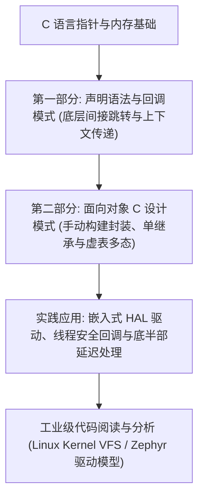

# 简介：深入理解 C 语言函数指针、回调机制与面向对象设计模式

在计算机科学与系统编程的宏大版图中，C 语言长盛不衰的核心秘诀在于其对底层硬件与内存空间的绝对控制力。它既不像汇编语言那样完全剥离结构化逻辑，也不像高级语言（如 Java、Python、C#）那样用厚重的虚拟机、垃圾回收器（GC）或臃肿的运行时（Runtime）将开发者与底层细节隔绝开来。

在系统级编程、操作系统内核（例如 Linux Kernel）、嵌入式系统（例如 Zephyr RTOS、FreeRTOS）以及高性能网络库中，**函数指针（Function Pointers）**与由其派生出的**回调机制（Callbacks）**和**面向对象 C 模式（OOP-C）**是构建模块化、可复用、高内聚低耦合软件系统的核心基石。

本书旨在作为一本面向中高级系统工程师与嵌入式开发者的生产级技术指南，从底层硬件指令集架构（ISA）到顶层软件设计模式，全方位拆解 C 语言中基于指针的间接调用与面向对象技术。

---

## 1. 为什么用 C 语言实现面向对象？

许多现代开发者习惯了 C++、Rust、Go 或 Java 提供的原生面向对象或多态语法，常常会产生疑问：“既然有现成的现代面向对象语言，我们为什么还要在 C 语言中手动模拟面向对象？”

在系统级与嵌入式软件开发中，这个问题的答案源于实际工程约束：

1. **编译器与工具链限制**：在许多安全关键领域（如航天、轨道交通、汽车电子 MCU）或小众架构（如某些 8 位/16 位微控制器、DSP）中，C++ 编译器并不成熟、不支持标准库，或者根本不存在。C 语言是唯一受到全面、稳定且符合安全认证（如 MISRA C）支持的语言。
2. **运行效率与内存开销的可控性**：C++ 隐含的许多特性（如异常处理机制 `try-catch`、RTTI 运行时类型识别、动态内存分配的隐式调用、拷贝构造函数等）会引入难以预测的延迟和不可控的内存开销。使用 C 语言手动实现面向对象，可以对每一字节的内存布局、每一次函数调用的指令开销拥有 $100\%$ 的掌控力。
3. **ABI（应用二进制接口）稳定性**：C 语言的 ABI 极其稳定且通用。相比之下，C++ 存在名字修饰（Name Mangling）、复杂的虚函数表（vtable）布局和多重继承下的地址偏移问题，这使得跨编译器、跨语言的动态库链接异常困难。Linux 内核的虚拟文件系统（VFS）和内核驱动模型完全使用 C 语言的结构体和函数指针来定义标准接口，从而彻底规避了 ABI 的不兼容问题。
4. **代码的零成本抽象与硬件贴合度**：在裸机或 RTOS 开发中，硬件寄存器是固定的。通过 C 语言的结构体对齐和指针转换，能够将硬件寄存器直接映射为“对象实例”，而不需要引入面向对象语言运行时的额外负担。

---

## 2. 本书核心内容与结构

本书采用层层递进的结构，分为两大核心部分：

### 第一部分：声明语法与回调模式

* **[函数指针基础与回调](concepts/README.md)**：作为本部分的导读，简要概述函数指针的基础理论、直接调用与间接调用的概念，以及回调模式和上下文变量在现代软件架构中的定位。
* **[第一章：函数指针语法与回调函数设计](concepts/function-pointers-callbacks.md)**：
    * **语法与声明解析**：从复杂的函数指针声明入手，解析复杂类型定义的阅读法则（如“右左法则”），并通过 `typedef` 重构出可读性极高、生产级安全的接口。
    * **寄存器级汇编分析**：在 ARM (Cortex-M) 和 x86_64 架构下，通过反汇编对比直接函数调用（Direct Call）与间接函数调用（Indirect Call）在指令集级别的差异，详细剖析间接跳转指令（如 `BLX Rm`、`call reg`）的执行机理、流水线影响以及分支目标缓冲器（BTB）的预测失败代价。
    * **分支预测与安全漏洞**：探讨间接分支预测的硬件机理，分析 Spectre 漏洞如何利用推测执行进行侧信道攻击，以及 Linux 内核等系统软件中 Retpoline 机制的软硬件开销。
    * **同步与异步回调**：对比同步与异步回调的生命周期差异。分析异步回调中的“栈悬空指针（Dangling Pointer）”漏洞，并展示如何在多线程/中断环境下进行安全的生命周期管理。
    * **上下文传递与闭包模拟**：详细拆解 `void *userdata` 指针的必要性，展示如何在 C 语言中打包“状态与行为”，模拟面向对象语言中的闭包。

### 第二部分：面向对象 C 设计模式

* **[面向对象设计模式](oop/README.md)**：作为第二部分的导读，介绍如何在没有类（Class）概念的 C 语言中，通过结构体与指针的有机组合，重构出面向对象的三大核心特征：封装、继承和多态。
* **[第二章：面向对象 C 设计模式实现](oop/oop-c-patterns.md)**：
    * **封装（Encapsulation）**：利用不透明指针（Opaque Pointers，即 Pimpl 模式）将类的私有成员和内部实现完全隐藏在 `.c` 编译单元内部，实现强隔离的接口与实现分离。
    * **继承（Inheritance）**：通过结构体嵌套（Struct Nesting）实现单继承。从 C 语言标准出发，分析其内存对齐与布局，证明向上转型（Upcasting）的地址安全，并探讨安全向下转型（Downcasting）的类型检查机制（如类型标记 Type Tag）。
    * **多态（Polymorphism）**：手动设计虚函数表（vtable），模拟 C++ 的虚函数表指针（vptr）和动态绑定（Dynamic Binding）过程，详细拆解运行时的多态派发细节。
* **[第三章：面向对象 C 在嵌入式驱动中的实践](oop/real-world-embedded.md)**：
    * **硬件抽象层（HAL）解耦**：分析经典驱动开发中的操作接口设计（如串口 `struct uart_ops` 与块设备 `struct block_device_ops`），展示如何通过函数指针解耦底层硬件寄存器与上层协议栈。
    * **回调函数的线程安全与中断重入**：探讨在裸机中断服务例程（ISR）与 RTOS 任务中执行回调时的重入风险与死锁风险，详解“中断顶半部/底半部（Top-Half/Bottom-Half）”和“延迟处理（Deferred Processing）”的经典并发安全设计。
    * **工业级案例研究**：
        * **Linux 虚拟文件系统（VFS）**：剖析 `struct file`、`struct file_operations` 及其在 `read`/`write` 系统调用中的动态绑定派发机制。
        * **Zephyr RTOS 设备驱动模型**：解析 `struct device`、`struct gpio_driver_api` 及其如何通过编译期宏（`DEVICE_DEFINE`）与链接器脚本实现零运行时内存分配的静态驱动实例化。

---

## 3. 学习路径指南

为了能够最大化地吸收本书的知识，建议读者按照以下路径进行学习：

在学习过程中，我们不仅提供了深刻的理论分析，更提供了**生产级标准**的 C 语言代码实例。这些实例包含了详尽的边界检查、错误处理和规范的命名约定。建议读者在支持 ARM 交叉编译的 GCC 工具链或本地 x86 编译环境下进行编译运行，并使用 `objdump` 或 `gdb` 进行调试和反汇编分析，直观地观察 CPU 寄存器与内存的变化。

让我们开始这趟深入底层的 C 语言系统级编程之旅。
