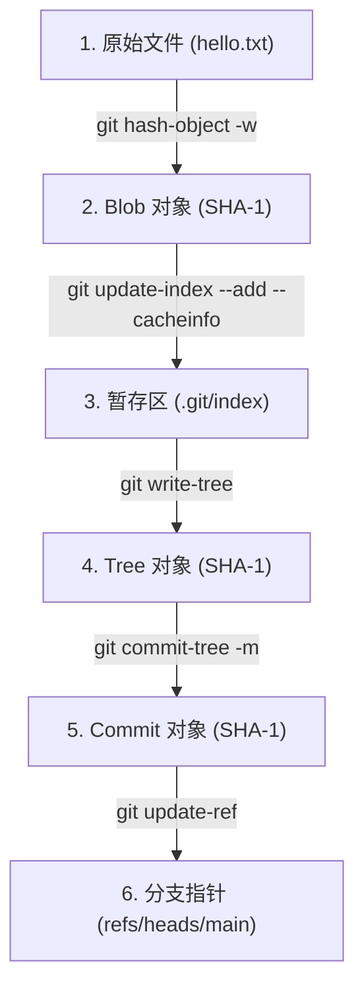

# 底层命令与上层命令 (Plumbing vs Porcelain) 实战

Git 的命令行工具集被优雅地划分为两大部分：
*   **上层命令（Porcelain Commands，意为“瓷器”）**：这是日常面向普通开发者的命令，如 `git add`、`git commit`、`git checkout`、`git status`。它们设计美观、界面友好、封装了复杂的逻辑。
*   **底层命令（Plumbing Commands，意为“管线/管道”）**：这是底层的辅助工具，如 `git hash-object`、`git cat-file`、`git write-tree`、`git commit-tree`。它们设计极其专一，适合被脚本或上层命令调用，遵循 Unix “只做好一件事”的哲学。

本章我们将通过对照表理解这两者的对应关系，并进行一次硬核实战：**不调用任何上层命令（不使用 `git add` 和 `git commit`），完全基于底层命令手工构建并提交一个版本**。

---

## 1. Porcelain 与 Plumbing 命令对照

理解底层的第一步是建立二者的功能映射关系：

| Porcelain 命令 (上层) | 对应的 Plumbing 命令 (底层) | 底层命令的具体作用 |
| :--- | :--- | :--- |
| `git add <file>` | `git hash-object -w <file>`<br>`git update-index --add ...` | 1. 写入内容至对象库生成 Blob<br>2. 将该 Blob 注册更新到 `index` 暂存区 |
| `git commit -m "msg"` | `git write-tree`<br>`git commit-tree <tree_sha> -m "msg"`<br>`git update-ref refs/heads/main <commit_sha>` | 1. 根据暂存区构建 Tree 对象<br>2. 封装 Tree 指针、父提交、作者信息生成 Commit 对象<br>3. 将当前分支的 Head 引用指向新 Commit |
| `git checkout <branch>` | `git read-tree -u -m <tree_sha>`<br>`git symbolic-ref HEAD refs/heads/<branch>` | 1. 将指定 Tree 读取并更新到暂存区和工作区<br>2. 将 `HEAD` 符号引用指向目标分支 |
| `git status` | `git diff-files`<br>`git diff-index --cached HEAD` | 1. 对比工作区与暂存区的差异<br>2. 对比暂存区与当前提交的差异 |

---

## 2. 纯底层命令提交流程图

下面是我们将要实战的操作流程，展示了数据如何一步步从原始文件流转为分支引用的全生命周期：



---

## 3. 实战：手动完成一次提交

接下来，让我们新建一个完全干净的 Git 仓库，并使用纯底层命令进行一次提交。

### 3.1 步骤一：初始化并配置仓库
```bash
# 新建空目录并初始化
mkdir git-plumbing-lab
cd git-plumbing-lab
git init

# 设置本地临时提交信息（若全局已设置可略过）
git config user.name "Plumbing Master"
git config user.email "plumbing@internals.com"
```

---

### 3.2 步骤二：创建文件并生成 Blob 对象
我们在工作区创建一个新文件 `hello.txt`：
```bash
echo "Hello, Git Plumbing!" > hello.txt
```
现在我们不运行 `git add`，而是调用底层命令 `git hash-object` 将文件写入数据库：
```bash
git hash-object -w hello.txt
```
> [!TIP]
> `-w` 参数代表 write（写入）。如果不加 `-w`，该命令只会计算并输出哈希值，不会将压缩后的对象实际写入到 `.git/objects` 中。

运行后输出一个 40 位哈希值：
```text
3b63200ff96c738ef9e1a1290374e2d43d3b6fb6
```
此时，Git 已经在 `.git/objects/3b/` 目录下写入了对应的 Blob 文件。

---

### 3.3 步骤三：手动更新暂存区 (Index)
虽然对象库里已经有了 Blob，但此时运行 `git status` 会发现 Git 提示 `hello.txt` 仍是未追踪（Untracked）状态。这是因为我们还没有把这个 Blob 登记到 `index`（暂存区）中。

我们必须使用 `git update-index` 来手动更新暂存区：
```bash
git update-index --add --cacheinfo 100644 3b63200ff96c738ef9e1a1290374e2d43d3b6fb6 hello.txt
```
#### 参数拆解：
*   `--add`：因为 `hello.txt` 是一个新文件，需要向暂存区中追加一条记录。
*   `--cacheinfo`：格式为 `mode sha-1 path`。它允许我们直接将已经写入对象库的 SHA-1 登记到暂存区，无需再次扫描物理文件。
*   `100644`：代表普通非可执行文件的文件模式（Mode）。
*   `3b63200f...`：刚才生成的 Blob 哈希。
*   `hello.txt`：暂存区中记录的文件相对路径。

此时运行 `git status`，你会发现神奇的现象：
```bash
git status
```
输出：
```text
On branch main

No commits yet

Changes to be committed:
  (use "git rm --cached <file>..." to unstage)
	new file:   hello.txt
```
我们成功在没有调用 `git add` 的情况下完成了暂存！

---

### 3.4 步骤四：通过暂存区写入目录树 (Tree)
在暂存区就绪后，我们需要把当前的暂存区打包，生成一个目录树（Tree）对象。该 Tree 对象将作为我们接下来 Commit 对象的根目录。

运行底层命令：
```bash
git write-tree
```
输出生成的 Tree 对象的哈希值：
```text
9d00922883e449c256a4220c4516be4c896d8bfa
```
这个命令会读取 `.git/index` 文件中的所有记录，并将其转换为一个（或多个，若存在子目录）Tree 对象存入 `.git/objects`。

---

### 3.5 步骤五：创建 Commit 对象
有了根目录树的哈希 `9d009228...`，我们就可以用 `git commit-tree` 命令来生成一个正式的 Commit 对象。

运行底层命令：
```bash
git commit-tree 9d00922883e449c256a4220c4516be4c896d8bfa -m "First commit using only plumbing commands"
```
> [!NOTE]
> 如果当前不是第一次提交，我们需要使用 `-p <parent_commit_sha>` 参数来把新提交同它的父提交连接起来，从而形成提交历史链（DAG）。因为这是首次提交，所以无需传递 `-p`。

运行后，输出生成的 Commit 对象的哈希值：
```text
7c8f90a2b8c5d1e2f3a4b5c6d7e8f9a0b1c2d3e4
```

---

### 3.6 步骤六：更新分支指针引用 (Ref)
至此，所有的对象（Blob、Tree、Commit）都已成功写入数据库。但是，如果你运行 `git log`，Git 仍会报错：
```text
fatal: your current branch 'main' does not have any commits yet
```
这是因为我们的当前分支指针 `refs/heads/main` （或 `HEAD`）还没有指向刚才生成的 Commit `7c8f90a2...`。

我们需要使用底层命令 `git update-ref` 来安全地更新引用指针：
```bash
git update-ref refs/heads/main 7c8f90a2b8c5d1e2f3a4b5c6d7e8f9a0b1c2d3e4
```
该命令会自动在 `.git/refs/heads/` 目录下创建或修改 `main` 文件，写入该 Commit 的哈希值，并为本次引用变更自动记录到引用日志（Reflog）中。

---

### 3.7 验证我们的成果！

现在，让我们见证奇迹的时刻。运行上层的 `git log` 和 `git status` 命令：

```bash
git log --stat
```
输出：
```text
commit 7c8f90a2b8c5d1e2f3a4b5c6d7e8f9a0b1c2d3e4 (HEAD -> main)
Author: Clean Code Lover <plumbing@internals.com>
Date:   Sat May 30 20:00:00 2026 +0800

    First commit using only plumbing commands

 hello.txt | 1 +
 1 file changed, 1 insertion(+)
```

运行 `git status`：
```bash
git status
```
输出：
```text
On branch main
nothing to commit, working tree clean
```

**我们成功了！** 整个过程没有任何一行 `git add` 或 `git commit`，完全依靠底层对象拼装和引用操作，成功在工作区干净、规范地产生了一个全新的 Commit。

---

## 4. 总结

通过上述实践，我们能够深刻体会到：
1.  **Git 是一种内容寻址数据库**：你给它数据，它通过哈希为你生成对应的 Blob、Tree、Commit；
2.  **分支与引用仅仅是一个快捷方式（快捷键）**：分支文件里仅仅保存了一个 Commit 哈希值。所谓分支的切换与创建，底层的代价只是修改一个 40 字节大小的文本文件。
3.  **暂存区 `index` 的核心价值**：它作为中介，使我们不必每次提交都去遍历磁盘上数以万计的物理文件，而是只需利用暂存区中的哈希指针即可快速计算生成 Tree 对象。

掌握了这些底层原理，无论是面对复杂的 Rebase 冲突、多分支合流，还是在排查引用损坏等深水区问题时，你都将拥有一双透视眼，能从容透过现象看到本质。
