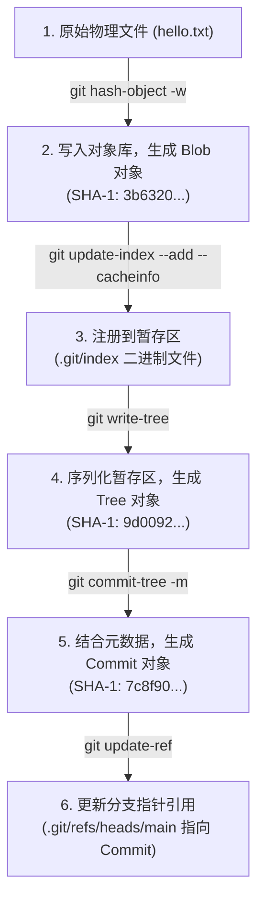

# 第三章：Plumbing 底层指令与 Porcelain 上层接口对比

在日常开发中，我们通常与 Git 的“上层命令（Porcelain Commands）”打交道，它们直观、易懂，如 `git add`、`git commit` 等。但在 Git 的设计理念中，这些高级命令仅仅是包装在“底层命令（Plumbing Commands）”之上的用户友好外壳。

本章我们将系统性地对比这两类命令的对应关系，并通过一次硬核的实战演练——**完全不用 `git add` 和 `git commit`，仅用底层命令手动拼装并完成一次分支提交**，从而彻底打通你对 Git 数据流转机制的理解。

---

## 1. Porcelain 与 Plumbing 命令对照表

下表梳理了我们日常使用的 Porcelain 命令在底层所触发或对应的 Plumbing 命令：

| Porcelain 命令 (高级) | 对应的 Plumbing 命令 (低级) | 底层命令的具体作用与物理行为 |
| :--- | :--- | :--- |
| `git add <file>` | `git hash-object -w <file>`<br>`git update-index --add ...` | 1. 计算文件哈希并将压缩后的 Blob 写入 `.git/objects/`。<br>2. 将文件路径、权限及 Blob 哈希注册到二进制 `index` 中。 |
| `git commit -m "msg"` | `git write-tree`<br>`git commit-tree <tree_sha> -m "msg"`<br>`git update-ref refs/heads/main <commit_sha>` | 1. 扫描暂存区，生成对应的 Tree 树对象。<br>2. 传入 Tree 哈希，组装作者、时间戳、父提交等生成 Commit 对象。<br>3. 将分支指针（引用）安全地更新为新 Commit 的哈希。 |
| `git checkout <branch>` | `git read-tree -u -m <tree_sha>`<br>`git symbolic-ref HEAD refs/heads/<branch>` | 1. 将目标分支的 Tree 结构读取并覆写到暂存区和工作区物理文件。<br>2. 将 `HEAD` 符号引用指向对应的分支引用文件。 |
| `git status` | `git diff-files`<br>`git diff-index --cached HEAD` | 1. 对比工作区文件系统与暂存区 `index` 的差异（未暂存修改）。<br>2. 对比暂存区 `index` 与当前 `HEAD` 提交的差异（已暂存修改）。 |
| `git reset --hard` | `git read-tree -u --reset <tree_sha>`<br>`git update-ref refs/heads/<branch> <commit_sha>` | 1. 强行将工作区与暂存区同步为指定 Tree。<br>2. 更新分支指针指向目标 Commit。 |

---

## 2. 纯底层命令提交流程图

下面的流程图展示了数据如何一步步从最原始的文件字节流，通过管道命令的不断处理，最终沉淀为版本库中的一个分支最新提交：



---

## 3. 硬核实战：手动完成一次物理提交

下面，我们将在本地新建一个全新的、完全干净的仓库，纯用 Plumbing 底层指令演练提交流程。

### 3.1 步骤一：初始化并配置仓库
首先，我们在一个空文件夹下运行 `git init`：
```bash
# 创建实验工作目录
mkdir git-plumbing-lab
cd git-plumbing-lab

# 初始化空仓库
git init

# 配置此仓库特有的本地提交者信息，防止全局配置缺失导致报错
git config user.name "Plumbing Master"
git config user.email "plumbing@internals.com"
```
此时，`.git` 目录下仅有初始化文件，不存在 `index`（暂存区）文件，且 `.git/objects/` 为空。

---

### 3.2 步骤二：创建物理文件并生成松散 Blob 对象
我们在工作区创建一个名为 `hello.txt` 的文件：
```bash
# 创建文本文件
echo "Hello, Git Plumbing!" > hello.txt
```
接下来，我们**不运行** `git add`，而是调用底层命令 `git hash-object`：
```bash
# 计算并直接将文件内容写入对象数据库中
# -w: write (写入)；如果不加 -w，命令只会打印计算出的哈希，不会写入磁盘文件
git hash-object -w hello.txt
```
运行后终端会输出一个 40 位哈希值：
```text
3b63200ff96c738ef9e1a1290374e2d43d3b6fb6
```
#### 物理状态变化：
此时，查看 `.git/objects/` 目录，你会发现多了一个 `3b/` 目录：
*   **新生成文件**：`.git/objects/3b/63200ff96c738ef9e1a1290374e2d43d3b6fb6`
*   该文件就是压缩后的 Blob 对象。我们可以用 `git cat-file` 校验它：
    ```bash
    # -t: type (查看对象类型)
    git cat-file -t 3b63200ff96c738ef9e1a1290374e2d43d3b6fb6
    # 输出: blob
    ```

---

### 3.3 步骤三：手动将 Blob 登记到暂存区 (Index)
虽然 Blob 已经躺在对象数据库中了，但如果此时运行 `git status`，你会发现 `hello.txt` 仍是 **Untracked（未追踪）** 状态。这是因为暂存区 `.git/index` 里还没有任何关于该文件的登记。

我们必须使用 `git update-index` 来手动构建暂存区条目：
```bash
# 手动更新暂存区索引
# --add: 告诉 Git 这是一个新加入暂存区的文件路径
# --cacheinfo: 告诉 Git 直接根据 mode、sha-1 和路径来更新暂存区条目，无需扫描物理文件
# 100644: 文件模式 (普通非可执行文件)
# 3b63200ff96c738ef9e1a1290374e2d43d3b6fb6: 前一步生成的 Blob 哈希值
# hello.txt: 在暂存区中登记的相对路径名
git update-index --add --cacheinfo 100644 3b63200ff96c738ef9e1a1290374e2d43d3b6fb6 hello.txt
```
#### 物理状态变化：
此时，`.git/` 目录下被动态创建了一个名为 **`index`** 的二进制文件！我们运行高级命令 `git status` 检验：
```bash
# 查看暂存状态
git status
```
输出：
```text
On branch main

No commits yet

Changes to be committed:
  (use "git rm --cached <file>..." to unstage)
	new file:   hello.txt
```
我们成功在没有调用 `git add` 的情况下，完成了文件的“暂存”！

---

### 3.4 步骤四：通过暂存区写入目录树 (Tree)
暂存区就绪后，我们需要把当前的暂存区打包，生成一个目录树（Tree）对象。该 Tree 对象将作为我们接下来 Commit 对象的根目录结构。

运行底层命令：
```bash
# 序列化暂存区并写入 Tree 对象
git write-tree
```
输出生成的 Tree 对象的哈希值：
```text
9d00922883e449c256a4220c4516be4c896d8bfa
```
#### 物理状态变化：
Git 自动在数据库中生成了对应的物理 Tree 文件：`.git/objects/9d/00922883e449c256a4220c4516be4c896d8bfa`。
这是一个二进制 Tree 对象，它内部记录了 `hello.txt` 文件的权限模式、名字以及对应的 Blob 哈希值（3b6320...）。

---

### 3.5 步骤五：铸造 Commit 对象
有了根目录树的哈希 `9d009228...`，我们就可以用 `git commit-tree` 命令来生成一个正式的 Commit 对象。

如果是仓库的**第一次提交**（无父提交），运行：
```bash
# 生成无父提交的首次 Commit 对象
# -m: 指定提交信息
git commit-tree 9d00922883e449c256a4220c4516be4c896d8bfa -m "First commit using only plumbing commands"
```
终端会输出生成的 Commit 对象的哈希值（由于包含了当前的时间戳，你实际运行产生的哈希会与下面不同）：
```text
7c8f90a2b8c5d1e2f3a4b5c6d7e8f9a0b1c2d3e4
```

> [!NOTE]
> **关于后续提交**：如果不是首次提交，你需要把新提交同前一次提交（父提交）关联起来，从而形成 Git 提交链（DAG）。此时必须使用 **`-p`** 参数传入父提交哈希。例如：
> ```bash
> # -p: 指定父提交的 SHA-1 (Parent Commit)
> git commit-tree <new_tree_sha> -p <parent_commit_sha> -m "Subsequent commit msg"
> ```

#### 物理状态变化：
Git 在数据库中写入了 Commit 对象文件 `.git/objects/7c/8f90a2...`。该 Commit 对象的内容为纯文本，包含指向 Tree 的哈希、作者/提交者时间戳以及提交信息。

---

### 3.6 步骤六：更新分支指针引用 (Ref)
至此，所有的对象（Blob、Tree、Commit）都已成功写入数据库。但是，如果你运行 `git log`，Git 仍会提示没有提交历史。这是因为我们的当前分支指针 `refs/heads/main` 还没有指向刚才生成的 Commit `7c8f90a2...`。

我们需要使用底层命令 `git update-ref` 来安全地更新分支引用指针：
```bash
# 安全地将 main 分支指针更新指向我们的最新 Commit
# refs/heads/main: 目标分支引用路径
# 7c8f90a2b8c5d1e2f3a4b5c6d7e8f9a0b1c2d3e4: 上一步生成的 Commit 哈希
git update-ref refs/heads/main 7c8f90a2b8c5d1e2f3a4b5c6d7e8f9a0b1c2d3e4
```
#### 物理状态变化：
该命令在 `.git/refs/heads/` 目录下创建了名为 `main` 的文本文件，文件内容为 `7c8f90a2b8c5d1e2f3a4b5c6d7e8f9a0b1c2d3e4`。此外，Git 还会为本次引用变更自动记录到 `.git/logs/refs/heads/main` 引用日志（Reflog）中。

---

## 4. 验证我们的成果！

现在，让我们见证奇迹的时刻。运行高级命令 `git log` 和 `git status` 检查：

```bash
# 查看提交历史与统计信息
git log --stat
```
输出：
```text
commit 7c8f90a2b8c5d1e2f3a4b5c6d7e8f9a0b1c2d3e4 (HEAD -> main)
Author: Plumbing Master <plumbing@internals.com>
Date:   Sat May 30 20:00:00 2026 +0800

    First commit using only plumbing commands

 hello.txt | 1 +
 1 file changed, 1 insertion(+)
```

运行 `git status`：
```bash
# 查看工作区与暂存区状态
git status
```
输出：
```text
On branch main
nothing to commit, working tree clean
```

**我们成功了！** 整个过程没有任何一行 `git add` 或 `git commit`，完全依靠底层对象拼装和引用操作，成功在工作区干净、规范地产生了一个全新的 Commit。

---

## 5. 总结

通过上述管道级命令的实战演练，我们能清晰体会到 Git 的核心优势：
1.  **极高的数据一致性**：暂存区 `index` 的存在使得 Git 不需要每次都全面扫描物理磁盘，只需进行非常轻量级的指针记录与排序。
2.  **操作原子性**：底层的每个命令都各司其职，保证了只要 Commit 哈希值被最终写入分支引用文件，该版本便会被牢牢记录，不可修改。
