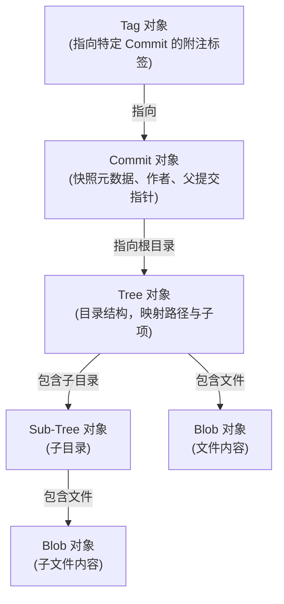

# 仓库结构与三大对象

在深入研读 Git 的具体技术细节前，我们有必要从高处俯瞰：Git 究竟是如何将我们的代码库、提交历史以及分支指针，在底层以极简的数据结构和物理文件组织起来的。

本部分将带你全面解构 Git 仓库的物理存储布局以及其核心对象模型。

---

## 1. 为什么是内容寻址？

传统的版本控制系统（如 SVN）通常以“文件路径”为核心，记录文件随着时间推移产生的**差异（Deltas）**。而 Git 另辟蹊径，将整个仓库视为一个**键值对对象数据库（Key-Value Object Database）**。

*   **键（Key）**：文件内容（包含类型和长度头部）经过 SHA-1 哈希算法计算得到的 40 位十六进制字符串（如 `8a9f0d1b4c6e8f5a2b0c3d4e5f6a7b8c9d0e1f2a`）。
*   **值（Value）**：经过 zlib 压缩后的数据实体。

只要文件内容相同，计算出的哈希值就完全相同，在 Git 数据库中也只会保留一份物理文件。这种设计天生带来了**去重**和**数据完整性校验**的优势。

---

## 2. 四大核心对象角色

Git 仅用四种核心对象，就完美构建出了一个复杂版本控制系统的全部数据骨架：



1.  **Blob (二进制大对象)**：仅存储文件内容（字节流），完全不记录文件名、文件路径或访问权限。
2.  **Tree (树对象)**：对应操作系统中的“目录”。它存储了一组条目，每个条目包含文件权限、类型（Blob 还是 Tree）、文件名（或子目录名）以及对应的 SHA-1 哈希值。
3.  **Commit (提交对象)**：对应一次版本历史快照。它记录了指向根 Tree 对象的哈希值、父提交（Parent）的哈希值（以形成提交图）、作者（Author）、提交者（Committer）以及提交信息。
4.  **Tag (标签对象)**：一种指向特定 Commit（通常情况下）的持久引用，包含标签名、打标签者、时间戳以及描述信息，常用于发布版本（如 `v1.0.0`）。

---

## 3. 对象压缩与物理布局

所有的 Git 对象在落盘前都会经过 **zlib** 算法压缩，生成一个“松散对象”（Loose Object）。为了避免在同一文件夹下产生海量小文件导致操作系统性能下降，Git 采用以下分级目录结构：

```text
.git/objects/
├── 8a/
│   └── 9f0d1b4c6e8f5a2b0c3d4e5f6a7b8c9d0e1f2a  <-- 松散对象物理文件
├── bd/
│   └── 6f9a0c...
└── pack/                                       <-- 打包对象(Packfiles)目录
```

*   哈希值的前 2 位作为子目录名（例如 `8a/`）。
*   哈希值的后 38 位作为文件名（例如 `9f0d1b4c...`）。

---

## 4. 本部分学习路线

在接下来的两章中，我们将进一步拆解并动手操作这些底层结构：

1.  **[第一章：Git 目录结构与底层存储物理布局](git-repository-structure.md)**：深入探讨 `.git` 文件夹下的每一个关键文件，尤其是神秘的二进制暂存区 `index` 文件和引用的物理存储。
2.  **[第二章：Blob、Tree、Commit 三大对象深度剖析](git-objects-deepdive.md)**：深入研究这四大对象的二进制字节结构、SHA-1 计算流程，编写 Python 解析器脱离 Git 读取这些对象。
