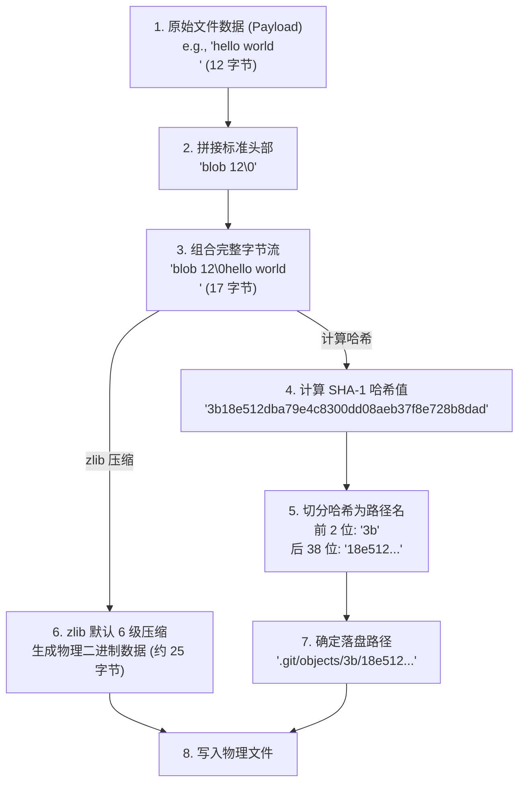
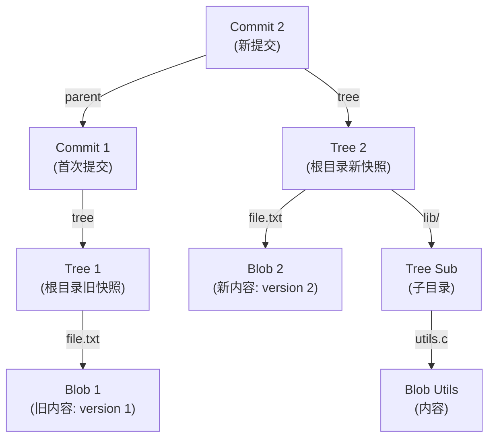

# 第二章：Blob、Tree、Commit 三大对象深度剖析

Git 并非黑盒，它的底层数据库极其透明、规整且极具工业美感。在 Git 的世界中，所有的数据（包括文件内容、目录结构、提交历史以及发布标签）都存储为**内容寻址对象（Content-Addressable Objects）**。

本章将深入探讨这四大对象（Blob、Tree、Commit、Tag）的物理存储格式、二进制报文协议、SHA-1 计算细节，展示对象生成与压缩的物理流向，并最终编写一个纯 Python 脚本，在不依赖 Git 原生命令行工具的情况下直接对 `.git/objects/` 进行读取解析与写入。

---

## 1. 内容寻址存储与 SHA-1 计算机制

在 Git 中，对象的唯一标识是一个 40 位的十六进制字符串（例如：`bd6f9a0c...`），它是对对象内容执行 **SHA-1** 哈希算法生成的校验和（Checksum）。

### 1.1 为什么是“内容寻址”？
在传统文件系统中，我们通过文件的“路径”或“名称”来寻找文件（例如 `C:\Users\doc\notes.txt`）。而在 Git 中，我们只关心文件的**内容**。
*   如果两个完全不同路径下的文件内容一模一样，Git 只会在 `objects/` 目录下存储**一份** Blob 对象。
*   文件路径、文件名以及权限等元数据，由上层的 Tree 对象负责管理，与文件内容本身完全解耦。

### 1.2 SHA-1 校验和的计算公式
Git 在对数据进行 SHA-1 计算时，并不是直接对原始文件字节流做哈希，而是必须在前面拼装一个**标准对象头部（Object Header）**。头部格式为：

$$\text{Header} = \text{Type} + \text{" "} + \text{Size\_in\_Bytes} + \text{"\textbackslash 0"}$$

其中：
*   `Type`：对象类型，可取值为 `blob`、`tree`、`commit` 或 `tag`。
*   ` `：一个空格字符。
*   `Size_in_Bytes`：对象实际内容（Payload）的字节长度，用十进制 ASCII 字符串表示。
*   `\0`：即 `0x00`（Null 字符），作为头部结束与内容开始的二进制分隔符。

因此，Git 计算出的 SHA-1 实际为：

$$\text{SHA-1} = \text{SHA-1}(\text{Type} + \text{" "} + \text{Size} + \text{0x00} + \text{Payload})$$

这种设计确保了：
1.  **类型防混淆**：相同内容的文件（Blob）与相同内容的提交信息（Commit）计算出的哈希值截然不同。
2.  **内容完整性**：头部的长度与内容长度必须一致，任何一处发生比特翻转都会彻底改变哈希值。

---

## 2. SHA-1 对象生成与压缩存盘物理流向图

下面是 Git 对象从原始数据流转换为 `.git/objects/` 下物理松散文件的全链路流向图：



---

## 3. 四大核心对象的二进制报文格式

接下来，我们依次拆解这四类对象在解压后的实际字节流布局。

### 3.1 Blob 对象：纯粹的文件内容包裹

Blob（Binary Large Object）是最基础的对象，它只包含文件数据，不包含任何文件名、修改时间或权限信息。

```text
+-----------------------------+------------------------------------+
| blob <size_in_bytes>\0      | <raw file contents>                |
+-----------------------------+------------------------------------+
|<-------- Header ----------->|<----------- Payload -------------->|
```

*   **特点**：纯文本、图片、音视频等任何格式的文件在 Git 看来都是一个 Blob。
*   **重用性**：如果你把文件 `a.txt` 重命名为 `b.txt` 且内容不变，Git 只会增加一个指向原 Blob 哈希的 Tree 记录，而不需要重新存储这个文件。

---

### 3.2 Tree 对象：目录结构的映射

Tree 对象对应文件系统中的**目录**。它记录了当前目录下所有子文件（Blob）和子目录（Tree）的元数据。

#### Tree 对象的 Payload 结构与设计理念
Tree 对象的 Payload 由一个或多个“目录条目（Directory Entries）”紧密排列组成。**每个条目的内部结构非常特殊**，采用文本与二进制混合的模式：

```text
[file_mode][space][file_name]\0[20-byte binary SHA-1]
```

##### 详细拆解：
1.  **`file_mode`**：文件模式，用八进制 ASCII 字符串表示（非固定长度，如 `100644` 代表普通文件，`100755` 代表可执行文件，`40000` 代表子目录/树，`120000` 代表符号链接）。
2.  **` `**（空格）：物理分隔符。
3.  **`file_name`**：文件名或目录名，UTF-8 编码。
4.  **`\0`**（Null 字节）：物理分隔符，表示文件名的结束。
5.  **`20-byte binary SHA-1`**：**注意！** 这里的 SHA-1 哈希值不是我们平时看到的 40 位十六进制字符，而是**原始的 20 字节二进制数据（Binary Raw SHA-1）**。

##### 为什么设计为 20 字节二进制形式？
在计算机中，一个字节可以表示两个十六进制字符。如果将哈希保存为 40 字节的十六进制 ASCII 文本，需要两倍的空间。对于包含成千上万个文件条目的巨大项目（如 Linux 内核源码树），Tree 对象会频繁地在内存与磁盘间读取。使用 20 字节的二进制原生数据可以使 Tree 对象的体积缩小约 30%，极大提升了目录树遍历的 I/O 效率。

#### Tree 对象的字节流物理布局图

```text
+---------------------------------------------------------------------------------------+
| tree <size>\0                                                                         |
+-------------+----+-------------+----+--------------------------+-----------------------+
| File Mode   | ' ' | Name        | \0 | Binary SHA-1 (20B)       | Next Entry File Mode...
+-------------+----+-------------+----+--------------------------+-----------------------+
| 100644      | 20 | main.c      | 00 | \x1a\xbf\x3c\x8d...      | 40000...
+-------------+----+-------------+----+--------------------------+-----------------------+
```

由于 20 字节二进制 SHA-1 往往包含不可读字符，因此如果直接在终端中 `cat` 一个 Tree 对象物理文件，屏幕上会出现大量乱码。

---

### 3.3 Commit 对象：版本快照的元数据

Commit 对象记录了某次提交的所有上下文信息。它的格式为纯文本，结构如下：

```text
tree <40-char hex SHA-1 of root tree>
parent <40-char hex SHA-1 of parent commit 1>
parent <40-char hex SHA-1 of parent commit 2> (如果是 Merge 提交则有多行 parent)
author <Name> <Email> <unix_timestamp> <timezone_offset>
committer <Name> <Email> <unix_timestamp> <timezone_offset>

<Commit Message>
```

#### 关键字段剖析：
*   **`tree`**：指向该提交所对应项目根目录的 Tree 对象（40 位十六进制）。
*   **`parent`**：指向父提交的哈希。首次提交（Root Commit）没有 parent 行；常规提交有 1 行 parent；合并提交（Merge Commit）会有 2 行或更多 parent 行。
*   **时间戳格式**：采用 Unix 时间戳（自 1970-01-01 以来的秒数）加时区偏移量。例如 `1780000000 +0800`。
*   **双空行分隔**：头部元数据与下方的 Commit Message 之间用一个连续的换行符（`\n\n`）进行物理分隔。

---

### 3.4 Tag 对象：附注标签

Tag 对象用于对某个特定的对象（通常是 Commit）打上一个不可变的“附注标签（Annotated Tag）”。其结构与 Commit 非常相似：

```text
object <40-char hex SHA-1 of target object>
type <commit|tree|blob|tag>
tag <tag_name>
tagger <Name> <Email> <unix_timestamp> <timezone_offset>

<Tag Message>
```

*   **对象指针的泛化**：从协议层面上，Tag 对象的 `type` 字段可以是 `tree` 或 `blob`，甚至可以让一个 Tag 指向另一个 Tag（嵌套标签）。

---

## 4. Git 对象 DAG 拓扑关系图

下面展示一个包含两次连续提交的 Git 仓库底层对象依赖 DAG（有向无环图）。可以看出，每次 Commit 指向一个根 Tree，而 Tree 则像文件树一样向下分支：



---

## 5. Python 脚本实战：纯底层解析与生成松散对象

下面我们将编写一个无需调用任何 `git` 命令行、纯 Python 标准库编写的工具。它能够：
1.  **读取并解析** 任意一个松散对象文件（支持 Blob, Commit, Tree, Tag），并结构化地展示其二进制数据。
2.  **手动生成** 一个标准的 Blob 对象并安全写入 `.git/objects/`。

### 5.1 Python 解析器代码 (`git_parser.py`)

```python
#!/usr/bin/env python3
"""
Git 松散对象解析与构建工具
基于 Python 3 标准库，无外部依赖。
"""

import os
import zlib
import hashlib
import sys

def parse_loose_object(filepath: str):
    """
    读取并解析指定的 Git 松散对象二进制文件
    """
    if not os.path.exists(filepath):
        print(f"[-] 错误: 文件不存在 {filepath}", file=sys.stderr)
        return

    # 1. 读取 zlib 压缩的文件内容
    with open(filepath, 'rb') as f:
        compressed_data = f.read()

    # 2. 解压缩
    try:
        raw_data = zlib.decompress(compressed_data)
    except zlib.error as e:
        print(f"[-] 错误: zlib 解压失败. 可能不是有效的松散对象文件. 原因: {e}", file=sys.stderr)
        return

    # 3. 解析 Header (格式: type size\0)
    null_byte_idx = raw_data.find(b'\0')
    if null_byte_idx == -1:
        print("[-] 错误: 对象报文中未找到 Null 字节分隔符", file=sys.stderr)
        return

    header_bytes = raw_data[:null_byte_idx]
    payload_bytes = raw_data[null_byte_idx + 1:]

    try:
        header_str = header_bytes.decode('utf-8')
        obj_type, obj_size_str = header_str.split(' ')
        obj_size = int(obj_size_str)
    except ValueError:
        print(f"[-] 错误: 无法解析的 Header 格式: {header_bytes}", file=sys.stderr)
        return

    print("=" * 60)
    print(f"[*] 对象类型: {obj_type.upper()}")
    print(f"[*] 数据大小: {obj_size} 字节 (实际 Payload 大小: {len(payload_bytes)} 字节)")
    print("=" * 60)

    # 4. 根据类型进行 Payload 结构化展示
    if obj_type == 'blob':
        print("[Blob 内容预览]:")
        try:
            print(payload_bytes.decode('utf-8'))
        except UnicodeDecodeError:
            # 可能是二进制文件（图片、编译文件等）
            print(f"<二进制数据 - 前 100 字节十六进制: {payload_bytes[:100].hex()}>")

    elif obj_type in ('commit', 'tag'):
        print("[文本元数据与报文]:")
        print(payload_bytes.decode('utf-8'))

    elif obj_type == 'tree':
        print("[Tree 目录项列表]:")
        idx = 0
        while idx < len(payload_bytes):
            # 寻找空格 (file_mode 与 filename 的分隔)
            space_idx = payload_bytes.find(b' ', idx)
            if space_idx == -1:
                break
            file_mode = payload_bytes[idx:space_idx].decode('utf-8')

            # 寻找 \0 (filename 与 20-byte SHA-1 的分隔)
            null_idx = payload_bytes.find(b'\0', space_idx)
            if null_idx == -1:
                break
            filename = payload_bytes[space_idx + 1:null_idx].decode('utf-8')

            # 读取 20 字节的二进制 SHA-1
            sha_binary = payload_bytes[null_idx + 1: null_idx + 21]
            sha_hex = sha_binary.hex()

            print(f"  Mode: {file_mode:<6} | Name: {filename:<20} | SHA-1: {sha_hex}")
            idx = null_idx + 21


def create_git_blob(content_str: str, repo_root: str = "."):
    """
    手动封装一个 Blob 对象，计算 SHA-1，对其进行 zlib 压缩并存盘，返回 40 位哈希。
    """
    payload = content_str.encode('utf-8')
    size = len(payload)

    # 构建头部
    header = f"blob {size}\0".encode('utf-8')
    full_data = header + payload

    # 计算 SHA-1 作为对象名
    sha1_hash = hashlib.sha1(full_data).hexdigest()

    # zlib 压缩
    compressed = zlib.compress(full_data)

    # 计算目标路径 (.git/objects/xx/xxxxxxxxxxxx)
    dir_name = sha1_hash[:2]
    file_name = sha1_hash[2:]
    target_dir = os.path.join(repo_root, ".git", "objects", dir_name)
    target_file = os.path.join(target_dir, file_name)

    # 写入文件系统
    os.makedirs(target_dir, exist_ok=True)
    with open(target_file, 'wb') as f:
        f.write(compressed)

    print(f"[+] 成功生成松散 Blob 对象!")
    print(f"    哈希值: {sha1_hash}")
    print(f"    写入路径: {target_file}")
    return sha1_hash


if __name__ == "__main__":
    if len(sys.argv) < 3:
        print("使用说明:")
        print("  解析对象: python git_parser.py parse <path_to_loose_file>")
        print("  生成 Blob: python git_parser.py write <text_content>")
        sys.exit(1)

    action = sys.argv[1].lower()
    if action == "parse":
        parse_loose_object(sys.argv[2])
    elif action == "write":
        create_git_blob(sys.argv[2])
    else:
        print(f"[-] 未知动作: {action}", file=sys.stderr)
        sys.exit(1)
```

---

### 5.2 验证我们的 Python 脚本

让我们在一个 Git 仓库中测试这个脚本：

#### 步骤一：使用脚本手动写入一个 Blob
```bash
# 写入自定义的文本，绕过 git add 直接向对象库注入 Blob
python git_parser.py write "Hello, this is a custom raw object!"
```
输出：
```text
[+] 成功生成松散 Blob 对象!
    哈希值: d7f06536cf2a2559b152d80d2cf93ebdfef5520e
    写入路径: ./.git/objects/d7/f06536cf2a2559b152d80d2cf93ebdfef5520e
```

#### 步骤二：使用原生 Git 命令检查我们写入的 Blob
```bash
# 使用 Git 原生底层命令检查该哈希的类型
git cat-file -t d7f06536cf2a2559b152d80d2cf93ebdfef5520e
# 输出: blob

# 读取该哈希的内容
git cat-file -p d7f06536cf2a2559b152d80d2cf93ebdfef5520e
# 输出: Hello, this is a custom raw object!
```
这证明我们绕过了 `git add`，成功纯手工向 Git 对象数据库中插入了一个合法的 Blob！
