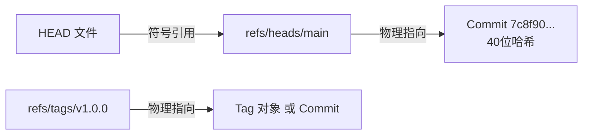

# 第一章：Git 目录结构与底层存储物理布局

要真正理解 Git 的工作原理，首先必须对 `.git` 文件夹进行物理上的“解剖”。当你在一个目录中执行 `git init` 时，Git 会在该目录下创建一个名为 `.git` 的隐藏文件夹。这个文件夹就是 Git 的**版本库（Repository）**，它包含了管理该项目版本历史所需的所有数据、元数据以及配置文件。

本章将详细剖析 `.git` 目录的物理结构、核心文件职责、二进制暂存区（Index）文件的底层数据结构，以及分支与引用的底层寻址机制。

---

## 1. `.git` 目录的物理布局图

在一个全新的空目录中执行 `git init`，并进行简单的文件添加和提交后，整个 `.git` 目录的物理布局如下：

```text
.git/
├── HEAD                    # 文本文件：指向当前活动分支的符号引用 (如 ref: refs/heads/main)
├── config                  # 文本文件：当前仓库的局部配置文件 (Local Configuration)
├── description             # 文本文件：供 Gitweb 展示项目描述使用，日常开发无实际作用
├── index                   # 二进制文件：极其关键的暂存区 (Staging Area / Directory Cache)
├── packed-refs             # 文本文件：打包后的引用列表 (优化松散引用文件数量)
├── hooks/                  # 文件夹：存放各种生命周期钩子脚本 (如 pre-commit, pre-push)
│   ├── pre-commit.sample   # 默认带有 .sample 后缀，去掉后缀并赋予可执行权限即可生效
│   └── ...
├── info/                   # 文件夹：附加元数据信息
│   └── exclude             # 文本文件：本地独享的排除规则，作用同 .gitignore 但不随代码库提交
├── objects/                # 文件夹：Git 的对象数据库 (Object Database)
│   ├── info/               # 对象的索引与辅助信息
│   ├── pack/               # 打包对象 (Packfiles) 目录，包含 .pack 和 .idx 索引文件
│   ├── [0-9a-f][0-9a-f]/   # 散列目录：用 SHA-1 哈希前 2 位命名 (如 objects/3b/)
│   │   └── [38位十六进制]    # 物理压缩对象文件：用哈希后 38 位命名 (松散对象 Loose Object)
│   └── info/
└── refs/                   # 文件夹：引用指针管理器 (References)
    ├── heads/              # 文件夹：本地分支指针 (如 refs/heads/main，文件内写入 40 位 Commit 哈希)
    ├── tags/               # 文件夹：本地标签指针 (轻量标签或附注标签的物理文件)
    └── remotes/            # 文件夹：远程跟踪分支指针 (如 refs/remotes/origin/main)
```

---

## 2. 核心文件职责与底层机制

### 2.1 HEAD 文件与“游离头指针”（Detached HEAD）

`HEAD` 文件的本质是 Git 的**当前位置指针**，它指示了 Git 当前正处于哪个分支上，或者正指向哪一个具体的提交。

打开一个正常分支状态下的 `HEAD` 文件：
```bash
# 查看当前 HEAD 文件内容
cat .git/HEAD
```
输出通常是：
```text
ref: refs/heads/main
```
这是一种**符号引用（Symbolic Reference）**，它指向另一个引用文件 `.git/refs/heads/main`。当工作区发生新的提交时，Git 不会修改 `HEAD` 文件，而是修改 `HEAD` 指向的 `refs/heads/main` 文件，将其中的哈希值更新为最新的 Commit SHA-1。

#### 游离头指针（Detached HEAD）的本质
当你检出（Checkout）某个特定的提交哈希值、标签或远程分支时：
```bash
# 检出特定的历史提交 (这里使用一个虚构的哈希)
git checkout a1b2c3d4e5f6
```
Git 会将 `HEAD` 文件修改为直接包含该 40 位十六进制的 Commit SHA-1：
```text
a1b2c3d4e5f6a7b8c9d0e1f2a3b4c5d6e7f8a9b0
```
此时，`HEAD` 不再指向任何分支，Git 称此状态为 **Detached HEAD（游离头指针）**。
*   **物理后果**：你在游离状态下做出的任何新提交都会生成 Commit 对象，且新 Commit 的 `parent` 会指向 `a1b2c3d4...`，同时 `HEAD` 会自动前移指向这个新 Commit。
*   **风险点**：由于没有本地分支指针（如 `refs/heads/main`）指向这些新提交，一旦你切换回其他分支（如 `git checkout main`），这些在游离状态下创建的提交将失去所有的引用通路。它们在 Git 中被称为**悬空提交（Dangling Commits）**，在一定时间（默认 30 天，可通过配置调整）后，会被 Git 的自动垃圾回收（Garbage Collection, GC）机制彻底从磁盘上抹去。

---

### 2.2 引用管理器 refs/ 与 packed-refs 优化

在 Git 中，引用（References，简称 refs）是给 40 位难以记忆的 SHA-1 哈希值起的“易读别名”。



*   **本地分支 (`refs/heads/`)**：该目录下的每一个文件对应一个本地分支。文件内容是一个 40 字节的 ASCII 文本，加一个换行符，里面仅存放该分支最新提交的哈希值。
*   **标签引用 (`refs/tags/`)**：
    *   **轻量标签（Lightweight Tag）**：文件内直接存放目标 Commit 的 40 位哈希值。
    *   **附注标签（Annotated Tag）**：文件内存放一个特殊的 **Tag 对象** 的哈希值，该 Tag 对象存储在 `objects/` 数据库中，内含打标签的作者、时间、描述信息并最终指向 Commit。

#### packed-refs 机制
当仓库中的分支和标签数量达到成百上千个时，在磁盘上维护大量的小文本文件会严重消耗系统的 inode 资源，并在读取时产生高频的 I/O 开销。
为了解决这一问题，Git 会在运行 `git gc` 或推送操作时，将 `refs/heads/` 和 `refs/tags/` 下的大部分引用合并写入到一个名为 `.git/packed-refs` 的单文件中。

`.git/packed-refs` 文件格式示例：
```text
# pack-refs with: peeled fully-peeled sorted 
8a9f0d1b4c6e8f5a2b0c3d4e5f6a7b8c9d0e1f2a refs/heads/main
e3b0c44298fc1c149afbf4c8996fb92427ae41e4 refs/tags/v1.0.0
^8a9f0d1b4c6e8f5a2b0c3d4e5f6a7b8c9d0e1f2a
```
*   `^` 符号开头的行代表**剥离（Peeled）**操作：它紧跟在附注标签行之后，指向该标签最终映射的 Commit 哈希值。这允许 Git 在不需要解压读取 Tag 对象本身的情况下，快速知道标签指向的实际 Commit。
*   **覆盖优先级**：如果一个引用同时存在于 `.git/refs/heads/` 目录（松散引用）和 `.git/packed-refs` 文件中，Git 会**优先读取松散引用**，因为松散引用的写入代表了最新的分支更新。

---

## 3. 暂存区 index 文件的二进制奥秘

暂存区（Staging Area，在源码中通常称为 `index` 或 `directory cache`）是 Git 架构设计的灵魂。它不是一个目录，而是一个位于 `.git/index` 的**单一二进制文件**。

### 3.1 为什么需要暂存区？
在 CVS 或 SVN 中，执行提交时，版本控制系统必须完整遍历整个工作区，比对每个文件的修改时间，计算差异并传送。如果项目文件极多，这个过程会慢得令人绝望。
Git 引入 `index` 作为缓冲：
1.  **性能极佳**：`index` 缓存了工作区中所有被追踪文件的状态元数据（如大小、修改时间、inode 等）以及对应的 Blob 哈希值。
2.  **提交极快**：当运行 `git commit` 时，Git 完全不需要扫描工作区，只需读取二进制的 `index` 文件，直接把其中记录的文件关系序列化为 Tree 对象，瞬间即可完成提交。

### 3.2 `index` 二进制格式结构剖析

`index` 文件由一个 **12 字节的文件头（Header）**、**数个排序的文件条目（Index Entries）**、**可选的扩展块（Extensions）** 以及 **20 字节的 SHA-1 校验和（Checksum）** 组成。

#### 3.2.1 头部布局 (Header) - 12 字节
```text
+-------------------------------------------------------+
|  DIRC Magic (4B)  |  Version (4B)  | Entry Count (4B) |
+-------------------------------------------------------+
```
*   **DIRC Magic (4字节)**：固定为 ASCII 字符 `DIRC` (意为 "Directory Cache")，十六进制为 `0x44495243`。如果前四个字节不是它，说明该文件已损坏或非 Git 暂存区文件。
*   **Version (4字节)**：版本号。通常为 `2`、`3` 或 `4`。版本 4 引入了路径名压缩等优化。
*   **Entry Count (4字节)**：一个 32 位无符号整型，记录了当前暂存区中追踪的文件条目总数。

#### 3.2.2 索引条目布局 (Index Entry)
在文件头之后，紧跟着 `Entry Count` 个条目。每个条目记录一个被追踪文件的详细状态。其底层字段排布如下（以 Version 2 为准）：

```text
+-----------------------------------------------------------------------+
| ctime seconds (4B)      | ctime nanoseconds fraction (4B)            |
+-------------------------+---------------------------------------------+
| mtime seconds (4B)      | mtime nanoseconds fraction (4B)            |
+-------------------------+---------------------------------------------+
| dev (4B)                | ino (4B)                                    |
+-------------------------+---------------------------------------------+
| mode (4B)               | uid (4B)                                    |
+-------------------------+---------------------------------------------+
| gid (4B)                | file size (4B)                              |
+-------------------------+---------------------------------------------+
|               20-byte binary SHA-1 of Blob (20B)                      |
+-----------------------------------------------------------------------+
| flags (2B)              | path name (Variable length)                 |
+-------------------------+---------------------------------------------+
| Null padding (1-8B) to align entry to 8-byte boundary                |
+-----------------------------------------------------------------------+
```

##### 字段细节拆解：
1.  **ctime (8字节)**：文件元数据最后修改时间（4 字节秒数 + 4 字节纳秒偏移）。
2.  **mtime (8字节)**：文件内容最后修改时间（4 字节秒数 + 4 字节纳秒偏移）。
3.  **dev / ino (各4字节)**：设备号与 inode 节点号。Git 利用它们快速判断工作区文件是否被篡改。
4.  **mode (4字节)**：文件权限与类型。Git 仅支持几种特定的文件类型：
    *   `100644` (十六进制 `0x81a4`)：普通非可执行文件。
    *   `100755` (十六进制 `0x81ed`)：可执行文件。
    *   `120000` (十六进制 `0xa000`)：符号链接。
    *   `160000` (十六进制 `0xe000`)：子模块（Gitlink）。
5.  **uid / gid (各4字节)**：属主用户 ID 和属组 ID。
6.  **file size (4字节)**：工作区文件的大小。
7.  **Blob SHA-1 (20字节)**：文件内容存入对象库后对应的 **二进制** SHA-1 哈希值。
8.  **flags (2字节)**：16 位标志位：
    *   第 1 位：`assume-valid` 标志。
    *   第 2 位：`extended` 标志（用于版本 3 及以上表示是否包含扩展标志）。
    *   第 3-4 位：`stage` 标志（用于解决 Merge 冲突，`00` 代表正常，`01` 代表 base，`10` 代表 ours，`11` 代表 theirs）。
    *   后 12 位：文件相对路径名长度。如果路径长度小于 0xFFF（4095字节），则填入实际值，否则填入 0xFFF。
9.  **path name (可变长度)**：文件的相对路径（如 `src/main.c`），使用 UTF-8 编码，以 `\0` 结尾。
10. **Null Padding (1-8字节)**：填充字节，用于将当前 entry 的总字节大小向上对齐到 8 字节的整数倍。

---

## 4. 实践：绕过高级命令进行分支物理回滚

为了验证分支在底层只是个简单的文本文件，我们通过实验手动修改分支指针来进行版本回退。

### 4.1 实验环境搭建

配置本地测试提交：
```bash
# 进入测试仓库并配置本地环境信息
git config user.name "Internals Explorer"
git config user.email "explorer@git.com"

# 1. 提交第一个版本
echo "Version 1.0" > doc.txt
git add doc.txt
# 产生第一个 Commit
git commit -m "feat: init doc"

# 2. 提交第二个版本
echo "Version 2.0" >> doc.txt
git add doc.txt
# 产生第二个 Commit
git commit -m "feat: update doc"
```

使用 `git log` 查看提交链，并记录这两个提交的哈希值：
```bash
git log --oneline
```
假设输出如下：
```text
f7c89a0 (HEAD -> main) feat: update doc
c3b2a10 feat: init doc
```

---

### 4.2 手动修改物理文件回滚

在不使用 `git reset` 或 `git revert` 的情况下，我们直接操作文件系统：

```powershell
# 在 Windows PowerShell 中直接重写分支引用文件
Set-Content -Path ".git/refs/heads/main" -Value "c3b2a10"
```
或者在 Git Bash / Linux Shell 中运行：
```bash
# 直接将第一个提交的哈希值写入 main 分支文件
echo "c3b2a10" > .git/refs/heads/main
```

再次运行 `git log` 查看当前版本历史：
```bash
git log --oneline
```
输出变为：
```text
c3b2a10 (HEAD -> main) feat: init doc
```
`main` 分支指针成功回退到了第一个提交！而第二个提交 `f7c89a0` 此时在 refs 拓扑图中失去了引用关联，变成了“悬空提交”。

> [!WARNING]
> 直接修改引用文件是非常危险的操作。Git 在正常写引用时会创建锁定文件（如 `main.lock`）以防止并发写入冲突，并且会往 `.git/logs/` 写入引用日志（Reflog）。我们直接回写文件会绕过这些保护与日志记录，可能导致 Reflog 状态不一致。本节实验仅用于加深底层原理的理解。
