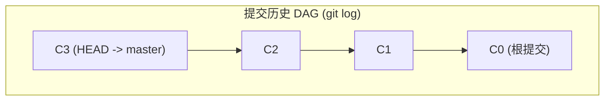
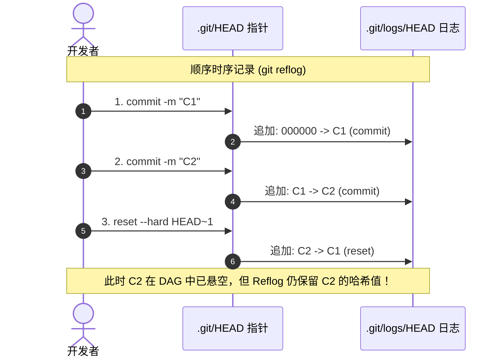

# 引用指针与引用日志底层原理

要想彻底掌握 Git Reflog，我们必须撕开 Git 命令行包装的抽象层，深入到 `.git` 目录的物理存储结构中。Git 本质上是一个以内容寻址的键值数据库（Content-Addressable Key-Value Database），而引用（References）则是指向该数据库中提交对象（Commit Objects）的具名指针。

本章将详细解构 Git 引用与其对应日志（Reflog）的底层存储机制、二进制/文本协议以及事务更新流程。

---

## Git 引用（References）的本质

在 Git 中，分支（Branches）和标签（Tags）在底层其实并没有什么神奇的。它们仅仅是存储在磁盘上的普通文本文件，内容是一个 40 字符的 SHA-1 哈希值（在启用 SHA-256 的现代仓库中为 64 字符），外加一个换行符。

当我们在项目根目录下查看 `.git/refs/` 结构时，通常会看到：
- `.git/refs/heads/`：包含本地分支指针文件。例如 `.git/refs/heads/master`。
- `.git/refs/tags/`：包含标签指针文件。
- `.git/refs/remotes/`：包含远程跟踪分支指针文件（如 `origin/master`）。

此外，还有一个特殊的**符号引用（Symbolic Reference）**——`.git/HEAD`。它并不直接包含哈希值，而是指向当前分支文件的路径：
```bash
$ cat .git/HEAD
ref: refs/heads/master
```
这意味着：当前 HEAD 指向 `master` 分支，而 `master` 分支对应的文件则指向具体的 Commit 哈希：
```bash
$ cat .git/refs/heads/master
d6855018306dfef5b721867c858df3f24fae0a7e
```

---

## Reflog 的物理存储结构

与 `.git/refs/` 目录平行，Git 在 `.git/logs/` 目录下维护着相对应的引用日志：

```text
.git/
├── HEAD
├── refs/
│   └── heads/
│       ├── master
│       └── feature-x
└── logs/
    ├── HEAD
    └── refs/
        └── heads/
            ├── master
            └── feature-x
```

- **`.git/logs/HEAD`**：记录本地 `HEAD` 指针的每一次移动。由于无论是切换分支还是在当前分支提交代码都会移动 `HEAD`，因此该文件是整个仓库中最活跃的日志。
- **`.git/logs/refs/heads/<branch-name>`**：专门记录该特定分支指针的移动历史。

### 原始日志文件的单行数据格式

如果我们直接用 `cat` 或 `less` 查看 `.git/logs/HEAD`，会发现它并非 JSON 或复杂二进制格式，而是一个非常规范的**制表符/空格分隔的纯文本协议**：

```text
96b86f8a846174b5952f4422e177b944208a0d92 d6855018306dfef5b721867c858df3f24fae0a7e hengvvang <hengvvang@example.com> 1779951600 +0800\tcommit: implement task monitoring watermarks
```

我们将这一行数据按照字节段进行拆解：

1. **旧哈希（Old SHA-1 / SHA-256）**（40 字节）：本次操作前，该引用所指向的 Commit 哈希值。如果这是该引用的创建操作（如新建分支或首次提交），则此字段填充为 40 个 `0`。
2. **空格**（1 字节）。
3. **新哈希（New SHA-1 / SHA-256）**（40 字节）：本次操作后，该引用所指向的目标 Commit 哈希值。
4. **空格**（1 字节）。
5. **提交者姓名（Committer Name）**：执行操作的人员名称（取自 `user.name` 配置）。
6. **空格 + 尖括号包围的邮箱（Committer Email）**：例如 `<hengvvang@example.com>`。
7. **空格**（1 字节）。
8. **时间戳（Timestamp）**：Unix 时间戳（从 1970 年 1 月 1 日开始的秒数），例如 `1779951600`。
9. **空格**（1 字节）。
10. **时区（Timezone）**：时区偏差值，例如 `+0800` 代表东八区。
11. **制表符 `\t`**（1 字节）。
12. **操作说明（Message）**：对本次指针移动原因的文本描述。例如：
    - `commit: ...`：提交了新代码。
    - `checkout: moving from master to dev`：切换了分支。
    - `reset: moving to HEAD~1`：执行了重置。
    - `rebase (start): checkout origin/master`：开始变基。

---

## 用 Shell 脚本解析原始 Reflog

我们可以编写一个简单的 Shell/Awk 脚本，绕过 Git 核心命令行，直接读取并格式化解析底层的 `.git/logs/HEAD` 文件，加深对该存储结构的直观认知：

```bash
#!/usr/bin/env bash
# parse_raw_reflog.sh - 演示如何用纯 Shell/Awk 工具读取并解析 Git 底层 Reflog 文件

LOG_FILE=".git/logs/HEAD"

if [ ! -f "$LOG_FILE" ]; then
    echo "错误: 找不到本地引用日志文件 $LOG_FILE"
    exit 1
fi

echo -e "索引\t旧哈希\t\t新哈希\t\t操作时间\t\t操作动作"
echo -e "--------------------------------------------------------------------------------"

# 使用 awk 逐行解析，利用制表符分割动作描述
awk -F'\t' '
{
    # 前半部分包含：old_sha, new_sha, author_info, timestamp, tz
    split($1, parts, " ")
    old_sha = substr(parts[1], 1, 7)
    new_sha = substr(parts[2], 1, 7)
    
    # 提取 Unix 时间戳（倒数第二个字段）
    timestamp = parts[length(parts)-1]
    
    # 动作描述部分在 $2
    action = $2
    
    # 转换时间戳为可读格式（兼容 Linux/macOS date）
    # 在 awk 中这里仅打印原始数据或通过 system 转换
    cmd = "date -d @" timestamp " +\"%Y-%m-%d %H:%M:%S\" 2>/dev/null || date -r " timestamp " +\"%Y-%m-%d %H:%M:%S\""
    cmd | getline date_str
    close(cmd)

    printf "%02d\t%s\t->\t%s\t[%s]\t%s\n", NR, old_sha, new_sha, date_str, action
}' "$LOG_FILE" | tail -n 15
```

---

## 引用更新的事务性与锁机制

当有高并发操作（例如脚本中频繁的本地构建、或者多进程写入）尝试修改同一个引用时，Git 必须确保引用和其日志的修改是**原子性的（Atomic）**。

为此，Git 引入了**文件排他锁机制**：

1. **锁文件创建**：当准备更新 `refs/heads/master` 时，Git 会首先在同目录下创建名为 `refs/heads/master.lock` 的空文件。
2. **写操作**：
   - 将新提交的哈希写入 `master.lock`；
   - 将对应的日志追加记录写到 `.git/logs/refs/heads/master` 的临时缓冲区中。
3. **提交更新**：
   - 将临时锁文件重命名（原子重命名系统调用 `rename()`）为 `refs/heads/master`，覆盖旧的引用文件。
   - 将缓冲区的日志物理追加到 `.git/logs/refs/heads/master` 以及 `.git/logs/HEAD` 中。
4. **异常释放**：如果更新失败或中途夭折，锁文件将被删除以允许后续操作。

通过这种方式，Git 确保了即使在操作系统断电或进程崩溃的极端情况下，引用指针和引用日志的物理状态依然能够保持一致，不会出现引用更新了但日志丢失，或者日志更新了但引用错乱的“半写入”状态。

---

## 时序日志 vs. 拓扑图：工作原理的对比

理解 `git log` 与 `git reflog` 差异的最直观方式是通过图表。

`git log` 沿着 Commit 对象内部的 `parent` 指针（只读、只往回看）遍历整个拓扑图：



而 `git reflog` 则是一个严格按照本地时间顺序递增的线性列表，记录了 HEAD 的每一次物理落脚点。哪怕某个提交在 DAG 图中由于分支被删而断裂（悬空），Reflog 依然会保留它的物理记录：



通过这一底层的物理日志，即使我们在 DAG 拓扑中丢失了指向 `C2` 的所有通路，我们也可以顺藤摸瓜，通过 Reflog 日志中的 `C2` 哈希值，直接将指针重新接回！下一章我们将详细讨论如何实施这一恢复流程。
