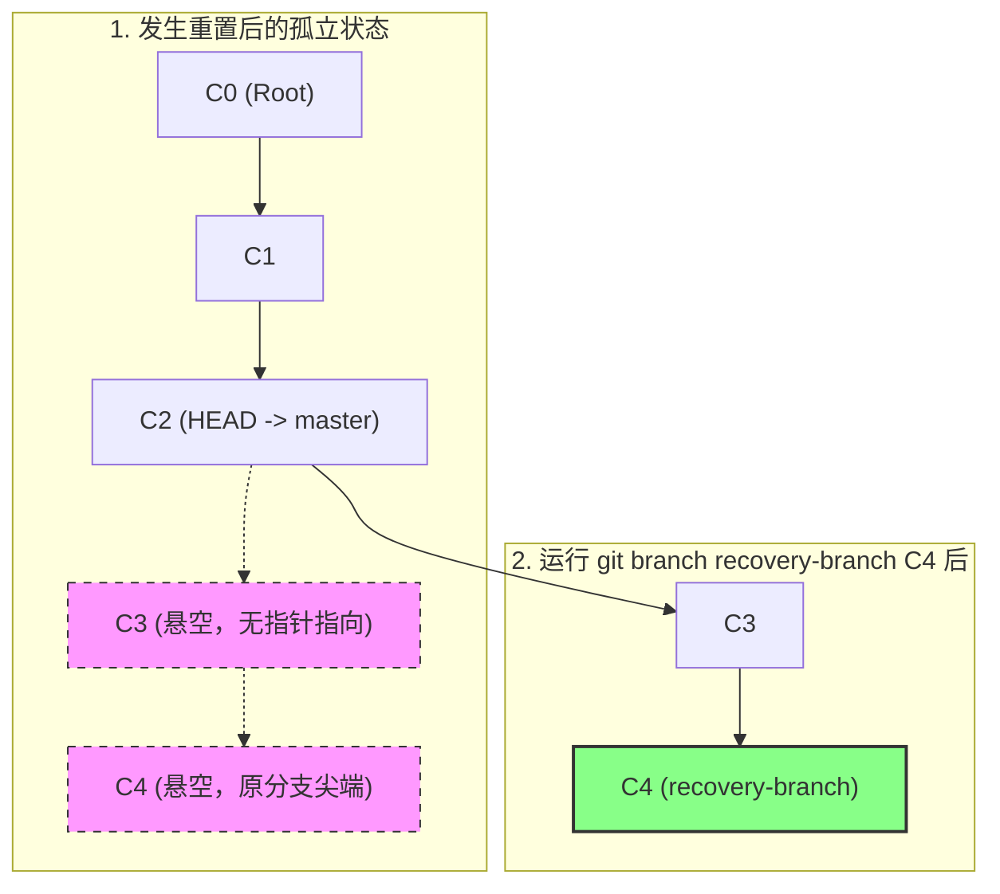

# 误操作恢复：找回丢失的提交与分支

在理解了 Reflog 的物理存储格式后，本章我们将切入实际应用场景，系统学习如何在遭遇灾难性误操作时进行数据抢救。

无论是执行了破坏性的重置（`git reset --hard`），还是强行删除了未合并的分支（`git branch -D`），只要了解 Git 的对象模型和引用日志，都可以将其完好无损地恢复。

---

## 恢复的核心理论：悬空对象与垃圾回收

当我们在 Git 中删除一个分支，或者执行 `reset --hard` 将分支指针往回移动时，原本位于指针前方的提交（Commits）在有向无环图（DAG）中就变成了**不可达（Unreachable）**状态。

- **不可达提交（Unreachable Commit）**：从当前任何分支、标签或远程引用出发，都无法通过父指针链追踪到的提交。
- **悬空对象（Dangling Object）**：不被任何其他对象（如树对象、提交对象）或任何外部引用（如分支、标签）所引用的对象。

**重要安全保障**：Git 并不会在提交变为空闲状态时立即物理删除它们。这些悬空对象会留在 `.git/objects/` 目录中，直到 Git 触发自动垃圾回收（Garbage Collection）并在保留期限过期后才会被真正清除。在垃圾回收发生前，Reflog 就是我们寻获这些悬空对象哈希值的唯一索引。

---

## 常用审计与检索命令

在抢救数据时，有三个核心管道命令是必须熟练掌握的：

### 1. `git reflog show`（或 `git reflog`）
这是最常用的第一步。它实际上是 `git log -g --abbrev-commit --pretty=oneline` 的别名。它能够列出当前 HEAD 指针的变迁历史：
```bash
# 查看本地 HEAD 历史记录
$ git reflog HEAD -n 15
```

### 2. `git log -g` (`--walk-reflogs`)
如果我们想要看更详细的提交元数据（如作者、提交日期、完整的提交注释），可以使用此命令。它会像遍历提交历史一样遍历本地的 Reflog：
```bash
# 以常规日志形式展示 Reflog 中的提交信息
$ git log -g --oneline
```

### 3. `git fsck` (File System Consistency Check)
如果某引用的日志已经丢失，但对象数据库中依然保留着该提交实体，我们可以直接使用 `git fsck` 工具扫描磁盘上的松散对象，找出所有的“悬空（Dangling）”节点：
```bash
# 扫描数据库，找出所有悬空的对象
$ git fsck --lost-found
```

---

## 灾难恢复实战演练

### 场景一：找回因 `git reset --hard` 丢失的本地提交

假设你在主分支 `master` 上开发，不小心执行了强力重置：
```bash
# 误操作：强行回滚 3 个提交，并清空暂存区与工作区
$ git reset --hard HEAD~3
HEAD is now at 8b4a2d1 feat: initialize project structure
```
你刚才辛苦写了半天并提交的 3 个 Commit 在常规 `git log` 中瞬间消失了。

#### 恢复步骤：

1. **查看 HEAD 的引用历史**：
   ```bash
   $ git reflog HEAD
   8b4a2d1 HEAD@{0}: reset: moving to HEAD~3
   f29dca4 HEAD@{1}: commit: fix: handle null pointer in network loop
   d4c1b92 HEAD@{2}: commit: feat: integrate task watermarks scheduler
   a1b8c22 HEAD@{3}: commit: feat: design hardware register layouts
   ```
   *解析：根据时序，`HEAD@{0}` 是你刚才执行重置的记录。而在重置之前，HEAD 指向的最新提交是 `HEAD@{1}`，其哈希值为 `f29dca4`。*

2. **验证丢失的提交内容**：
   在轻率重置之前，我们应先用 `git show` 确认哈希是否正确：
   ```bash
   $ git show f29dca4
   commit f29dca4b76e1a491e8432a11883bfd12cd4e0621
   Author: hengvvang <hengvvang@example.com>
   Date:   Sat May 30 19:40:00 2026 +0800

       fix: handle null pointer in network loop
   ...
   ```

3. **执行数据恢复**：
   有三种常见的恢复策略，具体取决于你的目的：

   **策略 A：将当前分支重置回丢失的提交（适合继续在此基础上开发）**：
   ```bash
   $ git reset --hard f29dca4
   HEAD is now at f29dca4 fix: handle null pointer in network loop
   ```

   **策略 B：在丢失的提交上新建临时分支（最安全，推荐）**：
   ```bash
   $ git branch recovery-branch f29dca4
   # 此时可以切换到新分支检查或与原分支进行 merge/rebase
   ```

   **策略 C：仅仅摘取特定的单个提交（Cherry-pick）**：
   ```bash
   $ git cherry-pick d4c1b92
   ```

---

### 场景二：找回被误删的分支

由于需求变更，你删除了一个本地分支：
```bash
$ git branch -D feature/leak-detector
Deleted branch feature/leak-detector (was 5e1a2f4).
```
随后你发现该分支上还有些未合并的代码在其他地方需要用到，而此时 `git log` 已经无法查找到该分支的信息。

#### 恢复步骤：

1. **通过 HEAD 历史查找分支指针的最后位置**：
   如果你之前在那个分支上工作过，HEAD 一定停留过。
   ```bash
   $ git reflog
   8b4a2d1 HEAD@{0}: checkout: moving from feature/leak-detector to master
   5e1a2f4 HEAD@{1}: commit: test: add stack overflow simulation cases
   ```
   *解析：`HEAD@{0}` 记录了你从 `feature/leak-detector` 切换回 `master`。而 `HEAD@{1}` 则说明在 `feature/leak-detector` 分支上进行的最后一次操作是提交了哈希为 `5e1a2f4` 的 Commit。*

2. **重建分支指针**：
   你只需要重新在此哈希上建立该分支即可：
   ```bash
   $ git branch feature/leak-detector 5e1a2f4
   ```
   分支指针重建后，不仅提交历史全部找回，且所有父节点构成的拓扑关系也恢复完整。

---

### 场景三：找回“未提交”但已暂存（git add）的代码

这是一个更为严苛的考验：**代码尚未执行 `git commit`，但执行过 `git add`**。随后执行了 `git reset --hard HEAD`。

*由于没有 Commit，这些操作根本不会记录在 `.git/logs/` 的 Reflog 中！这还能救吗？*

**答案是：可以！**
当文件被 `git add` 放入暂存区时，Git 会根据文件内容计算哈希并立即将其作为“松散对象”（Loose Object）写入磁盘上的 `.git/objects/` 中（即写入 Blob 对象）。虽然重置清空了暂存区索引，但磁盘上的物理 Blob 对象依然存在，它只是成了没有 Commit 或 Tree 指向的**悬空 Blob（Dangling Blob）**。

#### 恢复步骤：

1. **通过 `git fsck` 扫描悬空对象**：
   ```bash
   $ git fsck --lost-found
   Checking object directories: 100% (256/256), done.
   dangling blob 3c01a2f8b4d1c4e99f0e1c5f8b9d03c2718e38d4
   dangling commit 5e1a2f4b23c...
   ```

2. **查看悬空 Blob 的内容**：
   使用管道命令 `git cat-file -p` 打印内容，找出我们丢失的源码：
   ```bash
   $ git cat-file -p 3c01a2f8b4d1c4e99f0e1c5f8b9d03c2718e38d4
   #include <stdio.h>
   // 丢失的未提交代码：栈深度监控核心逻辑
   void monitor_stack_depth() {
       ...
   }
   ```

3. **还原文件**：
   重定向输出，重新拉回工作区：
   ```bash
   $ git cat-file -p 3c01a2f8b4d1c4e99f0e1c5f8b9d03c2718e38d4 > src/monitor.c
   ```

---

## 恢复过程的拓扑关系变化展示

下面这个 Mermaid 图直观展示了被 `reset` 后的悬空提交（Orphan Commit）是如何通过 Reflog 寻获哈希并以 `git branch` 重新接回主图谱的：



> [!CAUTION]
> **Reflog 绝非无所不能**：如果文件从未执行过 `git add`（也即从未进入过 Git 的暂存区/对象数据库），那么这些修改仅存在于操作系统的内存或磁盘未分配扇区中。在这种情况下，Git 对此无能为力，必须借助底层操作系统的文件恢复软件进行处理。因此，**频繁执行 `git add` 或临时 commit 是个极佳的防丢习惯。**
