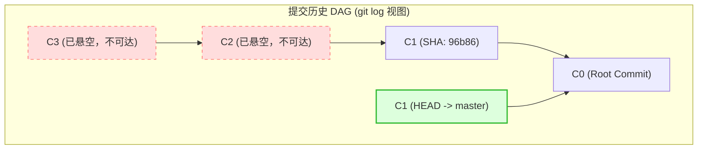
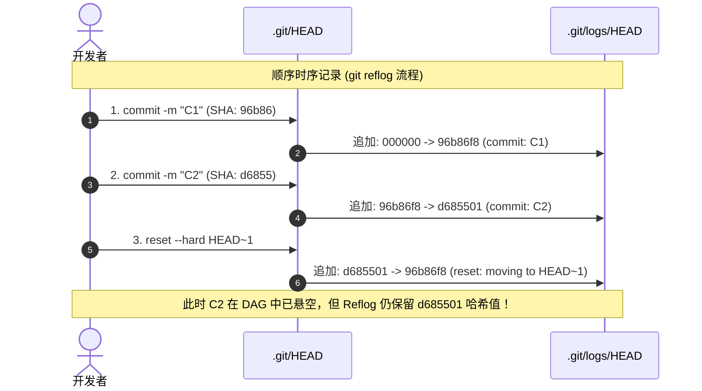

# 第一章：Git 引用指针机制与 Reflog 运行日志

要想彻底掌握 Git Reflog，我们必须撕开 Git 命令行包装的抽象层，深入到 `.git` 目录的物理存储结构中。Git 本质上是一个以内容寻址的键值数据库（Content-Addressable Key-Value Database），而引用（References）则是指向该数据库中提交对象（Commit Objects）的具名指针。

本章将详细解构 Git 引用与其对应日志（Reflog）的底层存储机制、物理协议以及事务更新与排他锁流程。

---

## 1.1 Git 引用（References）的本质与符号引用

在 Git 中，分支（Branches）和标签（Tags）在底层其实并没有什么神奇的。它们仅仅是存储在磁盘上的普通文本文件，内容是一个 40 字符的 SHA-1 哈希值（在启用 SHA-256 的现代仓库中为 64 字符），外加一个换行符。

### 引用文件的类型与存储

当我们查看 `.git/refs/` 结构时，通常会看到：
- **`.git/refs/heads/`**：包含本地分支指针文件。例如 `.git/refs/heads/master`，它表示本地 `master` 分支指向哪一次提交。
- **`.git/refs/tags/`**：包含标签指针文件。
- **`.git/refs/remotes/`**：包含远程跟踪分支指针文件（如 `origin/master`）。

### 符号引用（Symbolic Reference）

除了上述指向具体提交哈希的“普通引用”外，Git 还支持一种指向其他引用的引用，称为**符号引用（Symbolic Reference）**。最典型的例子就是 `.git/HEAD`：

```bash
# 查看 HEAD 文件的内容
$ cat .git/HEAD
ref: refs/heads/master
```

这表示当前 HEAD 指向本地的 `master` 分支，当我们在 `master` 分支上创建一个新提交时：
1. Git 读取 `.git/HEAD`，发现它指向 `refs/heads/master`；
2. Git 创建一个新的 Commit 对象；
3. Git 将该新 Commit 对象的哈希值写入 `.git/refs/heads/master` 文件中。

### 头指针游离状态（Detached HEAD）

当我们切到一个特定的提交哈希、远程分支或标签，而不是本地分支时，`.git/HEAD` 将进入**游离状态（Detached HEAD）**。此时，`.git/HEAD` 不再是符号引用，而是直接包含了具体的 Commit 哈希值：

```bash
# 切换到某个具体 Commit 后查看 HEAD
$ git checkout d68550183
Note: switching to 'd68550183'.
...
$ cat .git/HEAD
d6855018306dfef5b721867c858df3f24fae0a7e
```

在游离状态下所作的任何新提交都会生成新的 Commit 对象，但它们只被 `.git/HEAD` 直接引用。如果此时切换回其他分支，这些提交在有向无环图（DAG）中将立刻处于“不可达”状态，成为悬空 Commit。

---

## 1.2 Reflog 物理日志的文本协议与单行拆解

与 `.git/refs/` 目录平行，Git 在 `.git/logs/` 目录下维护着相对应的引用日志：
- **`.git/logs/HEAD`**：记录本地 `HEAD` 指针的每一次移动。它是整个仓库中最活跃的日志文件。
- **`.git/logs/refs/heads/<branch-name>`**：专门记录该特定分支指针的移动历史。

### 原始日志文件的单行数据格式

如果我们直接用 `cat` 查看 `.git/logs/HEAD`，会发现它是一个非常规范的**制表符与空格分隔的纯文本协议**。单行日志的字节布局如下所示：

```text
 40 字节 (旧哈希)     40 字节 (新哈希)     Committer 信息与时间戳               操作动作
┌──────────────────┐ ┌──────────────────┐ ┌───────────────────────────────────┐ ┌─────────────┐
96b86f8a84617...d92 d6855018306dfe...a7e hengvvang <hengvvang@example.com> 1779951600 +0800\tcommit: implement task monitoring watermarks
```

我们可以将这一行数据按照字节段和逻辑含义进行精细拆解：

1. **旧哈希（Old SHA-1 / SHA-256）**（40 或 64 字节）：本次操作前，该引用所指向的 Commit 哈希值。如果这是该引用的初始创建操作（如新建分支或首次提交），则此字段填充为全 `0`。
2. **空格**（1 字节）。
3. **新哈希（New SHA-1 / SHA-256）**（40 或 64 字节）：本次操作后，该引用所指向的目标 Commit 哈希值。
4. **空格**（1 字节）。
5. **提交者姓名（Committer Name）**：执行操作的人员名称（取自 `user.name` 配置）。
6. **空格 + 尖括号包围的邮箱（Committer Email）**：执行操作的人员电子邮箱，如 `<hengvvang@example.com>`。
7. **空格**（1 字节）。
8. **时间戳（Timestamp）**：Unix 时间戳（从 1970 年 1 月 1 日开始的秒数），例如 `1779951600`。
9. **空格**（1 字节）。
10. **时区（Timezone）**：时区偏差值，例如 `+0800` 代表东八区（北京时间）。
11. **制表符 `\t`**（1 字节）：它是操作动作与前部元数据的明确分界线。
12. **操作说明（Message）**：对本次指针移动原因的文本描述。例如：
    - `commit: ...`：通过 commit 命令生成了新提交。
    - `checkout: moving from master to dev`：执行了 `git checkout` 切换分支。
    - `reset: moving to HEAD~1`：执行了 `git reset` 重置。
    - `rebase (start): checkout origin/master`：开始进行变基操作。

---

## 1.3 引用更新的事务性与 `.lock` 排他锁机制

在多任务操作系统或团队协作工具中，可能会有多个进程（例如 IDE 的后台状态轮询、持续集成的本地钩子、或开发者的手动操作）并发读写本地仓库。为了防止并发写入导致引用文件或日志文件损坏，Git 实现了一套**引用更新事务与文件排他锁机制**。

### 事务执行步骤

以下是 Git 更新一个引用（例如将 `refs/heads/master` 更新为新提交 `C2`）时的底层物理步骤：

```text
               [并发写入/修改 master 引用]
                           │
                           ▼
             1. 创建锁文件 master.lock (排他)
          ┌──────────────────────────────────┐
          │ 检查 refs/heads/master.lock      │
          │ - 若已存在 -> 事务冲突，报错退出  │
          │ - 若不存在 -> 创建并锁定该文件  │
          └────────────────┬─────────────────┘
                           │ 成功
                           ▼
             2. 准备修改数据 (内存/临时区)
          ┌──────────────────────────────────┐
          │ - 将新 commit 哈希写入 lock 文件 │
          │ - 准备追加日志的临时缓冲区数据   │
          └────────────────┬─────────────────┘
                           │ 成功
                           ▼
             3. 物理重命名 (原子 Rename)
          ┌──────────────────────────────────┐
          │ 调用系统级原子 rename()：        │
          │ master.lock  ───>  master        │
          └────────────────┬─────────────────┘
                           │ 成功
                           ▼
             4. 写入引用日志 (Append Logs)
          ┌──────────────────────────────────┐
          │ 将缓冲数据追加写入对应日志：     │
          │ - .git/logs/refs/heads/master    │
          │ - .git/logs/HEAD                 │
          └──────────────────────────────────┘
```

1. **锁文件创建（Lock File Creation）**：
   当 Git 准备更新分支 `master` 时，首先会在同目录下创建一个名为 `refs/heads/master.lock` 的空文件。这是一个排他锁文件。如果该文件已存在，说明有另一个 Git 进程正在操作该分支，当前事务会立即中止并报错（例如：`Fatal: Unable to create '.../master.lock': File exists.`）。
2. **写入临时数据**：
   Git 将目标 Commit 哈希值写入 `master.lock` 文件。同时，Git 在内存或临时缓冲区中构建好即将写入 Reflog 的文本行。
3. **提交引用变更（Commit Reference）**：
   Git 使用操作系统级别的原子重命名系统调用（在 POSIX 系统上为 `rename()`，在 Windows 上为类似的安全原子文件覆盖 API），将 `master.lock` 重命名为 `master`。这保证了在修改分支指针时，分支文件要么完全是旧值，要么完全是新值，绝不会处于半写入的损坏状态。
4. **追加日志记录（Append Logs）**：
   当引用文件成功被原子覆盖后，Git 才会安全地将缓冲区的日志追加写入 `.git/logs/refs/heads/master` 以及公共的 `.git/logs/HEAD` 日志文件中。
5. **异常清理**：
   如果中途因磁盘空间不足或进程被杀导致更新中断，锁文件 `master.lock` 将被自动删除，回滚整个事务，以保证数据一致性。

---

## 1.4 用 Shell 脚本解析原始 Reflog

由于 Reflog 是纯文本格式，我们可以完全绕过 Git CLI 抽象，编写一个纯 Shell 与 Awk 的脚本直接读取并解析 `.git/logs/HEAD`，直观地还原其数据结构。

在项目的根目录下创建一个名为 `parse_raw_reflog.sh` 的脚本：

```bash
#!/usr/bin/env bash
# parse_raw_reflog.sh - 演示如何用纯 Shell/Awk 工具读取并解析 Git 底层 Reflog 文件
# 适用于本地审计与学习 Git 底层结构

set -euo pipefail

# 获取 Git 目录路径
GIT_DIR=$(git rev-parse --git-dir 2>/dev/null || echo ".git")
LOG_FILE="$GIT_DIR/logs/HEAD"

if [ ! -f "$LOG_FILE" ]; then
    echo "错误: 找不到本地引用日志文件 $LOG_FILE" >&2
    exit 1
fi

echo -e "行号\t旧哈希\t\t新哈希\t\t操作时间 (本地)\t\t操作说明"
echo -e "----------------------------------------------------------------------------------------------------"

# 使用 awk 逐行解析日志，利用制表符 (\t) 分割元数据与动作描述
awk -F'\t' '
{
    # $1 包含：old_sha, new_sha, author_name, author_email, timestamp, timezone
    # $2 包含：action message
    
    split($1, parts, " ")
    
    # 提取旧哈希与新哈希的前 7 位进行简写展示
    old_sha = substr(parts[1], 1, 7)
    new_sha = substr(parts[2], 1, 7)
    
    # 获取 Unix 时间戳（倒数第二个字段）
    timestamp = parts[length(parts)-1]
    
    # 动作描述部分在 $2
    action = $2
    
    # 调用系统 date 命令将时间戳转换为本地易读格式
    # 兼容 GNU date (Linux) 与 BSD date (macOS)
    cmd = "date -d @" timestamp " +\"%Y-%m-%d %H:%M:%S\" 2>/dev/null || date -r " timestamp " +\"%Y-%m-%d %H:%M:%S\""
    if ((cmd | getline date_str) <= 0) {
        date_str = "Unknown"
    }
    close(cmd)

    # 格式化输出
    printf "%02d\t%s\t->\t%s\t[%s]\t%s\n", NR, old_sha, new_sha, date_str, action
}' "$LOG_FILE" | tail -n 15
```

---

## 1.5 时序日志（Temporal Log）与拓扑图（Topological Graph）对比

理解 `git log` 与 `git reflog` 差异的最直观方式是通过对比它们在处理分支变迁和回滚操作时的拓扑结构和时序变化。

### 1. 提交历史的有向无环图 (git log)

`git log` 沿着 Commit 对象内部的 `parent` 指针（只读、只往回看）遍历整个拓扑图。对于 `git log` 来说，一旦主分支被 `reset`，之前的 C2 和 C3 提交就在逻辑上不可达了：



### 2. 物理指针移动时序 (git reflog)

而 `git reflog` 则是一个严格按照本地时间顺序递增的线性列表，记录了 HEAD 的每一次物理落脚点。即使某个提交在上面的 DAG 图中由于分支被 `reset` 而断开，Reflog 依然会保留它的物理记录：



通过这一底层的物理日志，即使我们在 DAG 拓扑中丢失了指向 `C2` 的所有通路，我们也可以顺藤摸瓜，通过 Reflog 日志中的 `d685501` 哈希值，直接将指针重新接回！下一部分我们将详细讨论如何实施这一恢复流程。
