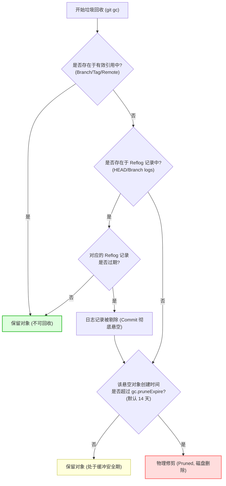

# 第三章：Git 垃圾回收 (GC) 与引用生命周期清理

随着本地开发的推进，每一次代码修改、分支切换、重置、变基都会不断向引用日志中追加新记录。如果不加节制地保留，`.git/logs/` 目录将无休止地膨胀。此外，那些已经“废弃”的提交对象因为被 Reflog 指向而无法被垃圾回收，导致本地对象数据库不断变大。

为了解决这一问题，Git 提供了一套自动与手动的 Reflog 过期与维护机制。本章将对这些机制的内部原理及配置参数进行全面剖析。

---

## 3.1 Git 垃圾回收（GC）与 Reflog 的保护伞机制

当我们执行 `git gc`（Garbage Collection）时，Git 会在后台执行一系列清理和优化工作：
1. **打包松散对象**：将大量独立的松散对象文件（Loose Objects）打包合并为单个包文件（Packfiles，带有 `.pack` 和 `.idx` 后缀），提高磁盘读写和网络传输性能。
2. **物理清除过期对象**：扫描并物理删除悬空且过期的历史数据。

### Reflog 的生命线保护作用

在 Git 的判定逻辑中，**一个对象能否被物理修剪（Prune）删除，完全取决于它是否被任何可达引用或 Reflog 日志记录所指向**。



即使某个提交在分支图谱（DAG）中由于被 reset 或分支删除而变成了不可达提交，只要 `.git/logs/` 目录下的任何日志文件（如 `logs/HEAD` 或已删分支的残留日志）中还包含这个提交的哈希值，Git 就会将其视为“受 Reflog 引用的对象”。

只有当该条 Reflog 日志记录由于过期被彻底清理，并且该悬空对象本身的寿命超过了修剪安全期（`gc.pruneExpire`）时，该对象才会被 `git gc` 真正从磁盘物理抹去。

---

## 3.2 核心配置参数详解

Git 允许我们通过配置项精细化定制可达和不可达引用日志的过期时间：

### 1. `gc.reflogExpire`
* **默认值**：`90 days`（90天）
* **适用对象**：**可达提交（Reachable Commits）**对应的日志记录。
* **含义**：如果一条日志记录中指向的 Commit，依然可以通过当前任意分支、标签或远程分支追溯到（即它仍在分支树上），该条 Reflog 日志记录将默认保留 90 天。

### 2. `gc.reflogExpireUnreachable`
* **默认值**：`30 days`（30天）
* **适用对象**：**不可达提交（Unreachable Commits）**对应的日志记录。
* **含义**：如果一条日志记录中指向的 Commit，已经在当前的分支树中不可达（例如执行 `reset --hard` 丢弃的旧提交，或被 `-D` 删除的分支），该条 Reflog 日志记录将被保留 30 天。这 30 天就是 Git 给开发者留出的“后悔药”缓冲期。

### 3. `gc.pruneExpire`
* **默认值**：`2 weeks`（14天）
* **适用对象**：未被任何引用（包括 Reflog）指向的悬空松散对象。
* **含义**：当垃圾回收运行时，对彻底失去一切引用的孤儿对象，如果其文件创建时间在 14 天以内，Git 依然会保留它以防万一；只有超过 14 天的对象才会被物理修剪。

### 4. `core.logAllRefUpdates`
* **默认值**：`true`（在非裸仓库中）
* **含义**：是否启用 Reflog 机制。如果设为 `false`，则不再生成和更新 `.git/logs/` 下的文件。通常在 CI/CD 机器或超大只读 Mono-repo 部署中，为了追求极致性能和节省磁盘 I/O，可能会将其关闭，但本地开发机绝不建议关闭。

### 更改保留期限示例

```bash
# 将当前仓库的“后悔缓冲期”(不可达 Reflog) 延长至 60 天
$ git config gc.reflogExpireUnreachable "60 days"

# 在全球配置中，将可达引用的日志保留期设为 180 天
$ git config --global gc.reflogExpire "180 days"
```

---

## 3.3 手动触发过期与清理命令

在某些紧急情况下（例如不小心在提交中包含了私钥、个人敏感数据，或者添加了数 GB 的测试大文件），你虽然用 `git reset --hard` 回滚了提交，但数据依然存在于悬空 Commit 中。此时，为了防止敏感数据泄漏或为了立即释放空间，必须手动触发 Reflog 过期并清理。

### `git reflog expire` 命令详解

```bash
git reflog expire [--expire=<time>] [--expire-unreachable=<time>] [--all | <refs>...]
```
* `--expire=<time>`：强制丢弃早于该时间的所有 Reflog 记录。
* `--expire-unreachable=<time>`：强制丢弃早于该时间的所有“不可达提交”对应的 Reflog 记录。
* `--all`：对本地所有引用的日志进行操作。
* `--dry-run` / `-n`：演练模式，仅输出会被删除的 Reflog 记录，而不做实际物理写入。

### 紧急物理净化实战（彻底擦除敏感/庞大历史）

若要将已经被 reset 的文件和提交立即从本地磁盘中物理擦除，必须按顺序执行以下命令：

```bash
# 1. 演练：查看哪些 Reflog 将会被清除
$ git reflog expire --expire=now --expire-unreachable=now --all --dry-run --verbose

# 2. 立即将所有的引用日志记录设为过期 (清空所有 reflog 历史)
$ git reflog expire --expire=now --expire-unreachable=now --all

# 3. 物理清空悬空对象数据库并即时修剪所有垃圾对象
# --prune=now 会绕过 14 天安全期，立即删除所有不可达对象
$ git gc --prune=now --aggressive
```

> [!CAUTION]
> **危险操作警告**：一旦运行了 `git reflog expire --expire=now --all` 加上 `git gc --prune=now`，所有未被当前有效分支/标签指向的提交和文件将被**永久且不可逆地物理删除**。在执行该操作前，请务必确认已经备份了所有必要的数据。

---

## 3.4 引用日志清理与审计维护脚本

以下是一个用于审计本地仓库中 Reflog 文件大小、并提供交互式安全清理机制的 Shell 脚本。

在项目根目录下创建 `reflog_audit_clean.sh`：

```bash
#!/usr/bin/env bash
# reflog_audit_clean.sh - 审计本地 Reflog 文件占用大小并进行安全/深度修剪
# 适用于本地项目维护与大文件清理后的深度净化

set -euo pipefail

GIT_DIR=$(git rev-parse --git-dir 2>/dev/null || echo ".git")
LOGS_DIR="$GIT_DIR/logs"

echo "=== 开始审计 Git Reflog 空间 ==="

if [ ! -d "$LOGS_DIR" ]; then
    echo "提示: 当前仓库未启用或无引用日志目录: $LOGS_DIR"
    exit 0
fi

# 1. 统计引用日志占用的物理空间
if [[ "$OSTYPE" == "msys" || "$OSTYPE" == "cygwin" ]]; then
    # Windows 环境兼容
    total_bytes=$(du -s "$LOGS_DIR" 2>/dev/null | cut -f1 || echo "未知")
    echo "引用日志物理大小: $total_bytes KB"
else
    # POSIX 环境
    total_bytes=$(du -sh "$LOGS_DIR" 2>/dev/null | cut -f1 || echo "未知")
    echo "引用日志物理大小: $total_bytes"
fi

# 2. 统计日志行数（以 HEAD 为例）
if [ -f "$LOGS_DIR/HEAD" ]; then
    head_lines=$(wc -l < "$LOGS_DIR/HEAD")
    echo "HEAD 日志当前记录数: $head_lines 条"
else
    echo "HEAD 日志文件尚不存在。"
fi

echo "--------------------------------------------------"
echo "请选择清理模式:"
echo "1) 安全修剪：仅清理 30 天以前的悬空（Unreachable）记录"
echo "2) 强力净化：立即物理擦除所有 Reflog 并彻底回收空间 [危险/不可逆]"
echo "3) 取消退出"
read -rp "输入选项 (1/2/3): " choice

case $choice in
    1)
        echo "正在执行安全清理..."
        # 仅将 30 天以前的不可达提交日志过期
        git reflog expire --expire-unreachable="30.days.ago" --all
        # 触发自动垃圾回收
        git gc --auto
        echo "安全清理完成。"
        ;;
    2)
        echo "警告：这将永久删除所有本地历史回滚点！"
        read -rp "确认要继续物理擦除吗？(y/N): " confirm
        if [[ "$confirm" =~ ^[Yy]$ ]]; then
            echo "正在物理擦除所有 Reflog 并强制回收空间..."
            # 立即过期所有日志记录
            git reflog expire --expire=now --expire-unreachable=now --all
            # 强制立即剪枝所有松散与打包的无用对象
            git gc --prune=now --aggressive
            echo "物理净化成功。"
        else
            echo "操作已取消。"
        fi
        ;;
    3|*)
        echo "操作已取消。"
        exit 0
        ;;
esac
```
