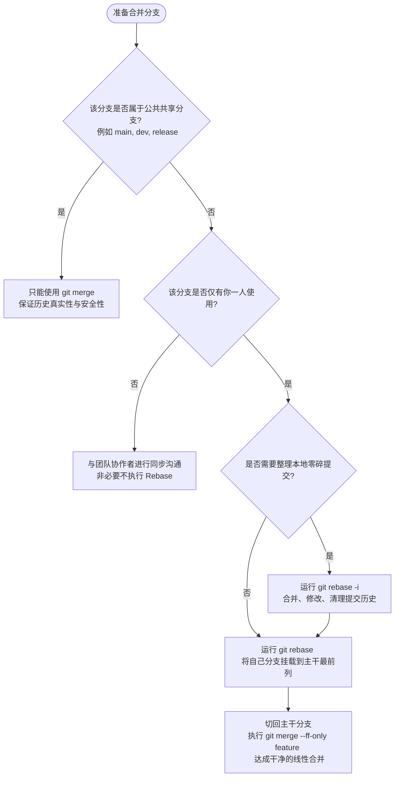

# 变基（Rebase）与合并（Merge）的深度抉择

在深入探索交互式变基（Interactive Rebase）的高级技巧之前，我们必须首先在理论与底层逻辑上，彻底厘清 Git 中两大核心分支合并机制：**合并（Merge）** 与 **变基（Rebase）**。

很多开发者对这两者的理解仅停留在“Merge 会产生一个合并提交，而 Rebase 不会”的表面现象。事实上，这两者代表了两种截然不同的版本控制哲学：一种致力于**完整保留历史的真实物理轨迹**，另一种则致力于**重新设计与优化历史的逻辑表述**。

---

## 1. Git 提交模型的本质：有向无环图 (DAG)

要理解 Merge 与 Rebase 的区别，首先需要理解 Git 存储历史的方式。Git 的底层并不是一个简单的“提交时间线”，而是一个由提交对象（Commit Object）组成的**有向无环图（Directed Acyclic Graph, DAG）**。

- **提交对象（Commit）**：每个 Commit 都包含指向其父提交（Parent Commit）的指针、项目快照（Tree）、作者与提交者信息以及提交信息。
- **分支（Branch）**：分支在 Git 中仅仅是一个**指向特定 Commit 的可变指针**（引用，Reference）。
- **HEAD**：一个特殊的指针，指向你当前工作的分支或提交。

---

## 2. 深入剖析 `git merge`

`git merge` 的核心语义是：**“将两个或多个分支的最新历史合并在一起。”**

根据分支拓扑结构的不同，Merge 主要分为两种类型：

### A. 快速向前合并（Fast-Forward Merge）
当被合并的分支（例如 `feature`）所指向的提交，是当前分支（例如 `main`）的直接后代时，Git 不需要执行任何三方合并算法。它只需要将当前分支的指针直接“向前移动”到被合并分支的位置。

```mermaid
graph LR
    subgraph 快速向前合并前 (Before Fast-Forward)
    C1((C1)) --> C2((C2))
    C2 --> C3((C3: main))
    C3 --> C4((C4))
    C4 --> C5((C5: feature))
    end
```

```mermaid
graph LR
    subgraph 快速向前合并后 (After Fast-Forward)
    C1((C1)) --> C2((C2))
    C2 --> C3((C3))
    C3 --> C4((C4))
    C4 --> C5((C5: main & feature))
    end
```

- **特点**：没有新的合并提交产生，历史完全是线性的。

### B. 三方合并（Three-Way Merge / Non-Fast-Forward）
当两个分支在分叉后各自都有新的提交时，Git 无法执行快速向前合并。此时，Git 会寻找这两个分支的**公共祖先（Common Ancestor）**，并对公共祖先、分支一的最新提交、分支二的最新提交这三方进行比对（这就是“三方合并”的由来）。

```mermaid
graph LR
    subgraph 三方合并前 (Before 3-Way Merge)
    C1((C1)) --> C2((C2: 公共祖先))
    C2 --> C3((C3))
    C3 --> C4((C4: main))
    C2 --> C5((C5))
    C5 --> C6((C6: feature))
    end
```

Git 会创建一个全新的提交（通常称为 **Merge Commit**），该提交拥有两个父指针，分别指向 `main` 的最新提交（C4）和 `feature` 的最新提交（C6）。它的内容是三方合并计算后的最终快照。

```mermaid
graph LR
    subgraph 三方合并后 (After 3-Way Merge)
    C1((C1)) --> C2((C2))
    C2 --> C3((C3))
    C3 --> C4((C4))
    C2 --> C5((C5))
    C5 --> C6((C6))
    C4 --> M7((M7: Merge Commit / main))
    C6 --> M7
    end
```

### Merge 的优势与劣势
*   **优势（Pros）**：
    *   **非破坏性**：它绝不会修改任何已有的提交，所有提交的 SHA-1 哈希值保持不变。
    *   **真实反映历史**：保留了分支存在的物理事实及合并发生的准确时间。
*   **劣势（Cons）**：
    *   **历史树混乱**：在频繁合并的多人协作项目中，网络拓扑图会演变成复杂的“地铁图”或“面条图”，难以追踪某个功能的演进。
    *   **合并垃圾**：产生大量无实际业务意义的 `Merge branch '...'` 提交，稀释了代码库的有效变更日志。

---

## 3. 深入剖析 `git rebase`

`git rebase` 的核心语义是：**“将当前分支上的修改，重新应用在另一个基底分支的顶端。”**

它的本质是**历史重写（History Rewriting）**。

### Rebase 的底层工作原理
假设我们有与上述相同的初始状态：`main` 分支在 C2 之后演进了 C3 和 C4，而 `feature` 分支演进了 C5 和 C6。

当我们切换到 `feature` 分支并执行 `git rebase main` 时，Git 会执行以下步骤：
1.  **确定差异范围**：找出当前分支（`feature`）与目标基底分支（`main`）的公共祖先（C2）。
2.  **临时保存提交**：提取公共祖先之后当前分支上的所有提交（C5 和 C6）的变更（Diff），并将它们保存为临时补丁（Patch）文件到 `.git/rebase-apply/` 目录中。
3.  **重置分支指针**：将当前分支（`feature`）的指针硬重置（`git reset --hard`）到目标基底分支（`main`，即 C4）所指向的提交。
4.  **逐个应用补丁**：将临时保存的补丁按顺序一一重新应用到新的基底（C4）上。每一次应用都会创建一个全新的提交（我们称之为 C5' 和 C6'）。
5.  **更新引用**：当所有补丁应用完毕且冲突解决后，将 `feature` 分支的 HEAD 指针指向最后一个新创建的提交（C6'）。

```mermaid
graph LR
    subgraph 变基之后 (After Rebase)
    C1((C1)) --> C2((C2))
    C2 --> C3((C3))
    C3 --> C4((C4: main))
    C4 --> C5_prime(("C5' (新哈希)"))
    C5_prime --> C6_prime(("C6' (新哈希): feature"))
    end
```

> [!IMPORTANT]
> **请注意：** 虽然 C5' 和 C6' 引入的代码修改与 C5 和 C6 几乎完全一致，但由于它们的**父指针（Parent Pointer）** 改变了，因此它们是全新的提交对象，拥有**完全不同的 SHA-1 哈希值**。原先的 C5 和 C6 提交在失去分支引用的指向后，会在不久的将来被 Git 的垃圾回收机制（GC）清理掉。

### Rebase 的优势与劣势
*   **优势（Pros）**：
    *   **极简的线性历史**：消除了无意义的 Merge Commit。整条历史主线是一条直线，代码评审极其直观，合并到主干后可以直接采用 Fast-Forward。
    *   **易于追溯与调试**：由于历史是线性的，使用 `git bisect` 进行二分法定位引入 Bug 的提交变得非常高效和准确。
*   **劣势（Cons）**：
    *   **隐藏了真实的合并时间线**：无法通过历史直接看出该分支是何时从主干拉出的，以及合并的确切时刻。
    *   **具有安全隐患**：如果对已推送共享的分支执行 Rebase，会导致严重的协作者冲突。

---

## 4. Rebase 与 Merge 对比矩阵

| 维度 | `git merge` | `git rebase` |
| :--- | :--- | :--- |
| **底层机理** | 寻找三方公共祖先，合并快照，创建新合并提交。 | 将本地分支的差异提交暂存，在目标顶端逐个重放，创建全新哈希值的提交。 |
| **对历史树的影响** | 非线性，保留分支分叉与合并交汇的拓扑图。 | 线性化，使整个提交历史呈现单线推进结构。 |
| **是否修改已有提交** | 否，只增不改，安全性高。 | 是，重写提交的父级关联，产生全新 Commit 哈希。 |
| **冲突解决时机** | 一次性解决。所有冲突在生成 Merge Commit 时集中处理。 | 逐步解决。在每个补丁应用时都可能触发冲突，需分步解决并推进。 |
| **主要适用场景** | 团队公共主干合并、保留完整发布痕迹、外部贡献者 PR 归并。 | 本地开发分支整理、同步上游最新主干变更、提交推送前的修剪。 |

---

## 5. 变基黄金法则 (The Golden Rule of Rebase)

如果只能记住关于 Rebase 的一条铁律，那就是：

> [!CAUTION]
> **不要在任何已经推送到公共共享仓库（如 GitHub、GitLab）的公共分支上执行 Rebase 变基！**

### 为什么不能？（灾难场景解析）
假设你和同事小张都在基于 `origin/main` 协作开发。
1.  你将本地分支 `feature-A` 推送到了远端。
2.  为了让历史好看，你在本地对 `feature-A` 执行了 `git rebase main`，这重写了该分支上所有提交的哈希值。
3.  你使用 `git push --force` 强行覆盖了远端的 `feature-A`。
4.  此时小张拉取（`git pull`）该分支。小张的本地 Git 会发现远端的分支历史与本地历史分叉了。为了合并这两者，Git 会尝试自动合并。
5.  结果是：小张的本地历史中，既包含了重写前的小张本地提交，又包含了你变基重写后的新提交。**完全相同的修改会以不同的哈希值在历史中双重出现**，并带来排山倒海般的合并冲突。

### 黄金法则的例外
仅在以下情况下，你可以对已推送的分支进行 Rebase/Force Push：
*   该分支**绝对只有你一个人在开发**（例如你私人的 Feature Branch），并且没有其他人会拉取它作为开发基底。
*   整个团队明确知晓该分支将被重置，并同意在重置后使用特定的同步命令。

### 灾难后的自救：`git pull --rebase`
如果你的同事在公共分支上执行了强制推送（Force Push），而你在本地基于旧历史做出了修改，请**不要**直接运行 `git pull`，因为这会引入一堆重复提交。你应该运行：

```bash
# 从远程拉取最新代码，并自动将你本地未推送的提交在远程新历史上进行变基重放
git pull --rebase origin <branch_name>
```
这会使你的本地提交在对方强推后的基底上进行 Rebase，从而避免冲突的二次扩大。

---

## 6. 生产环境下的分支演进决策树

为了在工程实践中最大化发挥两者的优势，推荐采用以下标准工作流：



通过这一决策逻辑，我们在个人的开发分支上，使用 `git rebase -i` 将杂乱的局部提交整理得清晰干净；在往主干分支合并时，又可以通过 `git merge --ff-only` 或者带 Squash 的合并，将整洁的变更集推入主分支，从而既维护了主分支历史的纯净，又确保了协作开发的绝对安全。
