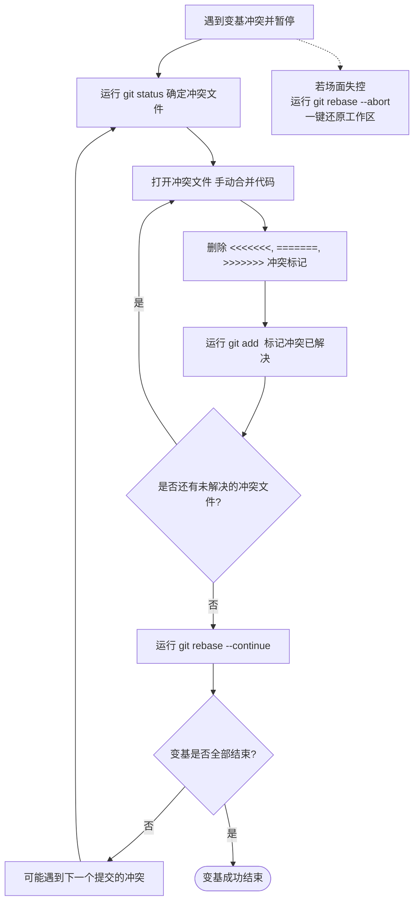

# 进阶变基技巧、冲突解决与安全恢复

在熟练掌握了交互式变基（Interactive Rebase）的基本指令后，本章将带领你进入更深层次的 Git 操作领域。我们将探讨如何拆分庞大的提交、如何在变基冲突中破局、如何使用三向变基指令（`--onto`）、如何配置自动变基（`--autosquash`）以及在操作失误时如何通过 `reflog` 进行无损灾难恢复。

---

## 1. 拆分提交 (Splitting Commits)

在开发过程中，我们经常会不小心把多个不相干的修改打包到了同一个提交中。这违反了**原子提交（Atomic Commits）**的规范（每个提交只干一件事，且能独立编译通过）。通过交互式变基的 `edit` 指令，我们可以轻松地将一个大提交拆分为多个逻辑清晰的小提交。

### 详细拆分步骤演练
假设你要拆分最近的第 2 次提交：

1.  **启动变基**：运行 `git rebase -i HEAD~3`。
2.  **设置动作为 `edit`**：在 Todo 列表中，将目标提交前的 `pick` 改为 `edit`（或简写 `e`），然后保存退出。
    ```text
    pick a1b2c3d 增加用户登录界面
    edit d4e5f6g 增加注册功能与密码找回功能  # 将此项改为 edit
    pick h7i8j9k 编写登录接口单元测试
    ```
3.  **变基暂停**：Git 运行到该提交并暂停，控制权返回给终端。
4.  **撤销该提交但保留修改**：运行以下命令，将 HEAD 指针往回退一步，但**保留**所有文件修改在工作区中（即混合重置）：
    ```bash
    # 撤销刚刚应用的 d4e5f6g 提交，其修改的所有文件均呈未暂存（unstaged）状态
    git reset HEAD^
    ```
5.  **分批次暂存并提交**：
    *   **步骤 A：创建“注册功能”提交**
        ```bash
        # 仅暂存与注册功能相关的文件或代码块（可以使用交互式暂存 -p）
        git add src/register.c src/register.h
        # 提交注册功能
        git commit -m "feat: 增加用户注册功能"
        ```
    *   **步骤 B：创建“密码找回功能”提交**
        ```bash
        # 暂存剩余的修改
        git add src/password_recovery.c
        # 提交密码找回功能
        git commit -m "feat: 增加密码找回及验证功能"
        ```
6.  **继续变基流程**：
    ```bash
    # 确认工作区已干净，通知 Git 继续后续的变基重放
    git rebase --continue
    ```

当变基全部结束后，原先的一个庞大提交 `d4e5f6g` 就被完美拆分为两个独立的原子提交了。

---

## 2. 冲突解决流程 (Conflict Resolution)

变基的本质是**在新的基底上重新应用补丁（Patch）**。由于基底代码已经发生了变化，补丁在应用时很容易因为代码冲突而导致变基挂起。

### ⚠️ 核心概念：变基冲突时的 HEAD 指向
在变基冲突发生时，很多开发者会感到困惑，分不清“我的代码”和“别人的代码”。
*   在冲突标记中，`<<<<<<< HEAD` 指向的是**当前的基底分支**（即你正在把修改往上挂的那个分支，例如主干 `main` 上的最新代码）。
*   而分界线下方 `>>>>>>> <commit_summary>` 指向的则是**你正在尝试重放的本地提交**（即你自己的 feature 分支代码）。
这与 `git merge` 的冲突方向刚好**相反**，请务必注意区分。

### 冲突排查与解决闭环
当变基由于冲突暂停时，终端会输出类似以下的警告：

```text
Auto-merging src/main.c
CONFLICT (content): Merge conflict in src/main.c
error: could not apply d4e5f6g... feat: add login logic
Resolve all conflicts manually, mark them as resolved with
"git add/rm <conflicted_files>", then run "git rebase --continue".
You can instead skip this commit: run "git rebase --skip".
To abort and get back to the state before "git rebase", run "git rebase --abort".
```

#### 规范化冲突处理流程：



> [!WARNING]
> 在解决冲突并使用 `git add` 暂存后，**绝对不要运行 `git commit`**。因为一旦你手动提交，就会在该基底上创建一个新的分叉，破坏变基的执行流。你应当且仅应当使用 `git rebase --continue` 让 Git 自己来完成后续的提交创建。

---

## 3. 跨越基底的变基：`git rebase --onto`

`git rebase --onto` 是 Git 中最强大的高级命令之一。它允许你将一个分支的一部分提交“嫁接”到另一个完全无关的基底上。

### 适用场景
假设我们有如下分支依赖关系：
*   你从 `main` 分支拉出了 `feature-A`。
*   随后，从小张的 `feature-A` 分支上，你拉出了自己的 `feature-B` 分支进行开发。
*   现在，`feature-A` 被废弃了，或者被直接合并到了 `main`，而你想把你的 `feature-B` 直接挂载到最新的 `main` 上，避开 `feature-A` 的历史。

```mermaid
graph TD
    subgraph 变基前 (Before --onto)
    C1((C1)) --> C2((C2: main))
    C2 --> C3((C3))
    C3 --> C4((C4: feature-A))
    C4 --> C5((C5))
    C5 --> C6((C6: feature-B))
    end
```

我们需要做的是：**将属于 `feature-B` 但不属于 `feature-A` 的那部分提交（即 C5, C6），移植到 `main` (C2) 的顶端。**

### 命令格式
```bash
# 格式：git rebase --onto <新基底> <旧基底/排除范围> <需要变基的分支>
git rebase --onto main feature-A feature-B
```

### 底层拓扑演变
执行命令后，Git 会计算出存在于 `feature-B` 且不存在于 `feature-A` 的提交集合（即 `feature-A..feature-B`，包含 C5 和 C6），然后将它们重放到 `main` (C2) 的顶端。

```mermaid
graph TD
    subgraph 变基后 (After --onto)
    C1((C1)) --> C2((C2: main))
    C2 --> C5_prime(("C5' (新哈希)"))
    C5_prime --> C6_prime(("C6' (新哈希): feature-B"))
    C2 --> C3((C3))
    C3 --> C4((C4: feature-A))
    end
```

原有的 `feature-B` 成功与 `feature-A` 脱钩，完美挂载到主干上。

---

## 4. 自动变基流 (Auto-squashing)

在本地高频迭代开发时，我们经常需要在稍后合并某个临时修改到早先的某个提交中。如果每次都通过手动 `git rebase -i` 并搜寻提交来修改动作，效率很低。Git 提供了 `autosquash` 机制来自动化这个过程。

### 步骤 A：生成特制标记的提交
当你在本地开发时，发现之前提交的 `a1b2c3d` 有个错别字需要修正。你修改完代码后，不要创建普通的 Commit，而是运行：

```bash
# 使用 --fixup 自动将新提交绑定到 a1b2c3d 上
git commit --fixup a1b2c3d
```

Git 会自动提取 `a1b2c3d` 的第一行日志，并创建一个日志名称为 `fixup! [a1b2c3d的提交日志]` 的新提交。

### 步骤 B：触发自动变基
当你准备整理历史推送时，运行：

```bash
# 启用 --autosquash 参数（针对 main 进行变基）
git rebase -i --autosquash main
```

此时，Git 在弹出的 Todo 列表中，会自动将那个 `fixup!` 提交移动到 `a1b2c3d` 的**正下方**，并将开头的动作自动从 `pick` 改为 `fixup`。

```text
pick a1b2c3d 增加用户登录界面
fixup 9e8d7c6 fixup! 增加用户登录界面  # 自动移动并设为 fixup!
pick d4e5f6g 修复拼写错误
```

你只需要直接保存退出，Git 就会自动完成合并，省去了手动上下移动和修改动作的繁琐步骤。

### ⚙️ 终极懒人配置
你可以修改全局 Git 配置，让 `rebase -i` 默认就开启 `autosquash` 功能：
```bash
git config --global rebase.autoSquash true
```

---

## 5. 灾难恢复 (Safety Recovery via Reflog)

很多开发者害怕 Rebase，主要是担心操作失误导致自己写好的代码“凭空消失”。
**请记住一条铁律：只要你的代码曾经被 `git commit` 过，它就绝对不会轻易丢失。**

因为 Git 拥有一个强大的本地操作日志系统 —— **Reflog**。

### 实战演练：挽救一次彻底失败的 Rebase
假设你在交互式变基时，不小心使用了 `drop` 丢弃了关键提交，或者在解决冲突时搞砸了，最后还错用了 `git rebase --continue` 完成了变基。此时你的分支历史已经被完全破坏。

#### 恢复步骤：

1.  **查看 HEAD 指针移动历史**：
    运行 `git reflog` 命令，你会看到类似下方的历史账本（从新到旧排列）：
    ```text
    8b2a3c1 HEAD@{0}: rebase (finish): returning to refs/heads/feature
    8b2a3c1 HEAD@{1}: rebase (pick): feat: add recovery logic
    f5d6c7b HEAD@{2}: rebase (pick): feat: add register logic
    c2d3e4f HEAD@{3}: rebase (start): checkout main
    a1c2e3f HEAD@{4}: commit: feat: critical work (被我不小心删掉的那个提交!)
    d4e5f6g HEAD@{5}: checkout: moving from main to feature
    ```
2.  **定位黄金切入点**：
    从日志中可以看出，`HEAD@{3}` 是执行 `rebase (start)` 的那一刻，而 `HEAD@{4}` 则是变基开始前，我们在 `feature` 分支上的最后一个完美状态。
3.  **时空回溯**：
    将分支 HEAD 强行重置回变基前的那个完美哈希值：
    ```bash
    # 绝对安全的重置，将当前分支指针、暂存区及工作区全部回滚到变基前
    git reset --hard a1c2e3f
    ```
4.  **确认恢复**：
    此时再次运行 `git log`，你会发现变基产生的垃圾历史全部消失，所有丢失的提交完好无损地回到了你的分支中！

---

## 6. 在变基过程中自动执行测试

为了确保你在 Rebase 过程中进行的任何 `squash`、`reword` 或 `edit` 操作没有破坏已有代码的功能，可以利用 `exec` 选项在每一步自动执行自动化构建或测试：

```bash
# 在重放每个提交后，都自动运行一次 make test。若某一步测试挂掉，变基立即暂停
git rebase -i main --exec "make test"
```

这对于维护高质量、高可靠性的提交历史而言，是生产环境下的最佳工程实践。

---

## 7. 保留合并提交的变基：`--rebase-merges`

在默认情况下，`git rebase` 会将所有的历史**扁平化（Flatten）**，丢弃所有的 Merge Commit。如果你在一个复杂的 Feature 分支中包含了多条并行的开发子支线，扁平化变基会破坏原有的开发脉络。

为了保留分支的拓扑结构，你可以在变基时加入 `--rebase-merges` 选项：

```bash
# 启动变基，且在 Todo 列表中生成 label, reset, merge 动作以重建分支图结构
git rebase -i --rebase-merges main
```

这会允许你在重整各个子支线提交的同时，依然保持整个功能分支内部完美的合并网络拓扑。
