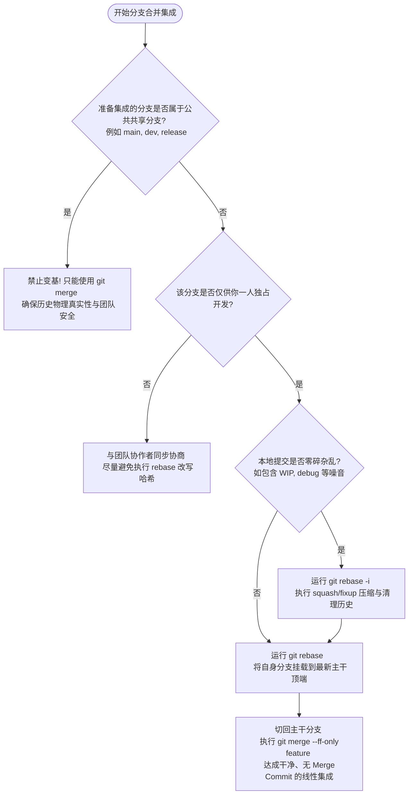

# 第一章：Git Merge 与 Rebase 底层原理及历史线对比

在分布式版本控制系统 Git 中，分支合并是协同开发的日常高频操作。然而，很多开发者仅停留在“`merge` 会产生一个合并提交，而 `rebase` 会使提交历史变成一条直线”的表象认知上。事实上，这两者在底层机制、图论结构、数据处理流程上有着本质的区别。

本章将从 Git 底层的数据模型（DAG）出发，深度解构 `git merge`（合并）与 `git rebase`（变基）的运行机理，通过直观的拓扑图与 ASCII 字符画展示历史线的演变，并探讨其在企业级工程实践中的深度抉择。

---

## 1. Git 提交模型的物理本质：有向无环图 (DAG)

要透彻理解分支集成的底层行为，必须首先拆解 Git 的存储模型。Git 本质上是一个**基于内容寻址的键值数据库**，其分支历史并不是一条简单的线性时间轴，而是一个由提交对象构成的**有向无环图（Directed Acyclic Graph, DAG）**。

### A. 核心概念组件
- **提交对象（Commit Object）**：每一个 Commit 都是一个不可变的节点。它包含了指向其父提交节点（Parent Commit）的哈希指针、项目根目录树对象（Tree）的哈希值、作者与提交者信息以及提交日志。
- **分支引用（Branch Ref）**：分支在 Git 中仅仅是一个**指向特定 Commit 的可变指针文件**。这些文件保存在 `.git/refs/heads/` 目录下，文件内容仅包含一个 40 字符的 SHA-1 哈希值。
- **HEAD 指针**：一个特殊的指针引用（通常保存在 `.git/HEAD` 文件中），指向当前正在工作的分支或特定提交。如果指向特定提交而非分支，则称为“游离 HEAD 状态（Detached HEAD）”。

### B. 初始状态拓扑（双分支分叉）
假设我们从 `main` 分支拉出了一个 `feature` 开发分支。在分叉点之后，`main` 分支演进了两个提交（C3, C4），而 `feature` 分支同样演进了两个提交（C5, C6）。其底层 DAG 的拓扑关系如下所示：

```text
      C3 --- C4 (main)
     /
C1 - C2 (分叉点 / 最近公共祖先)
     \
      C5 --- C6 (feature)
```

在上面的拓扑图中，箭头的物理方向实际上是从子提交指向父提交（例如 `C6 -> C5 -> C2`），但在逻辑演进上，我们通常习惯从左向右（从旧到新）来看待历史。

---

## 2. 深入剖析 `git merge`（合并）

`git merge` 的核心语义是：**“将两个或多个分支的最新变更合并在一起，创建一个新的统一状态。”**

根据两分支的物理拓扑结构，Git 会自动选择不同的合并策略：

### A. 快速向前合并（Fast-Forward Merge）
#### 1. 触发条件
当目标分支（如 `main`）自当前分支分叉以来没有任何新的提交时，即目标分支的指针是当前分支指针的直接上游祖先。

#### 2. 底层行为
Git 不需要执行任何三方合并算法，也不会创建新的合并提交。它只需将 `main` 的指针直接向前移动，指向 `feature` 的最新提交。

```text
[FF 合并前]
C1 --- C2 (main) --- C3 --- C4 (feature)

[FF 合并后 - 仅仅移动 main 指针]
C1 --- C2 --- C3 --- C4 (main, feature)
```

#### 3. 命令行操作与注释
```bash
# 切换到 main 分支
git checkout main

# 执行快速向前合并
git merge feature
# 终端输出类似：Updating c2...c4 \n Fast-forward
```

---

### B. 三方合并（Three-Way Merge / Non-Fast-Forward）
#### 1. 触发条件
当两个分支在分叉后各自演进出了新的提交（如前面的初始状态拓扑），Git 无法直接移动指针，必须执行三方合并。

#### 2. 底层行为步骤
1. **定位最近公共祖先（Merge Base）**：Git 会沿着分支的父指针回溯，利用图论算法（如 LCA，最低公共祖先算法）找到两者的最近公共祖先节点（C2）。
2. **计算差异（Diff）**：
   - 计算祖先节点 C2 与 `main` 最新提交 C4 之间的差异，记为 `Diff_A`。
   - 计算祖先节点 C2 与 `feature` 最新提交 C6 之间的差异，记为 `Diff_B`。
3. **合并差异与冲突检测**：Git 尝试将 `Diff_A` 和 `Diff_B` 应用在 C2 的快照上。如果两份 Diff 修改了同一个文件的相同行且内容不同，则会标记冲突，暂停合并。
4. **创建合并提交（Merge Commit）**：如果没有冲突（或冲突解决后），Git 会在工作区和暂存区生成合并后的最终快照，并自动创建一个全新的提交。这个提交非常特殊，**它拥有两个父级指针**：第一个父指针指向 C4，第二个父指针指向 C6。

```text
[三方合并拓扑图]

      C3 ------ C4
     /            \
C1 - C2            M7 (Merge Commit: main)
     \            /
      C5 ------ C6 (feature)
```

#### 3. 命令行操作与注释
```bash
# 切换到 main 分支
git checkout main

# 执行三方合并，强制不使用 Fast-Forward 即使满足条件（以便保留分支节点）
git merge --no-ff feature -m "Merge branch 'feature' into main"
```

---

### C. Merge 的工程优劣势分析
- **优势（Pros）**：
  - **历史真实性**：绝对真实地保留了所有提交发生的时间戳和分支物理拓扑结构，不会修改任何已有提交的哈希值（只增不改）。
  - **安全性**：由于不重写历史，在协作开发分支上执行 `merge` 是极其安全的，不会对协作者的本地库造成冲突。
- **劣势（Cons）**：
  - **网络图混乱**：在多人频繁集成的复杂项目中，Git 历史树会演变成错综复杂的“地铁图”或“面条图”，难以清晰追踪某个功能特性的线性演进脉络。
  - **日志污染**：存在大量类似于 `Merge branch '...' of ...` 的无实际业务含义的合并提交，稀释了关键功能提交的能见度。

---

## 3. 深入剖析 `git rebase`（变基）

`git rebase` 的核心语义是：**“将当前分支上的修改，重新应用在目标分支（基底）的顶端。”** 它的物理本质是**历史重写（History Rewriting）**。

### A. Rebase 的底层工作原理与细节步骤
假设我们仍处于分叉状态（`main` 指向 C4，`feature` 指向 C6），我们在 `feature` 分支上执行 `git rebase main`：

```text
      C3 --- C4 (main)
     /
C1 - C2
     \
      C5 --- C6 (feature)
```

Git 在底层会严格执行以下五个步骤：

#### 1. 确定差异范围
Git 回溯找到 `feature` 和 `main` 的最近公共祖先 C2。Git 会锁定存在于 `feature` 分支但不存在于 `main` 分支的提交集合，即 `C2..feature`，也就是提交 C5 和 C6。

#### 2. 导出并暂存补丁
Git 将 C5 和 C6 两个提交包含的修改（Diff）导出为临时补丁（Patch）文件，并将其有序保存在本地 `.git/rebase-apply/`（或 `.git/rebase-merge/`）目录下，同时临时记录这些提交的原始元数据。

#### 3. 强行重置当前分支（硬回滚）
Git 将 `feature` 分支的指针强制重置（等价于 `git reset --hard`）到目标分支 `main` 最新的提交 C4 上。此时，原本的 C5 和 C6 提交在分支树上“悬空”，失去直接引用。

```text
[重置后的临时状态]
C1 --- C2 --- C3 --- C4 (main, feature HEAD)
```

#### 4. 逐个重放补丁（创建全新 Commit）
- Git 读取 C5 对应的补丁，尝试将其应用到 C4 的代码快照上。若无冲突，则生成一个新的提交 **C5'**。**C5'** 的父指针指向 C4。
- Git 接着读取 C6 对应的补丁，尝试将其应用到 **C5'** 的代码快照上。若无冲突，则生成另一个新的提交 **C6'**。**C6'** 的父指针指向 **C5'**。

```text
[重放过程中的拓扑演变]
                       C5' --- C6' (feature HEAD)
                      /
C1 --- C2 --- C3 --- C4 (main)
```

#### 5. 更新引用
当所有临时补丁重放完毕后，Git 将 `feature` 分支指针最终指向 **C6'**，并清理临时存储目录。变基流程完美结束。

> [!IMPORTANT]
> **请务必注意：** 尽管 C5' 和 C6' 包含的代码变更与原先的 C5 和 C6 几乎完全一致，但由于它们的**父级指针改变了**（C5 的父指针是 C2，而 C5' 的父指针是 C4），所以它们的 SHA-1 哈希值已经发生了翻天覆地的变化。原先的 C5 和 C6 提交成为了无引用的“垃圾数据”，将在不久后被 Git 的 `git gc`（垃圾回收器）彻底清理。

---

### B. Rebase 的工程优劣势分析
- **优势（Pros）**：
  - **极简的线性历史**：消除了无意义的 Merge Commit。整条历史主线是一条直线，非常便于进行代码评审（Code Review）和持续集成构建。
  - **高效定位 Bug**：由于提交历史呈现单线推进，开发人员可以非常高效地利用 `git bisect`（二分查找）快速定位引入 Bug 的源头提交。
- **劣势（Cons）**：
  - **改写历史的代价**：会修改提交的 SHA-1 值。如果在不正确的时机（如公共分支）使用，会导致灾难性的协作冲突。
  - **丧失真实开发痕迹**：无法得知某个功能分支具体是在历史的哪一个物理时刻拉出及被并入主干的。

---

## 4. Rebase 与 Merge 对比矩阵

| 比较维度 | `git merge` | `git rebase` |
| :--- | :--- | :--- |
| **底层核心机理** | 寻找三方公共祖先，合并三方差异，创建双父指针的合并提交（Merge Commit）。 | 将当前分支特有提交导出为补丁，移动当前分支指针到新基底，依次重放补丁创建全新哈希的提交。 |
| **拓扑结构变化** | 非线性拓扑结构，完整保留分叉、合并交汇的网络图（DAG）。 | 线性化，将分叉的分支挪动到基底顶端，使提交历史呈现单线推进结构。 |
| **是否改写已有哈希** | 否，只增不改，安全性高。 | 是，重写被变基提交的父级关联，产生全新的 SHA-1 提交对象。 |
| **冲突解决时机与方式** | **一次性解决**。所有文件的冲突全部在最终生成 Merge Commit 时集中处理。 | **分步解决**。在每个补丁重放应用时都可能触发冲突，必须分步解决冲突并推进（`--continue`）。 |
| **适用场景定义** | 1. 团队公共主分支（如 `main`, `release`, `dev`）之间的集成。<br>2. 需要保留完整物理合并痕迹的场合。 | 1. 本地私有开发分支推送前的整理与修剪。<br>2. 保持主干分支的线性整洁，便于代码 Review。 |

---

## 5. 变基黄金法则 (The Golden Rule of Rebase)

如果只能记住关于 Rebase 的一条铁律，那就是：

> [!CAUTION]
> **不要在任何已经推送到公共共享仓库（如 GitHub、GitLab）的公共分支上执行 Rebase 变基！**

### A. 灾难场景图解
假设你与同事小张都在基于远程主分支 `origin/main` 协作开发。

1. 你本地拉出分支 `feature-A`，并开发了提交 C5, C6，接着你将其推送（Push）到了远端共享仓库。
2. 同事小张在你推送后，拉取了该分支到其本地，并基于 C6 开始开发他的新提交 C7。
3. 此时，为了整理历史，你在本地对 `feature-A` 执行了 `git rebase main`，将提交重写为 C5' 和 C6'，随后使用 `git push --force` 强行覆盖了远端的 `feature-A`。

远程仓库与小张本地的拓扑关系将陷入巨大冲突：

```text
[远端分支 feature-A 状态]
C1 --- C2 --- C3 --- C4 (main) --- C5' --- C6' (被你强推后的历史)

[小张本地 feature-A 状态]
C1 --- C2 --- C5 --- C6 (旧分支顶端) --- C7 (小张的新工作)
```

4. 当小张执行 `git pull` 同步时，Git 会试图合并这两份分叉的历史。结果是：小张的本地历史中，既包含了你变基前产生的旧提交（C5, C6），又包含了你强推到远端的新提交（C5', C6'）。**完全相同的代码修改，会以两组不同的哈希值在历史中重复出现**，并伴随海量的、无法自动处理的合并冲突。

### B. 黄金法则的例外情况
仅在以下场景下，你可以对已推送的分支执行 Rebase 并进行强推（`force push`）：
- 该分支**绝对只有你一个人在使用**（例如你个人的临时开发特性分支），没有任何其他人拉取过它并以此为基底进行后续的提交。
- 整个团队对此有明确的规范约定，且通过了相关的代码合入审批机制。

### C. 灾难发生时的挽救：`git pull --rebase`
如果你发现你的同事在公共分支上进行了强推，而你的本地代码基底已过时，此时切忌使用普通的 `git pull`。你应当使用变基式拉取：

```bash
# 从远程拉取最新代码，并自动将你本地尚未推送的提交，放在远程强推后的新历史上进行变基重放
git pull --rebase origin feature-A
```

这会避免把远程重写前后的提交重复引入本地，从而在最大程度上降低冲突范围。

---

## 6. 企业级开发的分支演进决策模型

为了在工程实践中完美兼顾历史的真实性与线性的整洁度，团队可以遵循以下的分支集成决策模型：



通过这套决策流，我们在各自的独立特性分支上，利用交互式变基将杂乱的局部提交整理得清晰干净；而在向公共主干合入时，则通过快速向前（Fast-Forward）合并或受控合并，向团队主线输出清晰、高逻辑连贯性的历史，这才是工业界规范的 Git 操作范式。
