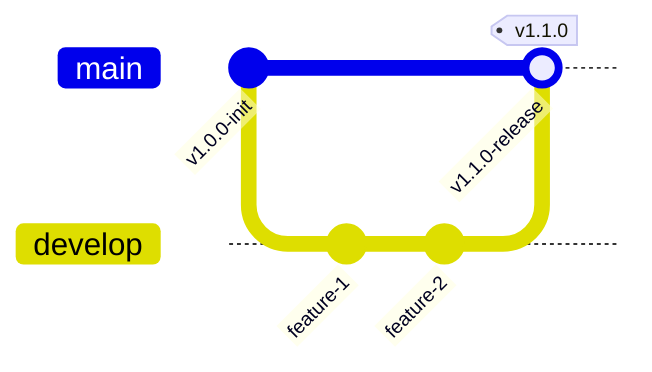
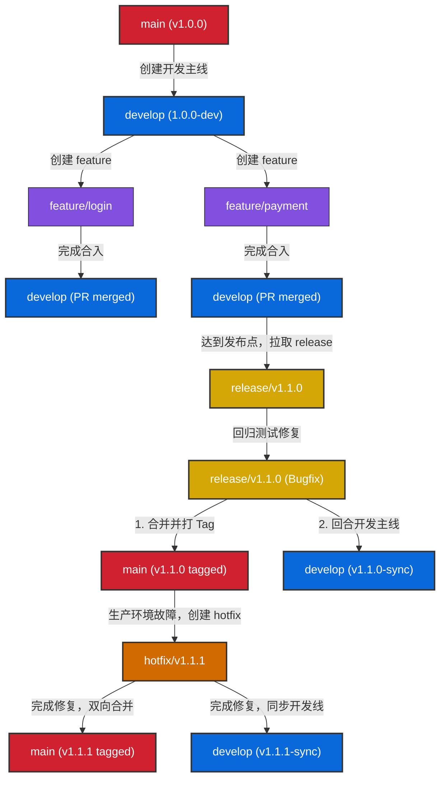

# 分支角色与长期分支拓扑

Git Flow 模型成功的基础在于对分支职责的严密划分以及拓扑关系的严格定义。在 Git Flow 的规范下，分支被明确划分为两类：**长期存在的核心分支（Long-lived Branches）**和**临时辅助分支（Transient Branches）**。本章将详细剖析它们的角色定义、拓扑关系、命名规范以及安全准入机制。

---

## 1. 双核心长期分支体系

长期分支在整个项目的生命周期中永远存在，不可被删除，代表了项目的两个核心状态：**绝对稳定的生产发布状态**与**持续集成的最新开发状态**。

### 1.1 `main` 分支（生产发布分支）
`main` 分支（在老旧项目中可能被命名为 `master`）是生产环境代码的终极化身。它具有最高的稳定要求和最严苛的访问权限。

* **准入原则**：严禁任何开发者直接向 `main` 分支提交（commit）或推送（push）代码。所有进入 `main` 的代码必须通过 Pull Request / Merge Request (PR/MR) 合并，且必须经过自动化的 CI 验证与团队评审。
* **状态要求**：`main` 分支上的任意一个提交都必须处于**随时可生产部署**的状态。
* **版本标记**：每一次对 `main` 分支的合并（通常来自 `release/*` 或 `hotfix/*` 分支），都必须打上清晰的语义化版本号标签（Git Tag），用以精确追踪线上部署的历史节点。

### 1.2 `develop` 分支（日常集成分支）
`develop` 分支是所有开发活动的核心集成点。它代表了团队为了下一个版本发布所做出的最新努力。

* **准入原则**：虽然作为开发集成分支，但一般情况下也建议禁止直接推送，而是通过 `feature/*` 分支提 PR/MR 合并进来。
* **状态要求**：`develop` 上的代码通常包含已经完成并通过单元测试的特性，但可能尚未经过完整的系统集成测试和 QA 验收。因此，它是“准稳定”的，不能直接部署到生产环境，但会持续部署到开发（Dev）或集成测试（INT/Alpha）环境。
* **承上启下**：它是所有 `feature/*` 分支的起点与终点，也是 `release/*` 分支的源头。

---

## 2. 三大短期/辅助分支生命周期

为了保证日常开发不被测试准备和线上紧急修复所干扰，Git Flow 引入了三种具有明确生命周期的临时辅助分支。一旦其使命完成，这些分支通常会被安全地删除。

### 2.1 `feature/*`（特性开发分支）
用于开发某个特定的新功能或进行代码重构。

* **起点**：必须拉取自 `develop` 分支。
* **终点**：开发并自测完成后，合并回 `develop` 分支。
* **隔离性**：`feature/*` 分支只存在于开发者的本地仓库，或者团队内部的协作仓库中，绝不与 `main` 分支发生直接交互。
* **多特性并行**：不同开发者或小组可在各自的 `feature/*` 分支上并行独立开发，互不干扰。

### 2.2 `release/*`（预发布测试分支）
当 `develop` 分支已经集成了当前发布周期内的所有预定功能，且通过了初步验证，便到了创建 `release/*` 分支的时刻。该分支专门用于发布前的准备工作。

* **起点**：拉取自 `develop` 分支。
* **终点**：测试通过并准备好发布时，**双向合并**到 `main` 分支和 `develop` 分支。
* **职能限制**：在此分支上，只能进行**缺陷修复（Bug Fixes）**、**文档修改（Docs Changes）**以及**元数据配置（如版本号更新）**。绝对禁止在此分支上合并新的 Feature 级别代码。
* **价值所在**：这种设计使得测试团队可以对即将发布的版本进行最后的加固测试，而开发团队可以立即在 `develop` 分支上开始下一个版本的 `feature/*` 开发，实现研发与测试的流水线并行。

### 2.3 `hotfix/*`（紧急热修复分支）
当生产环境（即 `main` 分支的代码）出现必须立即解决的严重 Bug，而当前的 `develop` 分支又堆积了大量未测试通过的下一代功能时，`hotfix/*` 是唯一的安全通道。

* **起点**：必须拉取自 `main` 分支上对应发生问题的 Tag 节点。
* **终点**：修复完成并验证后，同样进行**双向合并**，同时合入 `main` 和 `develop` 分支。
* **特殊情况**：如果在紧急修复时，当前已经存在一个活跃的 `release/*` 分支，那么 `hotfix` 应该合入 `main` 和该 `release/*` 分支（因为该 `release/*` 分支最终也会被合入 `develop`），从而避免当前尚未发布的内容受到污染，同时确保修复能够带入下一代产品中。

---

## 3. Git Flow 拓扑架构图解

以下展示了 Git Flow 典型的分支生命周期与合并路径：

---

## 4. 严格的分支命名与准入规范

在企业级落地中，如果没有命名和准入的约束，Git Flow 将会退化成一团乱麻。

### 4.1 命名约定

| 分支类型 | 推荐命名格式 | 示例 | 作用域与存储建议 |
| :--- | :--- | :--- | :--- |
| **生产分支** | `main` 或 `master` | `main` | 远程共享，受保护（Protected） |
| **开发分支** | `develop` | `develop` | 远程共享，受保护（Protected） |
| **特性分支** | `feature/<Issue-ID>-<short-description>` | `feature/JIRA-101-oauth2-login` | 本地为主，提 PR 时推送至远程 |
| **发布分支** | `release/v<Major>.<Minor>.<Patch>` | `release/v1.1.0` | 远程共享，QA 团队的核心测试分支 |
| **热修复分支** | `hotfix/v<Major>.<Minor>.<Patch>` | `hotfix/v1.1.1` | 临时远程共享，验证后立即删除 |

### 4.2 语义化版本 (SemVer) 严格联动
Git Flow 的 `release/*` 和 `hotfix/*` 命名必须严格遵循 **语义化版本规范 (Semantic Versioning)**：
* **主版本号 (Major)**：当你做了不兼容的 API 修改时。
* **次版本号 (Minor)**：当你做了向下兼容的功能性新增时（对应 `release/*`）。
* **修订号 (Patch)**：当你做了向下兼容的问题修正时（对应 `hotfix/*`）。

### 4.3 核心分支权限保护与质量门禁
为了防止人为误操作，研发管理者应在 GitLab/GitHub/Gitee 等平台上对 `main` 和 `develop` 设置如下策略：
1. **禁止 Force Push（强制推送）**：确保历史 commit 链条的绝对完整与不可逆。
2. **强制 Code Review**：至少需要 1~2 名资深开发人员的 Approve 才能进行分支合入。
3. **强制 CI 门禁**：合并请求的触发条件必须包括静态扫描（SonarQube）无严重警告、所有单元测试 100% 通过、代码覆盖率达到预设阈值（例如 80%）。
