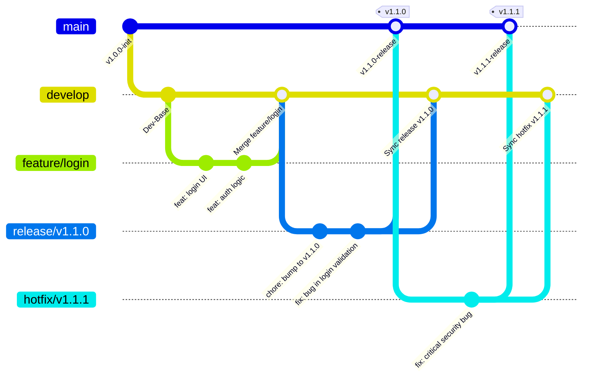

# Git Flow 分支管理模型实践

在现代软件工程中，源代码管理不仅是保存历史记录的工具，更是团队协作、版本发布和质量控制的核心基石。随着团队规模的扩大和发布周期的演进，缺乏规范的分支管理会导致合并冲突频发、发布版本混乱以及线上故障定位困难等痛点。

由 Vincent Driessen 于 2010 年提出的 **Git Flow** 模型，是一套经典、规范且被广泛采用的分支管理工作流。它通过引入清晰的分支角色定义和严格的变更生命周期，为软件研发团队提供了一种高度可预测、面向发布（Release-Oriented）的协作框架。

---

## 核心设计哲学

Git Flow 的核心设计哲学可以概括为以下三点：

1. **职责分离（Separation of Concerns）**：将“日常开发”、“预发布测试”与“生产发布”环境在物理分支上进行严格隔离。这种隔离避免了正在开发中的、尚不稳定的特性代码直接影响到线上的稳定运行版本，也保障了集成测试环境的纯净性。
2. **发布驱动（Release-Driven）**：所有的开发活动最终都服务于一个明确的版本发布周期。通过拉取专用的发布分支（Release Branches），测试团队可以在不阻塞日常开发的前提下，进行发布前的集成测试、元数据配置与缺陷修复。此时，开发团队可以在开发分支上无缝开启下一阶段的功能开发。
3. **紧急修复通道（Hotfix Track）**：建立独立于正常开发流的紧急修复机制。当线上发生严重故障时，可以通过快捷的热修复分支（Hotfix Branches）绕过漫长的日常开发测试周期，在最短时间内将安全补丁部署上线，同时通过规范的双向合并机制，确保修复方案完美同步至所有的开发分支中。

---

## Git Flow 高级拓扑概览

以下是 Git Flow 分支管理模型的经典演进拓扑图。它清晰地展现了主干分支、集成分支、特性开发、发布冷冻和紧急热修复的流转方向：

---

## 本书阅读指南

本书旨在为中大型研发团队提供一份**生产级、实战化**的 Git Flow 落地指南。我们将从底层的分支拓扑结构出发，深入到具体的生命周期操作命令，最后探讨团队协作与自动化工具链的整合。

本书结构分为以下两个核心部分：

### [第一部分：Git Flow 分支模型与角色定义](branches/README.md)
* **[第一章：主干、开发、特性与修补分支角色定义与命名规范](branches/branch-roles.md)**
  详细解析 `main` 与 `develop` 双长期分支的设计意图、准入条件，以及 `feature/*`、`release/*`、`hotfix/*` 等临时分支的拓扑演进和命名规范。

### [第二部分：发布生命周期与协同实践](lifecycle/README.md)
* **[第二章：发布与热修复 (Hotfix) 生命周期流程控制](lifecycle/gitflow-release-lifecycle.md)**
  以实战演练的方式，还原功能开发、版本发布、紧急修复三大典型场景的完整生命周期，提供详尽的 Git 原生命令行操作及合并拓扑图解。
* **[第三章：多人并行开发冲突规避与命令行工具实践](lifecycle/collaboration-and-tooling.md)**
  探讨在实际工程中如何将 Git Flow 与 Pull Request (PR) / Merge Request (MR) 流程结合，如何配置 CI/CD 流水线进行自动化分支校验与构建，以及如何运用辅助工具（如 `git-flow` 插件）提升开发效率。

---

## 学习目标

完成本书的学习后，您将能够：

* **深刻理解** Git Flow 的拓扑结构及每个分支的生命周期与职责边界。
* **熟练掌握** 使用原生 Git 命令或 `git-flow` 命令行工具管理完整的发布与修复周期。
* **设计并落地** 符合企业级规范的 Pull Request 准入机制与 CI/CD 自动化校验流水线。
* **具备在复杂多分支合并冲突**、发布倒退等极端场景下的容灾与解决能力。
* **制定科学的命名与版本规范**，让团队代码提交历史具有极高的可读性与可回溯性。
