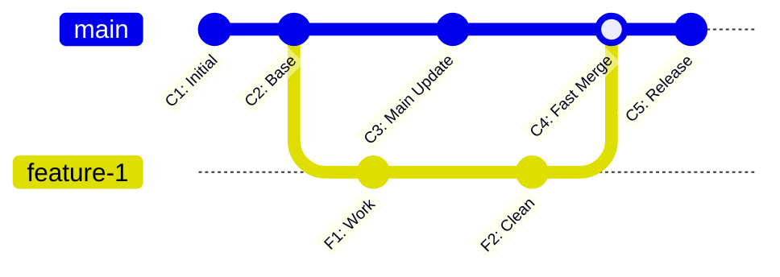
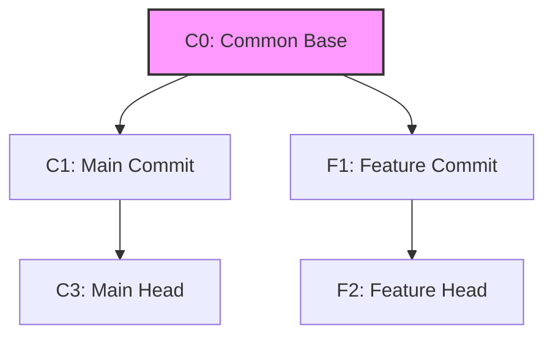

# 01 Trunk-Based Development 核心原则与分叉代价

在团队协作开发软件时，版本控制流的选择直接决定了团队的集成效率与交付周期。本章将深入探讨主干开发（Trunk-Based Development, TBD）的核心原则，将其与 Git Flow、GitHub Flow 等经典工作流进行对比，并从热力学与 Git 底层机制的角度，量化分析“分叉”所带来的技术债务与认知负载。

---

## 1. 什么是主干开发 (TBD)？

主干开发（Trunk-Based Development）是一种版本控制管理实践。在这种模式下，所有开发人员共同向同一个被称为“主干”（通常是 `main` 或 `master`）的单一分支提交代码。



### TBD 的核心约束与原则：
1. **短生命周期分支**：如果必须创建开发分支，其生命周期也应当以“小时”为单位计量，最长不应超过 24-48 小时。通常在一天内就会被合并回主干。
2. **高频集成**：开发人员每天至少一次（建议多次）将本地修改推送到主干。这意味着“集成”动作变成了日常的微观行为，而非阶段性的宏观任务。
3. **主干随时可发布**：主干分支上的任何一个提交，都必须随时可以通过自动化流水线安全地部署到生产环境。一旦主干构建被破坏（例如编译失败或测试挂掉），团队的最高优先级是“修复主干（Fix the Build）”。
4. **自动化测试护航**：每一次向主干的推送或合并，都会触发自动化构建和全量/增量单元测试与集成测试，绝不允许未经测试的代码污染主干。

---

## 2. 工作流对比：Git Flow vs. GitHub Flow vs. TBD

理解主干开发的优越性，需要首先看清其他工作流在现代高频交付场景下的局限性。

| 特性维度 | Git Flow | GitHub Flow | Trunk-Based Development |
| :--- | :--- | :--- | :--- |
| **核心分支数量** | 至少 2 个长期分支 (`master`, `develop`) | 1 个长期分支 (`main`) | 1 个长期分支 (`main` 或 `trunk`) |
| **分支生命周期** | 数周至数月（长期存在功能与发布分支） | 数天（直到 PR 批准并部署） | 数小时到 1 天（极短生命周期） |
| **集成频率** | 低频，阶段性大批量合并 | 中频，按功能块合并 | 极高频，每日多次集成 |
| **发布与部署解耦** | 未解耦（通过分支进行版本发布） | 部分解耦（合并即部署） | 深度解耦（通过特性开关随时按需发布） |
| **CI/CD 要求** | 中等，允许人工干预测试 | 高，需要 PR 流水线验证 | 极高，需要强大的门禁与合并队列 |
| **适用团队规模** | 适合传统按版本发布的单体系统 | 适合中小型团队、开源社区 | 适合大规模、高频交付、微服务或 Monorepo 团队 |

### Git Flow 的“集成地狱”本质
Git Flow 由 Vincent Driessen 于 2010 年提出。它设计了极为复杂的生命周期：
* `develop` 分支用于集成日常功能。
* `feature/*` 分支从 `develop` 迁出，完成后合并回 `develop`。
* `release/*` 分支从 `develop` 迁出，用于硬化测试，修完 Bug 后同时合并回 `master` 和 `develop`。
* `hotfix/*` 分支从 `master` 迁出，修完后也需要双向合并。

这种模式的致命弱点在于 **“长周期隔离”**。当 10 个开发者各自在不同的 `feature` 分支上开发 2 周，他们在本地看到的基线（Base）与其他人完全脱节。在合并回 `develop` 时，会遭遇巨大的物理冲突和逻辑冲突。

---

## 3. 量化分叉代价：集成延迟与冲突的数学模型

我们引入 **“集成延迟（Integration Delay）”** 的概念来量化分支开发的隐性成本。假设团队有 $N$ 个并行开发的分支，每个分支的平均生命周期为 $T$ 天。

### 3.1 冲突概率的非线性增长
如果分支长期不与主干同步，冲突概率并不随时间呈线性增长，而是呈指数/非线性增长。
设每个分支每天修改的代码行数为 $L$，代码库总行数为 $S$。在时间 $t$ 时，一个分支修改的行数占比为 $\frac{L \cdot t}{S}$。
当两个分支并行开发 $t$ 天且没有互相合并时，它们修改到相同代码块（发生物理冲突）的概率 $P_{conflict}$ 满足：
$$P_{conflict}(t) \approx 1 - \left(1 - \frac{L \cdot t}{S}\right)^{L \cdot t}$$
随着时间 $t$ 的延长，该概率迅速趋近于 1。

### 3.2 语义冲突（Semantic Conflict）与认知负载
相比于 Git 能自动检测到的“物理冲突”，**语义冲突**更为隐蔽。例如：
* 开发者 A 在分支 `feature-A` 中重构了某个公共接口的方法签名（删除了一个未使用的参数）。
* 开发者 B 在分支 `feature-B` 中编写了新功能，并调用了该接口的旧签名。

当两个分支各自通过本地编译，并被 Git 成功自动合并（因为修改了不同的文件，Git 判定无冲突）后，**主干在编译时或运行时将直接崩溃**。
* **分叉延迟越长**，开发者需要在大脑中缓存的“未决变更状态”就越多。
* **认知负载** 与 $\sum (\text{分支生存时间} \times \text{分支变更代码量})$ 成正比。长寿命分支严重损耗了开发者的心理带宽。

---

## 4. Git 底层三路合并（3-Way Merge）机制解析

要彻底理解冲突是如何产生的，必须理解 Git 的底层合并算法。Git 在合并两个分支时，默认采用的是 **三路合并（3-Way Merge）** 算法（主要通过 `ort` 或 `recursive` 策略实现）。

### 4.1 寻找最近公共祖先 (Lowest Common Ancestor, LCA)
当你想把 `feature` 分支合并回 `main` 时，Git 会首先寻找这两个 Commit 节点的最近公共祖先：



* **LCA** 是节点 `C0`。
* Git 会计算两组 Diff：
  1. `Diff1` = `C0` -> `C3` (主干自祖先以来的所有修改)
  2. `Diff2` = `C0` -> `F2` (分支自祖先以来的所有修改)

### 4.2 冲突判定的逻辑表格
Git 扫描文件的每一行，对比 `C0`、`C3` 和 `F2` 中的内容：

| 在 LCA (`C0`) 中的内容 | 在 `main` (`C3`) 中的内容 | 在 `feature` (`F2`) 中的内容 | 合并结果 (Merged) | 说明 |
| :--- | :--- | :--- | :--- | :--- |
| `foo` | `foo` | `foo` | `foo` | 三者一致，无修改 |
| `foo` | `bar` | `foo` | `bar` | 仅 `main` 修改，自动应用 `main` 的修改 |
| `foo` | `foo` | `baz` | `baz` | 仅 `feature` 修改，自动应用 `feature` 的修改 |
| `foo` | `bar` | `baz` | **Conflict** | 双方在同一处进行了不同修改，抛出物理冲突 |

### 4.3 为什么长寿命分支会导致 LCA 漂移与合并退化？
当分支生存周期达到数周时，主干已经向前演进了数百个 Commit，且经历了多次其他分支的合并。此时：
1. **LCA 节点非常陈旧**。Diff 计算出来的变更集范围巨大，导致冲突点呈倍数增加。
2. **反复合并的交叉历史（Criss-Cross Merge）**。如果开发者频繁将主干反向合并回自己的分支，会导致 Git 在寻找 LCA 时产生多个备选祖先。Git 必须通过虚拟合并生成一个临时祖先（Recursive Merge），这极大地增加了合并出错和误覆盖代码的概率。

---

## 5. 生产级 Git 命令行实践与配置

为了在主干开发中保持提交历史的线性与整洁，我们需要规范 Git 的操作习惯。

### 5.1 强制线性历史：Rebase 代替 Merge
在 TBD 中，鼓励在推送本地短寿命分支前，先使用 `rebase` 将本地变更“垫”在最新的主干之上，确保合并时可以使用 **Fast-Forward（快进）** 模式。

```powershell
# 1. 获取主干最新代码
git checkout main
git pull --redeploy origin main

# 2. 切回短寿命分支，将主干的变更 rebase 到当前分支
git checkout feature-quick-fix
git rebase main

# 3. 此时若有冲突，在本地进行微调解决，然后继续 rebase
# git add <resolved-files>
# git rebase --continue

# 4. 合并回主干（强制 fast-forward）
git checkout main
git merge --ff-only feature-quick-fix
git push origin main
```

### 5.2 全局 Git 门禁优化配置
建议团队成员在本地配置以下 Git 属性，从工具链层面规避杂乱的非线性提交历史：

```ini
# ~/.gitconfig 或项目根目录下的 .git/config

[pull]
    # 每次拉取代码时默认使用 rebase，避免产生无意义的 "Merge branch 'main' of ..." 提交
    rebase = true

[merge]
    # 发生合并时，如果无法进行快进合并 (Fast-Forward)，则直接报错拒绝，防止污染提交树
    ff = only

[commit]
    # 强制在提交前进行 GPG 签名（企业级安全要求）
    gpgsign = true

[core]
    # 开启 autocrlf 转换，避免 Windows 与 Linux/macOS 开发者之间的换行符冲突
    autocrlf = input
```

### 5.3 实用诊断命令
在主干开发中，定位分支分叉点和基线漂移是常见操作：

```powershell
# 查找当前分支与 main 分支的最近公共祖先 Commit Hash
git merge-base main HEAD

# 查找自公共祖先以来，主干上被修改过的所有文件清单，用于评估潜在冲突
git diff --name-status $(git merge-base main HEAD) main

# 打印美观的一线流 Git 提交拓扑图
git log --graph --oneline --decorate --all -n 15
```

---

通过严格缩短分支生命周期、利用 `rebase` 保持提交历史的绝对线性，团队可以从物理上消除大部分的合并成本。然而，当频繁将未完成的代码合并到主干时，如何保证不影响生产环境的线上用户？下一章我们将深入讲解 **特性开关（Feature Flags）与抽象分支（Branch by Abstraction）**。
