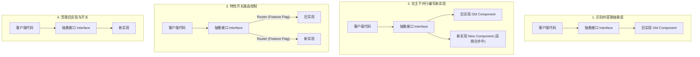

# 02 特性开关与抽象分支设计模式

在主干开发（TBD）流程中，开发人员每天都会向主干提交代码，甚至直接将主干代码连续自动部署到生产环境。然而，许多复杂的业务功能可能需要数周才能编写完毕。为了实现“高频集成且随时可发布”，我们必须**解耦“代码部署”（Code Deployment）与“特性发布”（Feature Release）**。

实现这一目标的核心技术手段是 **特性开关（Feature Flags / Feature Toggles）** 与 **抽象分支（Branch by Abstraction）**。

---

## 1. 核心理念：解耦部署与发布

* **部署（Deployment）**：指将新的二进制文件或代码包物理地推送到服务器、容器或 CDN，并在后台运行起来。这属于**技术层面的行为**，应该是高频且低风险的。
* **发布（Release）**：指将新的功能或体验展示给用户。这属于**业务层面的决策**，带有业务期望与用户体验风险。

传统的 Git 工作流将两者强行绑定（必须合并分支并编译部署才能让用户看到新功能）。而在主干开发中，新代码一旦合入主干就会随流水线直接被部署到生产环境，但在运行时被特性开关判定为“关闭”，对用户不可见。这就实现了部署与发布的解耦。

---

## 2. 特性开关的分类与生命周期

特性开关并不是一种单一的配置，根据其生命周期长度和动态可变性，主要可以分为以下四类：

```
                    ▲ 高
                    │
                    │       [ 运维开关 Ops Toggles ]
                    │       (如：降级、熔断器 - 长期存在)
                    │
                    │                               [ 权限开关 Permission ]
 动态变更能力       │                               (如：付费功能解锁 - 永久存在)
                    │
                    │       [ 实验开关 Experimentation ]
                    │       (如：A/B 测试 - 中期存在)
                    │
                    │  [ 业务发布开关 Release Toggles ]
                    │  (如：新版 UI 灰度 - 短期存在，发布后删除)
                    │
                    └──────────────────────────────────────────────►
                                                               生命周斯 (长)
```

1. **业务发布开关（Release Toggles）**：用于将未完成的代码安全地合并入主干。一旦功能全量上线，必须**在 1-2 周内从代码库中彻底删除**，以防止代码库中充斥着大量的无用判断（技术债）。
2. **实验开关（Experimentation Toggles）**：用于 A/B 测试。通常基于特定的用户分流策略，收集指标数据，在实验结束后清理。
3. **运维开关（Ops Toggles）**：用于系统降级、限流、熔断等。通常长期存在，直接对接监控警报系统。
4. **权限开关（Permission Toggles）**：用于控制不同付费套餐用户的特权。通常生命周期非常长，属于业务逻辑的一部分。

---

## 3. 企业级特性开关引擎设计 (Go 实现)

为了避免每次判定开关都发起一次网络或数据库查询，生产环境中的特性开关引擎通常采用**内存缓存 + 规则本地估值（Local Evaluation）**的架构。

以下是一个采用 Go 语言实现的并发安全、支持用户上下文（User Context）和百分比灰度控制的特性开关引擎：

```go
package featureflags

import (
	"crypto/fnv"
	"fmt"
	"sync"
)

// UserContext 封装了当前请求的用户信息，用于规则评估
type UserContext struct {
	UserID   string
	Email    string
	TenantID string
	Groups   []string
}

// Rule 定义了特性开关的灰度规则
type Rule struct {
	Enabled        bool     `json:"enabled"`          // 全局主开关
	AllowedGroups  []string `json:"allowed_groups"`   // 允许访问的白名单用户组
	RolloutPercent uint32   `json:"rollout_percent"`  // 灰度百分比 (0-100)
}

// Engine 管理所有特性开关的状态与评估
type Engine struct {
	mu    sync.RWMutex
	flags map[string]Rule
}

// NewEngine 初始化引擎
func NewEngine() *Engine {
	return &Engine{
		flags: make(map[string]Rule),
	}
}

// SetFlag 动态更新开关规则（通常由后台配置推送协程调用）
func (e *Engine) SetFlag(name string, rule Rule) {
	e.mu.Lock()
	defer e.mu.Unlock()
	e.flags[name] = rule
}

// IsEnabled 判断某个特性在当前用户上下文中是否开启
func (e *Engine) IsEnabled(flagName string, ctx UserContext) bool {
	e.mu.RLock()
	rule, exists := e.flags[flagName]
	e.mu.RUnlock()

	if !exists {
		return false // 默认关闭，防御性设计
	}

	// 1. 全局开关校验
	if !rule.Enabled {
		return false
	}

	// 2. 白名单组校验
	if len(rule.AllowedGroups) > 0 {
		for _, g := range ctx.Groups {
			for _, allowed := range rule.AllowedGroups {
				if g == allowed {
					return true
				}
			}
		}
	}

	// 3. 基于用户 ID 的哈希百分比分流
	if rule.RolloutPercent > 0 {
		if ctx.UserID == "" {
			return false // 匿名用户如果不提供 ID，默认不参与灰度
		}
		hashVal := hashUserID(ctx.UserID)
		bucket := hashVal % 100
		if bucket < rule.RolloutPercent {
			return true
		}
	}

	return false
}

// hashUserID 使用 FNV-1a 算法生成一致性哈希，保证同一用户判定结果的一致性
func hashUserID(userID string) uint32 {
	h := fnv.New32a()
	_, _ = h.Write([]byte(userID))
	return h.Sum32()
}
```

### 业务使用示例：
```go
package main

import (
	"fmt"
	"featureflags"
)

func main() {
	engine := featureflags.NewEngine()

	// 配置新购物车功能的灰度策略：开启全局，允许 beta 用户组，或者 30% 比例的用户灰度
	engine.SetFlag("new_shopping_cart", featureflags.Rule{
		Enabled:        true,
		AllowedGroups:  []string{"beta-testers"},
		RolloutPercent: 30,
	})

	// 用户 1：属于普通用户组，ID 哈希如果未落入 30%，则为 false
	user1 := featureflags.UserContext{
		UserID: "user_89124",
		Groups: []string{"regular-users"},
	}

	// 用户 2：属于 beta 测试组，必定为 true
	user2 := featureflags.UserContext{
		UserID: "user_90384",
		Groups: []string{"beta-testers"},
	}

	fmt.Printf("User 1 Enabled: %v\n", engine.IsEnabled("new_shopping_cart", user1))
	fmt.Printf("User 2 Enabled: %v\n", engine.IsEnabled("new_shopping_cart", user2))
}
```

---

## 4. 抽象分支（Branch by Abstraction）重构模式

当我们需要对底层的核心组件（例如：支付网关、数据库存储层、ORM 框架）进行破坏性重构或完全替换时，由于涉及代码极多且周期较长，不可能在一天内完成。为了不阻塞主干，我们应当采用 **抽象分支（Branch by Abstraction）** 模式。

### 4.1 迁移步骤示意图



### 4.2 详细落地指南：以更换支付 SDK 为例

假设我们需要将现有的 Stripe 支付逻辑替换为 Adyen 支付逻辑，且不能阻塞主干开发，也不能中断生产服务。

#### 步骤一：定义通用抽象接口
在主干代码库中，为支付行为声明一个清晰的抽象接口。

```go
package billing

import "context"

type PaymentRequest struct {
	AmountCents int64
	Currency    string
	Token       string
}

type PaymentResponse struct {
	TransactionID string
	Success       bool
	ErrorMessage  string
}

// PaymentGateway 统一抽象接口
type PaymentGateway interface {
	Charge(ctx context.Context, req PaymentRequest) (PaymentResponse, error)
}
```

#### 步骤二：包装旧实现，确保所有调用者依赖接口
将原有的 Stripe 支付逻辑打包成 `StripeGateway` 并实现该接口。重构原有的控制器，让其持有接口引用而非具体类。

```go
package billing

import (
	"context"
	"fmt"
)

type StripeGateway struct {
	apiKey string
}

func NewStripeGateway(key string) *StripeGateway {
	return &StripeGateway{apiKey: key}
}

func (s *StripeGateway) Charge(ctx context.Context, req PaymentRequest) (PaymentResponse, error) {
	// 调用 Stripe SDK 逻辑...
	fmt.Println("Processing charge via Stripe...")
	return PaymentResponse{TransactionID: "stripe_tx_123", Success: true}, nil
}
```

#### 步骤三：编写新实现并每日合入主干
编写 `AdyenGateway`。开发人员可以在开发过程中将其分成多次 PR 合入主干。因为没有任何业务入口调用它，即使它是半成品，也不会破坏生产环境的运行。

```go
package billing

import (
	"context"
	"fmt"
)

type AdyenGateway struct {
	merchantAccount string
}

func NewAdyenGateway(account string) *AdyenGateway {
	return &AdyenGateway{merchantAccount: account}
}

func (a *AdyenGateway) Charge(ctx context.Context, req PaymentRequest) (PaymentResponse, error) {
	// 调用 Adyen SDK 逻辑...
	fmt.Println("Processing charge via Adyen...")
	return PaymentResponse{TransactionID: "adyen_tx_987", Success: true}, nil
}
```

#### 步骤四：引入路由网关并配置特性开关
使用开关引擎进行运行时路由决策：

```go
package billing

import (
	"context"
	"errors"
)

type RoutingGateway struct {
	oldGateway PaymentGateway
	newGateway PaymentGateway
	ffEngine   *FeatureFlagsEngine // 指向上文实现的开关引擎
}

func NewRoutingGateway(old, new PaymentGateway, ff *FeatureFlagsEngine) *RoutingGateway {
	return &RoutingGateway{
		oldGateway: old,
		newGateway: new,
		ffEngine:   ff,
	}
}

func (r *RoutingGateway) Charge(ctx context.Context, req PaymentRequest, userCtx UserContext) (PaymentResponse, error) {
	// 从上下文或参数中判定是否使用新网关
	if r.ffEngine.IsEnabled("use_adyen_payment_gateway", userCtx) {
		return r.newGateway.Charge(ctx, req)
	}
	return r.oldGateway.Charge(ctx, req)
}
```

#### 步骤五：灰度验证与收尾清理
1. **暗启动（Dark Launch）**：在生产环境配置 `use_adyen_payment_gateway` 灰度 1% 的流量。
2. **渐进式放大**：如果没有发现异常，逐步放量到 10%、50%、100%。
3. **彻底清理**：确认新网关 100% 稳定运行数周后，提交一个新的 PR，物理删除 `StripeGateway`，删除 `RoutingGateway`，并将支付接口的依赖直接绑定为 `AdyenGateway`。

通过特性开关与抽象分支，团队可以将数月跨度的重构工作拆解为天级别的微小合并，极大地降低了系统集成的断代风险。下一章我们将讨论如何依靠 CI/CD 自动化门禁来守护主干的稳定。
