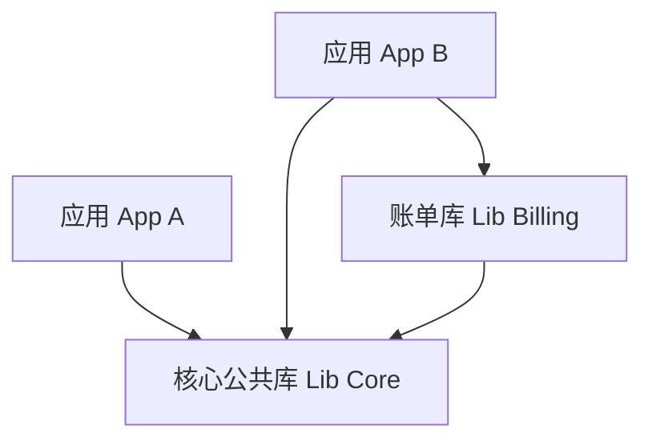

# 03 大规模团队 CI/CD 自动化与流水线门禁

主干开发（TBD）将代码集成的频次提升到了极限，这意味着每日可能有数十甚至数百次提交直接注入主干。如果完全依赖人工 Code Review 或手动的发布测试，主干将随时处于崩溃边缘。因此，**自动化的持续集成与持续部署（CI/CD）门禁系统**是 TBD 能否落地的命脉。

本章将系统剖析企业级 CI/CD 门禁流水线的核心架构设计、大规模团队下的 Monorepo 优化策略，以及解决并发合并冲突的合并队列（Merge Queue）技术。

---

## 1. 持续集成（CI）门禁流水线设计

门禁流水线（PR Gating Pipeline）的目标是：在代码进入主干前，通过纯自动化手段拦截 99% 的低级错误和语义冲突。

```
[ 开发者提交 PR ] 
       │
       ▼
 ┌───────────────┐
 │ 1. 静态检查   │ ──(失败)──► [ 拒绝合并并通知开发者 ]
 └───────────────┘
       │ (通过)
       ▼
 ┌───────────────┐
 │ 2. 编译与构建 │ ──(失败)──► [ 拒绝合并 ]
 └───────────────┘
       │ (通过)
       ▼
 ┌───────────────┐
 │ 3. 单元测试   │ ──(失败)──► [ 拒绝合并 ]
 └───────────────┘
       │ (通过)
       ▼
 ┌───────────────┐
 │ 4. 集成与 E2E │ ──(失败)──► [ 拒绝合并 ]
 └───────────────┘
       │ (通过)
       ▼
[ 触发合并队列 (Merge Queue) ]
```

### 门禁流水线的核心要素：
1. **静态代码分析与 Linting**：强制代码格式一致性，检查潜在的安全漏洞与反模式（如未处理的 Error）。
2. **测试覆盖率卡点**：设定基线（如覆盖率不得低于 80%），且新 PR 不能拉低整体覆盖率。
3. **隔离的临时测试环境**：对每个 PR 动态拉起临时的容器环境（Ephemeral Environments），运行轻量级端到端（E2E）测试。

---

## 2. 大规模 Monorepo 的增量构建与测试

在大型企业中，多个微服务或子系统通常放在同一个代码仓库（Monorepo）中。如果每次 PR 提交都对整个 Monorepo 进行全量编译和测试，CI 时间将飙升至数小时，彻底摧毁 TBD 的高频集成原则。

### 2.1 依赖图计算与增量测试
我们必须引入智能构建系统（如 Bazel、Nx、Turborepo）。这些工具可以通过静态分析构建起项目间的依赖关系图（Dependency Graph）。



* 如果开发者仅修改了 `Lib Billing` 中的代码，CI 系统根据依赖图计算，只需重新测试 `Lib Billing` 和 `App B`，而 `App A` 的单元测试则直接复用缓存。

### 2.2 基于 Git Diff 的轻量级增量检测脚本
如果尚未引入复杂的构建系统，也可以使用以下 Shell 脚本，在 CI 中判断被修改的包并针对性执行测试：

```bash
#!/usr/bin/env bash
set -euo pipefail

# 获取当前 PR 分支与主干的共同祖先
BASE_COMMIT=$(git merge-base origin/main HEAD)

# 找出所有被修改的文件目录
CHANGED_DIRS=$(git diff --name-only "$BASE_COMMIT" HEAD | awk -F/ '{print $1}' | sort -u)

echo "检测到被修改的根目录: $CHANGED_DIRS"

for DIR in $CHANGED_DIRS; do
  # 判断该目录是否是一个可测试的 Go 模块
  if [ -f "$DIR/go.mod" ]; then
    echo "========= 开始测试模块: $DIR ========="
    cd "$DIR"
    go test -v -race -coverprofile=coverage.out ./...
    cd - > /dev/null
  else
    echo "跳过非 Go 模块目录: $DIR"
  fi
done
```

---

## 3. 合并队列（Merge Queue / Merge Train）机制

### 3.1 经典冲突场景：“主干崩塌”
假设主干处于稳定状态。有两位开发者同时提交了 PR：
* **PR A**：修改了某个公共 API，移除了一个未使用的字段。PR 门禁测试通过。
* **PR B**：引入了新功能，恰好调用了该字段。PR 门禁测试通过（因为当时它是基于没有 PR A 的主干计算的）。

如果两个 PR 先后被合并入主干，主干瞬间就会因为类型编译错误或运行时异常而崩溃。这就是经典的**并发集成冲突**。

### 3.2 合并队列的 optimistic 并发执行
合并队列（Merge Queue）是 GitHub、GitLab（称为 Merge Train）等平台提供的解决此类问题的核心技术。

其工作原理是：当 PR 通过 Review 准备合并时，它不会直接合入主干，而是进入一个队列。队列会在后台模拟一个“合并链条”：

```
主干最新状态 (C0)
   │
   ├─► 模拟合并 PR 1 ─────► 运行测试流水线 (Pipeline 1) ──(通过)──► 真实合入主干
   │
   └─► 模拟合并 PR 1 + PR 2 ──► 运行测试流水线 (Pipeline 2) ──(若 Pipeline 1 通过则加速合并)
```

1. **并行乐观评估**：PR 2 的测试是在“假设 PR 1 已经成功合并”的临时基线上运行的。
2. **容错重组**：如果测试流水线 1 失败了，队列会立刻把 PR 1 从队列中剔除，并在主干基础上重新为 PR 2 运行测试。

这保证了**任何合入主干的代码都已经在最新的合并序列中被验证过**，从而从原理上消除了主干崩塌的可能。

---

## 4. 生产级 GitHub Actions 门禁流水线配置

以下是一个生产级的 GitHub Actions 工作流配置，展示了分支保护、并发取消、Go 依赖缓存以及多阶段测试的实现：

```yaml
name: TBD CI Gate

on:
  pull_request:
    branches: [ main ]
  push:
    branches: [ main ]

# 避免同一个 PR 重复触发流水线时产生资源浪费，新提交会自动取消旧流水线
concurrency:
  group: ${{ github.workflow }}-${{ github.ref }}
  cancel-in-progress: true

jobs:
  static-check:
    name: Lint & Security Scan
    runs-on: ubuntu-latest
    steps:
      - name: Checkout Code
        uses: actions/checkout@v4
        with:
          fetch-depth: 0 # 获取完整历史以计算 merge-base

      - name: Set up Go
        uses: actions/setup-go@v5
        with:
          go-version: '1.22'
          cache: true # 自动缓存 go 依赖包

      - name: Run Golangci-Lint
        uses: golangci/golangci-lint-action@v4
        with:
          version: v1.55.2

      - name: Run Govulncheck (漏洞扫描)
        run: |
          go install golang.org/x/vuln/cmd/govulncheck@latest
          govulncheck ./...

  unit-test:
    name: Build & Test Suite
    needs: static-check
    runs-on: ubuntu-latest
    steps:
      - name: Checkout Code
        uses: actions/checkout@v4

      - name: Set up Go
        uses: actions/setup-go@v5
        with:
          go-version: '1.22'
          cache: true

      - name: Verify Dependencies
        run: go mod verify

      - name: Build Binaries
        run: go build -o /dev/null ./...

      - name: Run Unit Tests with Race Detector
        run: |
          go test -race -v -covermode=atomic -coverprofile=coverage.txt ./...

      - name: Upload Coverage to Codecov
        uses: codecov/codecov-action@v4
        with:
          file: ./coverage.txt
          fail_ci_if_error: true
          token: ${{ secrets.CODECOV_TOKEN }}
```

---

## 5. 持续部署（CD）与金丝雀发布及快速回滚

主干开发在 CI 阶段拦截了代码层面的错误，但在 CD 阶段，依然需要防止逻辑缺陷（如特定边缘场景的 Core Dump）影响全局。

### 5.1 金丝雀发布（Canary Release）
不要将代码一次性部署到所有生产服务器。应通过 ingress 流量控制器（如 Envoy, Traefik, Istio）进行灰度分流：

```
                    ┌──► [ 1% Traffic ] ──► Canary Pod (新代码)
[ 用户流量 ] ───────┤
                    └──► [ 99% Traffic ] ──► Production Pod (旧代码)
```

1. **监控回显（Metrics Loop）**：SRE 监控平台自动观测 Canary 容器的 HTTP 5xx 错误率、P99 延迟以及 OOMKilled 事件。
2. **自动升级**：若 15 分钟内指标无异常，将流量自动扩大至 10%、50%，直至 100%。

### 5.2 极致回滚策略对比
当生产环境出现故障时，TBD 团队有三种主要的回滚手段，各自适用于不同的故障级别：

| 回滚手段 | 操作速度 | 风险等级 | 适用场景 |
| :--- | :--- | :--- | :--- |
| **特性开关回滚 (Feature Flag Toggle)** | **毫秒级/亚秒级** | 极低 | 业务逻辑 Bug、第三方服务限流、API 交互异常。直接关闭云端配置开关即可。 |
| **重新部署旧镜像 (CD Rollback)** | **分钟级** (依赖发布速度) | 中等 | 致命内存泄漏、OOM、运行时死锁、严重系统崩溃。 |
| **Git 回滚 (Git Revert)** | **10 分钟以上** (需经过 CI/CD 流水线) | 较高 (可能产生新的合并冲突) | 架构变动失败、或者需要长线撤销某项代码修改。 |

> [!TIP]
> 优秀的生产系统设计应当秉持“**开关优先于镜像部署，部署优先于 Git Revert**”的原则。尽可能将故障影响控制在毫秒级以内。

---

## 总结

主干开发（Trunk-Based Development）并不是一个孤立的代码流控制技巧，而是现代 DevOps 体系演进的必然结果。通过：
1. **第一章** 探讨的短寿命分支与线性历史规避集成冲突；
2. **第二章** 详述的特性开关与抽象分支使未完成代码安全合入并实现平滑重构；
3. **第三章** 介绍的自动化门禁、增量构建、合并队列及金丝雀发布，保障主干的安全与高可用；

团队能够打破部门墙，消除发布前耗时数周的代码冻结（Code Freeze）与硬化测试期，真正实现业务价值的高频、安全、高质量持续交付。
