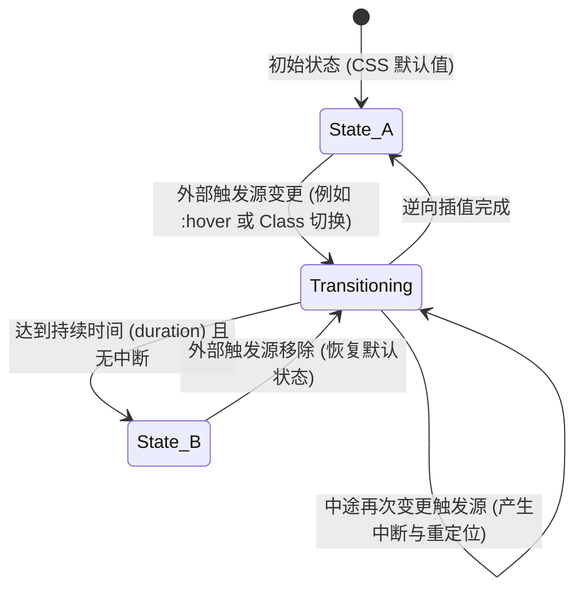
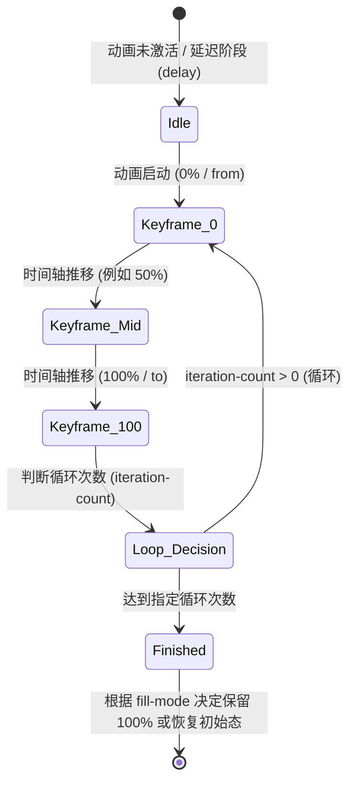
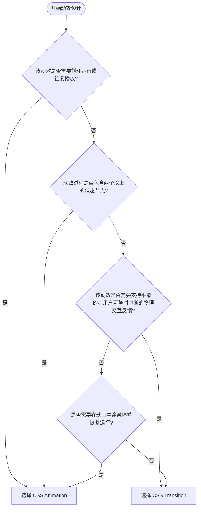

# 第一章：Transition 与 Animation 的对比与选型

在现代 Web 界面设计中，过渡（Transition）与关键帧动画（Animation）是构建动态交互的两大基石。虽然它们最终都能在屏幕上呈现出平滑的视觉变化，但其底层的状态机模型、执行生命周期以及适用场景有着本质的不同。本章将从状态机理论、触发机制、数学插值曲线以及工程选型等维度展开深度探讨。

---

## 1. 状态机视角下的动效建模

### 1.1 Transition：双态单次转移状态机
从状态机（State Machine）的视角来看，`transition` 本质上是一个**双态单次转移状态机**（Two-State Single-Transition State Machine）。它本身不主动发起任何行为，而是依赖于外部条件的改变（例如用户交互触发的伪类状态变化，或 JavaScript 修改了 DOM 的 Class/Inline Style），从而在**初始态（State A）**与**目标态（State B）**之间进行属性插值。



在 Transition 状态机中，有几个关键性特征：
- **无中途航标点**：过渡只能从 A 点直线（在时域上遵循指定的 Timing Function）滑向 B 点，无法在中途声明“在 50% 时将透明度降低到 0.2，而在 70% 时将旋转角度增加到 45度”。
- **中断恢复机制（Interruptibility）**：当过渡在从 A 到 B 的中途被中断（例如鼠标悬停到一半时移开），浏览器会自动计算当前的中断值，并以此为起点逆向插值回 A。这使得 Transition 天生具有非常平滑的物理跟随感，不会产生视觉上的突变（Snap）。

### 1.2 Animation：多态时间轴驱动状态机
与 Transition 不同，`animation` 结合 `@keyframes` 构成了一个**多态时间轴驱动状态机**（Multi-State Timeline-Driven State Machine）。它一旦被绑定并激活，就会完全接管目标元素的指定属性，并按照预先定义的时间轴（以百分比或关键字表示的 Keyframes）进行多阶段转移。



Animation 状态机的核心特征包括：
- **主动式执行**：它不需要外部的持续触发源。只要 Class 被挂载，或者 `animation-name` 被赋予，它就会按照其内部时间轴自动运行。
- **丰富的生命周期控制**：它拥有循环次数（`iteration-count`）、播放方向（`direction`，如交替播放 `alternate`）、播放状态（`play-state`，如暂停 `paused`）等高维控制手段。
- **状态冻结与释放**：动画结束后的行为高度依赖于充填模式（`animation-fill-mode`），它能够决定是在动画结束后将元素状态回滚到时间轴之外（None），还是将其冻结在最后一帧（Forwards）。

---

## 2. 生命周期与触发机制

在实际开发中，我们需要精准捕获这两类动效的生命周期事件，以便在特定的节点执行业务逻辑（例如动效结束后销毁 DOM 节点、发起网络请求或串联下一个动效）。

### 2.1 Transition 的生命周期事件
Transition 在执行过程中会在 DOM 元素上抛出四个核心事件：
1. `transitionrun`：当过渡被触发时立即触发（在任何 `transition-delay` 开始之前）。
2. `transitionstart`：在 `transition-delay` 结束、实际动画插值开始时触发。
3. `transitionend`：在过渡正常完成时触发。如果过渡在中途被中断或取消，则不会触发此事件。
4. `transitioncancel`：如果过渡在完成前被中断（例如属性值被重置，或者元素被设置为 `display: none`），则触发此事件。

下面是利用 JavaScript 安全销毁弹窗（Modal）的典型生产级代码：

```javascript
/**
 * 生产级安全过渡监听器
 * @param {HTMLElement} element - 需要监听过渡的 DOM 元素
 * @param {Function} callback - 过渡正常结束或被取消后的回调函数
 */
function runWithTransitionCleanup(element, callback) {
    let called = false;
    
    const handleCleanup = (event) => {
        // 确保只响应目标元素自身的过渡，防止冒泡干扰
        if (event.target !== element) return;
        
        if (!called) {
            called = true;
            // 移除所有监听器，避免内存泄漏
            element.removeEventListener('transitionend', handleCleanup);
            element.removeEventListener('transitioncancel', handleCleanup);
            callback();
        }
    };
    
    element.addEventListener('transitionend', handleCleanup);
    element.addEventListener('transitioncancel', handleCleanup);
    
    // 安全降级：防止因浏览器丢帧或未触发 transitionend 导致的逻辑死锁
    // 读取元素计算后的过渡持续时间与延迟时间之和
    const styles = window.getComputedStyle(element);
    const duration = parseFloat(styles.transitionDuration) || 0;
    const delay = parseFloat(styles.transitionDelay) || 0;
    const totalTimeMs = (duration + delay) * 1000;
    
    // 设定一个稍微宽松的定时器作为安全网 (额外增加 50ms)
    setTimeout(() => {
        if (!called) {
            called = true;
            element.removeEventListener('transitionend', handleCleanup);
            element.removeEventListener('transitioncancel', handleCleanup);
            callback();
        }
    }, totalTimeMs + 50);
}
```

### 2.2 Animation 的生命周期事件
与 Transition 类似，Animation 也有一套对应的事件机制：
1. `animationstart`：动画开始播放时触发（如果有 `animation-delay`，则在延迟结束后触发）。
2. `animationiteration`：当动画循环播放，且进入新的一次循环迭代时触发。
3. `animationend`：动画播放完毕（且不再循环）时触发。
4. `animationcancel`：动画在未完成前被强制移除（例如清空 `animation-name` 或销毁 DOM）时触发。

对于级联式（Chained）动画，依靠 `animationend` 事件进行链式串联是避免“回调地狱”的一种高雅做法，也可以通过 CSS 变量来实现纯 CSS 级联。

---

## 3. 插值曲线（Timing Functions）与数学建模

无论是 Transition 还是 Animation，其本质都是随时间推移对属性值进行插值。控制插值速率的机制是 `transition-timing-function` 或 `animation-timing-function`。

### 3.1 三次贝塞尔曲线（Cubic Bézier Curves）
CSS 动效的核心数学模型是三次贝塞尔曲线。在数学上，一条三次贝塞尔曲线由四个控制点定义：$P_0, P_1, P_2, P_3$。在 CSS 规范中：
- 起点 $P_0$ 固定为 $(0, 0)$，代表动画起始时间和起始进度。
- 终点 $P_3$ 固定为 $(1, 1)$，代表动画结束时间和结束进度。
- 用户通过 `cubic-bezier(x1, y1, x2, y2)` 定义的则是控制点 $P_1(x_1, y_1)$ 与 $P_2(x_2, y_2)$。

其参数方程为：
$$B(t) = (1-t)^3 P_0 + 3(1-t)^2t P_1 + 3(1-t)t^2 P_2 + t^3 P_3, \quad t \in [0, 1]$$

其中，$t$ 是参数时间，映射到屏幕上时，横坐标 $x$ 代表“经过的时间百分比”，纵坐标 $y$ 代表“动画执行的输出进度”。

> [!IMPORTANT]
> 规范要求控制点 $P_1$ 和 $P_2$ 的横坐标 $x_1, x_2$ 必须在 $[0, 1]$ 区间内，因为时间不能倒流；但纵坐标 $y_1, y_2$ 可以超出 $[0, 1]$ 区间。这种数学特性允许我们设计出“回弹（Anticipation / Back）”与“过冲（Overshoot）”的物理效果。

#### 物理仿真：利用超界贝塞尔曲线模拟弹性阻尼（Spring Physics）
真实的物理世界中，物体在停止前往往会有惯性回弹。以下是一个典型的“卡片滑出并回弹”的生产级 CSS 配置：

```css
/* 
  模拟弹性阻尼效果的自定义贝塞尔曲线
  P1(0.175, 0.885), P2(0.320, 1.275)
  y2 = 1.275 表明动画输出进度最高会冲到 127.5% 的位置，然后平滑回落到 100%
*/
.springy-card {
  width: 320px;
  height: 200px;
  background: #2a2f3b;
  border-radius: 12px;
  transform: translateY(100px);
  opacity: 0;
  
  /* 定义加速启动、在接近目标值时产生明显超速冲过头再回弹的质感 */
  transition: 
    transform 0.65s cubic-bezier(0.175, 0.885, 0.32, 1.275),
    opacity 0.4s ease-out;
}

/* 激活状态 */
.springy-card.is-visible {
  transform: translateY(0);
  opacity: 1;
}
```

### 3.2 阶跃函数：`steps()`
并非所有动效都需要平滑插值。在某些特定场景下（例如打字机文字逐字显现效果、经典像素游戏精灵图帧动画），我们需要属性值呈离散分布。这时就需要用到阶跃函数 `steps(number_of_steps, direction)`。

- `number_of_steps`：指定将时间轴等分为多少个阶段。
- `direction`（或关键字）：定义在每个区间的起点还是终点发生状态跃迁。
  - `jump-start`（或 `start`）：在每个间隔的开始处发生跃迁。
  - `jump-end`（或 `end`）：在每个间隔的结束处发生跃迁（默认值）。

```css
/* 精灵图序列帧播放示例 */
.sprite-character {
  width: 64px;
  height: 64px;
  background-image: url('/assets/character-run-loop.png'); /* 包含 8 帧的单行水平合并图 */
  background-position: 0 0;
  
  /* 
    8 帧图像，因此等分为 8 步。
    使用 steps(8) 可以让背景图的位置瞬间跳跃，而不是平滑滚动，从而实现逐帧播放的效果。
  */
  animation: run-cycle 0.8s steps(8) infinite;
}

@keyframes run-cycle {
  from {
    background-position: 0 0;
  }
  to {
    background-position: -512px 0; /* 64px * 8帧 = 512px */
  }
}
```

---

## 4. 技术选型矩阵与决策树

在架构具体的动效方案时，如何选择 Transition 与 Animation？以下是系统化的选型维度对比：

| 选型维度 | Transition (过渡) | Animation (关键帧动画) |
| :--- | :--- | :--- |
| **状态复杂性** | 适合双态切换（State A $\leftrightarrow$ State B） | 适合多态、多航标点（A $\rightarrow$ B $\rightarrow$ C $\rightarrow$ D） |
| **触发源** | 必须由外部状态变更触发（CSS 伪类、Class 切换等） | 可自启动（挂载即运行），也可通过 Class 激活 |
| **执行生命周期** | 单次执行后停止，不可天然循环 | 支持无限循环、指定次数循环、交替往返播放 |
| **时间轴控制** | 无法在中途调整不同时间点的插值速度 | 可以在关键帧内部为不同区间单独声明 `animation-timing-function` |
| **中断体验** | 天生支持无缝平滑中断，体验极佳 | 中断时通常会产生突变，需通过复杂的 JS 介入来平滑过渡 |
| **暂停/恢复能力** | 无法被动态暂停，只能反向运行 | 可通过控制 `animation-play-state: paused` 轻松暂停 |
| **典型应用场景** | 按钮悬停反馈、输入框聚焦描边、菜单展开收起 | Loading 加载环、骨架屏扫描闪烁、循环背景波浪、复杂的入场叙事动效 |

### 4.1 动效选型决策树



通过这一决策逻辑，开发者能够在架构初期就为组件选择最简练、性能最优且可维护度最高的动效实现方案。在下一章中，我们将深入 `@keyframes` 的语法内部，探索如何通过数学思维对多轨道动画进行建模与组合。
