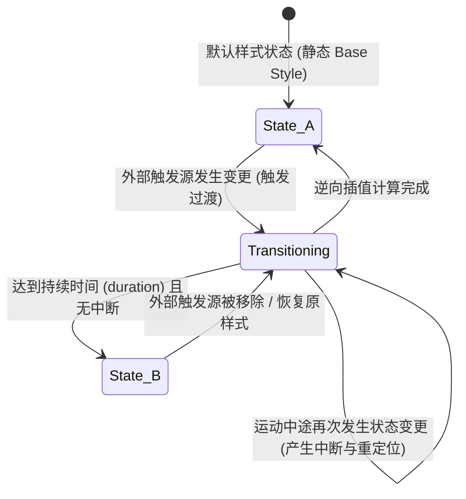
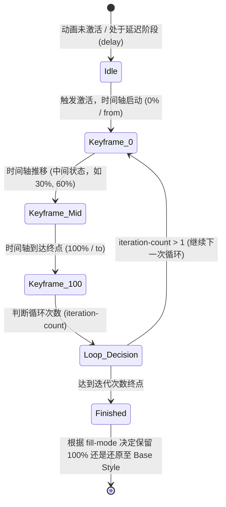
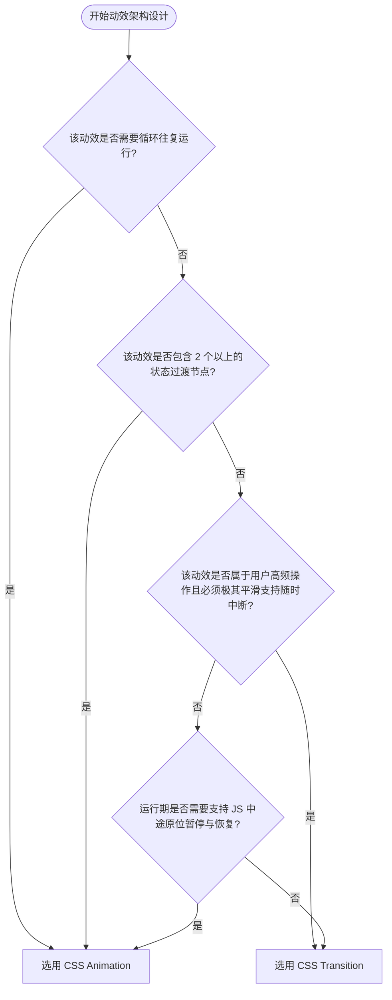

# 第一章：CSS 过渡机制与缓动物理模型

在现代网页和应用的用户界面中，过渡（Transition）与关键帧动画（Animation）是构建动态交互、呈现平滑视觉变化的基石。虽然两者最终在屏幕上产生的效果都是属性值的连续变化，但其底层的状态机模型、运行生命周期、线程执行模型以及数学插值算法有着本质的不同。本章将对这些核心机制进行深度拆解与数学建模。

---

## 1. 状态机视角下的动效建模

### 1.1 Transition：双态单次转移状态机

从状态机（State Machine）的角度分析，CSS `transition` 本质上是一个**双态单次转移状态机**（Two-State Single-Transition State Machine）。它自身是惰性的，不主动发起任何状态变化。其运行必须依赖外部触发源的变更（如 DOM Class 的切换、`:hover` 等伪类的激活、或者由 JavaScript 直接更改内联样式），从而在**初始态（State A）**与**目标态（State B）**之间触发插值计算。



在 Transition 状态机中，有两个最关键的特性：
1.  **无中间航标点（No Interpolated Waypoints）**：过渡只能从 $A$ 点遵循指定的插值速度曲线滑向 $B$ 点，中途无法定义非线性的中间状态（例如在 $50\%$ 的进度处改变其他无关属性）。
2.  **天生的中断恢复机制（Interruptibility）**：当过渡在从 $A$ 到 $B$ 的中途被中断（例如用户悬停卡片到一半时鼠标移开），浏览器会自动捕获**中断瞬间的当前属性计算值（Current Interpolated Value）**作为新的起点，并计算出一个逆向的插值轨迹平滑返回 $A$。这能防止视觉上产生突兀的跳跃。

### 中断逆向过渡的数学轨迹示意图

```text
 属性值 (Value)
   ^
 B |                                  / 目标态 B
   |                                 /
   |             中断发生点 (Interrupted)
   |                 *...................... 正常过渡到 B 的预期路径
   |                / \
   |               /   \  <-- 逆向平滑返回路径
   |              /     \
 A |─────────────*       *───────────────────> 时间 (Time)
             初始态 A    返回 A 点
```

---

### 1.2 Animation：多态时间轴驱动状态机

与 Transition 不同，`animation` 结合 `@keyframes` 构成了一个**多态时间轴驱动状态机**（Multi-State Timeline-Driven State Machine）。一旦绑定并激活，它就会全面接管目标元素的指定属性，并按照预先定义的时间轴（以百分比或关键字表示的关键帧）进行多阶段状态转移。



Animation 状态机的核心特性包括：
1.  **主动式自主执行**：它不需要持续的外部状态维持。只要类名或动画声明被挂载，它就会沿着参数化时间轴自行向前推移。
2.  **多阶段状态定义**：允许在 $0\%$ 到 $100\%$ 的区间内定义任意数量的控制航标点，可实现极为复杂的运动轨迹与非线性属性变化。
3.  **中断不平滑性**：如果动画在中途被强行移除（例如将 `animation-name` 设为 `none`），在没有专门的 JS 干预下，元素属性会瞬间突变（Snap）回 Base Style。

---

## 2. 浏览器线程执行模型与生命周期

在现代渲染引擎（如 Chrome Chromium 架构中的 Blink 引擎）中，动画和过渡的生命周期管理面临着**主线程（Main Thread）与合成线程（Compositor Thread）**的分工协作挑战。

### 2.1 主线程与合成线程协同模型

*   **主线程**：负责解析 HTML、CSS、执行 JavaScript、计算布局（Layout）和重绘（Paint）。
*   **合成线程**：负责图层的复合（Composite），并直接向 GPU 提交渲染指令。

```text
 ──[主线程 Main Thread]───────────────────────────────────────────────────────
    │ (产生交互/执行 JS)
    ▼
    [更新样式/布局/绘制] ────(提交图层数据 Commit)────► [合成线程 Compositor Thread]
                                                             │ (完全接管 transform/opacity)
                                                             ▼
                                                      [GPU 硬件加速渲染]
```

如果我们在动画或过渡中仅改变 `transform` 或 `opacity`，计算和控制就会完全被委派给合成线程。合成线程在动画运行过程中，即使主线程被繁重的 JS 任务（如大列表渲染、垃圾回收）阻塞，动画依然能在 GPU 中流畅运行。然而，过渡与动画的**事件回调（Events）**必须回到主线程执行，这会带来一些隐性的性能和一致性风险。

---

### 2.2 Transition 的生命周期事件与主线程卡顿应对

Transition 包含四个核心生命周期事件：
1.  `transitionrun`：过渡规则被触发时立即抛出（在延迟 `transition-delay` 开始之前）。
2.  `transitionstart`：延迟结束、属性实际开始发生插值变化的瞬间抛出。
3.  `transitionend`：过渡正常结束，达到目标值时抛出。
4.  `transitioncancel`：过渡在中途由于属性被重置或元素被设为 `display: none` 导致非正常中断时抛出。

#### ⚠️ 生产环境死锁隐患
由于 `transitionend` 运行在主线程上，若主线程因为 JS 复杂任务卡死，`transitionend` 可能会被延迟几十甚至几百毫秒才被调用。如果我们的业务逻辑依赖于这个事件来销毁弹窗（例如 Modal），用户就会看到弹窗卡在最后一帧，随后产生严重的顿挫感。

为此，生产级动效代码通常会使用一个**物理防卡死安全网（Safety-Net Timer）**：

```javascript
/**
 * 生产级安全过渡执行器
 * @param {HTMLElement} element - 监听过渡的目标 DOM 元素
 * @param {Function} callback - 过渡完成后必须执行的回调逻辑
 */
function safeTransitionTrigger(element, callback) {
    let hasCompleted = false;
    
    // 清理并执行回调的内联函数
    const handleCleanup = (event) => {
        // 必须确认事件源为目标元素本身，排除子元素冒泡干扰
        if (event && event.target !== element) return;
        
        if (!hasCompleted) {
            hasCompleted = true;
            element.removeEventListener('transitionend', handleCleanup);
            element.removeEventListener('transitioncancel', handleCleanup);
            callback();
        }
    };
    
    // 监听原生过渡事件
    element.addEventListener('transitionend', handleCleanup);
    element.addEventListener('transitioncancel', handleCleanup);
    
    // 从计算样式中动态获取过渡总时长
    const styles = window.getComputedStyle(element);
    const duration = parseFloat(styles.transitionDuration) || 0;
    const delay = parseFloat(styles.transitionDelay) || 0;
    const totalTimeMs = (duration + delay) * 1000;
    
    // 安全网：设定一个稍微宽松的时间窗 (额外增加 50ms 缓冲)
    // 即使主线程卡顿丢失 transitionend 事件，定时器依然能兜底执行回调，避免业务卡死
    setTimeout(() => {
        if (!hasCompleted) {
            console.warn('Transition event dropped or delayed. Falling back to safety timer.');
            handleCleanup();
        }
    }, totalTimeMs + 50);
}
```

---

### 2.3 Animation 的生命周期事件

Animation 事件模型包含：
1.  `animationstart`：动画在延迟结束后正式启动时抛出。
2.  `animationiteration`：当动画循环播放（`iteration-count > 1`）且每次进入新周期时抛出。
3.  `animationend`：非无限循环动画正常执行结束时抛出。
4.  `animationcancel`：动画在未完成前被强行中断（如移除动画类名）时抛出。

---

## 3. 三次贝塞尔曲线（Cubic Bézier Curves）与数学建模

无论是过渡还是关键帧，其核心插值速度都由 `cubic-bezier()` 控制。

### 3.1 三次贝塞尔曲线参数方程

在 CSS 规范中，贝塞尔曲线的输入与输出被映射到 $[0, 1] \times [0, 1]$ 的二维直角坐标系中。
*   $P_0 = (0, 0)$ 代表动画起点（时间占比 $0$，属性变化进度 $0$）。
*   $P_3 = (1, 1)$ 代表动画终点（时间占比 $1$，属性变化进度 $1$）。
*   开发者定义的控制点为 $P_1(x_1, y_1)$ 与 $P_2(x_2, y_2)$。

曲线的参数方程以参数 $t \in [0, 1]$ 表达为：
$$x(t) = 3(1-t)^2t x_1 + 3(1-t)t^2 x_2 + t^3$$
$$y(t) = 3(1-t)^2t y_1 + 3(1-t)t^2 y_2 + t^3$$

### 3.2 渲染引擎中的 Newton-Raphson 求解机制
当浏览器在每一帧渲染时，已知的是当前时间进度比值 $x_{target}$。因为 $x(t)$ 关于 $t$ 是一个单调递增的三次函数，渲染引擎必须通过数值计算反解出参数 $t$，随后代入 $y(t)$ 得到属性的变化进度值 $y_{target}$。

Blink 引擎底层（如 `CubicBezier.cpp`）通常使用 **牛顿-拉夫森法（Newton-Raphson Method）** 进行快速迭代求解。若导数接近于零，则降级为**二分查找法（Bisection Search）**：

对于给定的 $x_{target}$，定义误差方程：
$$f(t) = x(t) - x_{target} = 0$$

迭代公式为：
$$t_{n+1} = t_n - \frac{f(t_n)}{f'(t_n)}$$

其中一阶导数为：
$$f'(t) = x'(t) = 3(1-t)^2 x_1 + 6(1-t)t (x_2 - x_1) + 3t^2(1 - x_2)$$

经过大约 4 到 8 次牛顿迭代后，即可解出极其高精度的 $t$，然后利用 $y(t)$ 参数方程求出实际渲染的属性插值百分比，从而完成一帧的渲染渲染计算。

---

### 3.3 超界曲线与物理回弹仿真

在 CSS 中，虽然控制点横坐标 $x_1, x_2$ 必须限制在 $[0, 1]$ 之间以保证时间的单向流动，但纵坐标 $y_1, y_2$ 可以任意设置。这允许我们模拟真实的重力和阻尼反弹。

#### 阻尼过冲回弹（Overshoot）
设置 $y_2 > 1.0$，属性计算值会突破 $1.0$ 的极限，冲过头之后平滑降回 $1.0$。

```css
/*
  自定义阻尼回弹过渡
  P1(0.25, 0.46), P2(0.45, 1.4) ──> y2 = 1.4，意味着计算值最大会达到 140%
*/
.spring-overshoot-box {
  width: 100px;
  height: 100px;
  background-color: #6366f1;
  /* 开启 GPU 合成图层 */
  will-change: transform;
  
  /* 绑定 600ms 的回弹过渡 */
  transition: transform 0.6s cubic-bezier(0.25, 0.46, 0.45, 1.4);
}

.spring-overshoot-box:hover {
  transform: scale(1.3); /* 放大过程中，会先放大到约 1.42 倍，再弹性回落到 1.3 倍 */
}
```

---

### 3.4 阶跃函数：`steps()`

与用于连续插值的贝塞尔曲线不同，阶跃函数 `steps(n, [start | end])` 将过渡区间切分为 $n$ 等分，呈现离散的状态跳转。常用于逐帧精灵图（Sprite Sheet）或打字机字符出现效果。

*   `jump-start` (或 `start`)：在每个时域小间隔的**开始**处直接跳跃至该段终值。
*   `jump-end` (或 `end`)：在每个时域小间隔的**结束**处跳跃至该段终值（此为 CSS 默认配置）。

```css
/* 经典 8 帧角色奔跑精灵图动画配置 */
.sprite-runner {
  width: 128px;
  height: 128px;
  background-image: url('/assets/runner-sprite-sheet.png'); /* 水平并排 8 帧，总宽度 1024px */
  background-repeat: no-repeat;
  
  /* 
    8 帧精灵图，分为 8 步执行。
    必须使用 steps(8)，使背景偏移瞬间跳变，防止背景平滑拉伸滚动
  */
  animation: sprite-play 0.8s steps(8) infinite;
}

@keyframes sprite-play {
  from {
    background-position: 0px 0px;
  }
  to {
    background-position: -1024px 0px; /* 128px * 8 帧 */
  }
}
```

---

## 4. 技术选型决策框架

在面临一个特定的用户体验动效设计需求时，可以参考如下的技术特征对比表和决策树来进行合理的架构技术选型：

### 4.1 技术特性对比矩阵

| 特性维度 | Transition (过渡) | Animation (关键帧动画) |
| :--- | :--- | :--- |
| **状态转移复杂度** | 双态单次转移（A $\leftrightarrow$ B） | 任意多阶段时间轴（A $\rightarrow$ B $\rightarrow$ C $\rightarrow$ D） |
| **状态机驱动源** | 依赖外部条件变更（伪类状态、DOM Class） | 自启动（Mount 后运行）或挂载类名启动 |
| **运行循环** | 单次转移，无法直接设置无限循环 | 支持 `infinite` 或指定次数循环 |
| **中断物理感** | 底层天然支持当前值捕获，中断过渡极平滑 | 中断时会产生突变，需要繁琐的 JS 介入平滑化 |
| **运行期暂停** | 无法原生暂停至中途，只能反向退回起始状态 | 支持 `animation-play-state: paused` 完美原位挂起 |
| **时域速度控制** | 全程共享一条贝塞尔插值曲线 | 可以在不同关键帧区间独立声明不同的 `timing-function` |

### 4.2 动效选型决策流程图



在接下来的章节中，我们将深入 `@keyframes` 时间轴内部，探索多轨道空间解耦、状态冻结等关键技术。
