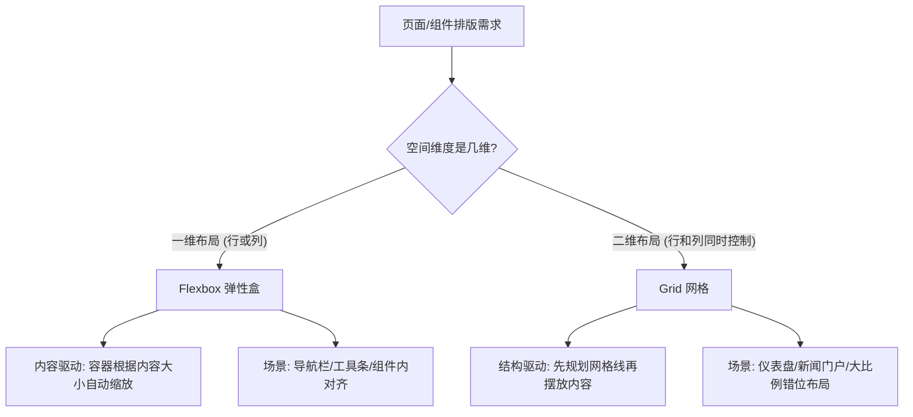

# CSS Flexbox & Grid 现代布局之道

在 Web 前端开发的演进历程中，页面布局技术的变革始终是推动用户界面（UI）保真度与响应速度的核心引擎。从早期的 HTML `<table>` 滥用，到依赖 `float`（浮动）与 `clear` 的 Hack 时代，再到基于 `position: absolute` 和 Inline-block 的拼凑式微调，开发者曾长期受困于 CSS 缺乏原生语义化、结构化布局引擎的窘境。

**CSS Flexible Box Layout (Flexbox)** 与 **CSS Grid Layout** 的相继推出，彻底宣告了上述“刀耕火种”时代的终结。它们是 W3C 专为解决现代复杂 Web 界面排版而设计的原生声明式布局系统。本指南将从底层机制、数学模型、架构设计到现代响应式无媒体查询实践，深度解析这两大引擎的核心原理与实战技巧。

---

## 1. 布局范式的演进与技术痛点

在现代布局引擎出现之前，前端开发者为了实现简单的“垂直居中”或“等高列”布局，通常需要使用大量非语义化的 CSS 属性和结构冗余的 DOM。

### 历史布局方案的局限性

| 布局方法 | 核心应用场景 | 关键技术痛点与副作用 |
| :--- | :--- | :--- |
| **Table 布局** | 早期多列布局 | HTML 结构极其臃肿，失去语义化；渲染性能差（需整表解析完毕后一次性绘制）；高度不可控。 |
| **Float 浮动** | 文字环绕、伪多列排版 | 必须频繁使用 `clear: both` 或清除浮动（clearfix）Hack；脱离常规文档流，容器高度塌陷；无法优雅实现真正的垂直居中。 |
| **Inline-block** | 横向排列块级元素 | 元素间会因 HTML 换行符产生无法消除的空白间距（4px 缝隙问题），需要通过设置父级 `font-size: 0` 等奇技淫巧解决。 |
| **Absolute 定位**| 重叠与绝对悬浮 | 元素完全脱离文档流，无法撑开父容器高度；在响应式布局中难以动态适配，需要依赖 JavaScript 计算位置。 |

现代布局引擎则引入了**流动自适应（Fluidity）**与**结构声明（Structure Declaration）**的思想，将样式逻辑与 DOM 结构解耦，并原生支持弹性伸缩与多维空间对齐。

---

## 2. Flexbox 与 Grid 的设计哲学对比

在构建复杂的页面时，最常见的技术决策问题是：“我应该用 Flexbox 还是 Grid？”要做出正确选择，必须深入理解两者在多维空间下的控制差异。



### 一维内容驱动 vs 二维结构驱动

1. **Flexbox（一维布局系统）**：
   * **内容驱动（Content-Driven）**：Flexbox 优先考虑内容。它的基本假设是：你有一组大小不一的子项，你想让他们在单向轴（水平行或垂直列）上自适应地排列、对齐并分配剩余空间。
   * **动态伸缩**：子项的实际尺寸是由其内部内容决定的，然后再通过弹性因子（`flex-grow` / `flex-shrink`）进行空间膨胀或收缩。

2. **Grid（二维布局系统）**：
   * **结构驱动（Layout-Driven）**：Grid 优先考虑网格结构。它允许你直接在容器上划分出水平行与垂直列的网格线，就像在画布上画格子。
   * **坐标定位**：子项根据设定的网格轨道（Tracks）或网格区域（Areas）被“摆放”到对应的坐标系中。子项的尺寸默认受限于它所在的网格单元格（Grid Cell）的大小，而不是完全由子项的内容决定。

### 选型决策矩阵

为了让开发人员在架构设计时有章可循，下表提供了一个清晰的选型参考：

| 选型考量维度 | Flexbox 优先适用场景 | Grid 优先适用场景 |
| :--- | :--- | :--- |
| **空间维度** | 一维线性排列（仅按行排布，或仅按列排布） | 二维平面排列（行与列都需要精确对齐控制） |
| **控制中心** | 子项（Flex Items）通过自身的弹性属性控制尺寸 | 容器（Grid Container）通过网格轨道控制子项边界 |
| **重叠需求** | 难以优雅处理元素层叠，需借助相对/绝对定位 | 原生支持不同子项分配到相同/交叉的网格网格线，实现完美重叠 |
| **对齐基准** | 适合基于文字基线（Baseline）或特定对齐规则的弹性分配 | 适合多卡片之间在行高、列宽上保持严丝合缝的几何对齐 |
| **典型实例** | 顶部导航栏、卡片内部元素对齐、按钮组、聊天对话列表 | 响应式大图画廊、复杂控制台仪表盘、多栏新闻排版 |

---

## 3. 本书学习目标与知识体系

本指南致力于提供生产级的技术深度，避免流于属性的简单罗列。在接下来的章节中，我们将由浅入深攻克以下核心知识体系：

```
[第1章：Flexbox 布局机制] ────────> [第2章：Grid 布局架构] ────────> [第3章：无媒体查询响应式]
 ├── 主轴与交叉轴的动态旋转           ├── 显式网格与隐式网格定义            ├── auto-fit/auto-fill 深度辨析
 ├── 伸缩计算数学公式推导             ├── fr 单位与百分比的区别            ├── CSS Subgrid (子网格) 实践
 └── 双向对齐与 margin-auto 妙用      └── 密集排列算法与 Template Areas      └── 容器查询 (@container) 范式
```

### 1. Flexbox 布局机制与对齐原理
我们将剖析 Flex 容器的坐标变换、主轴与交叉轴的概念，深入推导浏览器在处理剩余空间分配（`flex-grow`）以及空间不足压缩（`flex-shrink`）时的精确数学公式与权重加权算法，并提供多个组件级的 CSS 布局模版。

### 2. Grid 布局架构与网格轨道划分
我们将深入研究 CSS Grid 的多轴轨道划分，对比 `fr` 弹性轨道单位与传统百分比单位在解析上的本质差异。学习显式网格（Explicit Grid）与隐式网格（Implicit Grid）的转换，掌握网格区域命名、重叠定位以及自动流（`grid-auto-flow: dense`）的密集填充算法。

### 3. 响应式布局：无媒体查询的现代响应式实践
摆脱对传统 `@media` 屏幕宽度断点的强耦合，学习如何利用 Grid 的 `auto-fit`/`auto-fill` 配合 `minmax()` 函数构建具备高流动性的自适应网格。同时，我们将探讨前沿的 CSS Subgrid（子网格）对齐技术，以及 CSS 容器查询（Container Queries）在现代组件化开发中的核心价值。
