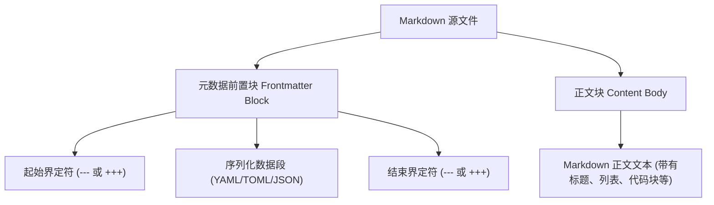

# Frontmatter 语法与格式规范

Frontmatter 允许开发者在 Markdown 文件最顶部定义结构化元数据。要构建一个稳健的博客引擎或文档系统，首先必须掌握主流元数据格式的语法规范、潜在陷阱以及其底层的提取解析机制。

---

## 主流 Frontmatter 格式对比

在实际开发中，最常见的三种 Frontmatter 格式为 **YAML**、**TOML** 和 **JSON**。它们各自有不同的界定符和语法逻辑。

### 1. YAML Frontmatter
YAML (YAML Ain't Markup Language) 是使用最广泛的格式。它以其简洁、人类可读性高以及对复杂嵌套结构的支持而著称。在 Markdown 中，YAML 块由前后的三减号（`---`）进行包裹。

```yaml
---
title: "深入研究 YAML 元数据"
date: 2026-05-30T20:30:00+08:00
draft: false
tags:
  - Markup
  - Markdown
author:
  name: "hengvvang"
  email: "hengvvang@example.com"
# 这是一个注释
description: >
  这是一个折行字符串。
  在解析后，所有的换行符都会被转换为空格，
  非常适合编写冗长的 SEO 描述。
summary: |
  这是一个保留换行的多行字符串。
  换行符会被原样保留下来。
---
# 这里是 Markdown 正文
```

### 2. TOML Frontmatter
TOML (Tom's Obvious, Minimal Language) 是 Hugo 等 Go 语言生态静态站点生成器的默认选项。它以强类型和清晰的键值映射为特点，使用三加号（`+++`）作为包裹界定符。

```toml
+++
title = "深入研究 TOML 元数据"
date = 2026-05-30T20:30:00+08:00
draft = false
tags = ["Markup", "Markdown"]

[author]
name = "hengvvang"
email = "hengvvang@example.com"

# 多行字符串使用三个双引号
description = """
这是一个 TOML 格式的多行字符串，
同样可以很方便地记录文章摘要。
"""
+++
# 这里是 Markdown 正文
```

### 3. JSON Frontmatter
在 JavaScript 和 Node.js 生态的某些轻量级构建工具中，JSON Frontmatter 也占有一席之地。它使用 `---json` 作为起始界定符，并以 `---` 作为结束界定符。

```json
---json
{
  "title": "深入研究 JSON 元数据",
  "date": "2026-05-30T20:30:00+08:00",
  "draft": false,
  "tags": [
    "Markup",
    "Markdown"
  ],
  "author": {
    "name": "hengvvang",
    "email": "hengvvang@example.com"
  }
}
---
# 这里是 Markdown 正文
```

---

## 语法细则与常见陷阱

### YAML 的致命陷阱
YAML 虽然可读性强，但其规范过于宽泛，导致在解析时存在许多不易察觉的 Bug：

1.  **Tab 与空格（Indentation）**：YAML 严格禁止使用 Tab 制表符进行缩进，必须使用纯空格。如果不小心混入了 Tab，解析器会抛出 `YAMLException: bad indentation` 错误。
2.  **冒号后必须加空格（Colon Spacing）**：YAML 中的键值对分隔符是冒号加空格 `键: 值`。如果不小心写成了 `title:Deep Dive`（缺少空格），解析器会将其当作完整的字符串键 `"title:Deep Dive"`，而该键对应的值则为空。
3.  **未转义的冒号（Unescaped Colons）**：如果字段的值包含冒号（例如文章的副标题），必须用双引号或单引号将整个值包围：
    *   *错误示范*：`title: 深入浅出: Frontmatter 指南`（解析器会误认为 `深入浅出` 是键，且后续存在非法嵌套）。
    *   *正确示范*：`title: "深入浅出: Frontmatter 指南"`。
4.  **布尔值隐式转换（Implicit Booleans）**：在旧版 YAML 1.1 规范中，诸如 `yes`, `no`, `on`, `off` 会被隐式解析为布尔值。这意味着如果你的文章标签中写了 `tags: [html, no, css]`，`no` 可能会被解析为布尔值 `false` 而不是字符串 `"no"`。**最佳实践：对于布尔值只使用原生的 `true` 或 `false`，其他可能产生歧义的词全部加双引号。**

### TOML 的时区与结构控制
1.  **日期格式规范**：TOML 对日期格式有着极强的约束力。它要求采用 RFC 3339 格式，如 `2026-05-30T20:30:00+08:00`。任何不规范的日期字符串都会导致整个块解析失败。
2.  **表格段落的声明顺序**：在 TOML 中，子表（如 `[author]`）的声明必须放在普通的顶层键值对之后。如果在子表之后又定义了顶层变量，该变量会被归属到该子表中：
    ```toml
    # 错误：draft 变成了 author 对象的属性！
    [author]
    name = "hengvvang"
    draft = false
    ```

---

## 格式对比矩阵

| 特性 | YAML | TOML | JSON |
| :--- | :--- | :--- | :--- |
| **界定符** | `---` | `+++` | `---json` / `---` |
| **可读性** | 极高（免标点符号） | 高（类似 ini 配置文件） | 一般（大量的括号和双引号） |
| **嵌套支持**| 基于空格缩进 | 基于 `[table]` 结构 | 基于嵌套 JSON 对象 |
| **日期支持**| 原生 ISO 8601 支持 | 原生 RFC 3339 支持 | 仅支持字符串（需二次解析） |
| **容错率** | 较低（对缩进/空格高度敏感）| 较高（强语法报错提示明确） | 极低（不允许逗号多余/缺失） |
| **解析速度**| 较慢（解析规则极其庞杂） | 适中 | 极快（引擎原生支持） |

---

## Markdown 文件物理结构

在磁盘上，包含 Frontmatter 的 Markdown 文件并不是纯粹的文档，而是被划分为元数据区和正文区两个部分的复合文本。



---

## 解析器底层实现原理

要从 Markdown 中解析 Frontmatter，编译器通常遵循以下步骤：
1.  检测文件的第一行是否为界定符。
2.  定位下一个相同界定符的行号。
3.  提取两界定符之间的内容，送入对应格式的解析器（如 YAML 解析器、TOML 解析器）。
4.  将界定符之后的所有文本作为 Markdown 正文保留。

下面是一个生产级别的 Node.js 脚本，它能够在**跨平台（兼容 Windows `\r\n` 与 Unix `\n` 换行符）**的前提下，精准提取并解析 YAML Frontmatter。

```javascript
/**
 * 生产级 Markdown Frontmatter 解析器 (支持 Windows/Unix 换行)
 * 依赖安装: npm install js-yaml
 */
const fs = require('fs');
const yaml = require('js-yaml');

/**
 * 解析带有 Frontmatter 的 Markdown 文本
 * @param {string} rawContent 原始文件内容
 * @returns {Object} { data: 元数据对象, content: 正文文本 }
 */
function parseFrontmatter(rawContent) {
  // 兼容不同操作系统的换行符，统一转化为 \n，但保留原长度信息
  const normalized = rawContent.replace(/\r\n/g, '\n');
  
  // 检查是否以 YAML 分隔符 "---" 开头
  if (!normalized.startsWith('---\n')) {
    return { data: {}, content: rawContent };
  }

  // 寻找结束分隔符 "\n---\n"
  const endIdx = normalized.indexOf('\n---\n', 4);
  if (endIdx === -1) {
    return { data: {}, content: rawContent };
  }

  // 截取 YAML 数据块
  const yamlContent = normalized.slice(4, endIdx);
  // 截取正文数据块（加 5 是因为 "\n---\n" 的长度为 5）
  // 为了不破坏原始内容的行尾换行符，我们在原 rawContent 上进行截取
  // 需要计算原 rawContent 对应的真实偏移量
  const lines = rawContent.split(/\r?\n/);
  
  let yamlLinesCount = 0;
  let lineIndex = 0;
  
  // 遍历行以计算 frontmatter 的结束行号
  for (let i = 0; i < lines.length; i++) {
    if (i === 0 && lines[i].trim() === '---') {
      continue;
    }
    if (lines[i].trim() === '---') {
      yamlLinesCount = i;
      break;
    }
  }

  let data = {};
  try {
    // 使用 js-yaml 的安全解析方法，避免执行任意代码
    data = yaml.load(yamlContent) || {};
  } catch (e) {
    throw new Error(`YAML Frontmatter 解析失败: ${e.message}`);
  }

  // 正文内容为从结束分隔符下一行起的全部内容
  const content = lines.slice(yamlLinesCount + 1).join(rawContent.includes('\r\n') ? '\r\n' : '\n');

  return { data, content };
}

// 示例用法：
// const { data, content } = parseFrontmatter(fs.readFileSync('post.md', 'utf-8'));
// console.log("元数据:", data);
// console.log("正文:", content);

module.exports = { parseFrontmatter };
```
