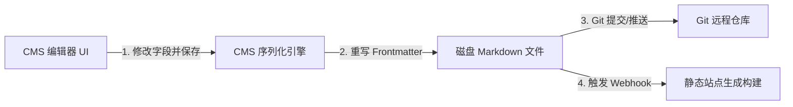

# 静态生成器与 Headless CMS 的集成与解析原理

Frontmatter 并非独立存在，它的价值在于静态站点生成器（SSG）和无头内容管理系统（Headless CMS）对它的读取、解析、渲染以及写入。理解各大框架的解析机制并具备在 AST（抽象语法树）层面定制管道的能力，是开发大型企业文档系统的分水岭。

---

## 静态生成器（SSG）解析模型

不同的 SSG 在处理 Frontmatter 时，有着各自独特的架构设计与 API 访问方式。

### 1. Hugo (Go 语言生态)
Hugo 是公认构建速度极快的静态生成器。它原生支持 YAML、TOML 和 JSON 格式，且在解析上采用了“双轨制”：
*   **内置系统变量映射**：Hugo 会自动将标准字段（如 `title`, `date`, `description`, `draft`）映射到页面的根级属性。在 HTML 模板中，可以直接通过 `{{ .Title }}` 或 `{{ .Date }}` 访问。
*   **自定义参数映射**：任何非内置的自定义字段，都会被放入 `.Params` 字典中。例如 `tags: ["Go"]` 需要通过 `{{ .Params.tags }}` 访问。特别需要注意的是，**Hugo 会将 `.Params` 下所有的自定义键名强制转化为小写**。
*   **级联机制（Cascade）**：Hugo 支持在 Frontmatter 中使用 `cascade` 关键字，将某些元数据递归传递给所有的子页面或子目录。
    ```yaml
    # content/sections/_index.md
    cascade:
      banner: "/images/default-banner.png"
      sharing: true
    ```

### 2. Jekyll (Ruby 生态)
Jekyll 是 Frontmatter 的开山鼻祖。在 Jekyll 中，所有的元数据都被统一解析并挂载在 Liquid 模板的 `page` 对象上，例如 `{{ page.title }}`。
*   **全局默认配置**：为了减少每篇文章的 Frontmatter 重复编写，Jekyll 允许在根目录的 `_config.yml` 中定义 `defaults` 规则，针对特定路径的文件预设默认 Frontmatter 值。

### 3. Astro (现代 JS 生态)
Astro 在设计上将 Markdown/MDX 视为一等公民，并在构建期集成了强大的 **Content Collections (内容集合)** 引擎。
*   **类型安全**：Astro 强制要求开发者在 `src/content/config.ts` 中定义集合 Schema，利用 Zod 在构建时进行校验。
*   **数据访问**：

```typescript
// src/content/config.ts
import { defineCollection, z } from 'astro:content';

const blogCollection = defineCollection({
  type: 'content',
  schema: z.object({
    title: z.string(),
    tags: z.array(z.string()),
    draft: z.boolean().default(false),
  }),
});

export const collections = {
  'blog': blogCollection,
};
```

在 Astro 页面（`.astro`）中，即可通过类型安全的方式消费这些数据：

```astro
---
// src/pages/posts.astro
import { getCollection } from 'astro:content';
const posts = await getCollection('blog', ({ data }) => !data.draft);
---
<ul>
  {posts.map(post => (
    <li>
      <a href={`/posts/${post.slug}`}>{post.data.title}</a>
      {/* post.data.title 具有完备的 TypeScript 类型推导 */}
    </li>
  ))}
</ul>
```

### 4. Next.js & Contentlayer
对于基于 React/Next.js 开发的站点，**Contentlayer** 提供了类似 Astro 的体验。它作为一个独立的数据层运行，在后台监视 Markdown 文件夹的变化，实时解析 Frontmatter 并在 `.contentlayer/generated` 中动态输出 TypeScript 定义和静态 JSON 文件，使得 Next.js 页面可以像读取本地 API 一样导入文章元数据。

---

## Headless CMS 交互与读写逻辑

Headless CMS（如 Decap CMS、Tina CMS）以及本地开发辅助工具（如 VS Code 的 **Front Matter** 扩展）并不维护数据库，而是直接读写 Git 仓库中的 Markdown 源文件。



### 1. Tina CMS (基于 Git 的实时可视化 CMS)
Tina CMS 允许在浏览器中直接预览修改。它要求开发者编写一个 `tina/config.ts` 配置文件，描述 Markdown 中 Frontmatter 的字段结构（例如 String、Number、Reference 关联等）。当用户在浏览器中拖动滑块或修改文本时，Tina CMS 会实时更新本地 Markdown 文件头部的 YAML 块并触发页面的热更新。

### 2. VS Code Front Matter 插件
这是一款出色的本地 IDE 插件。它会在 VS Code 侧边栏提供一个可视化的面板，直接抓取当前 Markdown 文件的 Frontmatter。
*   **标签管理**：它能够从项目的所有 Markdown 文件中提取已有的 `tags` 列表，提供下拉联想输入，防止开发者录入同义但拼写不同的标签（例如 `javascript` 与 `JS`）。

### 3. 多语言（I18n）元数据架构设计
在国际化多语言网站中，Frontmatter 扮演着桥梁的作用：
*   **关联键（Translation Key）**：对于同一篇文章的不同语言版本，通常在 Frontmatter 中配置相同的 `translationKey`（或使用相同的文件路径名）。
*   **语言标识**：通过 `lang: zh-CN` 和 `lang: en-US` 区分目标受众，静态生成器据此生成对应的语言子路由（例如 `/zh/blog/...` 与 `/en/blog/...`）。

---

## AST 编译层：自定义 Remark 插件开发

在实际工程中，我们常常需要对 Frontmatter 进行动态改造。例如：**自动计算文章的字符数，并估算出阅读时间，然后将 `readingTime` 动态注入到 Frontmatter 对象中，避免作者手动计算。**

在 JavaScript 的 Markdown 编译链中，Unified / Remark 生态占据统治地位。Markdown 会首先被转化为 MDAST（Markdown 抽象语法树），随后我们可以编写 Remark 插件对树节点进行操作。

下面是一个完整的、可直接运行的 ESM 规范 Remark 插件，演示了如何通过 AST 提取 Markdown 正文并向元数据中追加字段。

```javascript
/**
 * file: remark-reading-time.js
 * 作用: 自定义 Remark 插件，统计正文字符数并动态注入阅读时间到 Frontmatter 中。
 * 运行依赖: npm install unified remark-parse remark-frontmatter yaml
 */

import { visit } from 'unist-util-visit';
import yaml from 'yaml';

export default function remarkReadingTime() {
  return function (tree, file) {
    let wordCount = 0;

    // 1. 遍历 AST，仅统计文本节点（Text Node）和代码节点（Code Node）的字符长度
    visit(tree, (node) => {
      if (node.type === 'text' || node.type === 'code') {
        // 过滤掉空白字符，累加字符数
        const text = node.value.replace(/\s+/g, '');
        wordCount += text.length;
      }
    });

    // 假设中文普通人阅读速度为 350 字/分钟，英文 200 字/分钟
    // 这里采用综合估算率：每 300 个字符对应 1 分钟阅读时间
    const readingTimeMin = Math.max(1, Math.ceil(wordCount / 300));

    // 2. 寻找并更新 AST 中的 YAML 节点
    let frontmatterNode = null;
    visit(tree, 'yaml', (node) => {
      frontmatterNode = node;
    });

    let currentData = {};
    if (frontmatterNode) {
      try {
        // 解析当前的 YAML 内容
        currentData = yaml.parse(frontmatterNode.value) || {};
      } catch (err) {
        file.fail(`解析 YAML 失败: ${err.message}`, frontmatterNode);
      }
    }

    // 3. 动态注入计算出的阅读时间与字数统计
    currentData.readingTime = `${readingTimeMin} min read`;
    currentData.wordCount = wordCount;

    // 将追加数据后的对象重新序列化回 YAML 格式并写回节点
    if (frontmatterNode) {
      frontmatterNode.value = yaml.stringify(currentData).trim();
    } else {
      // 如果原本没有 Frontmatter，则在 AST 顶部插入一个新的 YAML 节点
      const newYamlNode = {
        type: 'yaml',
        value: yaml.stringify(currentData).trim(),
      };
      tree.children.unshift(newYamlNode);
    }

    // 4. 将数据同时挂载到 vfile 的 data 属性上，便于下游组件（如 HTML 模板）直接消费
    file.data.frontmatter = currentData;
  };
}
```

---

## 性能考量与大规模构建优化

当静态站点的 Markdown 文档数量达到数千篇甚至数万篇时，Frontmatter 的解析时间会显著影响整体构建速度：

1.  **避免在循环中重复实例化解析器**：确保 YAML/TOML 解析模块（如 `js-yaml`）仅初始化一次，并在整个编译生命周期中重用。
2.  **增量编译与缓存（Incremental Build）**：像 Hugo 这样优秀的工具，会对未发生变化的 Markdown 文件跳过 Frontmatter 解析和 AST 构建，直接从前一次构建的中间缓存中读取渲染好的 HTML 片段。在 JS 生态中，可以利用 `mtime`（文件最后修改时间）或文件 MD5 Hash 来设计文件级别的缓存。
3.  **减少不必要的正则提取**：正则引擎的回溯机制在处理极大文本时开销巨大。如果只需要提取 Frontmatter 而不渲染正文，请使用流式读取（ReadStream）在读到第二个 `---` 时立即关闭文件，避免将数万行的 Markdown 正文读入内存中。
