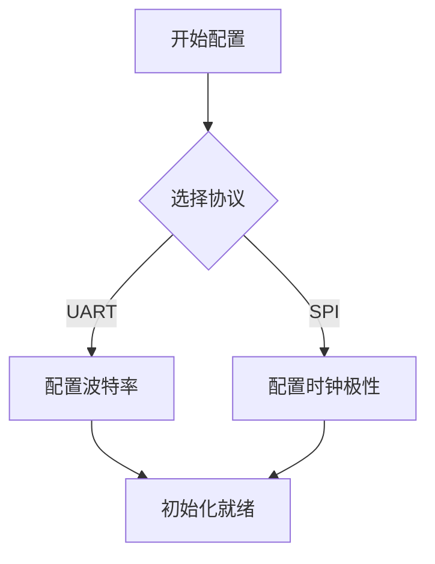

# Markdown 深度实践：使用 Mermaid 绘制流程图

Mermaid 是一款基于 JavaScript 的图表渲染工具，它允许你在 Markdown 中直接使用文本代码编写流程图、时序图、甘特图等多种图表。

## 基础流程图代码

在支持 Mermaid 的编辑器中输入以下代码块：

```text

```

这会转换为一张精美的拓扑渲染图。相较于插入外部图片，这种文本化制图方式非常容易在版本控制中编辑和更新。