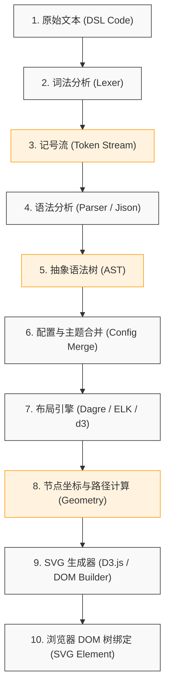

# Mermaid 核心原理与渲染机制

要精通 Mermaid 绘图并解决生产环境下的渲染异常与性能瓶颈，首先必须洞悉其底层的编译原理、布局算法及 DOM 渲染管线。Mermaid 并不是一个简单的图形拼接工具，而是一个完整的“领域特定语言（DSL）编译器”。

---

## 1. Mermaid 编译与渲染生命周期

当浏览器或 Markdown 渲染器加载包含 ` ```mermaid ` 的代码块时，Mermaid 的运行时（Runtime）会启动一条复杂的渲染流水线（Pipeline）。以下是该流水线的核心阶段：



### 1.1 词法分析（Lexing）与语法分析（Parsing）
Mermaid 的解析器底层主要基于 **Jison**（一个用 JavaScript 编写的解析器生成器，类似于 Bison/Yacc）。
- **词法分析器（Lexer）**：扫描原始的 Markdown 文本块，过滤掉无关字符，根据特定的正则表达式将诸如 `graph`, `-->`, `subgraph` 等关键字转换为内部的 Token（记号）。
- **语法分析器（Parser）**：根据预先定义好的语法规则（Grammar Files, `.jison`），校验 Token 流的结构是否合法。如果符合规则，解析器将构建出对应的 **AST（Abstract Syntax Tree，抽象语法树）**。

例如，对于以下声明：
```text
graph LR
    A[Client] -->|HTTP| B(Server)
```
其生成的 AST（简化表示）在内存中呈现为一个图的数据结构：
```json
{
  "type": "flowchart",
  "direction": "LR",
  "nodes": [
    { "id": "A", "label": "Client", "shape": "rect" },
    { "id": "B", "label": "Server", "shape": "round" }
  ],
  "edges": [
    { "start": "A", "end": "B", "text": "HTTP", "type": "arrow" }
  ]
}
```

---

## 2. 布局引擎与坐标计算（Layout Engines）

在得到图的拓扑结构（即哪些节点相连）后，最大的挑战是如何决定每个节点在二维空间中的具体坐标 `(x, y)`，以及连接它们的贝塞尔曲线路径（Edges）。Mermaid 依赖于以下几种主流的布局计算库：

### 2.1 Dagre & Dagre-d3
对于**流程图（Flowchart）**，Mermaid 默认使用 **Dagre**。Dagre 是一个基于 Sugiyama 框架的有向图布局算法实现。
其布局步骤如下：
1. **去环（Cycle Removal）**：若图中有循环，临时翻转某些边，使其成为有向无环图（DAG）。
2. **分层（Layer Assignment / Ranking）**：利用网络单纯形算法（Network Simplex），决定每个节点应该处在图的第几层。
3. **节点排序（Node Ordering）**：通过重心启发式（Barycenter Heuristic）算法对每层内的节点进行排序，最大程度减少连线交叉（Crossings）。
4. **坐标分配（Coordinate Assignment）**：分配具体的 `x` 和 `y` 坐标，确保节点之间有足够的间距，并且边尽可能直。
5. **路径绘制（Edge Routing）**：计算控制点，用 B 样条曲线（B-splines）绘制避开节点的路径。

### 2.2 ELK (Eclipse Layout Kernel)
在较新版本的 Mermaid 中，引入了对 **ELK** 布局引擎的支持（通过配置项 `layout: elk`）。ELK 提供了更为高级的排版选项，如正交布局（Orthogonal Layout）和更强的大图排版能力，特别适合处理节点数量超过 100 的复杂微服务拓扑图或电路图。

---

## 3. DOM 渲染与运行时安全性（Security Sandbox）

由于 Mermaid 输出的是 SVG 代码，直接将其插入到宿主 HTML 页面中存在严重的**跨站脚本攻击（XSS）**隐患。例如，恶意的图表代码可能尝试在节点 Label 中注入 `<script>` 标签或 JavaScript 伪协议：
```text
graph TD
    A[""]
```

为了抵御这类攻击，Mermaid 设计了多层防御机制：

### 3.1 安全级别（Security Levels）
Mermaid 的 `securityLevel` 配置参数控制了渲染时的安全屏障等级：
- **`strict`（默认值）**：拒绝渲染 HTML 标签，所有的 HTML 实体都将被转义。
- **`antiscript`**：允许部分安全的 HTML 标签（如 `br`, `b`, `i` 等），但通过 DOMPurify 库过滤掉任何可能执行 JavaScript 的属性（如 `onload`, `onclick`, `onerror`）及 `javascript:` 链接。
- **`loose`**：完全不设防，信任所有输入的 HTML 内容（仅适用于受信任的本地环境或静态构建期）。
- **`sandbox`**：在一个不可见的 `<iframe>` 沙箱中执行渲染，并将生成的静态 SVG 序列化后拷贝回宿主页面。由于 iframe 处于隔离域，恶意脚本无法窃取宿主页面的 Cookie 或访问父窗口 DOM。

---

## 4. 生产级初始化配置参考

在实际的 mdBook、Docusaurus 或自定义前端平台集成中，不推荐直接使用无参的 `mermaid.initialize({})`。以下是一份经过工业界验证的、包含性能调优与安全加固的配置示例：

```javascript
// mermaid_config.js
// 生产级 Mermaid 初始化配置示例

mermaid.initialize({
  // 1. 启动与解析选项
  startOnLoad: true,             // 页面加载完成后是否自动寻找 .mermaid 类并渲染
  maxTextSize: 50000,            // 限制单张图表的最大字符数，防止超大文本导致浏览器崩溃（防 DDOS）
  securityLevel: 'strict',       // 严格模式，防御恶意 DOM 注入与 XSS 攻击
  
  // 2. 主题与视觉样式
  theme: 'forest',               // 选用默认主题：default, dark, forest, neutral
  themeVariables: {
    fontFamily: '"Fira Code", "PingFang SC", sans-serif', // 自定义全局字体
    fontSize: '14px',            // 基准字号
    primaryColor: '#e1f5fe',     // 节点背景色
    primaryBorderColor: '#0288d1',// 节点边框色
    lineColor: '#607d8b'         // 连线颜色
  },

  // 3. 流程图（Flowchart）专项优化
  flowchart: {
    htmlLabels: false,           // 禁用 HTML Label，改用纯 SVG Text 渲染，防止布局漂移
    curve: 'basis',              // 曲线弯折算法：basis (平滑), linear (直折线), cardinal
    useMaxWidth: true,           // 开启响应式缩放，SVG 将带有 viewBox 并适应容器宽度
    diagramPadding: 8,           // 图表外边距
    rankSpacing: 50,             // 层级之间的纵向距离（TB 布局下）
    nodeSpacing: 40              // 同一层内节点之间的横向距离
  },

  // 4. 时序图（Sequence Diagram）专项优化
  sequence: {
    actorMargin: 50,             // 参与者（Actor）盒子的左右间距
    width: 150,                  // 参与者盒子的默认宽度
    height: 65,                  // 参与者盒子的默认高度
    boxMargin: 10,               // 消息箭头的上下间距
    messageFontSize: 12,         // 消息字号
    mirrorActors: true,          // 当图表较长时，是否在底部也渲染一份 Actor 列表
    showSequenceNumbers: false,  // 是否显示消息序号（1, 2, 3...）
    wrap: true                   // 参与者名称文本过长时是否自动换行
  },

  // 5. 状态图（State Diagram）专项优化
  state: {
    dividerWidth: 2,             // 并发状态分隔线的宽度
    dividerMargin: 8,            // 分隔线边距
    animationDefs: ''            // 禁用不必要的 CSS 动画以提升移动端性能
  }
});
```

通过这一套底层渲染流水线以及精细化参数控制，我们可以大幅提高图表渲染的稳定性和页面加载性能，下一章我们将深入剖析具体图表类型的语法与建模规范。
