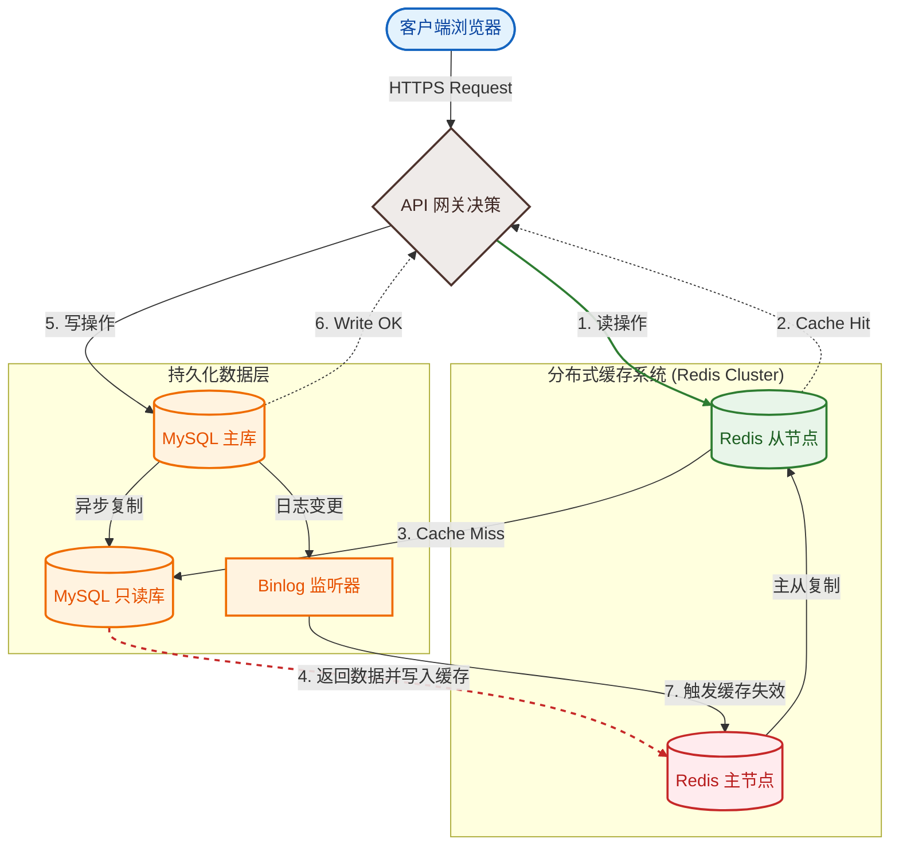
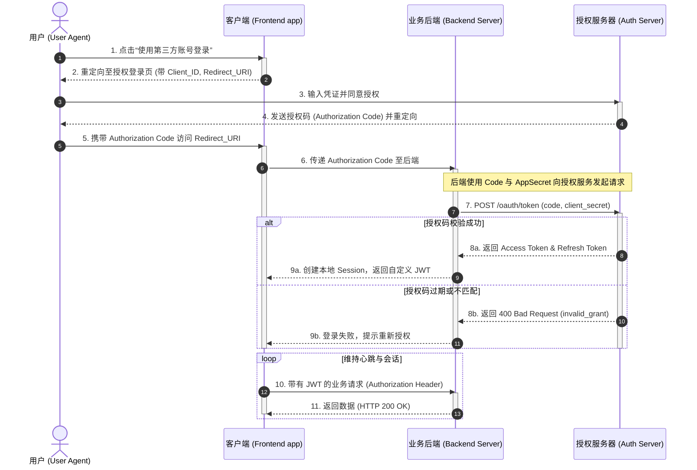
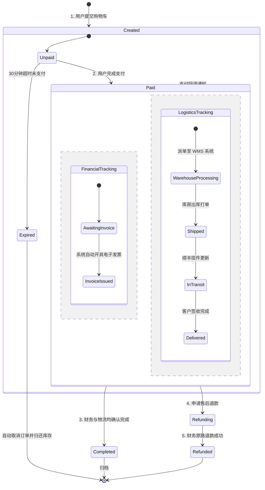
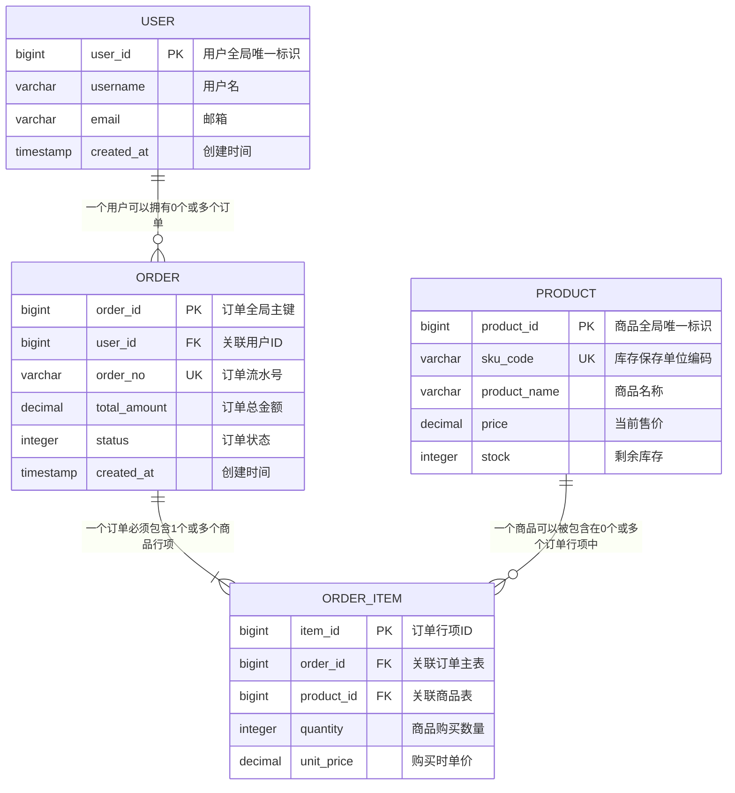
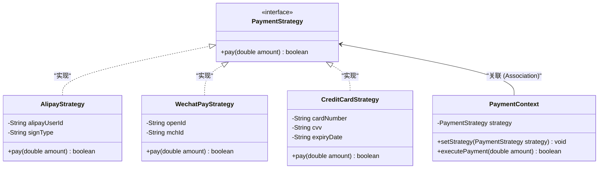

# 主流图表语法与多场景建模

在本章中，我们将深入探讨 Mermaid 中最常用的五种系统设计图表。所有示例均采用真实生产场景（如高并发架构、OAuth 2.0 认证流、订单状态机及电商数据模型），并附带详细的行级注释与设计考量。

---

## 1. 流程图（Flowcharts）

流程图是表达拓扑结构、业务决策控制流最直观的工具。在 Mermaid 中，流程图通过 `graph` 或 `flowchart` 声明。建议使用最新版本的 `flowchart`，它在渲染算法和节点边框连接上更具优化。

### 1.1 核心语法与形状速查
*   **布局方向**：`TB` (Top to Bottom), `BT` (Bottom to Top), `LR` (Left to Right), `RL` (Right to Left)。
*   **节点形状**：
    *   矩形：`id[Text]`
    *   圆角矩形：`id(Text)`
    *   体育场形：`id([Text])`
    *   圆柱形（数据库）：`id[(Text)]`
    *   菱形（决策分支）：`id{Text}`
    *   平行四边形：`id[\Text\]` 或 `id[/Text/]`
*   **连线样式**：
    *   实线带箭头：`A --> B`
    *   粗实线：`A ==> B`
    *   虚线：`A -.-> B`
    *   无箭头连线：`A --- B`
    *   带文本的连线：`A -->|描述| B` 或 `A -- 描述 --> B`

### 1.2 生产级案例：多级缓存与写穿透拓扑

以下是一个包含了子图（Subgraph）嵌套、多节点形状和自定义 CSS 类样式的微服务读取/写入缓存控制流程：

---

## 2. 时序图（Sequence Diagrams）

时序图用于描述对象或系统之间依时间顺序进行的交互。它极其适合分析微服务间的同步 RPC 调用和异步消息队列（MQ）推送。

### 2.1 核心语法要素
*   **参与者声明**：`participant` 或 `actor`，可通过 `as` 关键字定义别名。
*   **消息箭头**：
    *   实线带实心箭头（同步调用）：`->>`
    *   虚线带实心箭头（同步返回）：`-->>`
    *   实线带非实心箭头（异步调用）：`->`
    *   虚线带非实心箭头（异步返回）：`-->`
*   **激活区间**：在发送端或接收端使用 `activate` 和 `deactivate`，或直接在箭头后追加 `+` 和 `-`。
*   **条件分支与循环**：使用 `alt/else` 表示分支逻辑，使用 `loop` 表示循环逻辑，使用 `opt` 表示可选步骤。
*   **并行计算**：使用 `par` 块包围并发操作。

### 2.2 生产级案例：OAuth 2.0 授权码模式交互流

以下详细刻画了用户、第三方客户端、后端网关以及授权服务器之间的 Token 获取全生命周期：

---

## 3. 状态图（State Diagrams）

状态图是设计复杂业务实体（如订单状态、交易链路、工作流审批）生命周期的核心利器，能有效防止非法状态转移漏洞。

### 3.1 核心语法要素
*   **初始与终态**：用 `[*]` 表示。
*   **状态转移**：`State1 --> State2 : TriggerEvent`。
*   **复合状态**：在一个状态内定义子状态，形成嵌套结构。
*   **并发状态**：在一个复合状态内部，使用 `--` 分割多个同时运行的并行状态线。

### 3.2 生产级案例：微服务订单生命周期状态机

下面是一个结合了并发状态（支付与物流跟踪并行）和复合状态的典型电商订单状态图：

---

## 4. 实体关系图（ER Diagrams）

在设计关系型数据库时，ER 图用于表示数据表之间的物理或逻辑关系。

### 4.1 关系基数符号
*   `||--||`：一且仅有一（One and only one）
*   `||--o{`：零个或多个（Zero or many）
*   `||--|{`：一个或多个（One or many）
*   `o|--|{`：一个或多个（非强依赖）

### 4.2 生产级案例：电商交易系统核心模型

此案例描述了用户、订单、订单项与商品之间的关联性，并列出了关键字段及约束属性：

---

## 5. 类图（Class Diagrams）

对于静态代码结构以及设计模式的讲解，类图是不可或缺的表达方式。

### 5.1 生产级案例：策略设计模式（Strategy Pattern）的实现

以下是一个支付系统中使用策略模式（Strategy Pattern）进行结算的面向对象类图设计：

通过这一章的代码实例，你可以直接拷贝这些结构模板到你的 Markdown 文件中，并根据实际业务快速替换节点信息。在下一章，我们将讨论在大型项目中文档可视化排版的最优工程实践。
