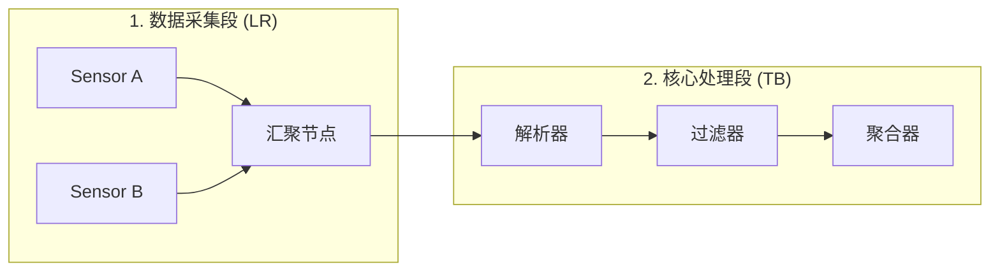
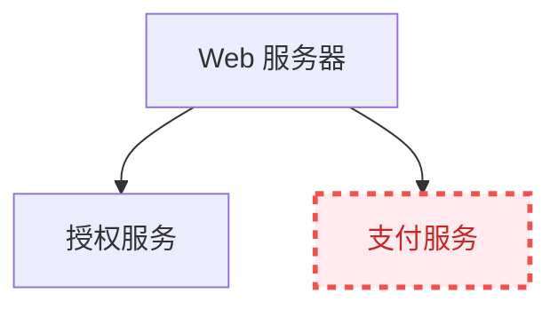

# 系统工程文档与架构可视化最佳实践

在团队协作和复杂系统维护中，随着架构的演进，Mermaid 代码库也会面临“图表膨胀”、“布局崩溃”和“加载缓慢”等工程挑战。本章归纳了一套用于生产级系统工程文档的 Mermaid 最佳实践，以应对大型复杂图表的防御性排版、企业视觉规范定制以及编译期静态化流水线。

---

## 1. 复杂图表的排版防御与布局优化

当节点数量超过 30 个时，默认的布局引擎（如 Dagre）极易产生严重的连线交错、长节点溢出以及“面条图”现象。通过以下排版技巧，可有效进行“防御性排版”：

### 1.1 分治原则：多层嵌套子图与方向管理
在一个超大的流程图中，如果全部节点都在同一个顶级作用域下，布局引擎的计算自由度过高，极易导致混乱。合理划分 `subgraph` 可以强行约束引擎将特定节点群聚合在一起，并为其指定局部的布局方向。



### 1.2 物理尺寸控制：防御大图溢出
大型 SVG 图表在移动端或窄屏阅读器中往往会缩放到肉眼难辨的程度。为了解决这个问题，可以通过 CSS 样式对渲染容器进行强制约束，使其在超出屏幕宽度时显示横向滚动条，而非无限制缩小：

```css
/* 自定义应用于 Markdown 中 Mermaid 容器的 CSS */
.mermaid-scroll-container {
    width: 100%;
    overflow-x: auto; /* 允许横向滚动 */
    overflow-y: hidden;
    padding: 15px 0;
    -webkit-overflow-scrolling: touch;
}

.mermaid-scroll-container svg {
    max-width: none !important; /* 阻止 SVG 被强制缩放到 100% 容器宽 */
    height: auto;
}
```
*在 Markdown 中，可以使用原生 HTML 标签包裹 Mermaid 代码块来实现该容器效果（如宿主渲染器支持原生标签）：*
```html
<div class="mermaid-scroll-container">
```

```html
</div>
```

### 1.3 连线优化：减少交错的经验法则
1.  **节点 ID 有序化**：按执行逻辑从上到下或从左到右声明节点代码。虽然 Mermaid 是声明式的，但词法解析器的读取顺序会微弱影响 Dagre 引擎的初分配矩阵。
2.  **善用隐式连接符**：如果只是想约束节点的纵向层级关系，但不想要明显的箭头，可以使用 `---` 或 `-.->` 代替 `-->`，甚至可以通过修改 `linkStyle` 将特定边的透明度设为 0，用于辅助定位。
3.  **提取主干**：将异常流（如 Timeout、Error Handling）的返回路径使用虚线（`-.->`）进行渲染。这有助于布局引擎降低这些次要路径的权重，使主干链路（Happy Path）保持居中且平直。

---

## 2. 企业视觉规范定制与 CSS 注入

为了保持与企业 VI（视觉识别系统）的一致性，Mermaid 支持在配置和代码块中进行精细的颜色及字体控制。

### 2.1 基于 `themeVariables` 的配置重载
如在第 1 章中所述，通过传入 `themeVariables` 可以覆盖诸如边框、字体、背景等参数。针对常用的深色/浅色主题切换，可以采用以下配置模板：

```javascript
// 浅色企业主题配置
const lightCorporateTheme = {
  theme: 'base',
  themeVariables: {
    background: '#ffffff',
    primaryColor: '#f4f5f7',
    primaryTextColor: '#172b4d',
    primaryBorderColor: '#dfe1e6',
    lineColor: '#4c9aff',
    secondaryColor: '#f3f0ff',
    tertiaryColor: '#e6fcf5'
  }
};
```

### 2.2 在 Markdown 内部使用 `classDef` 实现局部高亮
在复杂的系统排错文档中，我们常常需要突出高亮显示“当前故障组件”。可以直接在 Mermaid 代码底部声明并绑定样式类：



---

## 3. 构建工程化与 CI/CD 自动化集成

在大型静态网站构建（如使用 mdBook、Docusaurus 或 Hexo 等工具）中，采用客户端浏览器实时解析渲染 Mermaid.js 存在两个严重痛点：
1.  **FOUC（无样式内容闪烁）**：页面刚加载时显示为纯文本代码，等 JS 加载完成后才突然闪烁变成 SVG。
2.  **SEO 不友好**：网络爬虫只能抓取到原始的 Mermaid 文本，而无法索引 SVG 中的图形文字信息。
3.  **PDF 导出失败**：在静态文档导出为 PDF 时，由于 JS 未运行，图表通常无法展示。

### 3.1 解决方案：使用 `@mermaid-js/mermaid-cli` 进行静态化编译
我们可以在 CI/CD 阶段将 Markdown 中的 Mermaid 代码块提前编译为静态的 SVG 矢量图，替换原始代码块后，再输出给 mdBook 进行构建。

#### 步骤一：安装 Mermaid 命令行工具
在构建服务器上通过 npm 安装：
```bash
npm install -g @mermaid-js/mermaid-cli
```

#### 步骤二：编写预编译处理脚本（Node.js / PowerShell）
以下是一个实用的 PowerShell 脚本示例，用于自动扫描 `src` 下的 `.md` 文件，提取 Mermaid 代码块并调用 `mmdc` 工具渲染为同名的本地 SVG 镜像，从而避免客户端渲染开销。

```powershell
# compile_mermaid.ps1
# 自动化编译 Markdown 内嵌 Mermaid 为静态 SVG 的脚本

$sourceDir = "./src"
$outputImageDir = "./src/images/mermaid"

# 确保图片存放目录存在
if (!(Test-Path $outputImageDir)) {
    New-Item -ItemType Directory -Force -Path $outputImageDir | Out-Null
}

# 递归寻找所有的 markdown 文件
$mdFiles = Get-ChildItem -Path $sourceDir -Filter "*.md" -Recurse

foreach ($file in $mdFiles) {
    Write-Host "Processing file: $($file.FullName)"
    $content = Get-Content -Path $file.FullName -Raw
    
    # 匹配 ```mermaid ... ``` 的正则
    # 使用 Windows 安全的匹配组
    $regex = '(?s)```mermaid\r?\n(.*?)\r?\n```'
    $matches = [regex]::Matches($content, $regex)
    
    $index = 1
    $modifiedContent = $content
    
    foreach ($match in $matches) {
        $mermaidCode = $match.Groups[1].Value
        $tempCodeFile = [System.IO.Path]::GetTempFileName()
        $tempCodeFile = [System.IO.Path]::ChangeExtension($tempCodeFile, ".mmd")
        
        # 将提取的代码写入临时 .mmd 文件
        Set-Content -Path $tempCodeFile -Value $mermaidCode -Encoding utf8
        
        # 输出图片路径
        $baseName = [System.IO.Path]::GetFileNameWithoutExtension($file.Name)
        $outputSvgName = "${baseName}_diag_${index}.svg"
        $outputSvgPath = Join-Path $outputImageDir $outputSvgName
        $relativeSvgPath = "images/mermaid/${outputSvgName}"
        
        # 调用 mmdc (mermaid-cli) 编译为 SVG
        Write-Host "Compiling diagram $index..."
        $proc = Start-Process -FilePath "mmdc" -ArgumentList "-i", "`"$tempCodeFile`"", "-o", "`"$outputSvgPath`"", "-b", "transparent" -NoNewWindow -PassThru -Wait
        
        if ($proc.ExitCode -eq 0) {
            # 用编译后的  标签替换原始的代码块
            $imgTag = ""
            $modifiedContent = $modifiedContent.Replace($match.Value, $imgTag)
            Write-Host "Successfully compiled to ${outputSvgPath}"
        } else {
            Write-Warning "Failed to compile diagram $index in $($file.Name)"
        }
        
        # 清理临时文件
        if (Test-Path $tempCodeFile) { Remove-Item $tempCodeFile }
        $index++
    }
    
    # 将替换后的内容写回文件（注意：通常建议输出到 dist/ 目录下，此处仅演示逻辑）
    # Set-Content -Path $file.FullName -Value $modifiedContent -Encoding utf8
}
```

#### 步骤三：接入 GitHub Actions 流水线
你可以轻松地将预编译步骤集成到你的 GitHub Actions 自动化工作流中：

```yaml
# .github/workflows/deploy.yml
name: Deploy mdBook with Pre-rendered Mermaid

on:
  push:
    branches:
      - main

jobs:
  deploy:
    runs-on: ubuntu-latest
    steps:
      - uses: actions/checkout@v3

      - name: Setup Node.js (for Mermaid-CLI)
        uses: actions/setup-node@v3
        with:
          node-version: 18

      - name: Install mmdc
        run: npm install -g @mermaid-js/mermaid-cli

      - name: Render Mermaid Diagrams
        # 运行您在项目中编写的编译脚本
        run: node ./scripts/compile-mermaid.js

      - name: Install mdBook
        run: |
          curl -sSL https://github.com/rust-lang/mdBook/releases/download/v0.4.37/mdbook-v0.4.37-x86_64-unknown-linux-gnu.tar.gz | tar -xz
          sudo mv mdbook /usr/local/bin/

      - name: Build Book
        run: mdbook build

      - name: Deploy to GitHub Pages
        uses: peaceiris/actions-gh-pages@v3
        with:
          github_token: ${{ secrets.GITHUB_TOKEN }}
          publish_dir: ./book
```

通过这一整套工程化手段，你的 Mermaid 文档在团队协作中将具备出色的健壮性、可访问性以及极佳的性能体验。
