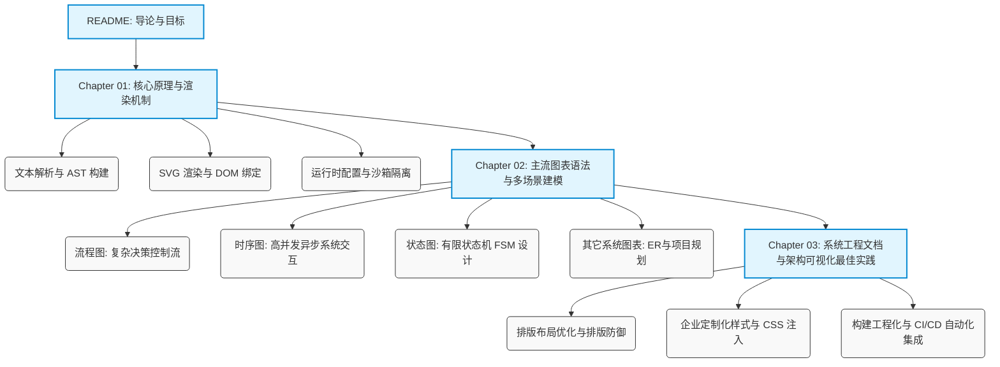

# Markdown Mermaid 图表建模与工作流绘制

在现代软件工程与系统架构设计中，“文档即代码”（Docs as Code）已成为主流的工程实践。传统的二进制图形文件（如 Visio、Draw.io XML 甚至各类截图）在版本控制、团队协作和自动部署流程中面临巨大的挑战：它们无法进行直观的行级 Diff 差异对比，也无法直接嵌入到纯文本的 Markdown 文档中。

**Mermaid** 作为一个基于 JavaScript 的声明式图表绘制库，彻底改变了这一现状。它允许开发者使用极简的、人类可读的文本语言来描述复杂的拓扑结构、业务状态机、时序交互以及项目生命周期，并将其动态渲染为交互式的矢量图形（SVG）。

---

## 本书定位与目标

本书旨在为系统架构师、高级研发工程师、技术文档写作者以及系统运维人员提供一份**生产级**的 Mermaid 建模与集成手册。我们将从底层解析与渲染机制出发，深入主流图表语法，最终归纳出一套适用于复杂系统工程文档的可视化设计规范。

通过阅读本书，您将掌握：

1. **底层原理与渲染流水线**：理解 Markdown 渲染器与 Mermaid.js 如何通过 DOM 解析和数据绑定生成 SVG 矢量图，以及多平台（GitHub, GitLab, Obsidian, mdBook）的渲染兼容性。
2. **多场景深度建模**：熟练运用 Mermaid 的语法结构绘制高复杂度的流程图（Flowcharts）、时序图（Sequence Diagrams）、状态图（State Diagrams）、甘特图（Gantt Charts）以及实体关系图（ER Diagrams）。
3. **样式定制与防御性排版**：掌握 Mermaid 的 `themeVariables` 与样式重载机制，实现企业级视觉风格统一，并解决大型图表的“渲染溢出”与“布局崩溃”问题。
4. **Docs as Code 工程化实践**：学会将 Markdown 嵌套 Mermaid 接入 CI/CD 自动编译管道，在静态网站生成器（如 mdBook）中构建精美的在线技术手册。

---

## 知识框架

为了让您能够由浅入深地构建完整的知识体系，本书精心设计了如下三个章节：

---

## 学习准备

在开始阅读后文前，您仅需准备一个支持 Markdown 预览的编辑器即可，例如：
*   **VS Code**（推荐安装插件：*Markdown Preview Mermaid Support* 或 *Markdown All in One*）
*   **Obsidian**（原生支持 Mermaid 渲染）
*   **mdBook**（本书所采用的渲染框架，配合自定义 CSS/JS 即可实现动态离线渲染）

让我们开启 Markdown 声明式图表建模的学习之旅。
