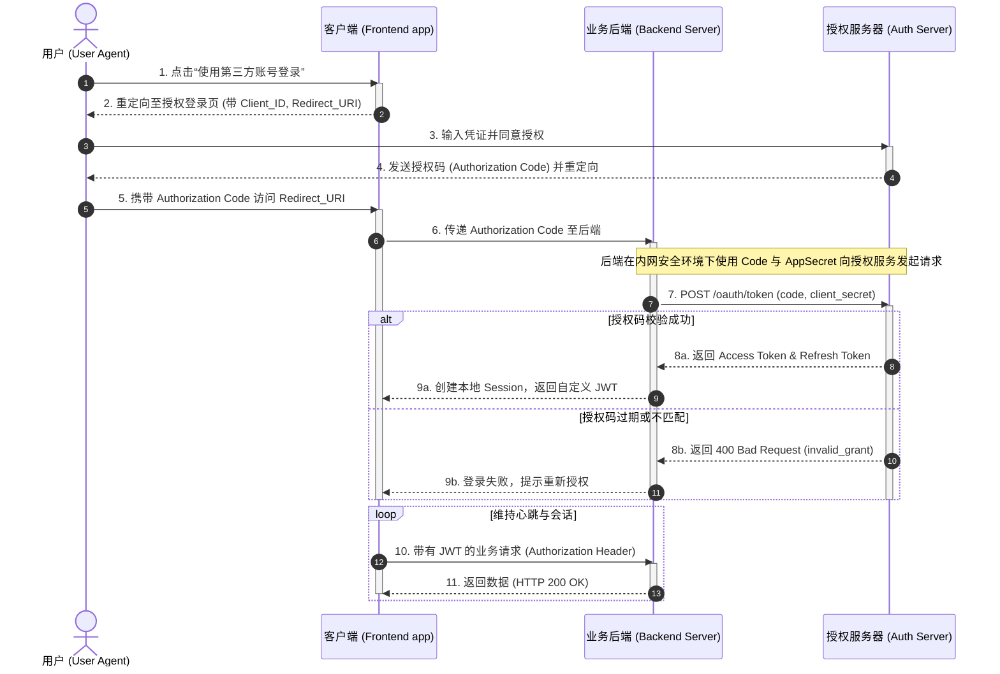
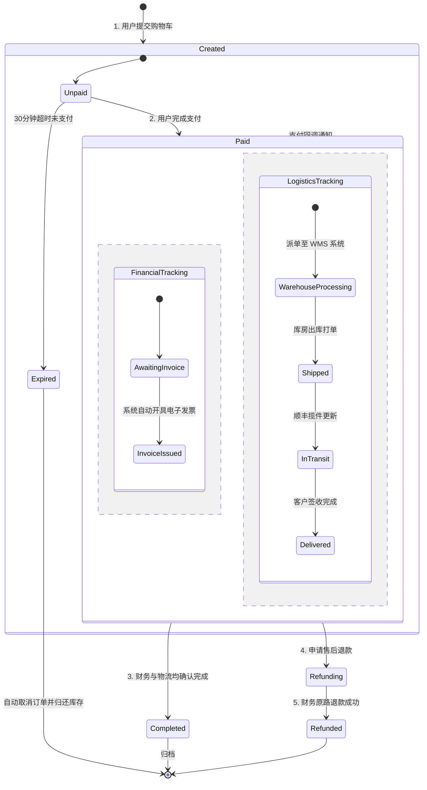
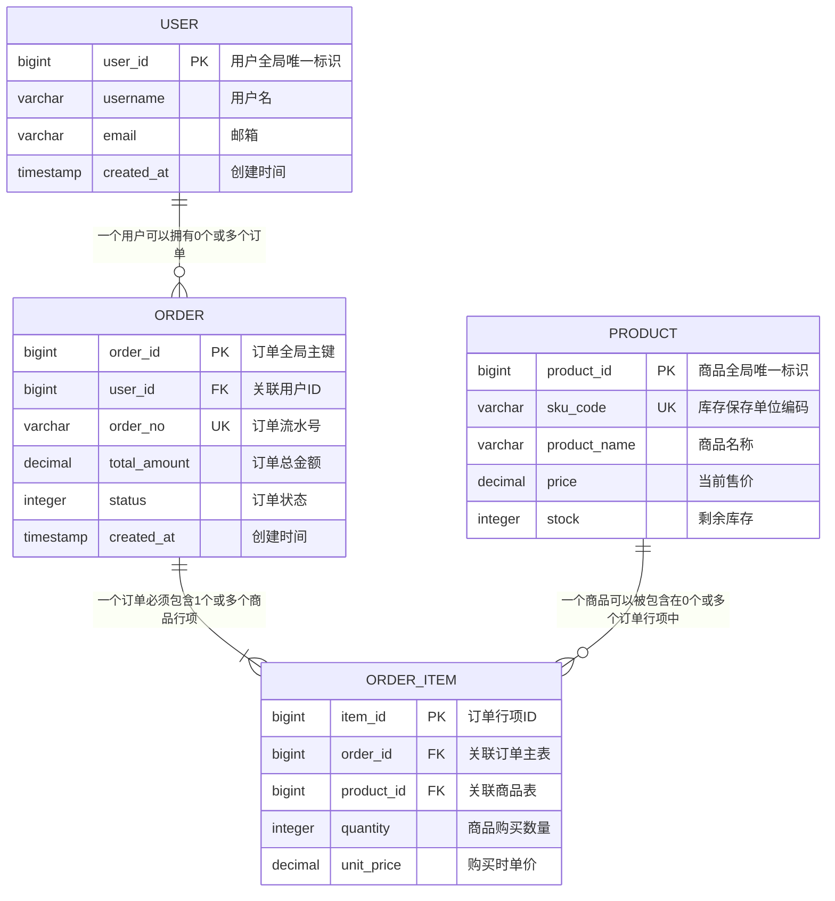
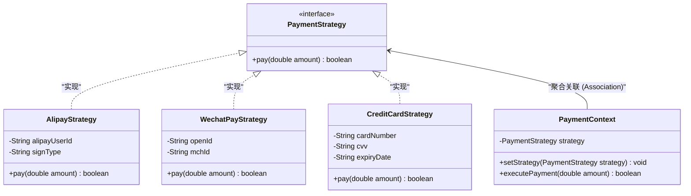

# 第二章：核心图表类型语法与实例深度解析

在本章中，我们将深入探讨 Mermaid 中最常用的五种核心系统设计图表。所有示例均基于真实生产场景（如高并发双写缓存架构、OAuth 2.0 授权码流、并发订单状态机、电商交易数据模型以及策略设计模式），并附带详细的行级注释与架构设计考量。

---

## 1. 流程图（Flowcharts）

流程图是表达拓扑结构、业务决策控制流以及数据流转逻辑最直观的工具。在 Mermaid 中，流程图通过 `flowchart` 声明（比旧版的 `graph` 提供了更好的连接线绘制与子图嵌套性能）。

### 1.1 状态循环控制流的 ASCII 抽象
在具有失败重试与退避策略（Backoff Retry）的复杂状态环路中，控制流的拓扑如下所示：

```text
                  +--------------------------------+
                  |      1. Initiate Request       |
                  +--------------------------------+
                                  |
                                  v
+------------+    +--------------------------------+
|  5. Sleep  | <--|    3. Fail (Retry < Max)       |
|  (Backoff) |    +--------------------------------+
+------------+                    ^
      |                           |
      v                           |
+------------+    +--------------------------------+
|  4. Retry  | -->|     2. Execute Task / API      |
+------------+    +--------------------------------+
                                  |
                                  v
                  +--------------------------------+
                  |  6. Success (Exit & Return)    |
                  +--------------------------------+
```

### 1.2 生产级案例：多级缓存与写穿透拓扑

以下是一个包含了子图（Subgraph）嵌套、多节点形状和自定义 CSS 类样式的微服务读取/写入缓存控制流程：

```mermaid
flowchart TD
    %% ----------------------------------------------------
    %% 定义全局样式类 (Class Definitions)
    %% ----------------------------------------------------
    classDef clientClass fill:#e3f2fd,stroke:#1565c0,stroke-width:2px,color:#0d47a1;
    classDef gateClass fill:#efebe9,stroke:#4e342e,stroke-width:2px,color:#3e2723;
    classDef cacheClass fill:#e8f5e9,stroke:#2e7d32,stroke-width:2px,color:#1b5e20;
    classDef dbClass fill:#fff3e0,stroke:#ef6c00,stroke-width:2px,color:#e65100;
    classDef alertClass fill:#ffebee,stroke:#c62828,stroke-width:2px,color:#b71c1c;

    %% ----------------------------------------------------
    %% 客户端与网关层节点定义
    %% ----------------------------------------------------
    User([客户端浏览器]):::clientClass
    Gateway{API 网关决策}:::gateClass

    User -->|HTTPS Request| Gateway

    %% ----------------------------------------------------
    %% 子图一：分布式缓存系统 (Redis Cluster)
    %% ----------------------------------------------------
    subgraph CacheSystem["分布式缓存系统 (Redis Cluster)"]
        direction LR
        RedisMaster[(Redis 主节点)]:::cacheClass
        RedisSlave[(Redis 从节点)]:::cacheClass
        RedisMaster -->|主从同步复制| RedisSlave
    end

    %% ----------------------------------------------------
    %% 子图二：持久化存储层 (MySQL & CDC)
    %% ----------------------------------------------------
    subgraph StorageLayer["持久化数据层"]
        direction TB
        MySQL_Master[(MySQL 主库)]:::dbClass
        MySQL_Replica[(MySQL 只读库)]:::dbClass
        BinlogReceiver[Binlog 监听器]:::dbClass
        
        MySQL_Master -->|异步复制| MySQL_Replica
        MySQL_Master -->|日志订阅| BinlogReceiver
    end

    %% ----------------------------------------------------
    %% 业务逻辑流转关系定义
    %% ----------------------------------------------------
    Gateway -->|1. 读操作| RedisSlave
    RedisSlave -.->|2. 缓存命中 (Cache Hit)| Gateway
    
    RedisSlave -->|3. 缓存失效 (Cache Miss)| MySQL_Replica
    MySQL_Replica -.->|4. 返回数据并写回缓存| RedisMaster

    Gateway -->|5. 写操作| MySQL_Master
    MySQL_Master -.->|6. 写入完成 (Write OK)| Gateway
    
    %% 使用 Canal 或 Debezium 监听 Binlog 自动失效缓存，防止双写不一致
    BinlogReceiver -->|7. 异步触发缓存失效 (Evict)| RedisMaster:::alertClass

    %% ----------------------------------------------------
    %% 关键连接线样式调优 (Link Styling)
    %% ----------------------------------------------------
    linkStyle 4 stroke:#2e7d32,stroke-width:2px;
    linkStyle 7 stroke:#c62828,stroke-width:2px,stroke-dasharray: 5 5;
```

---

## 2. 时序图（Sequence Diagrams）

时序图用于描述对象或系统之间依时间顺序进行的交互。它极其适合分析微服务间的同步 RPC 调用和异步消息队列（MQ）推送。

### 2.1 核心语法要素
*   **参与者声明**：`participant` 或 `actor`，可通过 `as` 关键字定义别名。
*   **消息箭头**：
    *   `->>`：同步调用（实线实心箭头）。
    *   `-->>`：同步返回（虚线实心箭头）。
    *   `->`：异步消息发送（实线非实心箭头）。
    *   `-->`：异步返回（虚线非实心箭头）。
*   **激活区间**：在发送端或接收端使用 `activate` 和 `deactivate`，或直接在箭头后追加 `+` 和 `-`。
*   **条件分支与循环**：使用 `alt/else` 表示条件分支，`loop` 表示循环，`opt` 表示可选步骤。
*   **并行计算**：使用 `par` 块包围并发操作。

### 2.2 生产级案例：OAuth 2.0 授权码模式交互流

以下详细刻画了用户、第三方客户端、后端网关以及授权服务器之间的 Token 获取全生命周期：



---

## 3. 状态图（State Diagrams）

状态图是设计复杂业务实体（如订单状态、交易链路、工作流审批）生命周期的核心利器，能有效防止非法状态转移漏洞。

### 3.1 核心语法要素
*   **初始与终态**：用 `[*]` 表示。
*   **状态转移**：`State1 --> State2 : TriggerEvent`。
*   **复合状态**：在一个状态内定义子状态，形成嵌套结构。
*   **并发状态**：在一个复合状态内部，使用 `--` 分割多个同时运行的并行状态线。

### 3.2 生产级案例：微服务订单生命周期状态机

下面是一个结合了并发状态（支付与物流跟踪并行）和复合状态的典型电商订单状态图：



---

## 4. 实体关系图（ER Diagrams）

在设计关系型数据库时，ER 图用于表示数据表之间的物理或逻辑关系，能够直接转译为 DDL。

### 4.1 关系基数符号定义
- `||--||`：一且仅有一（One and only one）
- `||--o{`：零个或多个（Zero or many）
- `||--|{`：一个或多个（One or many）
- `o|--|{`：一个或多个（非强依赖）

### 4.2 生产级案例：电商交易系统核心模型

此案例描述了用户、订单、订单项与商品之间的关联性，并列出了关键字段及约束属性：



---

## 5. 类图（Class Diagrams）

对于静态代码结构以及设计模式的讲解，类图是不可或缺的表达方式。

### 5.1 生产级案例：策略设计模式（Strategy Pattern）的实现

以下是一个支付系统中使用策略模式进行结算的面向对象类图设计：



---

## 6. 甘特图（Gantt Charts）

甘特图对于表达工程进度、版本上线里程碑以及任务依赖非常有用。

### 6.1 生产级案例：微服务重构版本发布甘特图

```mermaid
gantt
    title 微服务重构与版本发布进度计划
    dateFormat  YYYY-MM-DD
    axisFormat  %m-%d
    
    section 架构设计与调研
    方案评审及技术选型           :active, des1, 2026-06-01, 5d
    数据库分库分表方案设计       : des2, after des1, 7d
    
    section 核心开发阶段
    订单模块重构与接口改造      :critical, dev1, 2026-06-08, 12d
    支付网关对接与灰度逻辑开发   : dev2, after des2, 10d
    
    section 质量保障与灰度测试
    自动化集成测试与性能压测     :active, test1, after dev1, 5d
    灰度环境部署及 1% 流量导入   : test2, after test1, 4d
    
    section 生产发布与监控
    全量上线与历史数据割接       : mil1, after test2, 3d
```

通过这一章的代码实例，你可以直接拷贝这些结构模板到你的 Markdown 文件中，并根据实际业务快速替换节点信息。在下一章，我们将讨论在大型项目中文档可视化排版的最优工程实践。
