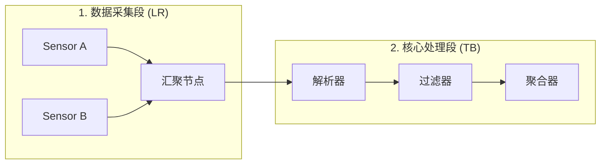
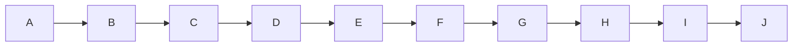
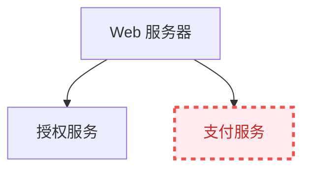

# 第三章：系统文档图表设计最佳实践与版本管理

在团队协作和复杂系统维护中，随着系统架构的演进，技术文档中的 Mermaid 源码文件也会面临“图表过度膨胀”、“线缆交叉布局崩溃”和“页面加载缓慢”等工程痛点。本章归纳了一套用于生产级系统工程文档的 Mermaid 最佳实践，以应对大型复杂图表的防御性排版、企业视觉规范定制以及编译期静态化流水线。

---

## 1. 复杂图表的排版防御与布局优化

当系统节点数量超过 30 个时，默认的布局引擎（如 Dagre）极易产生严重的连线交错、长节点溢出以及类似“乱麻线”的视觉灾难。为了维护图表的高可读性，需要采用以下防御性排版技巧：

### 1.1 分治原则：多层嵌套子图与方向管理
在一个超大的流程图中，如果全部节点都在同一个顶级作用域下，布局引擎的计算自由度过高，极易导致混乱。合理划分 `subgraph` 可以强行约束引擎将特定节点群聚合在一起，并为其指定局部的布局方向。



### 1.2 物理尺寸控制：防御大图溢出与排版崩塌
大型 SVG 图表在窄屏幕或移动端设备中往往会自动缩放到无法辨认的程度。为了解决这个问题，可以通过 CSS 样式对渲染容器进行强制约束，使其在超出屏幕宽度时显示横向滚动条，而非无限制缩小：

```css
/* 自定义应用于 Markdown 中 Mermaid 容器的 CSS */
.mermaid-scroll-container {
    width: 100%;
    overflow-x: auto; /* 允许横向滚动 */
    overflow-y: hidden;
    padding: 15px 0;
    -webkit-overflow-scrolling: touch;
}

.mermaid-scroll-container svg {
    max-width: none !important; /* 阻止 SVG 被强制缩放到 100% 容器宽 */
    height: auto;
}
```

在支持原生 HTML 标签的 Markdown 渲染器中，可以使用以下结构包裹 Mermaid 代码块：
```html
<div class="mermaid-scroll-container">
```
```text

```
```html
</div>
```

### 1.3 连线优化：减少交错的经验法则
1. **节点 ID 声明顺序有序化**：按逻辑执行流的先后顺序，在文本中从上到下声明节点定义。虽然 Mermaid 是声明式的，但其词法解析器的读取顺序会微弱影响 Dagre 引擎对初始矩阵的赋值，顺序合理的代码生成的图表更直观。
2. **善用隐式连接符**：如果仅想约束两节点的上下层级排布（例如在 TB 布局下），但不想要多余的箭头，可以使用 `---` 代替 `-->`。甚至可以通过修改 `linkStyle` 将特定隐式辅助边的透明度设为 0，专门用于微调引擎对特殊节点的定位。
3. **主干与支线分离**：将异常处理流（如 Timeout、Error Handling 导致的熔断退避路径）使用虚线（`-.->`）渲染。这有助于布局引擎在计算时降低这些次要路径的权重，从而使系统的 Happy Path（核心业务主干）在屏幕正中保持平直、居中。

---

## 2. 企业视觉规范定制与 CSS 注入

为了保持与企业 UI 规范的一致性，Mermaid 支持在配置和代码块中进行精细的颜色及字体控制。

### 2.1 基于 `themeVariables` 的配置重载
通过在初始化配置中传入 `themeVariables`，可以统一公司技术站点所有文档的背景色、主边框颜色、文字颜色等参数：

```javascript
// 浅色企业主题配置
const lightCorporateTheme = {
  theme: 'base',
  themeVariables: {
    background: '#ffffff',
    primaryColor: '#f4f5f7',
    primaryTextColor: '#172b4d',
    primaryBorderColor: '#dfe1e6',
    lineColor: '#4c9aff',
    secondaryColor: '#f3f0ff',
    tertiaryColor: '#e6fcf5'
  }
};
```

### 2.2 在 Markdown 内部使用 `classDef` 实现局部故障节点高亮
在针对线上故障进行根因分析（RCA）或编写排错手册时，可以通过自定义类突显故障组件：



---

## 3. 构建工程化与 CI/CD 自动化集成

在大型静态网站构建（如使用 mdBook、Docusaurus 或 GitBook 等工具）中，采用客户端浏览器实时解析渲染 Mermaid.js 存在三个严重痛点：
1. **FOUC（无样式内容闪烁）**：页面刚加载时显示为纯文本代码，等 JS 加载并运行完毕后才突然闪烁渲染出 SVG，对用户体验伤害极大。
2. **SEO 极度不友好**：网络爬虫只能抓取到原始的 Mermaid DSL 代码，而无法索引解析出 SVG 图形中的文字和逻辑线索。
3. **离线或 PDF 导出失败**：在静态文档导出为 PDF 或进行离线化打包时，由于客户端 JavaScript 无法正常执行，图表通常无法展示，仅呈现出代码快。

### 3.1 解决方案：基于文本到图片（Text-to-Image）的预编译架构

为了彻底解决上述痛点，我们可以在 CI/CD 构建阶段引入预编译程序。在将 Markdown 输出给静态生成器之前，通过脚本解析 Mermaid 代码块并自动将其转译为静态 SVG 图片文件，实现完全的服务器端/构建时渲染。

#### 编译期核心转换流水线（Text-to-Image Compilation Phases）

```text
+-------------------------------------------------------------+
|                Raw Markdown Document Source                 |  <--- 开发者提交的 Markdown 源码
+-------------------------------------------------------------+
                              |
                              v
                +-----------------------------+
                |    AST / Regex Scanner      |  <--- 自动扫描并匹配 ```mermaid 代码块
                +-----------------------------+
                              |
                     (提取代码块至临时文件)
                              v
                +-----------------------------+
                |    Temporary .mmd Files     |  <--- 暂存纯 Mermaid 语法文件
                +-----------------------------+
                              |
                    (调用 CLI 渲染引擎)
                              v
                +-----------------------------+
                |     mermaid-cli (mmdc)      |  <--- 借助无头浏览器（Puppeteer）进行渲染
                +-----------------------------+
                              |
                      (生成物理图片文件)
                              v
                +-----------------------------+
                |  Static SVG Vector Images   |  <--- 生成符合企业样式的 SVG 图图片
                +-----------------------------+
                              |
                (将 Markdown 原代码块替换为 )
                              v
+-------------------------------------------------------------+
|             Transformed Markdown Document (Pure HTML)        |  <--- 只包含静态图片链接的 Markdown
+-------------------------------------------------------------+
                              |
                              v
                +-----------------------------+
                |   Static Site Generator     |  <--- mdBook / Docusaurus 静态编译
                +-----------------------------+
                              |
                              v
+-------------------------------------------------------------+
|                 HTML Pages / Static PDFs                    |  <--- 最终产物：秒开、支持 SEO 的文档
+-------------------------------------------------------------+
```

### 3.2 步骤一：安装 Mermaid 命令行工具
在构建服务器上通过 npm 全局安装官方命令行工具：
```bash
npm install -g @mermaid-js/mermaid-cli
```

### 3.3 步骤二：编写预编译处理脚本（PowerShell）
以下是一个实用的 PowerShell 脚本示例，用于自动递归扫描 `src` 下的 `.md` 文件，提取 Mermaid 代码块并调用 `mmdc` 工具渲染为同名的本地 SVG 镜像，从而避免客户端渲染开销。

```powershell
# compile_mermaid.ps1
# 自动化编译 Markdown 内嵌 Mermaid 为静态 SVG 的脚本

$sourceDir = "./src"
$outputImageDir = "./src/images/mermaid"

# 确保图片存放目录存在
if (!(Test-Path $outputImageDir)) {
    New-Item -ItemType Directory -Force -Path $outputImageDir | Out-Null
}

# 递归寻找所有的 markdown 文件
$mdFiles = Get-ChildItem -Path $sourceDir -Filter "*.md" -Recurse

foreach ($file in $mdFiles) {
    Write-Host "Processing file: $($file.FullName)"
    $content = Get-Content -Path $file.FullName -Raw
    
    # 匹配 ```mermaid ... ``` 的正则
    # 使用 Windows 安全的匹配组
    $regex = '(?s)```mermaid\r?\n(.*?)\r?\n```'
    $matches = [regex]::Matches($content, $regex)
    
    $index = 1
    $modifiedContent = $content
    
    foreach ($match in $matches) {
        $mermaidCode = $match.Groups[1].Value
        $tempCodeFile = [System.IO.Path]::GetTempFileName()
        $tempCodeFile = [System.IO.Path]::ChangeExtension($tempCodeFile, ".mmd")
        
        # 将提取的代码写入临时 .mmd 文件
        Set-Content -Path $tempCodeFile -Value $mermaidCode -Encoding utf8
        
        # 输出图片路径
        $baseName = [System.IO.Path]::GetFileNameWithoutExtension($file.Name)
        $outputSvgName = "${baseName}_diag_${index}.svg"
        $outputSvgPath = Join-Path $outputImageDir $outputSvgName
        $relativeSvgPath = "images/mermaid/${outputSvgName}"
        
        # 调用 mmdc (mermaid-cli) 编译为 SVG
        Write-Host "Compiling diagram $index..."
        $proc = Start-Process -FilePath "mmdc" -ArgumentList "-i", "`"$tempCodeFile`"", "-o", "`"$outputSvgPath`"", "-b", "transparent" -NoNewWindow -PassThru -Wait
        
        if ($proc.ExitCode -eq 0) {
            # 用编译后的  标签替换原始的代码块
            $imgTag = ""
            $modifiedContent = $modifiedContent.Replace($match.Value, $imgTag)
            Write-Host "Successfully compiled to ${outputSvgPath}"
        } else {
            Write-Warning "Failed to compile diagram $index in $($file.Name)"
        }
        
        # 清理临时文件
        if (Test-Path $tempCodeFile) { Remove-Item $tempCodeFile }
        $index++
    }
    
    # 将替换后的内容写回文件
    Set-Content -Path $file.FullName -Value $modifiedContent -Encoding utf8
}
```

### 3.4 步骤三：接入 GitHub Actions 自动化工作流
可以将上述静态化渲染步骤集成到持续集成流程（如 GitHub Actions）中：

```yaml
# .github/workflows/deploy.yml
name: Deploy mdBook with Pre-rendered Mermaid

on:
  push:
    branches:
      - main

jobs:
  deploy:
    runs-on: ubuntu-latest
    steps:
      - uses: actions/checkout@v3

      - name: Setup Node.js (for Mermaid-CLI)
        uses: actions/setup-node@v3
        with:
          node-version: 18

      - name: Install mmdc
        run: npm install -g @mermaid-js/mermaid-cli

      - name: Render Mermaid Diagrams
        # 运行 Node.js 版本的预渲染转换脚本
        run: node ./scripts/compile-mermaid.js

      - name: Install mdBook
        run: |
          curl -sSL https://github.com/rust-lang/mdBook/releases/download/v0.4.37/mdbook-v0.4.37-x86_64-unknown-linux-gnu.tar.gz | tar -xz
          sudo mv mdbook /usr/local/bin/

      - name: Build Book
        run: mdbook build

      - name: Deploy to GitHub Pages
        uses: peaceiris/actions-gh-pages@v3
        with:
          github_token: ${{ secrets.GITHUB_TOKEN }}
          publish_dir: ./book
```

通过这一整套构建期预编译与防御性排版手段，你的 Mermaid 文档在大型研发团队协作中将具备卓越的加载性能、极佳的 SEO 指数以及完美的离线可访问性。
