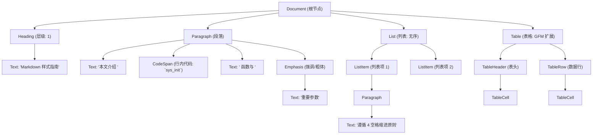

# Markdown 排版规范与样式指南

在现代软件工程与技术传播中，文档被视为“代码的延伸”（Docs as Code）。Markdown 凭借其极简的语法和优秀的易读性，已经成为技术文档、API 参考、技术博客以及电子书的主流标记语言。然而，Markdown 语法的宽泛性也带来了不可忽视的弊端——不同的书写习惯、模糊的嵌套缩进标准、中英文混排的视觉杂乱，以及缺乏统一的组件化扩展，往往导致最终的排版效果参差不齐，难以达到出版级读物的视觉美感与结构严谨性。

本指南是一份面向技术作家、系统工程师及开源社区维护者的**生产级 Markdown 排版规范与样式指南**。我们不仅关注 Markdown 源码的可读性与规范性，更聚焦于通过定制化手段（如 mdBook 的 CSS 覆写）实现优秀的视觉呈现与无障碍访问。

---

## 抽象语法树（AST）视角的 Markdown 解析

在编写 Markdown 时，不应仅仅将其视为纯文本，而应理解为对抽象语法树（Abstract Syntax Tree, AST）的描述。主流的 Markdown 解析器（如 Rust 编写的 `pulldown-cmark`）在编译时会将源文件转化为结构化的节点。不规范的语法会导致 AST 节点解析错误，进而产生不合规的 HTML 结构。

下图展示了一个标准 Markdown 片段被解析为 AST 的层级关系：

如果我们在编写标题时漏掉了井号后的空格（例如：`##内核优化`），解析器将无法识别其为 `Heading` 节点，而是将其退化为普通 `Paragraph` 中的文本节点，导致大纲视图（TOC）和文档结构断裂。因此，严谨的语法是优秀排版的前提。

---

## 核心设计理念

本指南的制定基于以下四个核心理念：

1. **结构第一，样式第二**：Markdown 的核心是语义化。合理的标题层级、清晰的列表嵌套和准确的表格定义是任何渲染引擎正常工作的基础。
2. **中西合璧，排版美学**：针对中文与英文/数字混排时的视觉特征，定义了空格规则（盘古之白）、标点符号映射以及断句排版规范，消除视觉上的拥挤感。
3. **平台中立与平台定制**：既保证源码在遵循 CommonMark/GFM 规范的解析器（如 GitHub, GitLab, VS Code）中拥有良好的可读性，又提供在 mdBook 编译环境下通过 CSS/JS 挂载实现深度定制的方案。
4. **无障碍与 SEO 友好**：强调图片 `alt` 描述、对比度控制、语义化标签的正确使用，确保残障人士和搜索引擎能精准理解文档内容。

---

## 本书内容大纲

为了系统化地建立起排版规范，本书划分为以下两个部分及核心章节：

### 第一部分：Markdown 排版规则与排版规范

*   **[排版规范（standards/README.md）](standards/README.md)**：介绍基础排版的大纲与基本约束。
*   **[第一章：Markdown 基础格式与代码块排版规范（standards/formatting-rules.md）](standards/formatting-rules.md)**：
    *   **标题层级**：探讨 `#` 后面必须保留空格的理由，多级标题的逻辑排布，以及避免层级跳跃的工程原则。
    *   **列表嵌套与缩进**：解决无序列表与有序列表嵌套时的缩进空格数（2空格与4空格的标准争论及解析引擎的 AST 兼容性）。
    *   **表格排版**：提供表格左右对齐的语法规范、紧凑型表格的编写标准。
    *   **引用与强调**：行内强调、粗体与斜体的边界界定，以及块级引用（Blockquotes）的使用场景。
    *   **无障碍设计 (Accessibility)**：深入讲解图片 `alt` 属性的写作规范，链接文本的语义化描述。
*   **[第二章：表格对齐、特殊字符与文字排版标准（standards/typographic-standards.md）](standards/typographic-standards.md)**：
    *   **中西文混排空格 (盤古之白)**：详述汉字与英文单词、数字、半角符号之间何时添加空格，以及何时不添加的细则。
    *   **标点符号规范**：统一全角与半角标点符号的边界，规范省略号（……）、破折号（——）、书名号（《》）的正确书写方式。
    *   **缩写与术语**：技术专有名词的大小写（如 `HTML` 而非 `html`, `Git` 而非 `git`）及专业缩写的排版一致性。
    *   **数学公式与代码混排**：规范 inline code 与数学符号的排版边界，避免行高被代码块撑开导致的排版混乱。

### 第二部分：mdBook 样式覆写与深度定制

*   **[主题深度定制（overrides/README.md）](overrides/README.md)**：介绍 mdBook 外观改造的理论框架与挂载机制。
*   **[第三章：自定义 CSS 样式覆写与特殊字体配置（overrides/mdbook-style-overrides.md）](overrides/mdbook-style-overrides.md)**：
    *   **mdBook 编译挂载机制**：分析 `book.toml` 中配置路径及加载顺序。
    *   **全局样式与字体优化**：基于 `var(--content-max-width)` 调整最大宽度，自定义中文优雅降级字体集（如 PingFang SC、Microsoft YaHei、Noto Sans CJK）。
    *   **高级组件定制 (CSS Overrides)**：
        *   实现带图标的容器（Alert Box / Callout Block）。
        *   优化块级引用 `blockquote` 的左边框与背景。
        *   定制表格（Table）斑马纹、表头悬停高亮与自适应滚动条。
        *   调整代码块（Pre/Code）的滚动轴样式与语法高亮配色的色彩对比度。

---

## 学习与实践目标

阅读完本指南后，你将能够：
*   写出在任何 CommonMark 兼容解析器中都不会解析崩溃或排版错乱的高质量 Markdown 源码。
*   在多人协作的技术团队中推广统一的 Markdown Linter 配置（如 `markdownlint`），实现代码级排版规范检查。
*   为你的 mdBook 静态网站编写优雅的 CSS 覆写文件，使其外观风格符合现代高端技术博客与官方文档的要求。
*   了解如何编写对屏幕阅读器和搜索引擎爬虫更友好的语义化标记。
