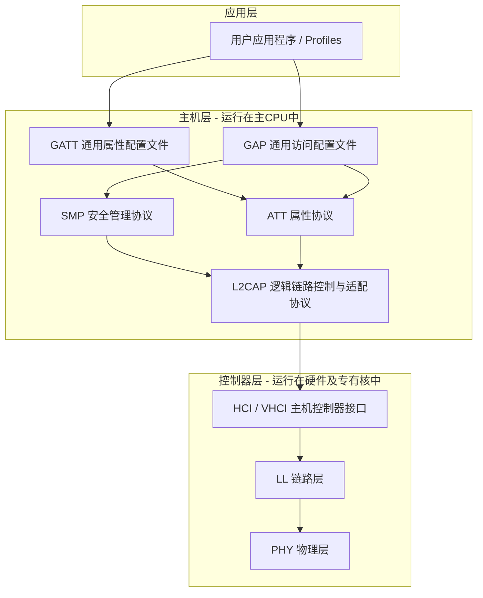

# BLE 核心物理与逻辑概念

低功耗蓝牙 (BLE) 并非经典蓝牙的简化版，而是一套从物理层 (PHY) 到应用层 (GATT) 全新设计的无线通信标准。为了在 ESP32 上开发出稳定、高效的 GATT 服务器，必须首先从系统级和协议级厘清其核心概念与逻辑流转。

---

## 1. BLE 协议栈分层架构

BLE 协议栈采用高度模块化的分层设计，主要分为三大部分：**控制器 (Controller)**、**主机 (Host)** 和 **应用层 (Application)**。



### 1.1 PHY（物理层）
*   **频段与信道：** BLE 运行在全球通用的 2.4 GHz ISM 频段（2400 MHz ~ 2483.5 MHz）。该频段被划分为 **40 个 RF 信道**，每个信道带宽为 2 MHz。
*   **信道分类：**
    *   **广播信道 (Advertising Channels)：** 37、38、39 号信道。这三个信道分布在 2.4 GHz 频段的不同频点，巧妙避开了 Wi-Fi (1、6、11 信道) 的中心频率，从而保证了极高的广播抗干扰能力。
    *   **数据信道 (Data Channels)：** 0 至 36 号信道。在建立连接后，设备会通过自适应跳频技术 (Adaptive Frequency Hopping, AFH) 在这 37 个数据信道间快速切换，以减轻干扰并提供频率多样性。
*   **调制方式：** 采用高斯频移键控 (GFSK)，调制指数为 0.5。

### 1.2 LL（链路层）
链路层是控制射频时序、数据包结构和状态转换的核心逻辑。它定义了设备的基本操作状态：
*   **Standby（待机）：** 射频未进行收发。
*   **Advertising（广播）：** 发送广播报文及扫描响应。
*   **Scanning（扫描）：** 监听广播信道上的报文。
*   **Initiating（发起）：** 监听特定外设的广播，并主动发起连接。
*   **Connection（连接）：** 设备已成功连接，分为 **Master (主机)** 和 **Slave (从机)** 角色。

### 1.3 HCI 与 VHCI（主机控制器接口）
HCI 是 Controller 与 Host 通信的标准物理接口（通常在分体芯片方案中使用 UART、SPI 等）。在 ESP32 这种单芯片 SoC 中，Controller 与 Host 共用同一片内存和 CPU 资源，因此使用 **VHCI (Virtual HCI)** 进行高效的进程/任务间通信，省去了物理总线的封包与延迟。

### 1.4 L2CAP（逻辑链路控制与适配协议）
L2CAP 是 Host 层的数据多路复用器。它将上层的 ATT、SMP 等协议的数据包封装并拆分成底层链路层能接受的最大有效载荷 (MTU)，同时为高层协议提供逻辑通道隔离。

### 1.5 ATT（属性协议）与 GATT（通用属性配置文件）
*   **ATT 协议：** 一种非常底层的 C/S (Client/Server) 协议。它将所有暴露的数据定义为一个个属性 (Attribute)，每个属性拥有固定的格式（句柄、UUID、值、权限），并提供诸如 Read、Write、Notify、Indicate 等原子操作。
*   **GATT 配置文件：** 建立在 ATT 协议之上，它将散落的属性组织成具有层次结构的逻辑关系，即 **Service (服务)**、**Characteristic (特征)** 和 **Descriptor (描述符)**。

---

## 2. GAP（通用访问配置文件）与连接管理

GAP 负责定义设备在 BLE 网络中的角色、发现机制、连接建立以及安全加密管理。

### 2.1 GAP 角色
*   **Broadcaster (广播者)：** 仅向外发送广播数据包，不接收任何连接或扫描请求（如 BLE Beacon 灯塔）。
*   **Observer (观察者)：** 仅扫描并接收广播数据包，不主动发起连接。
*   **Peripheral (外设 / 从机)：** 广播可连接包，接受来自主机的连接，在连接建立后充当从机角色。ESP32 GATT 服务器通常在启动时处于外设角色。
*   **Central (主机)：** 扫描广播，发起连接，建立连接后充当主机角色。

### 2.2 广播时序与碰撞规避
外设以设定的广播间隔 ($T_{\text{adv\_interval}}$) 周期性发送广播数据包。为了避免多个外设因为相同的广播间隔导致射频连续碰撞，协议规定每次实际广播时会加入一个 **0 ~ 10 ms 的伪随机延迟 ($T_{\text{adv\_delay}}$)**：

$$\text{Actual Advertising Interval} = T_{\text{adv\_interval}} + T_{\text{adv\_delay}}$$

在每个广播事件中，外设会在 37、38、39 三个信道上依次发送相同的数据包，随后短暂打开接收窗口监听来自主机的 `SCAN_REQ`（扫描请求）或 `CONNECT_IND`（连接发起）。

```
Channel 37: [ ADV_IND ] ----> (Listen)
Channel 38:             [ ADV_IND ] ----> (Listen)
Channel 39:                         [ ADV_IND ] ----> (Listen)
|<--------------------- Advertising Event --------------------->|
```

### 2.3 连接参数设定
一旦连接成功建立，设备通信转移到数据信道。连接的稳定性与功耗取决于三个核心参数：
1.  **Connection Interval (连接间隔)：** 两次数据同步事件 (Connection Event) 之间的时间间隔（步长为 1.25 ms，范围 7.5 ms ~ 4.0 s）。间隔越短，吞吐量越高，但功耗越高。
2.  **Slave Latency (从机延迟 / 潜伏期)：** 允许从机在无数据发送时忽略多少个连接事件。例如，若 Latency = 4，从机可以在连续 4 个连接事件中保持休眠，而不被主机判定为掉线，极大地降低了数据不频繁时的待机功耗。
3.  **Supervision Timeout (超时监督时间)：** 两次成功连接事件的最大时间间隔（范围 100 ms ~ 32.0 s）。若超过此时间没有收到任何射频包，则宣告链路断开。

> [!WARNING]
> 必须满足以下协议约束，否则连接参数将被 Controller 拒绝：
> $$\text{Supervision Timeout} > (1 + \text{Slave Latency}) \times \text{Connection Interval} \times 2$$

---

## 3. GATT 属性表层级结构

GATT 层次结构清晰，是应用层交互的基石。

```
+-------------------------------------------------------------------+
|                           GATT Profile                            |
+-------------------------------------------------------------------+
       |
       +---> [Service 1] (UUID: 0x180D - Heart Rate)
       |            |
       |            +---> [Characteristic 1] (UUID: 0x2A37 - Measurement)
       |            |          |
       |            |          +---> Declaration (Properties: Read/Notify)
       |            |          +---> Value (Data payload)
       |            |          +---> Descriptor (CCCD - UUID: 0x2902)
       |            |
       |            +---> [Characteristic 2] (UUID: 0x2A38 - Body Sensor Location)
       |                       |
       |                       +---> Value (Data payload)
       |
       +---> [Service 2] (UUID: 0xFFF0 - Custom OTA Service)
```

在 ATT 属性层中，**无论服务、特征定义、特征值还是描述符，在内存中全部映射为一个统一的“属性条目 (Attribute Entry)”**。每一条属性条目都包含以下四个核心元数据：

| 元数据 | 字节大小 | 说明 |
| :--- | :--- | :--- |
| **Handle (句柄)** | 16-bit | 属性在数据库中的唯一地址索引（0x0001 ~ 0xFFFF）。按顺序递增。 |
| **UUID** | 16-bit / 128-bit | 区分属性类型。SIG 标准组织定义了 16-bit 缩短 UUID（如 `0x2A37`）；自定义非标服务使用 128-bit 随机 UUID。 |
| **Value (值)** | 变长 | 实际承载的数据。例如特征值内容、服务声明中的服务UUID、CCCD 的配置状态（0x0001/0x0002）。 |
| **Permissions (权限)** | 8/16-bit | 控制访问的安全屏障。定义该属性是否可读、可写、是否需要加密连接 (Encryption)、认证 (Authentication) 或授权 (Authorization)。 |

### 3.1 关键描述符：CCCD (Client Characteristic Configuration Descriptor)
*   **UUID：** `0x2902`
*   **作用：** 用作客户端使能/禁止服务器端特征异步主动推送的开关。
*   **写入值格式：**
    *   `0x0001`：使能 **Notification (通知)**。
    *   `0x0002`：使能 **Indication (指示)**。
    *   `0x0000`：关闭推送。

---

## 4. 双向数据交互模式对比

GATT 规范定义了四种核心的数据交互流向，具有不同的流量控制和确认机制：

```
      Client (主机)                                   Server (从机)
        |                                                 |
        |============= 1. Read Request ==================>| 
        |<------------ 2. Read Response ------------------| (有确认, 低频)
        |                                                 |
        |============= 3. Write Request =================>| 
        |<------------ 4. Write Response -----------------| (有确认, 慢速)
        |                                                 |
        |============= 5. Write Command (No Resp) =======>| (无确认, 高吞吐)
        |                                                 |
        |<------------ 6. Notification (Notify) ----------| (无确认, 异步快)
        |                                                 |
        |<------------ 7. Indication (Indicate) ----------| 
        |============= 8. Confirmation ==================>| (有确认, 强保证)
```

1.  **Read (读)：** 主机向从机发起读请求，从机读取本地属性值并回复数据。该操作为同步过程，延迟取决于连接间隔。
2.  **Write Request (写请求)：** 主机向从机发送写数据，从机处理完毕后必须回复 `Write Response`。该操作自带应用层握手机制，吞吐量较低，因为在一个连接间隔内通常只能处理一次 Request/Response 对。
3.  **Write Command / Write Without Response (写命令)：** 主机只发送数据而不要求从机进行应用层确认。这使得主机可以在一个连接间隔内连续发送多个数据包，极大提高了数据的上行吞吐量（例如用于 OTA 固件包分发），但底层的防丢包全靠 L2CAP 和链路层重传保证。
4.  **Notification (通知)：** 从机主动推送数据给主机，**无需主机确认回复**。这是一种高效的单向数据流推送方式。
5.  **Indication (指示)：** 从机主动推送数据给主机，**但主机必须回复一个确认帧 (Handle Value Confirmation)**。在收到此确认帧前，从机不得发送下一个 Indication 数据包。这保证了重要状态通知的可靠投递，但限制了瞬时推送速率。
