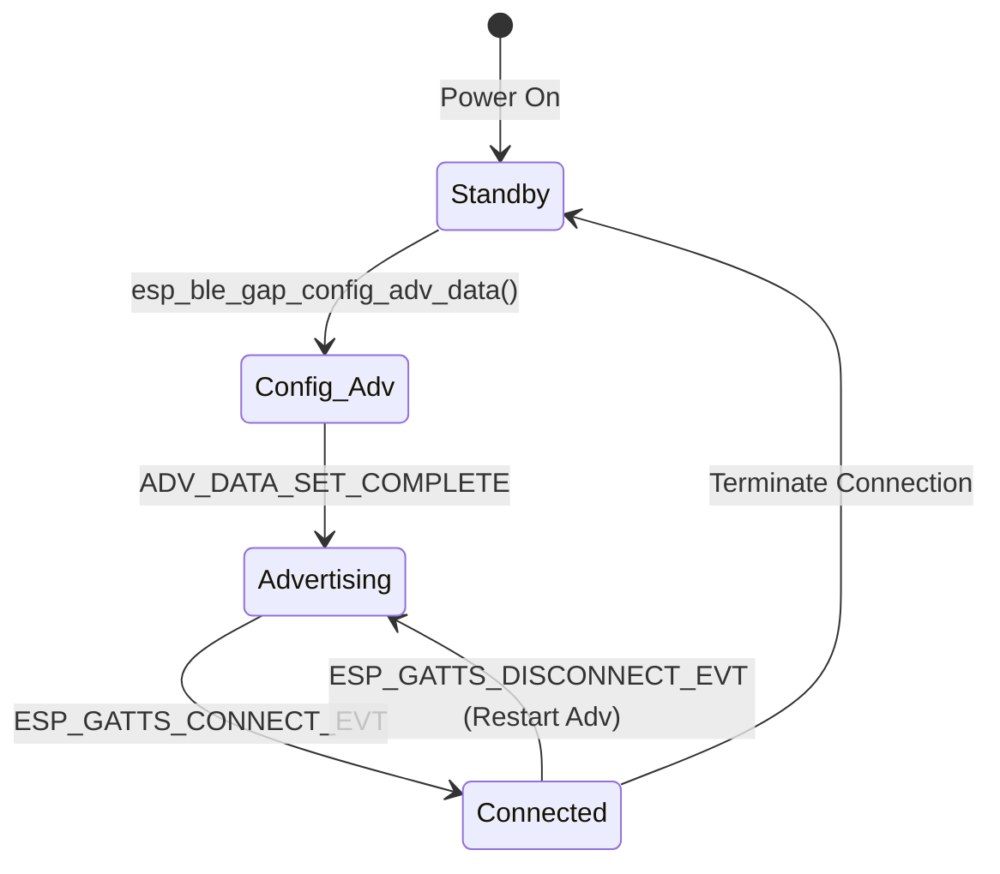

# 状态机、事件回调与双向数据流

低功耗蓝牙 (BLE) 协议栈本质上是一个庞大的、异步的事件驱动状态机。在 ESP-IDF 开发框架中，主机协议栈（Bluedroid）通过一组注册的回调函数与用户应用程序通信。

本章将深入解析 GAP 和 GATT 的核心回调事件，并设计一个**生产级、线程安全且与业务逻辑解耦的完整 C 语言应用架构**，以展示如何在真实工程中实现可靠的双向数据通信。

---

## 1. 异步事件驱动模型与线程安全

### 1.1 事件分发生命周期
在 ESP-IDF 中，蓝牙协议栈有其独立的运行线程（即 Bluedroid 主任务，常命名为 `BTU_TASK` 和 `BT_SYS_TASK`）。当协议栈检测到空口事件（如收到数据包、连接断开、主机更新连接参数）时，会**在蓝牙任务的上下文（Thread Context）**中调用用户注册的回调函数。

```
+------------------+                   +------------------+
|   Air Interface  |                   |   ESP32 BLE Stack|
| (Physical RF Event)                 |   (BTU_TASK Context) |
+------------------+                   +------------------+
         |                                       |
         | ======= Over-the-air packet =========>|
         |                                       | Parse packet
         |                                       v
         |                             +------------------+
         |                             |  Callback Event  |
         |                             | (e.g., GATTS_WRITE)|
         |                             +------------------+
         |                                       |
         |                                       | (Executes user callback)
         |                                       v
         |                             +------------------+
         |                             | User Callback    | <-- DO NOT BLOCK
         |                             |   Function       |
         |                             +------------------+
         |                                       |
         |                                       | Send msg to Queue
         |                                       v
         |                             +------------------+
         |                             |  FreeRTOS Queue  |
         |                             +------------------+
                                                 |
                                                 v
                                       +------------------+
                                       |  App Worker Task | <-- Handles heavy logic
                                       | (User Task Context)|
                                       +------------------+
```

> [!IMPORTANT]
> **黄金法则：绝不能在蓝牙回调函数中执行阻塞操作！**
> 任何导致回调延迟的阻塞动作（如等待信号量、长时间的 Flash 读写、I2C 慢速总线读取或 `vTaskDelay`）都会直接导致蓝牙堆栈线程死锁，进而触发 **监督超时 (Supervision Timeout)** 导致链路强行断开，或者引起软件看门狗复位 (WDT Reset)。
> **正确做法：** 回调函数仅执行最轻量级的数据提取，然后将数据拷贝至 FreeRTOS 队列中，通知外部的业务任务 (Worker Task) 处理。

### 1.2 注册流程与多 Profile 机制
在启用 Bluedroid 主机层后，通过以下步骤注册逻辑回调并申请唯一的应用 ID (App ID)：

```c
// 1. 注册 GAP 回调函数（处理广播、扫描、配对安全等事件）
esp_ble_gap_register_callback(gap_event_handler);

// 2. 注册 GATT 服务器回调函数（处理属性读写、建表、MTU 交换等）
esp_ble_gatts_register_callback(gatts_event_handler);

// 3. 注册指定 App ID 的 Profile
esp_ble_gatts_app_register(PROFILE_APP_ID);
```

---

## 2. GAP 事件状态机与广播设置

GAP 事件主要围绕**设备可见性 (Discovery)** 和 **连接状态转换 (Connectivity)** 展开。

### 2.1 状态转移图


### 2.2 广播数据结构 (AD Type)
广播包最大 31 字节，包含多个 AD Structure，格式为：`[Length (1 byte)] [AD Type (1 byte)] [AD Data (Length - 1 bytes)]`。
*   **Flags:** 指示连接模式（如 `ESP_BLE_ADV_FLAG_GEN_DISC` 通用可发现）。
*   **Complete Local Name:** 设备的蓝牙广播名。
*   **16-bit/128-bit Service Class UUIDs:** 指示本设备支持的 GATT 服务。

---

## 3. GATTS 核心事件深度剖析

当处理属性数据流时，GATTS 事件扮演核心角色：

### 3.1 客户端写入事件 (`ESP_GATTS_WRITE_EVT`)
当主机写入特征值或使能 CCCD 时，会抛出此事件。
*   **`param->write.need_rsp`：** 如果为 `true`，用户必须调用 `esp_ble_gatts_send_response()`；否则蓝牙主机会认为超时。如果属性的响应控制被定义为 `ESP_GATT_AUTO_RSP`，则协议栈内部会自动发送响应，但如果特征值定义为 `ESP_GATT_RSP_BY_APP`，则必须由应用层显式响应。
*   **`param->write.is_prep`：** 指示是否为准备写（Prepared Write，用于长特征数据分包写入）。对于简单的命令控制，此值通常为 `false`。

### 3.2 客户端读取事件 (`ESP_GATTS_READ_EVT`)
只在特征值配置为 `ESP_GATT_RSP_BY_APP` 时触发。我们需要在回调中填充 `esp_gatt_rsp_t` 结构体回复主机。

### 3.3 MTU 交换事件 (`ESP_GATTS_MTU_EVT`)
BLE 默认的 ATT MTU 大小为 23 字节（去掉 ATT 报头后，实际有效载荷为 20 字节）。为了提高吞吐量，主机连接后会发起 MTU 协商（最大可达 517 字节）。
在收到此事件时，应用层可以通过 `param->mtu.mtu` 获取协商后的有效 MTU 大小，以便调整发包的分片策略。

---

## 4. 生产级双向数据流完整 C 语言代码实现

下面是完整的、可编译的系统级 BLE 应用代码（通常位于 `main.c` 或组件中），它实现了以下生产级架构：
1.  **控制队列设计：** 回调收到控制指令后放入队列，由 `device_control_task` 解耦执行（Toggle On-Board LED）。
2.  **传感器推送任务：** `sensor_simulator_task` 周期性读取虚拟传感器数据，并通过 `esp_ble_gatts_send_indicate` 将数据推送给已使能 CCCD 的客户端。
3.  **连接与断开生命周期管理：** 自动重广播、状态清理。

```c
#include <stdio.h>
#include <stdlib.h>
#include <string.h>
#include "freertos/FreeRTOS.h"
#include "freertos/task.h"
#include "freertos/queue.h"
#include "esp_log.h"
#include "nvs_flash.h"
#include "driver/gpio.h"

// 包含蓝牙核心 API
#include "esp_bt.h"
#include "esp_bt_main.h"
#include "esp_gap_ble_api.h"
#include "esp_gatts_api.h"

#define TAG "BLE_GATT_APP"

#define PROFILE_NUM            1
#define PROFILE_APP_ID         0
#define DEVICE_NAME            "ESP32_SYS_GATT"
#define CONFIG_BLINK_GPIO      2 // 假设板载 LED 接在 GPIO 2

// 状态控制宏
static bool g_is_connected = false;
static uint16_t g_conn_id = 0;
static esp_gatt_if_t g_gatts_if = ESP_GATT_IF_NONE;

// 1. 声明句柄枚举与分配数组（与上一章保持完全一致）
enum {
    IDX_SVC = 0,
    IDX_CHAR_DEVICE_CTRL,
    IDX_CHAR_VAL_CTRL,
    IDX_CHAR_SENSOR_DATA,
    IDX_CHAR_VAL_SENSOR,
    IDX_CHAR_CFG_SENSOR,
    IDX_NB_ATTRIBUTES
};

static uint16_t gatt_db_handles[IDX_NB_ATTRIBUTES];

// CCCD 的本地状态缓存，控制传感器数据是否推送
static uint16_t g_sensor_cccd_value = 0x0000;

// FreeRTOS 队列句柄，用于解耦接收到的 BLE 写入命令
static QueueHandle_t g_cmd_queue = NULL;

// 2. 静态广播参数配置
static uint8_t adv_config_done = 0;
#define ADV_CONFIG_FLAG             (1 << 0)
#define SCAN_RSP_CONFIG_FLAG        (1 << 1)

// 广播服务 UUID（展示我们在广播中暴露 custom_service_uuid: 0xFFF0）
static uint8_t service_uuid[16] = {
    // 原始 128-bit 展现形式或 16-bit 展现形式。此处为了简单使用 16-bit 的规范补全形式
    0xfb, 0x34, 0x9b, 0x5f, 0x80, 0x00, 0x00, 0x80,
    0x00, 0x10, 0x00, 0x00, 0xF0, 0xFF, 0x00, 0x00
};

static esp_ble_adv_params_t adv_params = {
    .adv_int_min         = 0x20, // 广播间隔最小：20ms (0x20 * 0.625ms = 20ms)
    .adv_int_max         = 0x40, // 广播间隔最大：40ms
    .adv_type            = ADV_TYPE_IND,
    .own_addr_type       = BLE_ADDR_TYPE_PUBLIC,
    .channel_map         = ADV_CHNL_ALL,
    .adv_filter_policy   = ADV_FILTER_ALLOW_SCAN_ANY_CON_ANY,
};

static esp_ble_adv_data_t adv_data = {
    .set_scan_rsp        = false,
    .include_name        = true,
    .include_txpower     = true,
    .min_interval        = 0x0006, // 连接参数指示：最小间隔 7.5ms
    .max_interval        = 0x0010, // 最大间隔 20ms
    .appearance          = 0x00,
    .manufacturer_len    = 0,
    .p_manufacturer_data = NULL,
    .service_data_len    = 0,
    .p_service_data      = NULL,
    .service_uuid_len    = sizeof(service_uuid),
    .p_service_uuid      = service_uuid,
    .flag                = (ESP_BLE_ADV_FLAG_GEN_DISC | ESP_BLE_ADV_FLAG_BREDR_NOT_SUPPORT),
};

static esp_ble_adv_data_t scan_rsp_data = {
    .set_scan_rsp        = true,
    .include_name        = true,
    .service_uuid_len    = sizeof(service_uuid),
    .p_service_uuid      = service_uuid,
};

// 3. GATT 静态数据库定义 (结构复用第二章)
static const uint16_t primary_service_uuid         = ESP_GATT_UUID_PRI_SERVICE;
static const uint16_t char_declaration_uuid        = ESP_GATT_UUID_CHAR_DECLARE;
static const uint16_t character_client_config_uuid = ESP_GATT_UUID_CHAR_CLIENT_CONFIG;
static const uint16_t custom_service_uuid          = 0xFFF0;
static const uint16_t char_ctrl_uuid               = 0xFFF1;
static const uint16_t char_sensor_uuid             = 0xFFF2;

static const uint8_t char_prop_write               = ESP_GATT_CHAR_PROP_BIT_WRITE;
static const uint8_t char_prop_read_notify         = ESP_GATT_CHAR_PROP_BIT_READ | ESP_GATT_CHAR_PROP_BIT_NOTIFY;
static const uint8_t sensor_initial_val[4]         = {0x00, 0x00, 0x00, 0x00};
static const uint8_t sensor_cccd_initial_val[2]    = {0x00, 0x00};

static const esp_gatts_attr_db_t custom_gatt_db[IDX_NB_ATTRIBUTES] = {
    [IDX_SVC] = {
        .attr_control = {ESP_GATT_AUTO_RSP},
        .att_desc = {ESP_UUID_LEN_16, (uint8_t *)&primary_service_uuid, ESP_GATT_PERM_READ, sizeof(custom_service_uuid), sizeof(custom_service_uuid), (uint8_t *)&custom_service_uuid}
    },
    [IDX_CHAR_DEVICE_CTRL] = {
        .attr_control = {ESP_GATT_AUTO_RSP},
        .att_desc = {ESP_UUID_LEN_16, (uint8_t *)&char_declaration_uuid, ESP_GATT_PERM_READ, sizeof(uint8_t), sizeof(uint8_t), (uint8_t *)&char_prop_write}
    },
    [IDX_CHAR_VAL_CTRL] = {
        .attr_control = {ESP_GATT_RSP_BY_APP}, // 应用层回复：我们将通过硬件控制任务做出动作并响应
        .att_desc = {ESP_UUID_LEN_16, (uint8_t *)&char_ctrl_uuid, ESP_GATT_PERM_WRITE, 32, 0, NULL}
    },
    [IDX_CHAR_SENSOR_DATA] = {
        .attr_control = {ESP_GATT_AUTO_RSP},
        .att_desc = {ESP_UUID_LEN_16, (uint8_t *)&char_declaration_uuid, ESP_GATT_PERM_READ, sizeof(uint8_t), sizeof(uint8_t), (uint8_t *)&char_prop_read_notify}
    },
    [IDX_CHAR_VAL_SENSOR] = {
        .attr_control = {ESP_GATT_AUTO_RSP},
        .att_desc = {ESP_UUID_LEN_16, (uint8_t *)&char_sensor_uuid, ESP_GATT_PERM_READ, sizeof(sensor_initial_val), sizeof(sensor_initial_val), (uint8_t *)sensor_initial_val}
    },
    [IDX_CHAR_CFG_SENSOR] = {
        .attr_control = {ESP_GATT_AUTO_RSP},
        .att_desc = {ESP_UUID_LEN_16, (uint8_t *)&character_client_config_uuid, ESP_GATT_PERM_READ | ESP_GATT_PERM_WRITE, sizeof(sensor_cccd_initial_val), sizeof(sensor_cccd_initial_val), (uint8_t *)sensor_cccd_initial_val}
    }
};

// 4. GAP 事件回调处理
static void gap_event_handler(esp_gap_ble_cb_event_t event, esp_ble_gap_cb_param_t *param)
{
    switch (event) {
    case ESP_GAP_BLE_ADV_DATA_SET_COMPLETE_EVT:
        adv_config_done |= ADV_CONFIG_FLAG;
        if (adv_config_done == (ADV_CONFIG_FLAG | SCAN_RSP_CONFIG_FLAG)) {
            esp_ble_gap_start_advertising(&adv_params);
        }
        break;
    case ESP_GAP_BLE_SCAN_RSP_DATA_SET_COMPLETE_EVT:
        adv_config_done |= SCAN_RSP_CONFIG_FLAG;
        if (adv_config_done == (ADV_CONFIG_FLAG | SCAN_RSP_CONFIG_FLAG)) {
            esp_ble_gap_start_advertising(&adv_params);
        }
        break;
    case ESP_GAP_BLE_ADV_START_COMPLETE_EVT:
        if (param->adv_start_cmpl.status != ESP_BT_STATUS_SUCCESS) {
            ESP_LOGE(TAG, "Advertising start failed, error code %d", param->adv_start_cmpl.status);
        } else {
            ESP_LOGI(TAG, "Advertising started successfully.");
        }
        break;
    case ESP_GAP_BLE_UPDATE_CONN_PARAMS_EVT:
        ESP_LOGI(TAG, "Connection parameters updated: Interval=%d, Latency=%d, Timeout=%d, Status=%d",
                 param->update_conn_params.conn_int,
                 param->update_conn_params.latency,
                 param->update_conn_params.timeout,
                 param->update_conn_params.status);
        break;
    default:
        break;
    }
}

// 5. GATT 事件回调处理
static void gatts_event_handler(esp_gatts_cb_event_t event, esp_gatt_if_t gatts_if, esp_ble_gatts_cb_param_t *param)
{
    switch (event) {
    case ESP_GATTS_REG_EVT:
        ESP_LOGI(TAG, "GATT Register App Success, app_id %d", param->reg.app_id);
        esp_ble_gap_set_device_name(DEVICE_NAME);
        
        // 配置广播数据
        esp_ble_gap_config_adv_data(&adv_data);
        esp_ble_gap_config_adv_data(&scan_rsp_data);
        
        // 批量建表
        esp_ble_gatts_create_attr_tab(custom_gatt_db, gatts_if, IDX_NB_ATTRIBUTES, PROFILE_APP_ID);
        break;

    case ESP_GATTS_CREAT_ATTR_TAB_EVT:
        if (param->add_attr_tab.status == ESP_GATT_OK) {
            memcpy(gatt_db_handles, param->add_attr_tab.handles, sizeof(gatt_db_handles));
            ESP_LOGI(TAG, "Attribute table created, starting service...");
            esp_ble_gatts_start_service(gatt_db_handles[IDX_SVC]);
        } else {
            ESP_LOGE(TAG, "Create attribute table failed, error status = %x", param->add_attr_tab.status);
        }
        break;

    case ESP_GATTS_CONNECT_EVT:
        g_is_connected = true;
        g_conn_id = param->connect.conn_id;
        g_gatts_if = gatts_if;
        ESP_LOGI(TAG, "Client connected. Connection ID: %d, Remote MAC: %02x:%02x:%02x:%02x:%02x:%02x",
                 g_conn_id,
                 param->connect.remote_bda[0], param->connect.remote_bda[1],
                 param->connect.remote_bda[2], param->connect.remote_bda[3],
                 param->connect.remote_bda[4], param->connect.remote_bda[5]);
        
        // 更新连接参数以降低通信时延
        esp_ble_gap_conn_params_t conn_params = {0};
        memcpy(conn_params.bda, param->connect.remote_bda, sizeof(esp_bd_addr_t));
        conn_params.latency = 0;
        conn_params.max_int = 0x20;    // 40ms
        conn_params.min_int = 0x10;    // 20ms
        conn_params.timeout = 400;     // 4s
        esp_ble_gap_update_conn_params(&conn_params);
        break;

    case ESP_GATTS_DISCONNECT_EVT:
        g_is_connected = false;
        g_sensor_cccd_value = 0x0000; // 断开后复位 CCCD
        ESP_LOGI(TAG, "Client disconnected, reason: %d. Restarting advertising...", param->disconnect.reason);
        esp_ble_gap_start_advertising(&adv_params);
        break;

    case ESP_GATTS_WRITE_EVT: {
        // 核心：处理客户端写入事件
        uint16_t handle = param->write.handle;
        
        // 1. 判断是否是写入控制特征值
        if (handle == gatt_db_handles[IDX_CHAR_VAL_CTRL]) {
            // 发送给硬件控制队列，这里进行深度拷贝
            uint8_t *payload = malloc(param->write.len);
            if (payload != NULL) {
                memcpy(payload, param->write.value, param->write.len);
                uint32_t len = param->write.len;
                
                // 将封装包丢入队列（非阻塞方式）
                if (xQueueSend(g_cmd_queue, &payload, (TickType_t)0) != pdPASS) {
                    ESP_LOGW(TAG, "Command queue full, packet discarded");
                    free(payload);
                }
            }

            // 发送响应（因为本特征是 RSP_BY_APP，所以无论如何必须回复确认）
            if (param->write.need_rsp) {
                esp_gatt_rsp_t rsp = {0};
                rsp.attr_value.len = 0;
                rsp.attr_value.handle = handle;
                rsp.attr_value.offset = param->write.offset;
                rsp.attr_value.auth_req = ESP_GATT_AUTH_REQ_NONE;
                esp_ble_gatts_send_response(gatts_if, param->write.conn_id, param->write.trans_id, ESP_GATT_OK, &rsp);
            }
        }
        // 2. 判断是否是写入 CCCD (由协议栈自动响应了，但在应用层我们需记录其值以控制推送任务)
        else if (handle == gatt_db_handles[IDX_CHAR_CFG_SENSOR]) {
            if (param->write.len == 2) {
                g_sensor_cccd_value = (param->write.value[1] << 8) | param->write.value[0];
                ESP_LOGI(TAG, "CCCD updated: 0x%04x", g_sensor_cccd_value);
            }
        }
        break;
    }

    case ESP_GATTS_MTU_EVT:
        ESP_LOGI(TAG, "MTU Negotiated, size = %d", param->mtu.mtu);
        break;

    default:
        break;
    }
}

// 6. 硬件解耦控制任务 (GPIO / 业务逻辑)
static void device_control_task(void *pvParameters)
{
    ESP_LOGI(TAG, "Device control worker task started.");
    
    // 初始化引脚配置
    gpio_reset_pin(CONFIG_BLINK_GPIO);
    gpio_set_direction(CONFIG_BLINK_GPIO, GPIO_MODE_OUTPUT);

    uint8_t *cmd_data = NULL;
    while (1) {
        // 从队列中阻塞式获取 BLE 接收到的控制数据
        if (xQueueReceive(g_cmd_queue, &cmd_data, portMAX_DELAY) == pdPASS) {
            // 简单指令解析：第一字节为 0x01 开灯，0x00 关灯
            uint8_t command = cmd_data[0];
            if (command == 0x01) {
                gpio_set_level(CONFIG_BLINK_GPIO, 1);
                ESP_LOGI(TAG, "GPIO Action: LED turned ON");
            } else if (command == 0x00) {
                gpio_set_level(CONFIG_BLINK_GPIO, 0);
                ESP_LOGI(TAG, "GPIO Action: LED turned OFF");
            } else {
                ESP_LOGW(TAG, "Unknown GPIO Action Command: 0x%02x", command);
            }
            
            // 必须手动释放队列拷贝的堆内存
            free(cmd_data);
        }
    }
}

// 7. 传感器数据周期推送任务
static void sensor_simulator_task(void *pvParameters)
{
    ESP_LOGI(TAG, "Sensor simulator task started.");
    uint32_t sensor_counter = 0;

    while (1) {
        vTaskDelay(pdMS_TO_TICKS(1000)); // 1秒采集一次

        if (g_is_connected) {
            sensor_counter++;
            
            // 将计数模拟数据更新写入本地属性数据库，即使不发通知，客户端主动读也会读到新值
            uint8_t sensor_bytes[4];
            sensor_bytes[0] = (sensor_counter >> 24) & 0xFF;
            sensor_bytes[1] = (sensor_counter >> 16) & 0xFF;
            sensor_bytes[2] = (sensor_counter >> 8)  & 0xFF;
            sensor_bytes[3] = (sensor_counter)       & 0xFF;
            
            esp_ble_gatts_set_attr_value(gatt_db_handles[IDX_CHAR_VAL_SENSOR], sizeof(sensor_bytes), sensor_bytes);

            // 检查客户端是否开启了 Notification (即 CCCD 为 0x0001)
            if (g_sensor_cccd_value == 0x0001) {
                // 发送 Notification 帧（不需要确认，非阻塞）
                esp_ble_gatts_send_indicate(g_gatts_if, g_conn_id, 
                                            gatt_db_handles[IDX_CHAR_VAL_SENSOR], 
                                            sizeof(sensor_bytes), sensor_bytes, false);
                ESP_LOGI(TAG, "Notification Sent: Value = %d", (int)sensor_counter);
            }
        }
    }
}

// 8. 统一入口
void app_main(void)
{
    esp_err_t ret;

    // 1. 初始化 NVS（存储蓝牙射频校准等参数，必须初始化）
    ret = nvs_flash_init();
    if (ret == ESP_ERR_NVS_NO_FREE_PAGES || ret == ESP_ERR_NVS_NEW_VERSION_FOUND) {
        ESP_ERROR_CHECK(nvs_flash_erase());
        ret = nvs_flash_init();
    }
    ESP_ERROR_CHECK(ret);

    // 2. 初始化 FreeRTOS 队列
    g_cmd_queue = xQueueCreate(10, sizeof(uint8_t *));
    if (g_cmd_queue == NULL) {
        ESP_LOGE(TAG, "Failed to create control queue");
        return;
    }

    // 3. 释放经典蓝牙内存并使能 Bluedroid 堆栈
    ESP_ERROR_CHECK(esp_bt_controller_mem_release(ESP_BT_MODE_CLASSIC_BT));
    esp_bt_controller_config_t bt_cfg = BT_CONTROLLER_INIT_CONFIG_DEFAULT();
    ESP_ERROR_CHECK(esp_bt_controller_init(&bt_cfg));
    ESP_ERROR_CHECK(esp_bt_controller_enable(ESP_BT_MODE_BLE));
    ESP_ERROR_CHECK(esp_bluedroid_init());
    ESP_ERROR_CHECK(esp_bluedroid_enable());

    // 4. 注册蓝牙层级事件分发器
    ESP_ERROR_CHECK(esp_ble_gatts_register_callback(gatts_event_handler));
    ESP_ERROR_CHECK(esp_ble_gap_register_callback(gap_event_handler));
    ESP_ERROR_CHECK(esp_ble_gatts_app_register(PROFILE_APP_ID));

    // 5. 启动低耦合硬件与传感器任务
    xTaskCreate(device_control_task, "device_ctrl_task", 2048, NULL, 5, NULL);
    xTaskCreate(sensor_simulator_task, "sensor_sim_task", 2048, NULL, 5, NULL);

    ESP_LOGI(TAG, "ESP32 BLE GATT Server initialized successfully.");
}
```

---

## 5. BLE 功耗优化与射频控制

在物联网设备（例如由锂电池或纽扣电池供电的智能硬件）中，蓝牙开启后的功耗往往决定了整机寿命。我们可以通过以下手段优化 ESP32 的蓝牙功耗：

### 5.1 调制解调器休眠 (Modem Sleep) 与电源管理
ESP32 包含自动的 **Modem Sleep**。在没有蓝牙活动（例如没有广播包发送、且连接的连接事件还未到达）时，ESP32 蓝牙控制器会自动关闭部分射频单元以节电。
要开启此机制，必须在 `sdkconfig` 中开启 `CONFIG_PM_ENABLE`（电源管理使能），并在初始化时配置电源管理结构：

```c
#include "esp_pm.h"

// 启用电源管理自动休眠
esp_pm_config_t pm_config = {
    .max_freq_mhz = 160,       // CPU 最大运行频率
    .min_freq_mhz = 80,        // 空闲时 CPU 降低至 80MHz (或使用 XTAL 晶振)
    .light_sleep_enable = true // 允许自动进入 Light Sleep 模式
};
ESP_ERROR_CHECK(esp_pm_configure(&pm_config));
```

### 5.2 优化广播与连接时序参数
*   **广播功耗：** 将广播间隔从 `20ms` 调整为 `500ms` ~ `1000ms`，这虽然延长了主机第一次扫到设备的时间，但能节省 90% 以上的待机广播功耗。
*   **潜伏期 (Slave Latency)：** 调高从机延迟（如 4 或 8），在无数据更新时避免射频过度唤醒。
