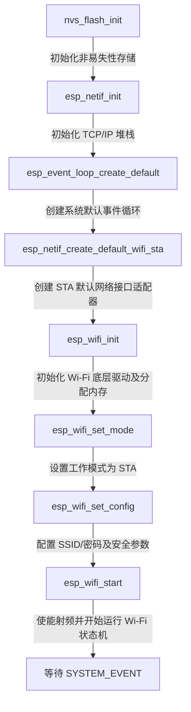

# 02 Wi-Fi STA 模式初始化流程与底层机制

将 ESP32 配置并启动为客户端模式（STA 模式）并非只是简单地调用一个 `connect` 函数。从系统级角度来看，这是一个多步骤、紧密耦合的初始化链路。如果任何一个环节的配置出现疏漏，都会导致射频校准失败、内存分配不足，或者在面临 WPA3 等新安全协议时无法正常连接。

本章将详细剖析 Wi-Fi 初始化生命周期中的八个核心步骤、底层的射频（RF）校准机制，以及生产级初始化代码的实现。

---

## 2.1 逐步剖析 Wi-Fi 初始化全生命周期

在 ESP-IDF 5.x 中，Wi-Fi STA 模式的初始化和配置标准流程如下图所示：



### 步骤 1：NVS 闪存初始化 (`nvs_flash_init`)
**为什么 Wi-Fi 依赖 NVS（Non-Volatile Storage）？**
1. **PHY 校准数据（PHY Calibration Data）**：ESP32 的 RF 物理层在出厂或首次启动时，需要对天线阻抗、发送功率、接收灵敏度以及局部振荡器进行校准。这些校准参数会存储在 NVS 中。如果 NVS 初始化失败，底层 PHY 驱动将无法加载，导致芯片直接重启。
2. **Wi-Fi 配置持久化**：底层驱动有时需要保存上一次连接的信道、BSSID 以及校准漂移数据，以加快下一次的重连速度。

### 步骤 2：网络接口初始化 (`esp_netif_init`)
该步骤会初始化底层的 `esp_netif` 框架。它会在系统堆中建立底层网络接口的数据结构，配置主循环，并准备接收来自硬件的 IP 数据包。**注意：此步骤在整个系统生命周期中只能调用一次。**

### 步骤 3：创建系统默认事件循环 (`esp_event_loop_create_default`)
ESP-IDF 采用异步事件驱动架构。该函数会启动一个专用的 FreeRTOS 任务（名为 `sys_evt`），用于派发系统事件（如 Wi-Fi 连接丢失、IP 地址获取成功、OTA 状态改变等）。
- 任何系统组件都可以向该循环发布事件。
- 应用层通过注册回调函数（Event Handler）来订阅这些事件，避免了应用任务在死循环中轮询状态。

### 步骤 4：创建 STA 默认网络接口适配器 (`esp_netif_create_default_wifi_sta`)
该 API 会创建一个内部的 `esp_netif` 实例，将底层 Wi-Fi STA 驱动的输入/输出接口与 LwIP 协议栈关联起来。它会自动为 STA 接口绑定默认的 DHCP 客户端，以便在连接到 AP（路由器）后，自动向 AP 请求分配 IP 地址。

### 步骤 5：Wi-Fi 驱动初始化 (`esp_wifi_init`)
此步骤是 Wi-Fi 驱动真正开始分配内存并初始化的起点。它需要传入一个配置结构体 `wifi_init_config_t`，该结构体包含：
- 底层发送/接收环形缓冲区的数量。
- NVS 存储的启用标志。
- 射频校准模式选择。

通常使用宏 `WIFI_INIT_CONFIG_DEFAULT()` 初始化该结构体，以应用乐鑫经过严苛测试的默认参数。

### 步骤 6：设置工作模式 (`esp_wifi_set_mode`)
将 Wi-Fi 工作模式配置为以下三种之一：
- `WIFI_MODE_STA`：工作站客户端模式（连接到路由器）。
- `WIFI_MODE_AP`：热点模式（允许其他设备连接到 ESP32）。
- `WIFI_MODE_APSTA`：混合模式（同时作为热点和客户端运行）。

### 步骤 7：配置 Wi-Fi 参数 (`esp_wifi_set_config`)
此步骤向驱动写入具体的连接参数（如 SSID、密码、加密模式等），这些参数将被写入 ESP32 的 RAM 中。如果需要，也可以指示驱动写入 NVS 中以进行掉电保存。

### 步骤 8：启动 Wi-Fi 驱动 (`esp_wifi_start`)
这是初始化流程的最后一步。调用后，Wi-Fi 驱动将根据之前配置的模式，使能 RF 射频模块、加载 PHY 参数、创建底层的 `wifi` 任务，并触发 `WIFI_EVENT_STA_START` 事件。

---

## 2.2 射频（RF）校准与硬件底层行为

当 `esp_wifi_start()` 被调用时，芯片内部会执行一系列复杂的硬件级动作：

### 2.2.1 RF 校准模式
ESP32 在 sdkconfig 中可以配置三种 PHY 校准模式（`CONFIG_ESP_PHY_CALIBRATION_AND_DATA_STORAGE`）：
1. **全校准（Full Calibration）**：每次启动时均对射频组件进行全面测试。虽然精度极高，但校准过程可能长达几百毫秒，且功耗极大（电流可能瞬间飙升至 200mA 以上）。
2. **部分校准（Partial Calibration）**：如果 NVS 中存在有效的校准数据，则只进行快速的增量校准，大幅缩短启动时间（仅需约 10ms - 30ms）。
3. **无校准（No Calibration）**：完全跳过校准，直接读取 NVS 内的数据。适用于对启动时间有极限要求的应用，但当环境温度发生剧烈变化时，可能会出现射频频偏，导致通信距离变短或直接断连。

### 2.2.2 锁相环（PLL）与信道扫描
当射频开启后，底层的锁相环（PLL）会锁定在 2.4 GHz 对应的载波频率。此时如果发起连接或扫描，射频前端会在 1 到 13 信道间快速切换（频率跳变，Frequency Hopping），通过接收周围 AP 发送的 Beacon（信标）帧或主动发送 Probe Request 来寻找目标 AP。

---

## 2.3 生产级 Wi-Fi 初始化 C 代码实现

在实际产品中，仅仅调用初始化 API 是不够的。我们必须处理 **NVS 空间不足、分区损坏需擦除重建** 等各种异常边缘情况。

以下是高度鲁棒、符合生产规范的 Wi-Fi 初始化实现代码：

```c
#include <string.h>
#include "esp_log.h"
#include "esp_wifi.h"
#include "esp_event.h"
#include "nvs_flash.h"
#include "esp_netif.h"

static const char *TAG = "wifi_init";

/**
 * @brief 初始化非易失性存储 (NVS)
 * Wi-Fi 驱动所需的 PHY 校准数据和配网参数均依赖 NVS。
 */
static esp_err_t init_nvs(void)
{
    esp_err_t ret = nvs_flash_init();
    if (ret == ESP_ERR_NVS_NO_FREE_PAGES || ret == ESP_ERR_NVS_NEW_VERSION_FOUND) {
        /* NVS 分区已被写满或者固件升级后格式不兼容，需擦除重建 */
        ESP_LOGW(TAG, "NVS flash truncated or format mismatch, erasing...");
        ESP_ERROR_CHECK(nvs_flash_erase());
        ret = nvs_flash_init();
    }
    return ret;
}

/**
 * @brief 生产级 Wi-Fi STA 模式初始化配置函数
 * @param[in] ssid 目标 AP 的 SSID 字符串
 * @param[in] password 目标 AP 的密码字符串
 * @param[out] out_netif 返回生成的 netif 句柄，便于后续高级网络配置（如静态 IP 等）
 */
esp_err_t wifi_sta_init_hardware(const char *ssid, const char *password, esp_netif_t **out_netif)
{
    if (ssid == NULL || password == NULL || out_netif == NULL) {
        ESP_LOGE(TAG, "Invalid arguments passed to wifi init");
        return ESP_ERR_INVALID_ARG;
    }

    // 1. 初始化 NVS
    esp_err_t err = init_nvs();
    if (err != ESP_OK) {
        ESP_LOGE(TAG, "Failed to initialize NVS: %s", esp_err_to_name(err));
        return err;
    }

    // 2. 初始化 TCP/IP 堆栈适配器
    err = esp_netif_init();
    if (err != ESP_OK) {
        ESP_LOGE(TAG, "Failed to initialize esp_netif: %s", esp_err_to_name(err));
        return err;
    }

    // 3. 创建系统默认事件循环
    err = esp_event_loop_create_default();
    if (err != ESP_OK && err != ESP_ERR_INVALID_STATE) { // ESP_ERR_INVALID_STATE 表示事件循环已创建，可忽略
        ESP_LOGE(TAG, "Failed to create default event loop: %s", esp_err_to_name(err));
        return err;
    }

    // 4. 创建默认的 Wi-Fi STA 网络接口
    esp_netif_t *sta_netif = esp_netif_create_default_wifi_sta();
    if (sta_netif == NULL) {
        ESP_LOGE(TAG, "Failed to create default wifi STA netif");
        return ESP_FAIL;
    }
    *out_netif = sta_netif;

    // 5. 初始化 Wi-Fi 驱动，使用默认配置
    wifi_init_config_t init_cfg = WIFI_INIT_CONFIG_DEFAULT();
    
    /* 生产级微调配置（根据业务需求选择性调整）:
     * 例如，如果设备内存极度紧缺，可以限制动态接收缓存区的最大数量:
     * init_cfg.dynamic_rx_buf_num = 16;
     */
    err = esp_wifi_init(&init_cfg);
    if (err != ESP_OK) {
        ESP_LOGE(TAG, "Failed to init Wi-Fi driver: %s", esp_err_to_name(err));
        return err;
    }

    // 6. 配置 Wi-Fi 工作模式为 STA
    err = esp_wifi_set_mode(WIFI_MODE_STA);
    if (err != ESP_OK) {
        ESP_LOGE(TAG, "Failed to set Wi-Fi mode: %s", esp_err_to_name(err));
        return err;
    }

    // 7. 配置连接参数
    wifi_config_t wifi_config = {
        .sta = {
            /* 必须显式将数组清零，防止脏数据导致解析出错 */
            .ssid = "",
            .password = "",
            
            /* DTIM 监听间隔：设置为 3 表示设备每隔 3 个 Beacon 帧才唤醒接收一次 DTIM。
             * 较大的值可以大幅度降低功耗，但会增加数据包接收延时。默认值为 0 (采用 AP 的 DTIM)。
             */
            .listen_interval = 3,
            
            /* 扫描模式配置：主动扫描还是被动扫描。默认为主动扫描。 */
            .scan_method = WIFI_FAST_SCAN,
            .sort_method = WIFI_CONNECT_AP_BY_SIGNAL, // 优先选择信号强的同名 AP
            
            /* 阈值设置：过滤掉信号太弱的 AP */
            .threshold.rssi = -85,
            
            /* 生产环境推荐的安全配置：PMF（受保护的管理帧）配置。
             * 对应 WPA3 协议，PMF 是强制要求的。
             */
            .pmf_cfg = {
                .capable = true,
                .required = false // 兼容不支持 PMF 的老旧路由器
            },
            
            /* 针对 WPA3 SAE 安全协议的配置项：
             * WIFI_AUTH_WPA3_PSK 模式下，规定生成 SAE 共享密钥的算法。
             */
            .sae_pwe_h2e = WPA3_SAE_PWE_BOTH,
        },
    };

    // 拷贝 SSID 和 密码，确保不会数组越界
    strncpy((char *)wifi_config.sta.ssid, ssid, sizeof(wifi_config.sta.ssid) - 1);
    strncpy((char *)wifi_config.sta.password, password, sizeof(wifi_config.sta.password) - 1);

    err = esp_wifi_set_config(WIFI_IF_STA, &wifi_config);
    if (err != ESP_OK) {
        ESP_LOGE(TAG, "Failed to set Wi-Fi configuration: %s", esp_err_to_name(err));
        return err;
    }

    // 8. 启动 Wi-Fi 驱动
    err = esp_wifi_start();
    if (err != ESP_OK) {
        ESP_LOGE(TAG, "Failed to start Wi-Fi: %s", esp_err_to_name(err));
        return err;
    }

    ESP_LOGI(TAG, "Wi-Fi STA mode hardware started successfully. Ready for connection.");
    return ESP_OK;
}
```

在下一个章节中，我们将基于此处启动的网络硬件，建立事件处理器，构建一个健壮的状态机来处理各种网络事件、断线重连以及 IP 获取。
