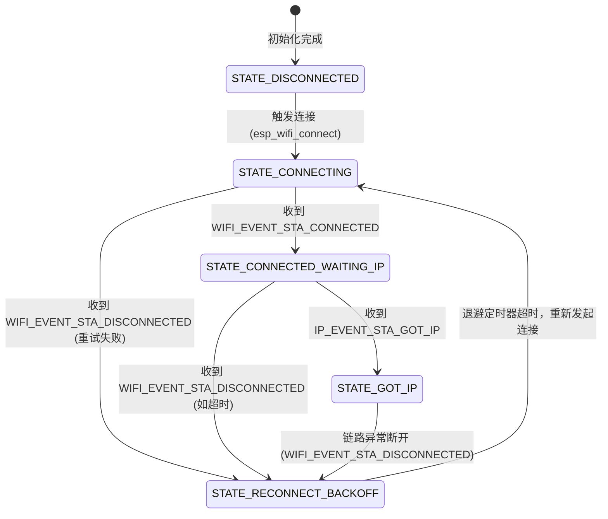

# 03 事件驱动连接管理与状态机实现

在嵌入式开发中，网络连接不是静态的。设备会因为物理移动、路由器过载、电磁干扰或者无线信道拥堵而随时失去连接。如果网络层缺乏一个清晰的“状态机”管理机制，系统将极易陷入死锁、重连风暴或者无法恢复的挂起状态。

本章将解构 ESP-IDF 的事件循环工作机理，剖析为什么“在事件回调中执行阻塞操作”是灾难性的，并提供一个基于 FreeRTOS 任务和事件组（Event Groups）构建的、具备指数退避（Exponential Backoff）重连策略的生产级 Wi-Fi 连接管理器。

---

## 3.1 ESP-IDF 事件循环机制与关键事件

ESP-IDF 的核心是**系统事件循环（System Event Loop）**。当底层 Wi-Fi 驱动的状态发生变化时，它会将对应的事件发送到系统队列，由系统事件任务（`sys_evt`）调用我们注册的回调函数。

```
+--------------------+            +-------------------+            +---------------------+
|  Wi-Fi 驱动 / LwIP  | --发布-->  |  系统事件队列     | --执行-->  | 用户注册的           |
|  (底层状态发生改变) |            |  (System Queue)   |            | Event Handler 回调  |
+--------------------+            +-------------------+            +---------------------+
```

对于 Wi-Fi STA 模式，我们重点关注两大类事件：**Wi-Fi 事件（`WIFI_EVENT`）** 与 **IP 事件（`IP_EVENT`）**。

### 3.1.1 关键 Wi-Fi 事件

*   **`WIFI_EVENT_STA_START`**
    *   **触发时机**：调用 `esp_wifi_start()` 且 Wi-Fi 硬件启动成功后。
    *   **动作**：此时射频就绪，系统可以安全地调用 `esp_wifi_connect()` 开始扫描并关联 AP。
*   **`WIFI_EVENT_STA_CONNECTED`**
    *   **触发时机**：ESP32 成功与目标 AP 完成了 802.11 关联与握手阶段（已连接上路由器）。
    *   **注意**：**此时设备仍然没有获取到 IP 地址！** 绝不能在此事件中创建 Socket 或是发起 HTTP 请求。此时 LwIP 协议栈刚开始启动 DHCP 客户端发起租约申请。
*   **`WIFI_EVENT_STA_DISCONNECTED`**
    *   **触发时机**：由于任何原因（密码错误、AP 关机、信号弱等）导致连接断开，或者主动调用了 `esp_wifi_disconnect()`。
    *   **数据载荷**：回调函数会接收到一个 `wifi_event_sta_disconnected_t` 结构体，其中包含断开的具体错误代码（`reason`）。

### 3.1.2 关键 IP 事件

*   **`IP_EVENT_STA_GOT_IP`**
    *   **触发时机**：DHCP 服务器成功为 ESP32 分配了 IPv4 地址，或者静态 IP 生效。
    *   **数据载荷**：包含分配到的 IP 地址、子网掩码、网关以及是否发生 IP 变更的标志（IP 漂移检测）。
    *   **动作**：**此时网络层完全就绪**，可以安全地唤醒上层业务任务，开始网络通信。
*   **`IP_EVENT_STA_LOST_IP`**
    *   **触发时机**：由于 DHCP 租约过期且无法续租，或者网卡被禁用，IP 地址被剥离。通常在 IPv4 场景下较少单独触发，因为一般会先触发 `WIFI_EVENT_STA_DISCONNECTED`。

---

## 3.2 避坑指南：事件回调的“不准阻塞”原则

在系统设计中，有一个极其重要但经常被新手忽视的准则：

> [!CAUTION]
> **绝对不能在注册的事件处理回调函数（Event Handler）中执行任何阻塞操作！**

### 为什么不能阻塞？
系统的默认事件循环是由一个名为 `sys_evt` 的 FreeRTOS 任务顺序执行的。如果您在事件回调中调用了 `vTaskDelay()`、进行了阻塞式的 Socket 读写，或者调用了需要等待网络回复的 API，就会导致 `sys_evt` 任务挂起。
一旦 `sys_evt` 被挂起，整个系统的其他事件（如 LwIP 的 IP 分配完毕事件、网卡断开事件、甚至其它驱动程序的事件）将全部积压在系统队列中，得不到处理，从而导致**系统级假死**。

### 正确的架构设计
事件回调只负责做两件事：
1. **记录/解析事件上下文**（如拷贝 IP 地址或记录 Disconnected 原因值）。
2. **通过非阻塞方式发送信号**（如设置 FreeRTOS 事件标志位，或者向用户管理队列发送消息）。

具体的重连逻辑、延时等待等重型任务，应当交给一个独立的**连接管理器任务（Connection Manager Task）**去同步执行。

---

## 3.3 Wi-Fi 连接有限状态机 (FSM) 设计

为了确保连接过程的健壮，我们设计如下状态机：



### 指数退避重连算法（Exponential Backoff）
如果在路由器损坏或网络拥堵时，ESP32 采用无脑的“死循环立即重连”，会导致：
1. 占用大量 CPU 和射频资源，芯片发热严重。
2. 干扰周围其他正常的 Wi-Fi 设备。
3. 某些智能路由器会因为检测到泛洪重连，直接将 ESP32 的 MAC 地址拉黑。

**指数退避策略**：第一次断开后等待 1 秒重连，若失败则等待 2 秒、4 秒、8 秒……直到达到一个最大等待上限（如 64 秒）。一旦连接成功并获取 IP，则重置退避计数器。

---

## 3.4 生产级 Wi-Fi 连接管理器 C 代码实现

下面是完整的、面向生产环境的 Wi-Fi 连接管理器实现。代码包含了详细的断开原因解析、基于事件组的非阻塞通知，以及安全的指数退避重连机制。

### 3.4.1 头文件定义 (`wifi_manager.h`)

```c
#ifndef WIFI_MANAGER_H
#define WIFI_MANAGER_H

#include "esp_err.h"
#include "esp_netif.h"

#ifdef __cplusplus
extern "C" {
#endif

/* 定义事件组的关键 Bits */
#define WIFI_CONNECTED_BIT   (1 << 0) // 已成功连接并获取 IP
#define WIFI_FAIL_BIT        (1 << 1) // 达到最大重试限制，彻底连接失败

/**
 * @brief 启动 Wi-Fi 连接管理器任务
 * @param[in] ssid 目标 AP 的 SSID
 * @param[in] password 目标 AP 的密码
 * @return esp_err_t 初始化结果
 */
esp_err_t wifi_manager_start(const char *ssid, const char *password);

#ifdef __cplusplus
}
#endif

#endif // WIFI_MANAGER_H
```

### 3.4.2 源文件实现 (`wifi_manager.c`)

```c
#include <string.h>
#include "freertos/FreeRTOS.h"
#include "freertos/task.h"
#include "freertos/event_groups.h"
#include "esp_system.h"
#include "esp_wifi.h"
#include "esp_event.h"
#include "esp_log.h"
#include "wifi_manager.h"

// 引入第二章的初始化声明
extern esp_err_t wifi_sta_init_hardware(const char *ssid, const char *password, esp_netif_t **out_netif);

static const char *TAG = "wifi_mgr";

/* FreeRTOS 事件组，用于同步状态 */
static EventGroupHandle_t s_wifi_event_group = NULL;

/* 线程安全互斥锁，用于保护关键配置 */
static SemaphoreHandle_t s_wifi_mutex = NULL;

/* 重连参数配置 */
#define INITIAL_RETRY_BACKOFF_MS   1000  // 初始退避延迟为 1 秒
#define MAX_RETRY_BACKOFF_MS       64000 // 最大退避延迟为 64 秒
#define CONNECT_TIMEOUT_MS         15000 // 单次连接的超时时间（等待IP）

/* 运行状态变量 */
static int s_retry_count = 0;
static uint32_t s_current_backoff_ms = INITIAL_RETRY_BACKOFF_MS;
static bool s_is_started = false;

/* 系统注册事件处理器的实例句柄 */
static esp_event_handler_instance_t s_wifi_handler_instance = NULL;
static esp_event_handler_instance_t s_ip_handler_instance = NULL;

/**
 * @brief 解析 Wi-Fi 断开的 Reason Code 并输出人性化日志
 */
static void log_disconnect_reason(uint8_t reason)
{
    switch (reason) {
        case WIFI_REASON_UNSPECIFIED:
            ESP_LOGW(TAG, "Disconnect reason: Unspecified error");
            break;
        case WIFI_REASON_AUTH_EXPIRE:
            ESP_LOGW(TAG, "Disconnect reason: Auth expired");
            break;
        case WIFI_REASON_AUTH_LEAVE:
            ESP_LOGW(TAG, "Disconnect reason: Auth leave (AP kicked us or client left)");
            break;
        case WIFI_REASON_ASSOC_EXPIRE:
            ESP_LOGW(TAG, "Disconnect reason: Association expired");
            break;
        case WIFI_REASON_ASSOC_TOOMANY:
            ESP_LOGW(TAG, "Disconnect reason: Too many associations (AP buffer full)");
            break;
        case WIFI_REASON_NOT_AUTHED:
            ESP_LOGW(TAG, "Disconnect reason: Not authenticated");
            break;
        case WIFI_REASON_NOT_ASSOCED:
            ESP_LOGW(TAG, "Disconnect reason: Not associated");
            break;
        case WIFI_REASON_ASSOC_LEAVE:
            ESP_LOGW(TAG, "Disconnect reason: Association leave");
            break;
        case WIFI_REASON_NO_AP_FOUND:
            ESP_LOGW(TAG, "Disconnect reason: Target AP not found (SSID out of range)");
            break;
        case WIFI_REASON_AUTH_FAIL:
            ESP_LOGW(TAG, "Disconnect reason: Authentication failed (Wrong password)");
            break;
        case WIFI_REASON_HANDSHAKE_TIMEOUT:
            ESP_LOGW(TAG, "Disconnect reason: Handshake timeout (4-way handshake failed)");
            break;
        case WIFI_REASON_CONNECTION_FAIL:
            ESP_LOGW(TAG, "Disconnect reason: Association failed");
            break;
        default:
            ESP_LOGW(TAG, "Disconnect reason code: %d", reason);
            break;
    }
}

/**
 * @brief 系统事件循环的回调函数
 * @note 遵循“绝不阻塞”原则。仅进行状态转换与信号投递。
 */
static void event_handler(void* arg, esp_event_base_t event_base,
                                int32_t event_id, void* event_data)
{
    if (event_base == WIFI_EVENT) {
        switch (event_id) {
            case WIFI_EVENT_STA_START:
                ESP_LOGI(TAG, "Wi-Fi started, trigger first connect attempt...");
                /* 触发首次连接：因为是在回调中，直接调用 esp_wifi_connect 是非阻塞的，可以安全执行 */
                esp_wifi_connect();
                break;
                
            case WIFI_EVENT_STA_CONNECTED:
                ESP_LOGI(TAG, "Associated with AP. Waiting for DHCP IP allocation...");
                break;
                
            case WIFI_EVENT_STA_DISCONNECTED: {
                wifi_event_sta_disconnected_t* event = (wifi_event_sta_disconnected_t*) event_data;
                ESP_LOGE(TAG, "Disconnected from Wi-Fi.");
                log_disconnect_reason(event->reason);
                
                /* 清除连接成功标志位 */
                xEventGroupClearBits(s_wifi_event_group, WIFI_CONNECTED_BIT);
                
                /* 核心算法：计算指数退避时间 */
                xSemaphoreTake(s_wifi_mutex, portMAX_DELAY);
                uint32_t current_delay = s_current_backoff_ms;
                s_retry_count++;
                // 延迟翻倍，但不能超过最大阈值
                s_current_backoff_ms = s_current_backoff_ms * 2;
                if (s_current_backoff_ms > MAX_RETRY_BACKOFF_MS) {
                    s_current_backoff_ms = MAX_RETRY_BACKOFF_MS;
                }
                xSemaphoreGive(s_wifi_mutex);
                
                ESP_LOGI(TAG, "Retry counter: %d. Reconnect backoff: %lu ms", s_retry_count, current_delay);
                
                /* 启动或延迟发起连接：由于此处是回调，我们不能直接 vTaskDelay。
                 * 我们可以让我们的连接管理器任务去执行这个延时，或者利用定时器。
                 * 这里我们通过向事件组发送一个“未就绪”的标记，让管理线程处理退避延时。
                 */
                xEventGroupSetBits(s_wifi_event_group, WIFI_FAIL_BIT);
                break;
            }
            default:
                break;
        }
    } else if (event_base == IP_EVENT) {
        switch (event_id) {
            case IP_EVENT_STA_GOT_IP: {
                ip_event_got_ip_t* event = (ip_event_got_ip_t*) event_data;
                ESP_LOGI(TAG, "Successfully obtained IP Address: " IPSTR, IP2STR(&event->ip_info.ip));
                
                /* 重置退避计数器 */
                xSemaphoreTake(s_wifi_mutex, portMAX_DELAY);
                s_retry_count = 0;
                s_current_backoff_ms = INITIAL_RETRY_BACKOFF_MS;
                xSemaphoreGive(s_wifi_mutex);
                
                /* 唤醒阻塞在等待连接完成标志的应用任务 */
                xEventGroupClearBits(s_wifi_event_group, WIFI_FAIL_BIT);
                xEventGroupSetBits(s_wifi_event_group, WIFI_CONNECTED_BIT);
                break;
            }
            default:
                break;
        }
    }
}

/**
 * @brief 独立的 Wi-Fi 管理与重连协调任务
 * 该任务可以安全地阻塞和延时，完全不干扰系统的其他事件。
 */
static void wifi_manager_thread(void *pvParameters)
{
    ESP_LOGI(TAG, "Wi-Fi Manager Thread started.");
    
    while (1) {
        /* 等待断开或需要重连的标志位 */
        EventBits_t bits = xEventGroupWaitBits(
            s_wifi_event_group,
            WIFI_CONNECTED_BIT | WIFI_FAIL_BIT,
            pdFALSE, // 不自动清除
            pdFALSE, // 任意一个 bit 满足即可
            portMAX_DELAY
        );

        if (bits & WIFI_FAIL_BIT) {
            // 清理失效标志，准备重试
            xEventGroupClearBits(s_wifi_event_group, WIFI_FAIL_BIT);

            xSemaphoreTake(s_wifi_mutex, portMAX_DELAY);
            uint32_t delay_ms = s_current_backoff_ms / 2; // 取上一步骤生效的退避延迟
            xSemaphoreGive(s_wifi_mutex);

            ESP_LOGW(TAG, "Entering reconnection backoff delay for %lu ms...", delay_ms);
            vTaskDelay(pdMS_TO_TICKS(delay_ms));

            ESP_LOGI(TAG, "Backoff ended. Initiating reconnection to AP...");
            esp_wifi_connect();
        }

        if (bits & WIFI_CONNECTED_BIT) {
            // 连接正常，任务进入休眠，等待事件组更新
            vTaskDelay(pdMS_TO_TICKS(5000));
        }
    }
    
    vTaskDelete(NULL);
}

/**
 * @brief 外部 API：初始化并启动 Wi-Fi 连接管理器
 */
esp_err_t wifi_manager_start(const char *ssid, const char *password)
{
    if (s_is_started) {
        ESP_LOGW(TAG, "Wi-Fi Manager already started.");
        return ESP_OK;
    }

    s_wifi_event_group = xEventGroupCreate();
    if (s_wifi_event_group == NULL) {
        ESP_LOGE(TAG, "Failed to create FreeRTOS event group.");
        return ESP_ERR_NO_MEM;
    }

    s_wifi_mutex = xSemaphoreCreateMutex();
    if (s_wifi_mutex == NULL) {
        ESP_LOGE(TAG, "Failed to create Mutex.");
        return ESP_ERR_NO_MEM;
    }

    // 1. 初始化底层硬件与配置参数（调用第2章封装的函数）
    esp_netif_t *sta_netif = NULL;
    esp_err_t err = wifi_sta_init_hardware(ssid, password, &sta_netif);
    if (err != ESP_OK) {
        ESP_LOGE(TAG, "Wi-Fi Hardware Init Failed: %s", esp_err_to_name(err));
        return err;
    }

    // 2. 注册系统事件监听器
    err = esp_event_handler_instance_register(WIFI_EVENT,
                                              ESP_EVENT_ANY_ID,
                                              &event_handler,
                                              NULL,
                                              &s_wifi_handler_instance);
    if (err != ESP_OK) {
        ESP_LOGE(TAG, "Failed to register WIFI_EVENT handler: %s", esp_err_to_name(err));
        return err;
    }

    err = esp_event_handler_instance_register(IP_EVENT,
                                              IP_EVENT_STA_GOT_IP,
                                              &event_handler,
                                              NULL,
                                              &s_ip_handler_instance);
    if (err != ESP_OK) {
        ESP_LOGE(TAG, "Failed to register IP_EVENT handler: %s", esp_err_to_name(err));
        return err;
    }

    // 3. 创建负责同步重连的任务线程（优先级必须低于 tcpip 任务）
    BaseType_t ret = xTaskCreatePinnedToCore(
        wifi_manager_thread,
        "wifi_mgr_task",
        4096,
        NULL,
        10, // 较低优先级，远低于 LwIP 任务 (18)
        NULL,
        1 // 绑定在 Core 1，将 Core 0 留给网络中断与协议栈任务
    );

    if (ret != pdPASS) {
        ESP_LOGE(TAG, "Failed to spawn Wi-Fi Manager Task.");
        return ESP_FAIL;
    }

    s_is_started = true;
    ESP_LOGI(TAG, "Wi-Fi connection manager started successfully.");
    return ESP_OK;
}
```

---

## 3.5 典型应用入口集成示例

以下是应用层的 `app_main` 入口如何调用并阻塞等待网络连接成功：

```c
#include "esp_log.h"
#include "nvs_flash.h"
#include "freertos/FreeRTOS.h"
#include "freertos/task.h"
#include "freertos/event_groups.h"
#include "wifi_manager.h"

static const char *TAG = "main";

/* 引用外部事件组句柄，用于在应用层等待网络就绪 */
extern EventGroupHandle_t s_wifi_event_group;

void app_main(void)
{
    ESP_LOGI(TAG, "System booting up...");

    /* 启动连接管理器（填入路由器 SSID 和 密码） */
    esp_err_t err = wifi_manager_start("Production_Router_SSID", "StrongSecurePassword123");
    if (err != ESP_OK) {
        ESP_LOGE(TAG, "Failed to start Wi-Fi Manager, system halting...");
        return;
    }

    /* 阻塞式等待网络就绪信号（WIFI_CONNECTED_BIT） */
    ESP_LOGI(TAG, "Waiting for network to become active...");
    EventBits_t bits = xEventGroupWaitBits(
        s_wifi_event_group,
        WIFI_CONNECTED_BIT,
        pdFALSE, // 不要清除该比特，使其他任务也可以共享此状态
        pdTRUE,  // 等待该比特被置1
        portMAX_DELAY // 永久等待，直至成功
    );

    if (bits & WIFI_CONNECTED_BIT) {
        ESP_LOGI(TAG, "Network is UP and running! Starting application business tasks...");
        
        /* TODO: 在这里可以安全地进行 DNS 解析、HTTP 连接、MQTT 建立等操作 */
    }
}
```

通过这套状态机与重连任务的设计，您的 ESP32 设备能够在面对任何断线情况时实现自动、指数退避地自我恢复，同时避免了主任务被挂起，是物联网项目迈向生产级的必经之路。
