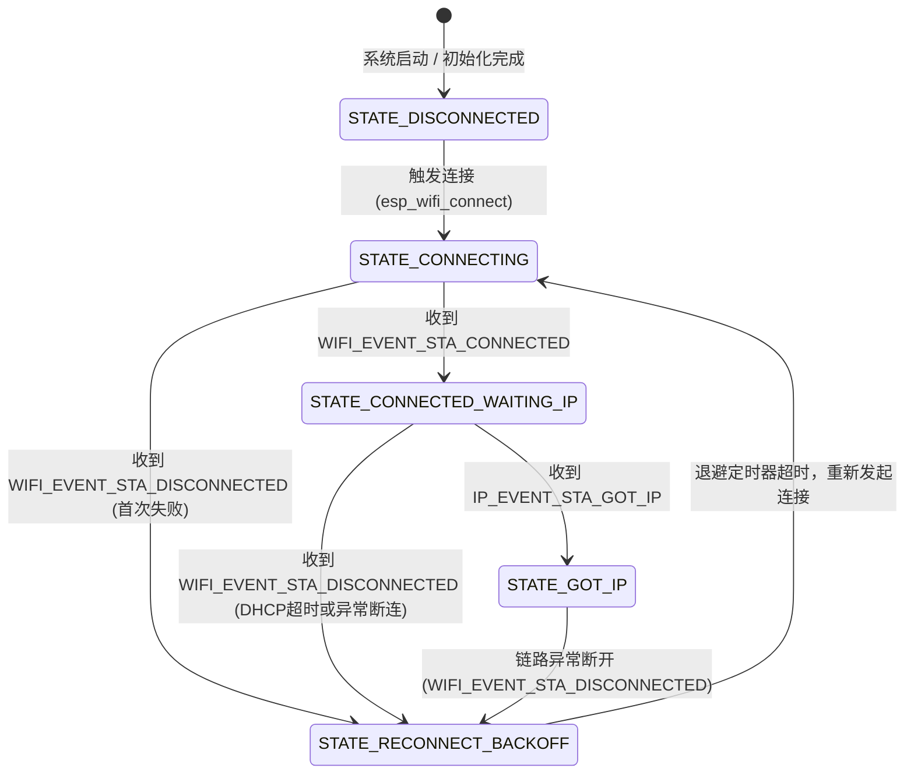

# 第三章：事件循环机制与 Wi-Fi 连接状态机管理

在嵌入式网络开发中，网络连接绝非静态的。由于天线朝向变化、信道电磁干扰、AP（路由器）过载或者网络 IP 租约到期，设备会随时与网络失去连接。如果在网络层缺乏清晰的“状态机”管理机制，系统极易陷入死锁、重连风暴或者无法恢复的挂起状态。

本章将详细解构 ESP-IDF 的核心事件循环分发机制，剖析为什么“在事件回调中执行阻塞操作”是灾难性的，并提供一个基于 FreeRTOS 任务、信号量和事件组构建的、具备指数退避及抖动因子（Jitter）重连策略的生产级 Wi-Fi 连接管理器。

---

## 3.1 ESP-IDF 事件循环机制与关键事件

ESP-IDF 的核心是一个基于异步队列的**系统事件循环（System Event Loop）**。其本质是解耦底层硬件驱动状态变更与上层应用逻辑的关键纽带。

### 3.1.1 事件分发架构与任务调度

下图展示了事件循环底层的任务与队列队列分发机制：

```
+------------------+
|  Wi-Fi 驱动核心  | -- 发生事件 (WIFI_EVENT_STA_CONNECTED) 
+------------------+
         |
         | esp_event_post() [非阻塞投递]
         v
+--------------------------------------------------------+
|                   系统事件队列 (Event Queue)            |
|  [ Event 1 ] [ Event 2 ] [ Event 3 ] [ ... ]           |
+--------------------------------------------------------+
         |
         v [队列读取]
+--------------------------------------------------------+
|  sys_evt 任务 (系统事件线程, 优先级 20, 单线程顺序执行)   |
+--------------------------------------------------------+
         |
         |-- 查找注册的事件句柄链表 (Hash Table / Linked List)
         |
         +-------------> [回调函数 A (event_handler)]
         |
         +-------------> [回调函数 B (event_handler)]
```

*   **`esp_event_post()`**：底层驱动或协议栈在检测到硬件状态改变时，通过该函数向系统事件队列投递一个包含 `Event Base`（事件基）、`Event ID`（事件 ID）和 `Payload`（数据指针）的事件。此调用仅将结构体复制进队列，不发生阻塞，保证中断服务程序（ISR）或底层高优先级任务的执行效率。
*   **`sys_evt` 任务**：系统启动时创建的专属事件处理任务。它在内部阻塞等待系统事件队列。一旦队列中有新事件，`sys_evt` 将其取出，匹配已注册的 Handler，并依次顺序调用这些回调函数。

### 3.1.2 关键事件详解与数据结构

对于 Wi-Fi STA 模式，我们重点关注两大类事件：**Wi-Fi 事件（`WIFI_EVENT`）** 与 **IP 事件（`IP_EVENT`）**。

#### 1. 关键 Wi-Fi 事件

*   **`WIFI_EVENT_STA_START`**
    *   **触发时机**：调用 `esp_wifi_start()` 且底层 Wi-Fi 任务与物理射频初始化成功。
    *   **动作**：此时底层射频就绪，系统开始可以安全地调用 `esp_wifi_connect()` 开始扫描并关联 AP。
*   **`WIFI_EVENT_STA_CONNECTED`**
    *   **触发时机**：ESP32 成功与目标 AP 完成了 802.11 关联与握手阶段（已建立空中的物理链路）。
    *   **重要警示**：**此时设备仍然没有获取到 IP 地址！** 绝不能在此事件中创建 Socket 或是发起 HTTP 请求。此时 LwIP 协议栈的 DHCPv4 客户端刚刚启动，准备向路由器发送 DHCP Discover 广播包。
*   **`WIFI_EVENT_STA_DISCONNECTED`**
    *   **触发时机**：由于任何原因（密码错误、AP 关机、信号弱等）导致连接断开，或者主动调用了 `esp_wifi_disconnect()`。
    *   **事件载荷**：回调函数会接收到一个 `wifi_event_sta_disconnected_t` 结构体，其中包含断开的具体错误代码（`reason`）。

#### 2. 关键 IP 事件

*   **`IP_EVENT_STA_GOT_IP`**
    *   **触发时机**：DHCP 服务器成功为 ESP32 分配了 IPv4 地址，或者静态 IP 生效。
    *   **事件载荷**：包含分配到的 IP 地址、子网掩码、网关以及是否发生 IP 变更的标志（IP 漂移检测）。
    *   **动作**：**此时网络层完全就绪**，可以安全地唤醒上层业务任务，开始网络通信。

---

## 3.2 避坑指南：事件回调的“不准阻塞”原则

在事件处理程序的编写中，存在一个极其重要但经常被忽略的开发准则：

> [!CAUTION]
> **绝对不能在注册的事件处理回调函数（Event Handler）中执行任何阻塞操作！**

### 3.2.1 为什么不能阻塞？

系统的默认事件循环是由唯一的 `sys_evt` 任务顺序调度的。如果您在事件回调中调用了 `vTaskDelay()`、进行了阻塞式的网络 Socket 读写，或者调用了需要等待回应的外部 API，就会导致整个 `sys_evt` 任务挂起。

一旦 `sys_evt` 被挂起，整个系统的其他事件（如 LwIP 的 IP 分配完毕事件、网卡断开事件、甚至其它驱动程序的事件）将全部积压在系统事件队列中，得不到处理，从而导致**系统级假死**。

#### Blocked Event Loop 的典型故障症状：
1.  **DHCP 握手超时**：`WIFI_EVENT_STA_CONNECTED` 触发的回调中阻塞了 5 秒，导致 LwIP 无法处理 DHCP 服务器发回的 Offer 包，使路由器认为设备不在线而收回 IP。
2.  **看门狗复位（WDT Panic）**：长时间阻塞事件队列任务会导致看门狗检测不到 `sys_evt` 的喂狗信号，从而直接重置整个 MCU。
3.  **连接断开后状态失控**：设备断开连接后，断开事件被卡在队列里，应用层根本感知不到网络已经挂掉，依然盲目发送数据，导致大量的 TCP Socket 报错。

### 3.2.2 正确的架构设计

事件回调只负责执行**非阻塞的轻量级操作**：
1.  **解析并暂存事件数据**（如拷贝 IP 地址或记录 Disconnected 原因值）。
2.  **通过非阻塞方式发送信号**（如设置 FreeRTOS 事件组标志位，或者向用户队列投递非阻塞消息）。

具体的重连逻辑、延时等待等重型任务，应当交给一个独立的**连接管理器任务（Connection Manager Task）**去同步执行。

---

## 3.3 Wi-Fi 连接有限状态机 (FSM) 设计

为了确保连接过程的健壮性，我们设计了如下五个核心状态的状态机：



*   **`STATE_DISCONNECTED`**：设备初始状态或主动断连状态。
*   **`STATE_CONNECTING`**：已向驱动发送 `esp_wifi_connect`，正在进行空中 802.11 协商。
*   **`STATE_CONNECTED_WAITING_IP`**：无线关联成功，LwIP 正在向路由器请求分配 IP。
*   **`STATE_GOT_IP`**：连接完全建立，网络畅通。
*   **`STATE_RECONNECT_BACKOFF`**：断连后处于冷却保护状态，避免对 AP 造成“重连暴风”。

### 3.3.1 带抖动因子（Jitter）的指数退避重连算法

在网络异常（如 AP 断电重启、多设备并发重连、网络拥堵）时，如果设备进行**无延时的死循环重连**，会导致：
1.  **重连风暴（Reconnection Storm）**：数十台甚至上百台 IoT 设备同时以最高频率向同一个路由器发送 Association Request，导致路由器的 CPU 瞬间过载、信道完全被控制冲突占满。
2.  **设备被路由器封锁**：智能路由器检测到某 MAC 地址在短时间内发送大量建立连接帧，会将其判定为恶意泛洪攻击，将其拉入黑名单拒绝响应。
3.  **功耗与发热**：连续高频射频发射会导致 ESP32 芯片发热严重，并在低功耗设备上瞬间耗尽电池电量。

#### 指数退避与随机抖动（Jitter）数学模型
为解决该问题，我们引入了指数退避加随机抖动的重连时间计算公式：
$$T_{\text{backoff}} = \min(T_{\text{initial}} \times 2^{n}, T_{\text{max}}) + \text{RandomJitter}$$

*   $T_{\text{initial}}$：初始等待延时，如 $1$ 秒。
*   $n$：当前连续重试的次数（连接成功后重置为 0）。
*   $T_{\text{max}}$：重试延时上限，通常设为 $64$ 秒。
*   $\text{RandomJitter}$：为防止多台设备由于同时断网而导致计算出的重试时序完全重合，我们在计算出的指数退避值上加上一个随机波动的抖动因子（例如加上 $0 \sim 1000\text{ ms}$ 的随机延迟），将网络请求在时域上均匀铺开（De-synchronization）。

---

## 3.4 生产级 Wi-Fi 连接管理器 C 代码实现

下面是完整的、面向生产环境的 Wi-Fi 连接管理器实现。

### 3.4.1 头文件定义 (`wifi_manager.h`)

```c
#ifndef WIFI_MANAGER_H
#define WIFI_MANAGER_H

#include "esp_err.h"
#include "esp_netif.h"

#ifdef __cplusplus
extern "C" {
#endif

/* 定义 FreeRTOS 事件组的关键 Bits */
#define WIFI_CONNECTED_BIT   (1 << 0) // 已成功连接并获取 IP
#define WIFI_FAIL_BIT        (1 << 1) // 连接失败且目前处于退避中

/**
 * @brief 启动 Wi-Fi 连接管理器任务
 * @param[in] ssid 目标 AP 的 SSID 字符串
 * @param[in] password 目标 AP 的密码字符串
 * @return esp_err_t 初始化结果
 */
esp_err_t wifi_manager_start(const char *ssid, const char *password);

/**
 * @brief 停止并清理 Wi-Fi 连接管理器释放资源
 * @return esp_err_t 清理结果
 */
esp_err_t wifi_manager_stop(void);

#ifdef __cplusplus
}
#endif

#endif // WIFI_MANAGER_H
```

### 3.4.2 源文件实现 (`wifi_manager.c`)

```c
#include <string.h>
#include "freertos/FreeRTOS.h"
#include "freertos/task.h"
#include "freertos/event_groups.h"
#include "esp_system.h"
#include "esp_wifi.h"
#include "esp_event.h"
#include "esp_log.h"
#include "esp_random.h"
#include "wifi_manager.h"

/* 引用第二章封装的初始化硬件声明 */
extern esp_err_t wifi_sta_init_hardware(const char *ssid, const char *password, esp_netif_t **out_netif);

static const char *TAG = "wifi_mgr";

/* FreeRTOS 事件组，用于跨任务同步 Wi-Fi 状态 */
static EventGroupHandle_t s_wifi_event_group = NULL;

/* 互斥量，用于保护多线程访问共享的重连计数器等状态 */
static SemaphoreHandle_t s_wifi_mutex = NULL;

/* 独立的重连协调任务句柄 */
static TaskHandle_t s_wifi_task_handle = NULL;

/* 退避算法常量参数定义 */
#define INITIAL_RETRY_BACKOFF_MS   1000  // 初始退避延迟为 1 秒
#define MAX_RETRY_BACKOFF_MS       64000 // 最大退避延迟为 64 秒
#define JITTER_MAX_MS              1000  // 随机抖动最大值为 1 秒

/* 运行状态共享变量，访问时需加锁 */
static int s_retry_count = 0;
static uint32_t s_current_backoff_ms = INITIAL_RETRY_BACKOFF_MS;
static bool s_is_started = false;
static esp_netif_t *s_sta_netif = NULL;

/* 事件监听器注册实例句柄，用于停止时注销 */
static esp_event_handler_instance_t s_wifi_handler_instance = NULL;
static esp_event_handler_instance_t s_ip_handler_instance = NULL;

/**
 * @brief 解析并记录 Wi-Fi 底层断开的具体 Reason Code
 */
static void log_disconnect_reason(uint8_t reason)
{
    switch (reason) {
        case WIFI_REASON_UNSPECIFIED:
            ESP_LOGW(TAG, "Disconnect Reason: Unspecified error");
            break;
        case WIFI_REASON_AUTH_EXPIRE:
            ESP_LOGW(TAG, "Disconnect Reason: Auth expired");
            break;
        case WIFI_REASON_AUTH_LEAVE:
            ESP_LOGW(TAG, "Disconnect Reason: Auth leave (Client left or AP kicked)");
            break;
        case WIFI_REASON_ASSOC_EXPIRE:
            ESP_LOGW(TAG, "Disconnect Reason: Association expired");
            break;
        case WIFI_REASON_ASSOC_TOOMANY:
            ESP_LOGW(TAG, "Disconnect Reason: Too many associations (AP full)");
            break;
        case WIFI_REASON_NOT_AUTHED:
            ESP_LOGW(TAG, "Disconnect Reason: Not authenticated");
            break;
        case WIFI_REASON_NOT_ASSOCED:
            ESP_LOGW(TAG, "Disconnect Reason: Not associated");
            break;
        case WIFI_REASON_ASSOC_LEAVE:
            ESP_LOGW(TAG, "Disconnect Reason: Association leave");
            break;
        case WIFI_REASON_NO_AP_FOUND:
            ESP_LOGW(TAG, "Disconnect Reason: SSID out of range (Target AP not found)");
            break;
        case WIFI_REASON_AUTH_FAIL:
            ESP_LOGW(TAG, "Disconnect Reason: Authentication failed (Wrong password)");
            break;
        case WIFI_REASON_HANDSHAKE_TIMEOUT:
            ESP_LOGW(TAG, "Disconnect Reason: 4-Way Handshake timeout");
            break;
        case WIFI_REASON_CONNECTION_FAIL:
            ESP_LOGW(TAG, "Disconnect Reason: Association failed");
            break;
        default:
            ESP_LOGW(TAG, "Disconnect Reason Code: %d", reason);
            break;
    }
}

/**
 * @brief 系统事件循环的回调函数
 * @note 必须极其轻量，绝不能包含 vTaskDelay 或阻塞型操作！
 */
static void event_handler(void* arg, esp_event_base_t event_base,
                          int32_t event_id, void* event_data)
{
    if (event_base == WIFI_EVENT) {
        switch (event_id) {
            case WIFI_EVENT_STA_START:
                ESP_LOGI(TAG, "Wi-Fi Interface Start. Triggering connection...");
                /* 触发异步连接 */
                esp_wifi_connect();
                break;
                
            case WIFI_EVENT_STA_CONNECTED:
                ESP_LOGI(TAG, "Air link established. DHCP IP lease acquisition started...");
                break;
                
            case WIFI_EVENT_STA_DISCONNECTED: {
                wifi_event_sta_disconnected_t* event = (wifi_event_sta_disconnected_t*) event_data;
                ESP_LOGE(TAG, "Link disconnected.");
                log_disconnect_reason(event->reason);
                
                /* 状态同步：清除网络已就绪标志，并将“重连失效标志”置位 */
                xEventGroupClearBits(s_wifi_event_group, WIFI_CONNECTED_BIT);
                
                /* 计算下一轮退避时间 (指数翻倍，并加上抖动) */
                xSemaphoreTake(s_wifi_mutex, portMAX_DELAY);
                s_retry_count++;
                s_current_backoff_ms = s_current_backoff_ms * 2;
                if (s_current_backoff_ms > MAX_RETRY_BACKOFF_MS) {
                    s_current_backoff_ms = MAX_RETRY_BACKOFF_MS;
                }
                xSemaphoreGive(s_wifi_mutex);
                
                /* 唤醒连接管理器线程去执行退避延时，绝不阻塞当前 sys_evt 任务 */
                xEventGroupSetBits(s_wifi_event_group, WIFI_FAIL_BIT);
                break;
            }
            default:
                break;
        }
    } else if (event_base == IP_EVENT) {
        switch (event_id) {
            case IP_EVENT_STA_GOT_IP: {
                ip_event_got_ip_t* event = (ip_event_got_ip_t*) event_data;
                ESP_LOGI(TAG, "IP Address assigned: " IPSTR, IP2STR(&event->ip_info.ip));
                
                /* 重置指数退避计时器 */
                xSemaphoreTake(s_wifi_mutex, portMAX_DELAY);
                s_retry_count = 0;
                s_current_backoff_ms = INITIAL_RETRY_BACKOFF_MS;
                xSemaphoreGive(s_wifi_mutex);
                
                /* 释放就绪信号，清除失败等待标志 */
                xEventGroupClearBits(s_wifi_event_group, WIFI_FAIL_BIT);
                xEventGroupSetBits(s_wifi_event_group, WIFI_CONNECTED_BIT);
                break;
            }
            default:
                break;
        }
    }
}

/**
 * @brief 独立的 Wi-Fi 重连与状态机守护任务
 * 独立上下文，可以任意阻塞和延时，完全不影响系统事件的调度。
 */
static void wifi_manager_thread(void *pvParameters)
{
    ESP_LOGI(TAG, "Wi-Fi Manager daemon task launched.");
    
    while (1) {
        /* 等待连接标志发生改变 */
        EventBits_t bits = xEventGroupWaitBits(
            s_wifi_event_group,
            WIFI_CONNECTED_BIT | WIFI_FAIL_BIT,
            pdFALSE, // 不自动清除，使得其他监控任务也能同步状态
            pdFALSE, // 满足任意标志即可解除阻塞
            portMAX_DELAY
        );

        if (bits & WIFI_FAIL_BIT) {
            /* 准备重连，先清除失败标志位以防止被二次捕获 */
            xEventGroupClearBits(s_wifi_event_group, WIFI_FAIL_BIT);

            xSemaphoreTake(s_wifi_mutex, portMAX_DELAY);
            /* 获取当前已确定的退避基准值 */
            uint32_t base_delay = s_current_backoff_ms / 2;
            xSemaphoreGive(s_wifi_mutex);

            /* 引入抖动因子 (Jitter): 生成 0 ~ JITTER_MAX_MS 毫秒的硬件随机数 */
            uint32_t jitter = esp_random() % JITTER_MAX_MS;
            uint32_t final_delay = base_delay + jitter;

            ESP_LOGW(TAG, "Entering Reconnection Backoff for %lu ms (Base: %lu ms, Jitter: %lu ms)...", 
                     final_delay, base_delay, jitter);
            
            /* 在当前独立任务中安全挂起 */
            vTaskDelay(pdMS_TO_TICKS(final_delay));

            ESP_LOGI(TAG, "Backoff elapsed. Posting connection command to driver...");
            esp_wifi_connect();
        }

        if (bits & WIFI_CONNECTED_BIT) {
            /* 链路就绪状态下，无需频繁处理重连。任务进入阻断性休眠，直到事件清除 */
            vTaskDelay(pdMS_TO_TICKS(2000));
        }
    }
    
    vTaskDelete(NULL);
}

/**
 * @brief 外部 API：初始化并启动 Wi-Fi 连接管理器
 */
esp_err_t wifi_manager_start(const char *ssid, const char *password)
{
    if (s_is_started) {
        ESP_LOGW(TAG, "Wi-Fi Manager is already running.");
        return ESP_OK;
    }

    /* 1. 初始化 FreeRTOS 事件组 */
    s_wifi_event_group = xEventGroupCreate();
    if (s_wifi_event_group == NULL) {
        ESP_LOGE(TAG, "Fatal: Failed to allocate Event Group.");
        return ESP_ERR_NO_MEM;
    }

    /* 2. 初始化互斥量 */
    s_wifi_mutex = xSemaphoreCreateMutex();
    if (s_wifi_mutex == NULL) {
        ESP_LOGE(TAG, "Fatal: Failed to allocate Mutex.");
        vEventGroupDelete(s_wifi_event_group);
        return ESP_ERR_NO_MEM;
    }

    /* 3. 驱动初始化与硬件配置（调用第 2 章封装的模块） */
    esp_err_t err = wifi_sta_init_hardware(ssid, password, &s_sta_netif);
    if (err != ESP_OK) {
        ESP_LOGE(TAG, "Hardware Init Block failed: %s", esp_err_to_name(err));
        vSemaphoreDelete(s_wifi_mutex);
        vEventGroupDelete(s_wifi_event_group);
        return err;
    }

    /* 4. 注册系统事件循环监听器 */
    err = esp_event_handler_instance_register(WIFI_EVENT,
                                              ESP_EVENT_ANY_ID,
                                              &event_handler,
                                              NULL,
                                              &s_wifi_handler_instance);
    if (err != ESP_OK) {
        ESP_LOGE(TAG, "WIFI_EVENT binding failed: %s", esp_err_to_name(err));
        goto cleanup;
    }

    err = esp_event_handler_instance_register(IP_EVENT,
                                              IP_EVENT_STA_GOT_IP,
                                              &event_handler,
                                              NULL,
                                              &s_ip_handler_instance);
    if (err != ESP_OK) {
        ESP_LOGE(TAG, "IP_EVENT binding failed: %s", esp_err_to_name(err));
        goto cleanup;
    }

    /* 5. 创建独立重连守护任务 (优先级必须低于 tcpip 任务 18) */
    BaseType_t ret = xTaskCreatePinnedToCore(
        wifi_manager_thread,
        "wifi_mgr_task",
        4096,
        NULL,
        10,            // 较低优先级，保证不干扰网络协议栈执行
        &s_wifi_task_handle,
        1              // 绑定在 APP_CPU (Core 1)
    );

    if (ret != pdPASS) {
        ESP_LOGE(TAG, "Failed to spawn Wi-Fi Manager Daemon thread.");
        err = ESP_FAIL;
        goto cleanup;
    }

    s_is_started = true;
    ESP_LOGI(TAG, "Wi-Fi Manager started successfully.");
    return ESP_OK;

cleanup:
    if (s_wifi_handler_instance) {
        esp_event_handler_instance_unregister(WIFI_EVENT, ESP_EVENT_ANY_ID, s_wifi_handler_instance);
    }
    if (s_ip_handler_instance) {
        esp_event_handler_instance_unregister(IP_EVENT, IP_EVENT_STA_GOT_IP, s_ip_handler_instance);
    }
    vSemaphoreDelete(s_wifi_mutex);
    vEventGroupDelete(s_wifi_event_group);
    return err;
}

/**
 * @brief 外部 API：停止并清理资源
 */
esp_err_t wifi_manager_stop(void)
{
    if (!s_is_started) {
        return ESP_OK;
    }

    ESP_LOGI(TAG, "Stopping Wi-Fi Manager...");

    /* 1. 挂起并删除守护线程 */
    if (s_wifi_task_handle) {
        vTaskDelete(s_wifi_task_handle);
        s_wifi_task_handle = NULL;
    }

    /* 2. 注销事件监听器 */
    if (s_wifi_handler_instance) {
        esp_event_handler_instance_unregister(WIFI_EVENT, ESP_EVENT_ANY_ID, s_wifi_handler_instance);
        s_wifi_handler_instance = NULL;
    }
    if (s_ip_handler_instance) {
        esp_event_handler_instance_unregister(IP_EVENT, IP_EVENT_STA_GOT_IP, s_ip_handler_instance);
        s_ip_handler_instance = NULL;
    }

    /* 3. 停止 Wi-Fi 硬件驱动 */
    esp_wifi_disconnect();
    esp_wifi_stop();
    esp_wifi_deinit();

    /* 4. 清理 FreeRTOS 对象 */
    if (s_wifi_mutex) {
        vSemaphoreDelete(s_wifi_mutex);
        s_wifi_mutex = NULL;
    }
    if (s_wifi_event_group) {
        vEventGroupDelete(s_wifi_event_group);
        s_wifi_event_group = NULL;
    }

    s_is_started = false;
    ESP_LOGI(TAG, "Wi-Fi Manager stopped and resources released.");
    return ESP_OK;
}
```

---

## 3.5 典型应用入口集成示例

以下展示了用户主任务（`app_main`）如何与 `wifi_manager` 进行线程安全的状态同步：

```c
#include "esp_log.h"
#include "nvs_flash.h"
#include "freertos/FreeRTOS.h"
#include "freertos/task.h"
#include "freertos/event_groups.h"
#include "wifi_manager.h"

static const char *TAG = "main";

/* 引用管理器中定义的全局同步事件组 */
extern EventGroupHandle_t s_wifi_event_group;

void app_main(void)
{
    ESP_LOGI(TAG, "Firmware booting up...");

    /* 启动 Wi-Fi 连接管理后台线程（自动开始配网建连） */
    esp_err_t err = wifi_manager_start("Office_AP_SSID", "EnterprisePassword123");
    if (err != ESP_OK) {
        ESP_LOGE(TAG, "Failed to start Wi-Fi Manager. System Halt.");
        return;
    }

    /* 阻塞式等待网络完全就绪信号（WIFI_CONNECTED_BIT） */
    ESP_LOGI(TAG, "Blocking wait for active internet connection...");
    EventBits_t bits = xEventGroupWaitBits(
        s_wifi_event_group,
        WIFI_CONNECTED_BIT,
        pdFALSE,         // 不要自动清除，使得其它应用任务也能查询此就绪状态
        pdTRUE,          // 必须等到就绪位被置为 1
        portMAX_DELAY    // 永久阻塞等待，直到 IP 分配成功
    );

    if (bits & WIFI_CONNECTED_BIT) {
        ESP_LOGI(TAG, "Network interface is UP. Initiating business tasks...");
        
        /* 
         * 此处可以安全地启动网络相关业务逻辑：
         * 例如 MQTT 连接、HTTPS API 请求、系统时间 SNTP 同步或 OTA 固件拉取。
         */
    }
}
```

通过本设计，设备不仅能实现自我网络修复，更能实现多个后台任务对网络状态的线程安全访问与感知，是嵌入式设备走向商用级的关键架构。
