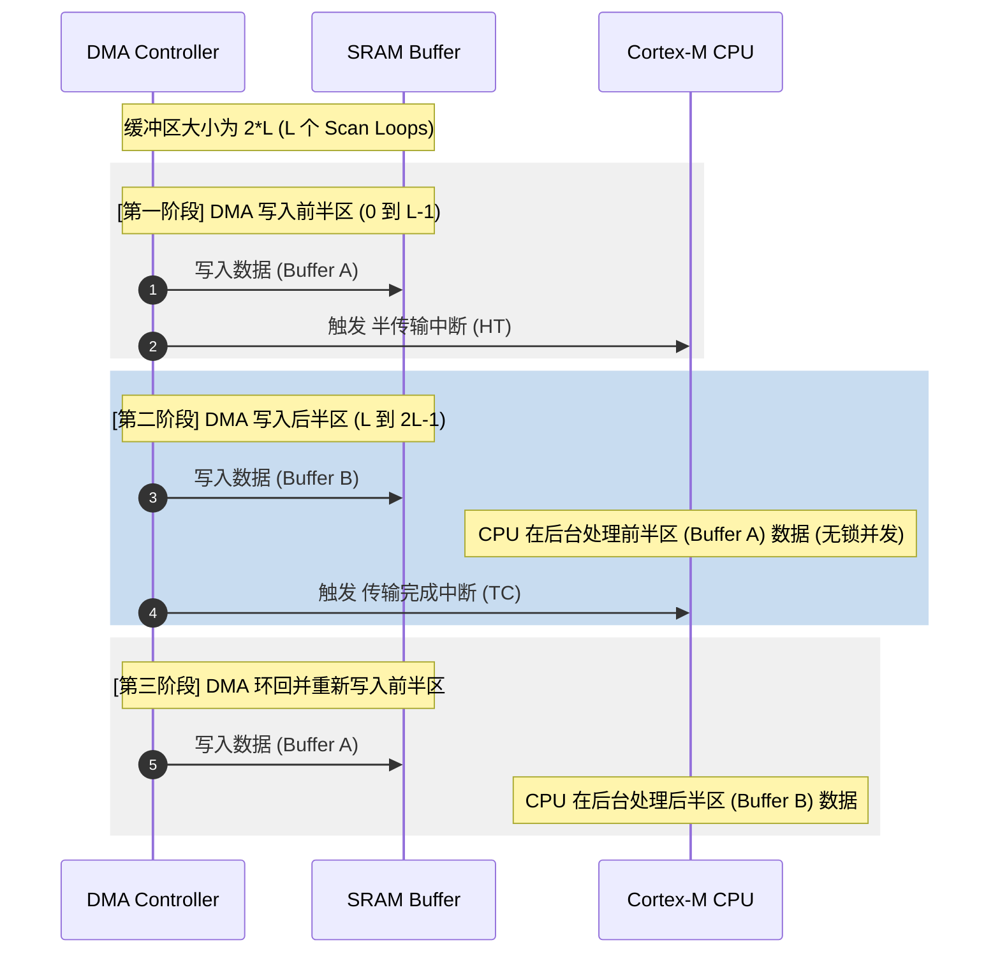

# 2. 多通道扫描采样与 DMA 双缓冲区机制

在工业现场的多物理量采集系统中，通常需要对多个模拟通道（如电压、电流、温度、压力）进行同步或依次采样。若只采用单通道数据传输方案，CPU 会疲于频繁切换 ADC 通道。本章将深入讲解如何利用 STM32 的规则组多通道扫描模式，结合 DMA 循环机制实现多通道数据的批量搬运，并利用双缓冲区（乒乓缓冲）机制解决高速采样下 CPU 读与 DMA 写的冲突痛点。

---

## 2.1 多通道扫描模式与转换组机制

STM32 的 ADC 转换通道被划分为两个核心组：**规则通道组（Regular Group）**和**注入通道组（Injected Group）**。

*   **规则通道组**：类似于主程序循环，最多支持 16 个通道。它们按照软件配置的序列（Rank）依次进行转换。
*   **注入通道组**：类似于中断服务程序，最多支持 4 个通道。它具有更高的优先级，一旦被触发（如电机控制中的 PWM 互补输出死区时刻），会打断正在进行的规则通道转换，转换完成后再恢复规则通道。

本章重点探讨**规则通道组**下的多通道扫描机制。

### 2.1.1 扫描模式 (Scan Mode) 与转换模式的排列组合

通过配置 `ADC_CR1` 寄存器中的 `SCAN` 位，以及 `ADC_CFGR` 中的连续/单次转换模式，可以得到不同的工作组合：

```
                +------------------ 扫描模式 (Scan Mode) ------------------+
                |                                                           |
                v (Enable)                                                  v (Disable)
      +-------------------+                                       +-------------------+
      |  依次转换序列中所有  |                                       |   仅转换序列中第一个  |
      |   配置的 Ranks     |                                       |     配置的 Rank      |
      +---------+---------+                                       +---------+---------+
                |                                                           |
      +---------+---------+                                       +---------+---------+
      |  (连续/单次转换)  |                                       |  (连续/单次转换)  |
      +----+-----------+--+                                       +----+-----------+--+
           |           |                                               |           |
           v           v                                               v           v
       [单次扫描]   [连续扫描]                                      [单次单通道] [连续单通道]
```

1.  **单次扫描模式（Single Scan Mode）**：
    触发一次后，ADC 按照序列（Rank 1 $\rightarrow$ Rank 2 $\rightarrow$ ... $\rightarrow$ Rank M）依次转换每个通道。当最后一个通道转换完成后，ADC 停止转换。下一轮采集需要重新软件或硬件触发。
2.  **连续扫描模式（Continuous Scan Mode）**：
    触发一次后，ADC 按照序列转换。当最后一个通道 Rank M 转换完成后，ADC 会自动**无缝循环**回到 Rank 1 继续新一轮扫描，无限循环，直到软件强行关闭。这是多通道高速高吞吐采集的常用模式。
3.  **间断模式（Discontinuous Mode）**：
    允许将一个包含多个通道的规则组划分为多个小组（Sub-groups）。例如：序列包含 6 个通道，子组大小设为 2。每次外部触发仅执行子组内的 2 个通道转换，分 3 次触发才能完成一次完整的规则组转换。这常用于与定时器精密同步的场景。

---

## 2.2 多通道 DMA 搬运与内存布局

在连续扫描多通道模式下，ADC 内部只有一个数据寄存器 `ADC_DR`。无论是通道 0 还是通道 1 转换完毕，结果都会写入这同一个寄存器并覆盖前值。

**因此，多通道扫描模式必须绑定 DMA，否则数据必定丢失。**

### 2.2.1 内存对齐与地址偏移

DMA 在每次接收到 ADC 的 `dma_req` 时，会将 `ADC_DR` 的值写入指定的内存区。其内存寻址遵循以下规律：

*   **数据宽度对齐**：ADC 转换分辨率为 12 位或 16 位，在内存中需要用 16 位的**半字（Half-word, uint16_t）**对齐。
*   **排列顺序**：DMA 内部的内存地址增量寄存器（`DMA_SxCR` 或 `DMA_CCR` 中的 `MINC` 位）必须开启。DMA 将按照配置的 Rank 顺序，依次将转换结果写入连续的内存空间。

假设我们配置了 4 个采样通道（$CH_A$、$CH_B$、$CH_C$、$CH_D$），并在 DMA 中设置了总接收缓冲区大小为 $N \times 4$（即采集 $N$ 轮扫描）。

内存布局如下表所示：

| 内存数组索引 | 物理偏移地址 (Bytes) | 对应采样通道 | 采样轮次 (Scan Loop) |
| :--- | :--- | :--- | :--- |
| `adc_buf[0]` | `BaseAddr + 0` | $CH_A$ | 第 0 轮采样 (Loop 0) |
| `adc_buf[1]` | `BaseAddr + 2` | $CH_B$ | 第 0 轮采样 (Loop 0) |
| `adc_buf[2]` | `BaseAddr + 4` | $CH_C$ | 第 0 轮采样 (Loop 0) |
| `adc_buf[3]` | `BaseAddr + 6` | $CH_D$ | 第 0 轮采样 (Loop 0) |
| `adc_buf[4]` | `BaseAddr + 8` | $CH_A$ | 第 1 轮采样 (Loop 1) |
| `adc_buf[5]` | `BaseAddr + 10` | $CH_B$ | 第 1 轮采样 (Loop 1) |
| ... | ... | ... | ... |
| `adc_buf[4*i + ch]` | `BaseAddr + 2*(4*i + ch)` | 通道 $ch$ | 第 $i$ 轮采样 (Loop $i$) |

**地址偏移计算公式**：
若通道总数为 $M$（$ch \in [0, M-1]$），当前处于第 $i$ 轮扫描（$i \in [0, N-1]$），则该采样值在缓冲区数组中的绝对索引为：
$$\text{Index}(i, ch) = i \times M + ch$$

---

## 2.3 双缓冲区（乒乓缓冲）无缝读写机制

在单缓冲区设计中，CPU 读取数据与 DMA 写入数据在空间上是重合的。由于 CPU 执行滤波或业务逻辑需要耗费时间，此时如果 DMA 的写指针赶上了 CPU 的读指针，就会发生**写覆盖（Race Condition）**，导致 CPU 读出半轮新数据、半轮旧数据的“数据撕裂”现象。

### 2.3.1 乒乓缓冲工作原理 (HT 与 TC 中断)

为了实现无锁（Lock-free）的高效数据交换，STM32 的 DMA 控制器提供了两个核心中断标志：
1.  **半传输完成（HT, Half Transfer Complete）**：当 DMA 传输完设定的缓冲区总长度的一半时触发。
2.  **传输完成（TC, Transfer Complete）**：当 DMA 传输完缓冲区的全部长度时触发，在循环模式下，DMA 随后会自动将写指针重置回缓冲区的起始地址。

利用这两个硬件中断，我们可以将一个大缓冲区在逻辑上切分为**前半区（Buffer A）**和**后半区（Buffer B）**，构成一个循环闭环：



这样，DMA 写入 Buffer B 时，CPU 在处理 Buffer A 的数据；DMA 写入 Buffer A 时，CPU 在处理 Buffer B。只要 **CPU 处理半区数据的时间小于 DMA 填充半区的时间**，系统就能保证数据流的 100% 完整与连续，且完全不需要加锁或禁用中断。

---

## 2.4 生产级双缓冲 C 代码实现

下面给出完整的基于 STM32 HAL 库实现的多通道扫描 + 乒乓双缓冲采集架构。该代码在实际工业变频器及电网谐波分析仪中可作为生产级底座。

### 2.2.1 核心配置与全局缓冲区

```c
#include "main.h"

#define ADC_CHANNELS        4       // 采集通道数量：CH0, CH1, CH2, CH3
#define SAMPLES_PER_HALF    128     // 每个半区容纳的扫描轮数
#define TOTAL_SAMPLES       (SAMPLES_PER_HALF * 2) // 总扫描轮数

// 接收原始数据的双缓冲区。使用 32 字节对齐，便于在使能了 D-Cache 的 Cortex-M7 上进行 Cache 维护
ALIGN_32BYTES(uint16_t g_adc_dmabuf[TOTAL_SAMPLES * ADC_CHANNELS]);

// 标志位：指示当前哪部分数据已准备好被 CPU 处理
typedef enum {
    BUFFER_NONE = 0,
    BUFFER_HALF_READY,   // 前半区就绪 (对应 HT 中断)
    BUFFER_FULL_READY    // 后半区就绪 (对应 TC 中断)
} BufferState_t;

volatile BufferState_t g_buffer_state = BUFFER_NONE;
```

### 2.2.2 中断回调函数设计

当 DMA 触发中断时，HAL 库会分发到对应的弱定义回调函数。我们在此重写这些回调，实现非阻塞通知。

```c
/**
  * @brief  DMA 规则组半传输完成回调函数 (HT)
  * @param  hadc ADC 句柄
  * @retval None
  */
void HAL_ADC_ConvHalfCpltCallback(ADC_HandleTypeDef* hadc)
{
    if (hadc->Instance == ADC1)
    {
        g_buffer_state = BUFFER_HALF_READY;
        
        /* 针对 Cortex-M7/D-Cache 的优化：
           如果使能了 D-Cache，必须在 CPU 读取前使前半区缓存失效 (Invalidate)，
           强制 CPU 从 SRAM 中读取 DMA 刚刚写入的最新数据 */
        #if defined (__DCACHE_PRESENT) && (__DCACHE_PRESENT == 1U)
        SCB_InvalidateDCache_by_Addr((uint32_t *)&g_adc_dmabuf[0], 
                                     (SAMPLES_PER_HALF * ADC_CHANNELS * sizeof(uint16_t)));
        #endif
    }
}

/**
  * @brief  DMA 规则组传输完成回调函数 (TC)
  * @param  hadc ADC 句柄
  * @retval None
  */
void HAL_ADC_ConvCpltCallback(ADC_HandleTypeDef* hadc)
{
    if (hadc->Instance == ADC1)
    {
        g_buffer_state = BUFFER_FULL_READY;

        /* 针对 Cortex-M7/D-Cache 的优化：
           使后半区缓存失效 */
        #if defined (__DCACHE_PRESENT) && (__DCACHE_PRESENT == 1U)
        SCB_InvalidateDCache_by_Addr((uint32_t *)&g_adc_dmabuf[SAMPLES_PER_HALF * ADC_CHANNELS], 
                                     (SAMPLES_PER_HALF * ADC_CHANNELS * sizeof(uint16_t)));
        #endif
    }
}
```

### 2.2.3 主循环/后台任务数据消费实现

在后台线程或主循环中，以非阻塞状态机模式查询 `g_buffer_state`，获取就绪的缓冲区首地址，并进行解复用与多通道业务处理。

```c
// 提取解调后的各通道存储数组
uint16_t g_ch0_data[SAMPLES_PER_HALF];
uint16_t g_ch1_data[SAMPLES_PER_HALF];
uint16_t g_ch2_data[SAMPLES_PER_HALF];
uint16_t g_ch3_data[SAMPLES_PER_HALF];

/**
  * @brief  解析分离多通道数据并执行信号处理
  * @param  p_src 对应就绪半区的首地址指针
  * @retval None
  */
static void Process_ADC_SubBuffer(const uint16_t* p_src)
{
    // 将交织排布的 DMA 数据解复用到各自通道的连续数组中
    for (uint32_t i = 0; i < SAMPLES_PER_HALF; i++)
    {
        g_ch0_data[i] = p_src[i * ADC_CHANNELS + 0];
        g_ch1_data[i] = p_src[i * ADC_CHANNELS + 1];
        g_ch2_data[i] = p_src[i * ADC_CHANNELS + 2];
        g_ch3_data[i] = p_src[i * ADC_CHANNELS + 3];
    }

    // 此处可以安全地对 g_chX_data 执行数字滤波、FFT 变换或控制环路计算
    // 例如：Motor_Control_Loop(g_ch0_data, g_ch1_data);
}

/**
  * @brief  应用层轮询消费任务
  */
void App_ADC_Poll_Task(void)
{
    BufferState_t state = g_buffer_state;

    if (state != BUFFER_NONE)
    {
        // 立即清除标志，避免重复处理
        g_buffer_state = BUFFER_NONE;

        if (state == BUFFER_HALF_READY)
        {
            // 处理前半区数据 (索引 0 开始)
            Process_ADC_SubBuffer(&g_adc_dmabuf[0]);
        }
        else if (state == BUFFER_FULL_READY)
        {
            // 处理后半区数据 (索引 SAMPLES_PER_HALF * ADC_CHANNELS 开始)
            Process_ADC_SubBuffer(&g_adc_dmabuf[SAMPLES_PER_HALF * ADC_CHANNELS]);
        }
    }
}
```

> [!IMPORTANT]
> **实时性硬约束**：
> 确保 `Process_ADC_SubBuffer` 的执行时间绝对小于单半区采集时间。
> 单半区采集时间计算式为：
> $$T_{half} = T_{conv\_total\_one\_channel} \times \text{Channels} \times \text{SAMPLES\_PER\_HALF}$$
> 如果 $T_{processing} \ge T_{half}$，则在 CPU 处理完 Buffer A 之前，DMA 就已经写满了 Buffer B 并触发 TC，开始覆盖 Buffer A。此时将触发数据紊乱，甚至在开启了溢出检测的情况下抛出 OVR 异常。

在下一章中，我们将进一步深入，学习如何在此双缓冲架构上集成硬件过采样（Hardware Oversampling）功能，并优化软件均值滤波算法，以榨干 STM32 的 ADC 性能。
